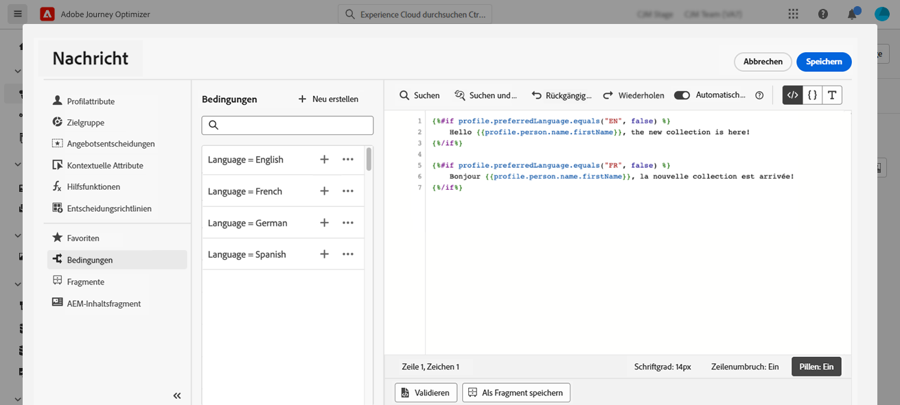

# Erstellen von dynamischen Inhalten {#dynamic-content}

Mit Adobe Journey Optimizer können Sie die in der Bibliothek erstellten bedingten Regeln nutzen, um dynamische Inhalte in Ihre Nachrichten einzufügen.

Dynamische Inhalte können in jedem Feld erstellt werden, in dem Sie mithilfe des Ausdruckseditors Personalisierung hinzufügen können. Dazu gehören Betreffzeile, Links, Inhalte von Push-Benachrichtigungen oder die Darstellungen von Angeboten in Textform. [Erfahren Sie mehr über Personalisierungskontexte](personalization-contexts.md)

Zusätzlich können Sie in E-Mail-Designer bedingte Regeln verwenden, um mehrere Varianten einer Inhaltskomponente zu erstellen.

## Hinzufügen dynamischer Inhalte zu Ausdrücken {#perso-expressions}

Gehen Sie wie folgt vor, um dynamische Inhalte in Ausdrücke einzufügen:

1. Navigieren Sie zu dem Feld, dem Sie dynamische Inhalte hinzufügen möchten, und öffnen Sie dann den Ausdruckseditor.

1. Wählen Sie das Menü **[!UICONTROL Bedingungen]**, um die Liste der verfügbaren bedingten Regeln anzuzeigen. Klicken Sie auf die Schaltfläche „+“ neben einer Regel, um sie dem aktuellen Ausdruck hinzuzufügen.

   Sie können auch eine neue Regel erstellen, indem Sie **[!UICONTROL Neu erstellen]** auswählen. [Erfahren Sie, wie Sie Bedingungen erstellen](create-conditions.md)

   

1. Fügen Sie zwischen den Tags `{%if}` und `{%/if}` den Inhalt ein, der angezeigt werden soll, wenn die bedingte Regel erfüllt ist. Sie können beliebig viele Regeln hinzufügen, um mehrere Varianten eines Ausdrucks zu erstellen.

   Im folgenden Beispiel wurden abhängig von der bevorzugten Sprache des Empfängers zwei Varianten für einen SMS-Inhalt erstellt.

   

1. Sobald Ihr Inhalt fertig ist, können Sie mit der Schaltfläche **[!UICONTROL Inhalt simulieren]** eine Vorschau der verschiedenen Varianten anzeigen. [Erfahren Sie, wie Sie Nachrichten testen und in der Vorschau anzeigen](../content-management/preview-test.md)

   

## Hinzufügen dynamischer Inhalte in E-Mails {#emails}

>[!CONTEXTUALHELP]
>id="ac_conditional_content"
>title="Bedingter Inhalt"
>abstract="Verwenden Sie bedingte Regeln, um mehrere Varianten einer Inhaltskomponente zu erstellen. Wenn beim Versand der Nachricht keine der Bedingungen erfüllt ist, wird der Inhalt der Standardvariante angezeigt."

>[!CONTEXTUALHELP]
>id="ac_conditional_content_select"
>title="Bedingter Inhalt"
>abstract="Verwenden Sie eine in der Bibliothek gespeicherte bedingte Regel oder erstellen Sie eine neue."

Gehen Sie wie folgt vor, um Varianten einer Inhaltskomponente in E-Mail-Designer zu erstellen:

1. Wählen Sie im [E-Mail-Designer](../email/content-from-scratch.md) eine Inhaltskomponente aus und klicken Sie dann auf **[!UICONTROL Bedingten Inhalt aktivieren]**.

   

1. Der Bereich **[!UICONTROL Bedingter Inhalt]** wird auf der linken Seite angezeigt. In diesem Bereich können Sie mithilfe von Bedingungen mehrere Varianten der ausgewählten Inhaltskomponente erstellen.

   Konfigurieren Sie Ihre erste Variante, indem Sie auf die Schaltfläche **[!UICONTROL Bedingung auswählen]** klicken.

   

1. Die Bedingungsbibliothek wird angezeigt. Wählen Sie die bedingte Regel aus, die Sie mit der Variante verknüpfen möchten, und klicken Sie dann auf **[!UICONTROL Auswählen]**. In diesem Beispiel möchten wir den Komponententext entsprechend der bevorzugten Sprache des Empfängers anpassen.

   

   Sie können auch eine neue Regel erstellen, indem Sie auf **[!UICONTROL Neu erstellen]** klicken. [Erfahren Sie, wie Sie Bedingungen erstellen](create-conditions.md)

1. Die bedingte Regel ist mit der Variante verknüpft. Benennen Sie die Variante für eine bessere Lesbarkeit um, indem Sie über das Symbol „Mehr Aktionen“ die Aktion **[!UICONTROL Umbenennen]** auswählen.

   

1. Konfigurieren Sie, wie die Komponente angezeigt werden soll, wenn die Regel beim Senden der Nachricht erfüllt ist. In diesem Beispiel soll der Text auf Französisch angezeigt werden, wenn dies die bevorzugte Sprache des Empfängers ist.

   

1. Fügen Sie so viele Varianten hinzu, wie für die Inhaltskomponente erforderlich sind. Sie können jederzeit zwischen den verschiedenen Varianten wechseln, um zu überprüfen, wie die Inhaltskomponente in Abhängigkeit von den bedingten Regeln angezeigt wird.

   >[!NOTE]
   >Wenn beim Senden der Nachricht keine der in den Varianten definierten Regeln erfüllt ist, zeigt die Inhaltskomponente den in der **[!UICONTROL Standardvariante]** definierten Inhalt an.
   >
   >Bedingte Inhalte werden anhand der zugehörigen Regeln in der Reihenfolge ausgewertet, in der die Varianten angezeigt werden. Die Standardvariante wird immer angezeigt, wenn keine anderen Bedingungen erfüllt sind.

1. Um eine Variante zu löschen, klicken Sie auf das Symbol „Mehr Aktionen“ neben der gewünschten Variante und wählen Sie **[!UICONTROL Löschen]** aus.

   
