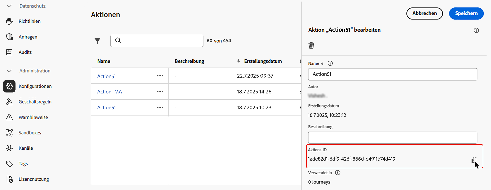
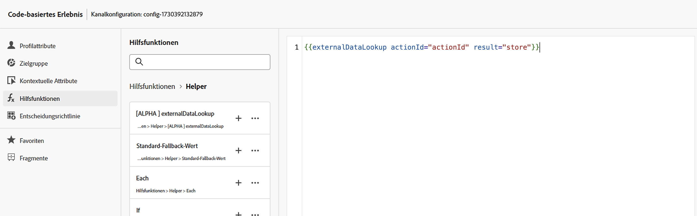
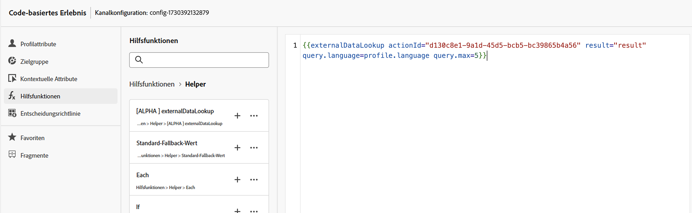
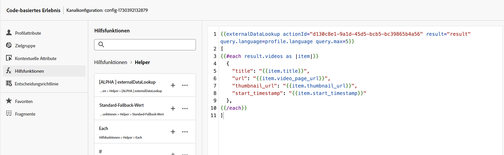
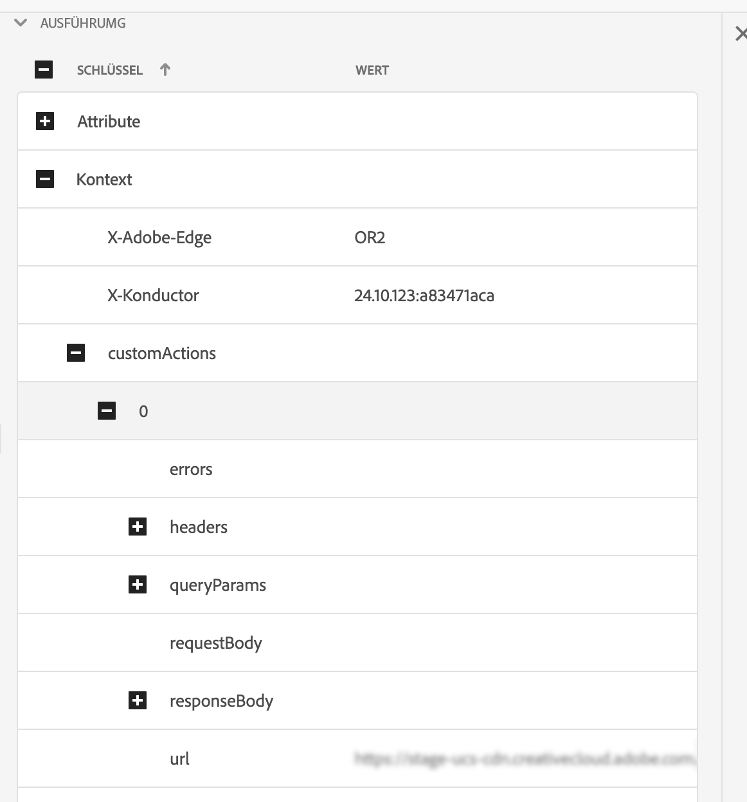

# Helper zur Suche externer Daten

Mit dem `externalDataLookup`-Helper im Personalisierungs-Editor von [!DNL Journey Optimizer] können Sie Daten dynamisch von einem externen Endpunkt abrufen und sie zur Erstellung von Inhalten für eingehende Kanäle wie Code-basierte Erlebnisse, Web- und In-App-Nachrichten verwenden.

>[!AVAILABILITY]
>
>Diese Funktion ist nur für eine ausgewählte Gruppe von Organisationen verfügbar (eingeschränkte Verfügbarkeit). 

Damit Sie den Helper verwenden können, müssen Sie zunächst im Menü **[!UICONTROL Administration]** > **[!UICONTROL Konfigurationen]** eine Aktion definieren. Bei einer Aktion konfigurieren Sie Details zu einem externen Endpunkt, z. B. URL, GET vs. POST-Methode, Header-Parameter, Abfrageparameter, POST-Textkörper-JSON-Schema und Antwort-JSON-Schema.

Nachdem die Aktion definiert wurde, kann sie wie folgt verwendet werden:

* Zum Abrufen von Inhalten in einer Aktivität mit benutzerdefinierter Aktion in Journeys
* Zum Abrufen von Daten in einer eingehenden Aktion in einem externalDataLookup-Helper in Journeys und Inbound-Kampagnen.

## Leitlinien und Einschränkungen

Weitere Informationen finden Sie unter „Benutzerdefinierte Aktionen“ in [!DNL Journey Optimizer]-Inbound-Kanäle, Kampagnen und Journeys#Sicherheitsvorkehrungen und Richtlinien.

* **Standard-Timeout**: Standardmäßig verwendet [!DNL Journey Optimizer] beim Aufruf eines externen Endpunkts ein Timeout von 300 ms. Wenden Sie sich an den Adobe-Support, um dieses Timeout für einen Endpunkt zu erhöhen.
* **Durchsuchen des Antwortschemas und Ausdrucksvalidierung**: Im Personalisierungseditor können Sie beim Einfügen von Ausdrücken das Schema der Endpunktantwort nicht durchsuchen. [!DNL Journey Optimizer] validiert keine Verweise auf JSON-Attribute aus der in Ausdrücken verwendeten Antwort.
* **Unterstützte Datentypen für Parameter**: Die unterstützten Datentypen für Payload-Variablenparameter, die über den externalDataLookup-Helper ersetzt werden sollen, sind `String`, `Integer`, `Decimal`, `Boolean`, `listString`, `listInt`, `listInteger`, `listDecimal`.
* **Automatische Aktualisierung für aktualisierte Aktionen**: Änderungen an einer Aktionskonfiguration werden nicht in den entsprechenden externalDataLookup-Aufrufen in Live-Kampagnen und Journey-Aufrufen übernommen. Damit eine Änderung übernommen wird, müssen Sie alle Live-Kampagnen oder Journeys kopieren oder ändern, die die Aktion in einem externalDataLookup-Helper verwenden.
* **Variablenersetzung**: Derzeit wird die Verwendung von Variablen in den Parameter des externalDataLookup-Helpers nicht unterstützt.
* **Dynamischer Pfad**: Derzeit wird der dynamische URL-Pfad nicht unterstützt.
* **Multi-Pass-Rendering**: Multi-Pass-Rendering wird unterstützt.
* **Authentifizierung**: Derzeit werden Authentifizierungsoptionen in der Aktionskonfiguration vom externalDataLookup-Helper nicht unterstützt. In der Zwischenzeit können Sie bei der API-schlüsselbasierten Authentifizierung oder anderen Nur-Text-Autorisierungsschlüsseln diese als Header-Felder in der Aktionskonfiguration angeben.

## Konfigurieren einer Aktion und Verwenden des Helpers

Gehen Sie wie folgt vor, um eine Aktion zu definieren und den Helper für die Personalisierung zu verwenden:

1. Erstellen Sie eine Aktion zum Konfigurieren des Endpunkts für die Suche. Dies muss für jeden Endpunkt nur einmal durchgeführt werden und sollte von einer technisch versierten Person übernommen werden. [Informationen zur Konfiguration einer benutzerdefinierten Aktion](../action/about-custom-action-configuration.md)

   Notieren Sie sich die Aktions-ID und kopieren Sie sie.

   

1. Erstellen Sie eine eingehende Kampagne oder Journey-Aktion. In diesem Beispiel zeigen wir, wie der externalDataLookup-Helper in einer JSON-Aktion „Code-basiertes Erlebnis“ verwendet wird. Der Helper kann aber auch in jedem anderen eingehenden Kanal in einem Personalisierungsfeld verwendet werden.

1. Bearbeiten Sie den Inhalt der Aktion, navigieren Sie im Personalisierungs-Editor zu den Helper-Funktionen und dann zu **[!UICONTROL Helper-Funktionen]** > **[!UICONTROL Helper]**.

1. Klicken Sie auf die Schaltfläche `+`, um den externalDataLookup-Helper einzufügen. Der Helper-Ausdruck wird mit Platzhalterwerten für `actionId` und `result` in den Editor eingefügt.

   

   Ersetzen Sie die Platzhalterwerte wie folgt:

   * `actionId`: Fügen Sie die zuvor kopierte Aktions-ID ein.
   * `result`: Legen Sie den gewünschten Namen fest. Sie verwenden diese Ergebnisvariable, um auf den abgerufenen Inhalt zuzugreifen.

1. Fügen Sie alle Variablenparameterwerte hinzu, die als Teil des Endpunkt-Aufrufs übergeben werden sollen. So können Sie beispielsweise einen Parameter für die Sprache und einen Parameter für die maximale Anzahl von Elementen übergeben.

   

1. Verwenden Sie die Ergebnisvariable, um auf die abgerufenen Daten zuzugreifen und sie in den Inhalt für die eingehende Aktion einzufügen. So können Sie beispielsweise ein JSON-Array von Elementen zurückgeben, die vom Endpunkt abgerufen wurden.

   

## Funktionsweise

### Laufzeitausführung

Wenn eine eingehende Aktion den externalDataLookup-Helper enthält, wird der Endpunkt zum Zeitpunkt des Empfangs und der Verarbeitung der [!DNL Journey Optimizer]-Personalisierungsanfrage durch das AEP Edge Network dynamisch aufgerufen.

Das bedeutet, dass der externe Endpunkt in der Lage sein muss, mindestens so viel Last und Durchsatz auf einmal zu verarbeiten, wie vom Client für die angegebene Oberfläche an das AEP Edge Network gesendet wird.

### Syntax

`{{externalDataLookup actionId="d130c8e2-9a2d-45d5-bcb6-bc39865b4a56" result="result" optional-parameters...}}`

### Übergeben von Parametern

Wenn der externe Endpunkt aufgerufen wird, werden alle in der Aktion definierten konstanten Header-Werte, Abfrageparameter und der Wert der Anfrage-Payload mit den in der Aktionskonfiguration angegebenen Werten gesendet.

Für alle Variablen-Header-Werte, Abfrage-/Pfadparameter oder Anfrage-Payload-Werte können Sie Werte mithilfe von Parametern dynamisch an den externalDataLookup-Helper übergeben.

Parameternamen:

* Header-Parameter: `header.<parameter-name>`
* Abfrageparameter: `query.<parameter-name>`
* Payload-Parameter: `payload.<parameter-name>`
* Pfadparameter: `dynamic_path.<parameter-name>`

Beispiel:

```
{{externalDataLookup actionId="..." result="result" header.myHeaderParameter="value1" query.myQueryParameter="value2" payload.myPayloadParameter="value3"}}`
```

Parameterwerte können feste Werte sein oder durch Verweise auf Profilfelder oder andere kontextuelle Attribute personalisiert werden, z. B.:

```
{{externalDataLookup actionId="..." result="result" query.myQueryParameter=profile.myProfileValue}}
```

Payload-Parameter können mit Punktnotation bereitgestellt werden, um auf verschachtelte JSON-Attribute zu verweisen, z. B.:

```
{{externalDataLookup actionId="..." result="result" payload.context.channel="web"}}
```

### Zugreifen auf das Ergebnis

Um auf die Daten zuzugreifen, die von einem externen Endpunkt-Suchaufruf abgerufen wurden, können Sie mit Personalisierungsausdrücken und Helper-Funktionen auf Felder verweisen, die in der Antwort-Payload in der Aktionsdefinition definiert sind.

Angenommen, die Antwort-Payload in der Aktion sieht wie folgt aus:

```
{
    "videos": [
        {
            "id": "integer",
            "title": "string",
            "description": "string",
            "thumbnail_url": "string",
            "video_page_url": "string",
            "url": "string",
            "video_type": "string",
            "start_timestamp": "dateOnly",
            "created_on": "dateOnly",
            ...
        }
    ]
}
```

Dann können Sie beispielsweise die Beschreibung des ersten Videos in einer HTML-Aktion „Code-basiertes Erlebnis“ ähnlich der folgenden abrufen und darauf zugreifen:

```
{{externalDataLookup actionId="d130c8e2-9a2d-45d5-bcb6-bc39865b4a56" result="result"}}
 
First video description: <b>result.videos[0].description</b>
```

Sie können die Elemente auch abrufen und in einer Schleife durchlaufen, um ein Element-Array in einer JSON-Aktion „Code-basiertes Erlebnis“ wie der folgenden zurückzugeben:

```
{{externalDataLookup actionId="d130c8e2-9a2d-45d5-bcb6-bc39865b4a56" result="result"}}
 
[
{{#each result.videos as |item|}}
    {                                                  
        "title": "{{item.title}}",
        "url": "{{item.video_page_url}}",
        "thumbnail_url": "{{item.thumbnail_url}}",
        "start_timestamp": "{{item.start_timestamp}}"
    },
{{/each}}
]
```

## Fehlerbehebung

### Timeouts und Fehlerbehandlung

[!DNL Journey Optimizer] verwendet beim Aufruf des externen Endpunkts ein striktes Timeout, um für das Adobe Experience Platform Edge Network eine Leistung mit niedriger Latenz und hohem Durchsatz zu gewährleisten.

Wenn beim Erreichen des Endpunkts ein Timeout oder ein anderer Fehler auftritt, ist die Ergebnisvariable leer. Alle Verweise auf Attribute innerhalb der Ergebnisvariablen sind in diesem Fall ebenfalls leer. Wenn Sie das Attribut einfach im Inhalt anzeigen, wird es als leer angezeigt. Wenn Sie versuchen, ein Array-Attribut im Ergebnis zu durchlaufen, werden keine Elemente zurückgegeben.

Wenn Sie Timeouts oder Fehler eleganter handhaben möchten, indem Sie Fallback-Inhalte anzeigen, können Sie überprüfen, ob das Ergebnis der Suche leer ist, und in diesem Fall Fallback-Inhalte anzeigen.

Sie können beispielsweise einen Fallback-Wert für ein einzelnes Attribut wie das folgende anzeigen:

```
First video description: 
```

Oder Sie können einen gesamten Inhaltsblock wie folgt bedingt rendern:

```
{{externalDataLookup actionId="d130c8e2-9a2d-45d5-bcb6-bc39865b4a56" result="result"}}
 

   ... do something with result ...

    ... return fallback content ...

```

### Debugging

Zur Unterstützung beim Debugging werden in der Edge Delivery-Ansicht in Adobe Experience Platform Assurance Timeout- und Fehlerdetails für die Suche nach externen Daten angezeigt. Wenn für einen externalDataLookup-Helper in einer eingehenden Aktion nicht die erwarteten Ergebnisse angezeigt werden, können Sie eine Assurance-Sitzung starten, einen [!DNL Journey Optimizer]-Aufruf aus einer Web- oder Mobile-Implementierung initiieren und die Edge Delivery-Ansicht verwenden, um Details zum Timeout oder zu Fehlern zu ermitteln.

Beispiel:

Im Abschnitt „Edge Delivery“ des Assurance-Trace wurde den Ausführungsdetails ein neuer customActions-Block mit Anfrage- und Antwortdetails ähnlich dem folgenden hinzugefügt. Der Fehlerabschnitt sollte beim Debugging helfen, wenn beim Ausführen benutzerdefinierter Aktionen Probleme aufgetreten sind



## Häufig gestellte Fragen {#faq-external-data}

Im Folgenden finden Sie häufig gestellte Fragen zum Helper zur Suche externer Daten.

Sie würden gerne mehr erfahren? Verwenden Sie die Feedback-Optionen unten auf dieser Seite, um Ihre Frage zu stellen, oder vernetzen Sie sich mit der [Adobe Journey Optimizer-Community](https://experienceleaguecommunities.adobe.com/t5/adobe-journey-optimizer/ct-p/journey-optimizer?profile.language=de){target="_blank"}.

+++ Wie wird ein kontextuelles Attribut aus der Anfrage als Parameter an eine Suche nach externen Daten übergeben?

Verwenden Sie das Menü „Kontextuelle Attribute“ > „Datenstrom“ > „Ereignis“, um das von Ihnen verwendete Erlebnisereignisschema zu durchsuchen und das entsprechende Attribut als Parameterwert wie folgt einzufügen:

```
{{externalDataLookup actionId="..." result="result" query.myQueryParameter=context.datastream.event.<schemaId>.my.xdm.attribute}}
```

+++

+++ Werden Antworten von externen Endpunkten durch [!DNL Journey Optimizer] zwischengespeichert?

Derzeit nicht. Diese Funktion wird in Zukunft unterstützt.

+++
