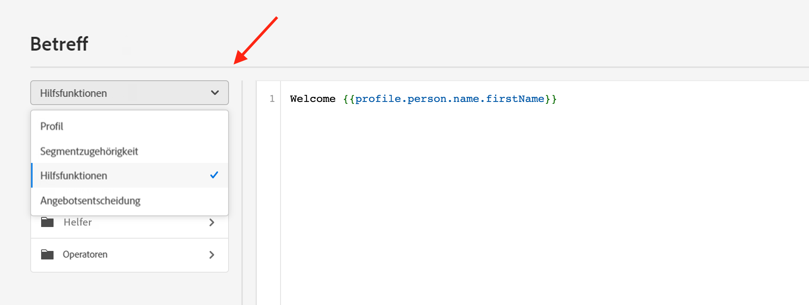

# Erste Schritte mit Helper-Funktionen{#functions}

Verwenden Sie die Vorlagensprache von [!DNL Journey Optimizer], um Datenoperationen wie Berechnungen, Datenformatierungen oder Konvertierungen und Bedingungen durchzuführen, und bearbeiten Sie Daten im Zuge der Personalisierung. Weitere Informationen zu Richtlinien zur Personalisierungssyntax finden Sie auf [dieser Seite](../personalization-syntax.md).

➡️ [Im Video erfahren Sie, wie Sie Helper-Funktionen verwenden](#video)

Die Vorlagensprache wird in Hilfsfunktionen verwendet, die in der Dropdown-Liste „Personalisierung“ des Ausdruckseditors verfügbar sind, wie unten gezeigt:

Im [!DNL Journey Optimizer]-Ausdruckseditor sind Hilfsfunktionen in drei Kategorien unterteilt: [Funktionen](#functions-helper), [Helper](#helper-helper) und [Operatoren](#operators-helper).

Wählen Sie eine Kategorie aus, um auf Unterkategorien und Funktionen zuzugreifen.

Sie können auf Unterkategorien durch Klicken auf das Symbol `>` zugreifen. Wählen Sie eine Funktion aus, indem Sie auf die `+` Symbol: wird die Funktion automatisch zum Personalisierungsbildschirm hinzugefügt.

Klicken Sie auf das Symbol `...`, um die Beschreibung der Funktion anzuzeigen und sie zu Ihren Favoriten hinzuzufügen. [Weitere Informationen](../personalize.md#fav)

## Funktionen{#functions-helper}

### Aggregations- und Array-Funktionen

<table>
    <tr>
        <td><a href="aggregation.md#average">Durchschnitt</a></td><td>Die Funktion gibt das arithmetische Mittel aller ausgewählten Werte im Array zurück</td>
    </tr>
    <tr>
        <td><a href="aggregation.md#count">Anzahl</a></td><td>Diese Funktion gibt die Anzahl der Elemente innerhalb des angegebenen Arrays zurück</td>
    </tr>
    <tr>
        <td><a href="aggregation.md#count-only-null">Nur Null zählen</a></td><td>Diese Funktion zählt die Anzahl der Nullwerte in der Liste.</td>
    </tr>
    <tr>
        <td><a href="aggregation.md#count-with-null">Mit Null zählen</a></td><td>Diese Funktion zählt alle Elemente der Liste einschließlich der Nullwerte.</td>
    </tr>
    <tr>
        <td><a href="arrays-list.md#distinct">Eindeutig</a></td><td>Diese Funktion ruft Werte aus einem Array oder einer Liste ab, wobei doppelte Werte entfernt werden</td>
    </tr>
    <tr>
        <td><a href="arrays-list.md#distinct-count-with-null">Unterschiedliche Zählung mit Null</a></td><td>Diese Funktion zählt die Anzahl der verschiedenen Werte einschließlich der Nullwerte.</td>
    </tr>
    <tr>
        <td><a href="arrays-list.md#head">Erstes Element</a></td><td>Diese Funktion gibt das erste Element in einem Array oder einer Liste zurück</td>
    </tr>
    <tr>
        <td><a href="arrays-list.md#first-n">Erste n in Array</a></td><td>Diese Funktion gibt die ersten n Elemente in einem Array zurück, wenn sie anhand des angegebenen numerischen Ausdrucks in aufsteigender Reihenfolge sortiert werden</td>
    </tr>
    <tr>
        <td><a href="arrays-list.md#in">Enthalten</a></td><td>Mit dieser Funktion wird bestimmt, ob ein Element einem Array oder einer Liste angehört</td>
    </tr>
    <tr>
        <td><a href="arrays-list.md#includes">Umfasst</a></td><td>Diese Funktion bestimmt, ob ein Array oder eine Liste ein bestimmtes Element enthält</td>
    </tr>
    <tr>
        <td><a href="arrays-list.md#intersects">Schnittmengen</a></td><td>Diese Funktion bestimmt, ob zwei Arrays oder Listen mindestens ein gemeinsames Element aufweisen</td>
    </tr>
    <tr>
        <td><a href="arrays-list.md#last-n">Letzte n in Array</a></td><td>Diese Funktion gibt die letzten n Elemente in einem Array zurück, wenn sie anhand des angegebenen numerischen Ausdrucks in aufsteigender Reihenfolge sortiert werden</td>
    </tr>
    <tr>
        <td><a href="aggregation.md#max">Maximum</a></td><td>Diese Funktion gibt den größten aller ausgewählten Werte im Array zurück</td>
    </tr>
    <tr>
        <td><a href="aggregation.md#min">Minimum</a></td><td>Die Funktion gibt den kleinsten aller ausgewählten Werte im Array zurück</td>
    </tr>
    <tr>
        <td><a href="arrays-list.md#notin">Nicht enthalten</a></td><td>Diese Funktion bestimmt, ob ein Element nicht in einem Array oder einer Liste enthalten ist</td>
    </tr>
    <tr>
        <td><a href="arrays-list.md#subset">Teilmenge von</a></td><td>Diese Funktion bestimmt, ob ein bestimmtes Array (Array A) eine Teilmenge eines anderen Arrays (Array B) ist, d. h. ob alle Elemente in Array A Elemente von Array B sind</td>
    </tr>
    <tr>
        <td><a href="aggregation.md#sum">Summe</a></td><td>Diese Funktion gibt die Summe aller ausgewählten Werte im Array zurück</td>
    </tr>
    <tr>
    <td><a href="arrays-list.md#superset">Übergeordnete Gruppe von</a></td><td>Diese Funktion bestimmt, ob ein bestimmtes Array (Array A) eine Obermenge eines anderen Arrays (Array B) ist, d. h. ob das Array A alle Elemente in Array B enthält.</td>
    </tr>
</table>

### Funktionen für Datum/Uhrzeit{#date-functions}

<table>
    <tr>
        <td><a href="dates.md#age">Alter</a></td><td>Diese Funktion ruft das Alter zu einem bestimmten Datum ab</td>
    </tr>
    <tr>
        <td><a href="dates.md#current">Aktuelle Zeit in Millisekunden</a></td><td>Diese Funktion ruft die aktuelle Zeit in Epochenmillisekunden ab.</td>
    </tr>
    <tr>
        <td><a href="dates.md#date-diff">Datumsunterschied</a></td><td>Diese Funktion ermittelt die Differenz zwischen zwei Daten in der Anzahl der Tage</td>
    </tr>
    <tr>
        <td><a href="dates.md#day-week">Wochentag</a></td><td>Diese Funktion ruft den Wochentag ab.</td>
    </tr>
    <tr>
        <td><a href="dates.md#day-year">Tag des Jahres</a></td><td>Diese Funktion ruft den Tag des Jahres ab.</td>
    </tr>
    <tr>
        <td><a href="dates.md#format-date">Datum formatieren</a></td><td>Diese Funktion formatiert einen Datums-/Uhrzeitwert.</td>
    </tr>
    <tr>
        <td><a href="dates.md#set-days">Tage festlegen</a></td><td>Diese Funktion legt den Tag des Monats für den angegebenen Datums-/Uhrzeitwert fest.</td>
    </tr>
    <tr>
        <td><a href="dates.md#set-hours">Stunden festlegen</a></td><td>Diese Funktion legt die Stunde des Datums-/Uhrzeitwerts fest</td>
    </tr>
    <tr>
        <td><a href="dates.md#to-utc">In UTC</a></td><td>Diese Funktion konvertiert einen Datum-/Uhrzeitwert in UTC.</td>
    </tr>
    <tr>
        <td><a href="dates.md#week-of-year">Woche des Jahres</a></td><td>Diese Funktion gibt die Woche des Jahres zurück.</td>
    </tr>
</table>
</table>

### Zuordnungsfunktionen {#map-functions}

<table>
    <tr>
        <td><a href="maps.md#get">Abrufen</a></td><td>Mit dieser Funktion wird der Wert einer Zuordnung für einen bestimmten Schlüssel abgerufen</td>
    </tr>
    <tr>
        <td><a href="maps.md#keys">Schlüssel</a></td><td>Mit dieser Funktion werden alle Schlüssel einer angegebenen Zuordnung abgerufen</td>
    </tr>
    <tr>
        <td><a href="maps.md#values">Werte</a></td><td>Diese Funktion ruft alle Werte einer angegebenen Zuordnung ab</td>
    </tr>
</table>

### Mathematische Funktionen {#math-functions}

<table>
    <tr>
        <td><a href="math.md#absolute">Absolut</a></td><td>Diese Funktion formatiert eine beliebige Zahl in die sprachabhängige Darstellung.</td>
    </tr>
    <tr>
        <td><a href="math.md#format-number">Formatnummer</a></td><td>Diese Funktion formatiert eine beliebige Zahl in die sprachabhängige Darstellung.</td>
    </tr>
    <tr>
        <td><a href="math.md#random">Zufällig</a></td><td>Diese Funktion gibt einen Zufallswert zwischen 0 und 1 zurück.</td>
    </tr>
    <tr>
        <td><a href="math.md#round-down">Abrunden</a></td><td>Diese Funktion rundet eine Zahl ab.</td>
    </tr>
    <tr>
        <td><a href="math.md#round-up">Aufrunden</a></td><td>Diese Funktion rundet eine Zahl auf.</td>
    </tr>
    <tr>
    <td><a href="math.md#to-hex-string">Zu Hexadezimalzeichenfolge</a></td><td>konvertiert eine beliebige Zahl in ihren hexadezimalen String.</td>
    </tr>
    <tr>
        <td><a href="math.md#to-percentage">Zu Prozentwert</a></td><td>Diese Funktion wandelt eine Zahl in einen Prozentwert um.</td>
    </tr>
    <tr>
        <td><a href="math.md#to-precision">Zu Präzision</a></td><td>Diese Funktion wandelt eine Zahl mit der erforderlichen Präzision um.</td>
    </tr>
    <tr>
        <td><a href="math.md#to-string">Zeichenfolge</a></td><td>Diese Funktion konvertiert eine beliebige Zahl in die Zeichenfolgendarstellung. </td>
    </tr>
</table>

### Objektfunktionen {#object-functions}

<table>
    <tr>
        <td><a href="objects.md#isNotNull">Ist nicht null</a></td><td>Mit dieser Funktion wird bestimmt, ob eine Objektreferenz vorhanden ist</td>
    </tr>
    <tr>
        <td><a href="objects.md#isNull">Ist null</a></td><td>Mit dieser Funktion wird bestimmt, ob keine Objektreferenz vorhanden ist</td>
    </tr>
</table>

### Zeichenfolgen-Funktionen {#string-functions}

<table>
    <tr>
        <td><a href="string.md#camelCase">Binnenmajuskel</a></td><td>Mit dieser Funktion wird der erste Buchstabe jedes Wortes einer Zeichenfolge großgeschrieben</td>
    </tr>
    <tr>
        <td><a href="string.md#char-code-at">Char-Code bei</a></td><td>Diese Funktion gibt den ASCII-Wert eines Zeichens zurück, z. B. die Funktion charCodeAt in JavaScript</td>
    </tr>
    <tr>
        <td><a href="string.md#concat">Verknüpfen</a></td><td>Mit dieser Funktion werden zwei Zeichenfolgen zu einer zusammengeführt</td>
    </tr>
    <tr>
        <td><a href="string.md#contains">Enthält</a></td><td>Mit dieser Funktion wird bestimmt, ob eine Zeichenfolge eine angegebene Unterzeichenfolge enthält</td>
    </tr>
    <tr>
        <td><a href="string.md#doesNotContain">Enthält nicht</a></td><td>Mit dieser Funktion wird bestimmt, ob eine Zeichenfolge eine angegebene Unterzeichenfolge nicht enthält</td>
    </tr>
    <tr>
        <td><a href="string.md#doesNotEndWith">Endet nicht mit</a></td><td>Mit dieser Funktion wird bestimmt, ob eine Zeichenfolge nicht mit einer angegebenen Unterzeichenfolge endet</td>
    </tr>
    <tr>
        <td><a href="string.md#doesNotStartWith">Beginnt nicht mit</a></td><td>Mit dieser Funktion wird bestimmt, ob eine Zeichenfolge nicht mit einer angegebenen Unterzeichenfolge beginnt</td>
    </tr>
    <tr>
        <td><a href="string.md#encode64">Codieren 64</a></td><td>Mit dieser Funktion wird eine Zeichenfolge ver- oder entschlüsselt</td>
    </tr>
    <tr>
        <td><a href="string.md#endsWith">Endet mit</a></td><td>Mit dieser Funktion wird bestimmt, ob eine Zeichenfolge mit einer angegebenen Unterzeichenfolge endet</td>
    </tr>
        </tr>
    <tr>
        <td><a href="string.md#equals">Gleich</a></td><td>Mit dieser Funktion wird bestimmt, ob eine Zeichenfolge mit einer angegebenen Zeichenfolge übereinstimmt</td>
    </tr>
    <tr>
        <td><a href="string.md#equalsIgnoreCase">Gleich ohne Groß-/Kleinschreibung</a></td><td>Mit dieser Funktion wird bestimmt, ob eine Zeichenfolge mit einer angegebenen Zeichenfolge übereinstimmt, Groß-/Kleinschreibung wird nicht beachtet</td>
    </tr>
    <tr>
        <td><a href="string.md#extractEmailDomain">E-Mail-Domain extrahieren</a></td><td>Mit dieser Funktion wird die Domain einer E-Mail-Adresse extrahiert</td>
    </tr>
    <tr>
        <td><a href="string.md#format-currency">Währung formatieren</a></td><td>Diese Funktion konvertiert eine beliebige Zahl in die entsprechende sprachabhängige Währungsdarstellung, je nachdem, welches Gebietsschema als Zeichenfolge im zweiten Argument übergeben wurde.</td>
    </tr>
    <tr>
        <td><a href="string.md#get-url-host">URL-Host abrufen</a></td><td>Diese Funktion wird verwendet, um den URL-Host abzurufen.</td>
    </tr>
    <tr>
        <td><a href="string.md#get-url-path">URL-Pfad abrufen</a></td><td>Diese Funktion wird verwendet, um den URL-Pfad abzurufen.</td>
    </tr>
    <tr>
        <td><a href="string.md#get-url-protocol">URL-Protokoll abrufen</a></td><td>Diese Funktion wird verwendet, um das URL-Protokoll abzurufen.</td>
    </tr>
    <tr>
        <td><a href="string.md#index-of">Index von</a></td><td>Diese Funktion gibt die Position (im ersten Argument) des ersten Auftretens des zweiten Parameters zurück. Gibt -1 zurück, wenn keine Übereinstimmung vorliegt</td>
    </tr>
    <tr>
        <td><a href="string.md#isEmpty">Ist leer</a></td><td>Mit dieser Funktion wird geprüft, ob eine Zeichenfolge oder ein Ausdruck leer ist</td>
    </tr>
    <tr>
        <td><a href="string.md#is-not-empty">Ist nicht leer</a></td><td>Diese Funktion gibt „true“ zurück, wenn die Zeichenfolge im Parameter nicht leer ist.</td>
    </tr>
    <tr>
        <td><a href="string.md#last-index-of">Letzter Index von</a></td><td>Diese Funktion gibt die Position (im ersten Argument) des letzten Auftretens des zweiten Parameters zurück. Gibt -1 zurück, wenn keine Übereinstimmung vorliegt.</td>
    </tr>
    <tr>
        <td><a href="string.md#leftTrim">Links kürzen</a></td><td>Diese Funktion entfernt Leerzeichen vom Anfang einer Zeichenfolge</td>
    </tr>
    <tr>
        <td><a href="string.md#length">Länge</a></td><td>Mit dieser Funktion wird die Anzahl der Zeichen in einer Zeichenfolge oder einem Ausdruck zurückgegeben</td>
    </tr>
    <tr>
        <td><a href="string.md#like">Ist wie</a></td><td>Mit dieser Funktion wird bestimmt, ob eine Zeichenfolge einem angegebenen Muster entspricht</td>
    </tr>
    <tr>
        <td><a href="string.md#lower">Kleinbuchstaben</a></td><td>Diese Funktion wandelt eine Zeichenfolge in Kleinbuchstaben um</td>
    </tr>
    <tr>
        <td><a href="string.md#mask">Maskieren</a></td><td>Diese Funktion wird verwendet, um einen Teil einer Zeichenfolge durch „X“-Zeichen zu ersetzen.</td>
    </tr>
    <tr>
        <td><a href="string.md#matches">Stimmt überein mit</a></td><td>Mit dieser Funktion wird bestimmt, ob eine Zeichenfolge mit einem bestimmten regulären Ausdruck übereinstimmt</td>
    </tr>
    <tr>
        <td><a href="string.md#md5">MD5</a></td><td>Diese Funktion gibt den MD5-Hash der Eingabezeichenfolge zurück.</td>
    </tr>
    <tr>
        <td><a href="string.md#notEqualTo">Ungleich</a></td><td>Mit dieser Funktion wird bestimmt, ob eine Zeichenfolge nicht gleich der angegebenen Zeichenfolge ist</td>
    </tr>
    <tr>
        <td><a href="string.md#not-equal-with-ignore-case">Entspricht nicht (Groß-/Kleinschreibung ignorieren)</a></td><td>Diese Funktion vergleicht zwei Zeichenfolgen miteinander, wobei die Groß- und Kleinschreibung ignoriert wird.</td>
    </tr>
    <tr>
        <td><a href="string.md#regexGroup">Gruppe regelmäßiger Ausdrücke</a></td><td>Mit dieser Funktion werden spezifische Informationen basierend auf dem bereitgestellten regulären Ausdruck extrahiert</td>
    </tr>
    <tr>
        <td><a href="string.md#replace">Ersetzen</a></td><td>Diese Funktion ersetzt eine angegebene Teilzeichenfolge in einer Zeichenfolge durch eine andere Teilzeichenfolge</td>
    </tr>
    <tr>
        <td><a href="string.md#replaceAll">Alle ersetzen</a></td><td>Diese Funktion ersetzt alle Teilzeichenfolgen eines Textes, die mit dem „Ziel“ übereinstimmen, durch die angegebene literale „Ersatz“-Zeichenfolge</td>
    </tr>
    <tr>
        <td><a href="string.md#rightTrim">Rechts kürzen</a></td><td>Diese Funktion entfernt Leerzeichen am Ende einer Zeichenfolge </td>
    </tr>
    <tr>
        <td><a href="string.md#split">Teilen</a></td><td>Mit dieser Funktion wird eine Zeichenfolge durch ein bestimmtes Zeichen aufgeteilt</td>
    </tr>
    <tr>
        <td><a href="string.md#startsWith">Beginnt mit</a></td><td>Mit dieser Funktion wird bestimmt, ob eine Zeichenfolge mit einer angegebenen Unterzeichenfolge beginnt</td>
    </tr>
    <tr>
        <td><a href="string.md#string-to-date">Zeichenfolge zu Datum</a></td><td>Diese Funktion konvertiert einen Zeichenfolgenwert in einen Datums-/Uhrzeitwert</td>
    </tr>
    <tr>
        <td><a href="string.md#string-to-integer">Zeichenfolge zu Ganzzahl</a></td><td>Diese Funktion wandelt einen Zeichenfolgenwert in einen ganzzahligen Wert um.</td>
    </tr>
    <tr>
        <td><a href="string.md#string-to-number">Zeichenfolge zu Zahl</a></td><td>Mit dieser Funktion wird eine Zeichenfolge in eine Zahl konvertiert. Bei einer ungültigen Eingabe wird dieselbe Zeichenfolge als Ausgabe zurückgegeben.</td>
    </tr>
    <tr>
        <td><a href="string.md#sub-string">Teilzeichenfolge</a></td><td>Diese Funktion gibt die Teilzeichenfolge des Zeichenfolgenausdrucks zwischen dem Anfangsindex und dem Endindex zurück.</td>
    </tr>
    <tr>
        <td><a href="string.md#titleCase">Titelschreibweise</a></td><td>Diese Funktion wird verwendet, um die ersten Buchstaben jedes Wortes einer Zeichenfolge großzuschreiben</td>
    </tr>
    <tr>
        <td><a href="string.md#to-bool">Zu booleschem Wert</a></td><td>Diese Funktion wandelt einen Argumentwert abhängig vom Typ in einen booleschen Wert um.</td>
    </tr>
    <tr>
        <td><a href="string.md#to-date-time">Zu Uhrzeit-/Datumsangabe</a></td><td>Diese Funktion wird verwendet, um die Zeichenfolge in ein Datum zu konvertieren. Bei einer ungültigen Eingabe wird das Epochendatum als Ausgabe zurückgegeben.</td>
    </tr>
    <tr>
        <td><a href="string.md#to-date-time-only">Nur zu Uhrzeit-/Datumsangabe</a></td><td>Diese Funktion konvertiert einen Argumentwert in einen Nur-Datum-Uhrzeit-Wert. Bei einer ungültigen Eingabe wird das Epochendatum als Ausgabe zurückgegeben.</td>
    </tr>
    <tr>
        <td><a href="string.md#trim">Kürzen</a></td><td>Diese Funktion entfernt Leerzeichen vom Anfang und vom Ende einer Zeichenfolge</td>
    </tr>
    <tr>
        <td><a href="string.md#upper">Großbuchstaben</a></td><td>Diese Funktion wandelt eine Zeichenfolge in Großbuchstaben um</td>
    </tr>
    <tr>
        <td><a href="string.md#url-decode">URL-Decodierung</a></td><td>Diese Funktion wird verwendet, um eine als URL codierte Zeichenfolge zu decodieren.</td>
    </tr>
    <tr>
        <td><a href="string.md#url-encode">URL-Codierung</a></td><td>Diese Funktion wird verwendet, um eine Zeichenfolge als URL zu codieren.</td>
    </tr>
</table>

## Helper{#helper-helper}

Helper werden auf [dieser Seite](helpers.md) näher beschrieben.

<table>
    <tr>
        <td><a href="helpers.md#default">Standardwert für Fallback</a></td><td>Diese Funktion wird verwendet, um eine Variable mit der Standardeinstellung zu rendern</td>
    </tr>
    <tr>
        <td><a href="helpers.md#each">Jeweils</a></td><td>Diese Funktion wird verwendet, um über ein Array zu iterieren</td>
    </tr>
    <tr>
        <td><a href="helpers.md#if-function">Wenn</a></td><td>Mit dieser Funktion wird ein bedingter Block definiert. Wenn die Ausdrucksevaluierung „true“ zurückgibt, wird der Block gerendert</td>
    </tr>
    <tr>
        <td><a href="helpers.md#let">Zulassen</a></td><td>Diese Funktion ermöglicht das Speichern eines Ausdrucks als Variable, die später in einer Abfrage verwendet werden kann</td>
    </tr>
   <tr>
        <td><a href="helpers.md#unless">Außer</a></td><td>Mit dieser Funktion wird ein bedingter Block definiert. Wenn die Ausdrucksevaluierung „false“ zurückgibt, wird der Block gerendert</td>
    </tr>
    <tr>
        <td><a href="helpers.md#with">Mit</a></td><td>Diese Funktion wird verwendet, um das Evaluierungs-Token des Vorlagenteils zu ändern</td>
    </tr>
</table>

## Operatoren{#operators-helper}

### Arithmetische Funktionen {#arithmetic-helper}

Mit arithmetischen Funktionen lassen sich einfache Berechnungen für Werte durchführen

<table>
    <tr>
        <td><a href="arithmetic-functions.md#add">Addieren</a></td><td>Mit diesem Operator wird die Summe zweier Argumentausdrücke ermittelt</td>
    </tr>
    <tr>
        <td><a href="arithmetic-functions.md#divide">Dividieren</a></td><td>Mit diesem Operator wird der Quotient zweier Argumentausdrücke ermittelt</td>
    </tr>
    <tr>
        <td><a href="arithmetic-functions.md#multiply">Multiplizieren</a></td><td>Mit diesem Operator wird das Produkt zweier Argumentausdrücke ermittelt</td>
    </tr>
    <tr>
        <td><a href="arithmetic-functions.md#remainder">Rest</a> </td><td>Dieser Operator wird verwendet, um den Rest nach der Division der beiden Argumentausdrücke zu ermitteln</td>
    </tr>
    <tr>
        <td><a href="arithmetic-functions.md#substract">Subtrahieren</a> </td><td>Mit diesem Operator wird die Differenz zwischen zwei Argumentausdrücken ermittelt</td>
    </tr>
</table>

### Boolesche Funktionen {#boolean-functions}

Boolesche Funktionen werden verwendet, um eine boolesche Logik auf verschiedene Elemente anzuwenden.

<table>
    <tr>
        <td><a href="operators.md#and">Und</a></td><td>Dieser Operator erstellt eine logische Konjunktion</td>
    </tr>
    <tr>
        <td><a href="operators.md#or">Oder</a></td><td>Dieser Operator erstellt eine logische Disjunktion</td>
    </tr>
</table>

### Vergleichsfunktionen {#comparison-functions}

Vergleichsfunktionen werden verwendet, um zwischen verschiedenen Ausdrücken und Werten zu vergleichen und entsprechend „true“ oder „false“ zurückzugeben.

<table>
    <tr>
        <td><a href="operators.md#equals">Gleich</a></td><td>Dieser Vorgang prüft, ob Werte gleich sind</td>
    </tr>
    <tr>
        <td><a href="operators.md#greaterthan">Größer als</a></td><td>Dieser Operator prüft, ob der erste Wert größer als der zweite Wert ist</td>
    </tr>
    <tr>
        <td><a href="operators.md#greaterthanorequal">Größer oder gleich</a></td><td>Dieser Operator prüft, ob der erste Wert größer oder gleich dem zweiten Wert ist</td>
    </tr>
    <tr>
        <td><a href="operators.md#lessthanorequal">Kleiner oder gleich</a> </td><td>Dieser Operator prüft, ob der erste Wert kleiner oder gleich dem zweiten Wert ist</td>
    </tr>
    <tr>
        <td><a href="operators.md#notequal">Ungleich</a></td><td>Dieser Operator prüft, ob ein angegebener Ausdruck ungleich einem angegebenen Wert ist</td>
    </tr>
</table>

## Anleitungsvideo{#video}

Erfahren Sie, wie Sie Personalisierungswerte mithilfe von Hilfsfunktionen zur Personalisierung umwandeln und lernen Sie verschiedene Anwendungsfälle für Hilfsfunktionen kennen.

>[!VIDEO](https://video.tv.adobe.com/v/334244?quality=12)
