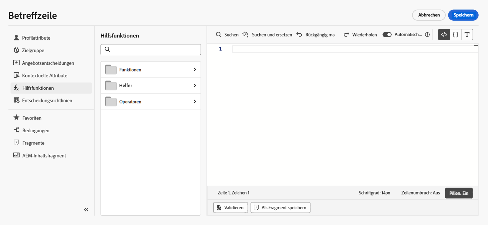

# Erste Schritte mit Helper-Funktionen{#functions}

Verwendung [!DNL Journey Optimizer] Vorlagensprache zum Ausführen von Vorgängen für Daten, z. B. Berechnungen, Datenformatierung oder Konvertierungen, Bedingungen und zum Bearbeiten dieser Vorgänge im Kontext der Personalisierung. Richtlinien zur Personalisierungssyntax in [diese Seite](../personalization-syntax.md).

➡️ [In diesem Video erfahren Sie, wie Sie Hilfsfunktionen verwenden.](#video)

Die Vorlagensprache wird in Hilfsfunktionen verwendet, die in der Dropdown-Liste &quot;Personalisierung&quot;des Ausdruckseditors verfügbar sind, wie unten gezeigt:

Im [!DNL Journey Optimizer] Ausdruckseditor und Hilfsfunktionen sind in drei Kategorien unterteilt: [Funktionen](#functions-helper), [Helfer](#helper-helper) und [Benutzer](#operators-helper).

Wählen Sie eine Kategorie aus, um auf Unterkategorien und Funktionen zuzugreifen.

Zugriff auf Unterkategorien durch Klicken auf `>` Symbol. Wählen Sie eine Funktion aus, indem Sie auf die `+` Symbol: wird die Funktion automatisch zum Personalisierungsbildschirm hinzugefügt.

Klicken Sie auf `...` -Symbol, um die Beschreibung der Funktion anzuzeigen und sie Ihren Favoriten hinzuzufügen. [Weitere Infos](../personalize.md#fav)

## Funktionen{#functions-helper}

### Aggregations- und Array-Funktionen

<table>
    <tr>
        <td><a href="aggregation.md#average">Durchschnittlich</a></td><td>Diese Funktion gibt das arithmetische Mittel aller im Array ausgewählten Werte zurück</td>
    </tr>
    <tr>
        <td><a href="aggregation.md#count">Count</a></td><td>Diese Funktion gibt die Anzahl der Elemente innerhalb des angegebenen Arrays zurück</td>
    </tr>
    <tr>
        <td><a href="aggregation.md#count-only-null">Nur Null zählen</a></td><td>Diese Funktion zählt die Anzahl der Nullwerte in der Liste.</td>
    </tr>
    <tr>
        <td><a href="aggregation.md#count-with-null">Zählung mit Null</a></td><td>Diese Funktion zählt alle Elemente der Liste einschließlich Nullwerten</td>
    </tr>
    <tr>
        <td><a href="arrays-list.md#distinct">Unterschiedlich</a></td><td>Diese Funktion ruft Werte aus einem Array oder einer Liste mit entfernten doppelten Werten ab</td>
    </tr>
    <tr>
        <td><a href="arrays-list.md#distinct-count-with-null">Zählung unterschiedlicher Werte mit Null</a></td><td>Diese Funktion zählt die Anzahl verschiedener Werte, einschließlich der Nullwerte</td>
    </tr>
    <tr>
        <td><a href="arrays-list.md#head">Erstes Element</a></td><td>Diese Funktion gibt das erste Element in einem Array oder einer Liste zurück</td>
    </tr>
    <tr>
        <td><a href="arrays-list.md#first-n">Erste n im Array</a></td><td>Diese Funktion gibt die ersten "N"-Elemente in einem Array zurück, wenn sie anhand des angegebenen numerischen Ausdrucks in aufsteigender Reihenfolge sortiert werden</td>
    </tr>
    <tr>
        <td><a href="arrays-list.md#in">In</a></td><td>Mit dieser Funktion wird bestimmt, ob ein Element einem Array oder einer Liste angehört</td>
    </tr>
    <tr>
        <td><a href="arrays-list.md#includes">Enthält</a></td><td>Diese Funktion bestimmt, ob ein Array oder eine Liste ein bestimmtes Element enthält</td>
    </tr>
    <tr>
        <td><a href="arrays-list.md#intersects">Schnittmengen</a></td><td>Diese Funktion ermittelt, ob zwei Arrays oder Listen mindestens ein gemeinsames Element aufweisen</td>
    </tr>
    <tr>
        <td><a href="arrays-list.md#last-n">Letzte n im Array</a></td><td>Diese Funktion gibt die letzten N-Elemente in einem Array zurück, wenn sie anhand des angegebenen numerischen Ausdrucks in aufsteigender Reihenfolge sortiert werden</td>
    </tr>
    <tr>
        <td><a href="aggregation.md#max">Maximum</a></td><td>Diese Funktion gibt den größten aller ausgewählten Werte innerhalb eines Arrays zurück</td>
    </tr>
    <tr>
        <td><a href="aggregation.md#min">Minimum</a></td><td>Diese Funktion gibt die kleinsten aller ausgewählten Werte im Array zurück</td>
    </tr>
    <tr>
        <td><a href="arrays-list.md#notin">Nicht enthalten</a></td><td>Diese Funktion bestimmt, ob ein Element nicht Mitglied eines Arrays oder einer Liste ist</td>
    </tr>
    <tr>
        <td><a href="arrays-list.md#subset">Untergruppe von</a></td><td>Diese Funktion bestimmt, ob ein bestimmtes Array (Array A) eine Teilmenge eines anderen Arrays (Array B) ist, d. h. ob alle Elemente in Array A Elemente des Arrays B sind</td>
    </tr>
    <tr>
        <td><a href="aggregation.md#sum">Summe</a></td><td>Diese Funktion gibt die Summe aller im Array ausgewählten Werte zurück</td>
    </tr>
    <tr>
    <td><a href="arrays-list.md#superset">Obermenge</a></td><td>Diese Funktion bestimmt, ob ein bestimmtes Array (Array A) eine Obermenge eines anderen Arrays (Array B) ist, d. h. wenn dieses Array A alle Elemente in Array B enthält</td>
    </tr>
</table>

### Datums-/Uhrzeitfunktionen{#date-functions}

<table>
    <tr>
        <td><a href="dates.md#age">Alter</a></td><td>Diese Funktion ruft das Alter von einem bestimmten Datum ab</td>
    </tr>
    <tr>
        <td><a href="dates.md#current">Aktuelle Zeit in Millisekunden</a></td><td>Diese Funktion ruft die aktuelle Zeit in Epoch-Millisekunden ab</td>
    </tr>
    <tr>
        <td><a href="dates.md#date-diff">Datumsunterschied</a></td><td>Diese Funktion ruft die Differenz zwischen zwei Daten in Anzahl von Tagen ab</td>
    </tr>
    <tr>
        <td><a href="dates.md#day-week">Wochentag</a></td><td>Diese Funktion ruft den Wochentag ab</td>
    </tr>
    <tr>
        <td><a href="dates.md#day-year">Tag des Jahres</a></td><td>Diese Funktion ruft den Tag des Jahres ab</td>
    </tr>
    <tr>
        <td><a href="dates.md#format-date">Datum des Formats</a></td><td>Diese Funktion formatiert einen Datums-/Uhrzeitwert</td>
    </tr>
    <tr>
        <td><a href="dates.md#set-days">Festlegen von Tagen</a></td><td>Diese Funktion legt den Tag des Monats für die angegebene Datum/Uhrzeit fest</td>
    </tr>
    <tr>
        <td><a href="dates.md#set-hours">Stunden festlegen</a></td><td>Diese Funktion legt die Stunde der Datum/Uhrzeit fest</td>
    </tr>
    <tr>
        <td><a href="dates.md#to-utc">auf UTC</a></td><td>Diese Funktion konvertiert einen Datum/Uhrzeit-Wert in UTC</td>
    </tr>
    <tr>
        <td><a href="dates.md#week-of-year">Woche des Jahres</a></td><td>Diese Funktion gibt die Woche des Jahres zurück</td>
    </tr>
</table>
</table>

### Zuordnungsfunktionen {#map-functions}

<table>
    <tr>
        <td><a href="maps.md#get">Get</a></td><td>Mit dieser Funktion wird der Wert einer Zuordnung für einen bestimmten Schlüssel abgerufen</td>
    </tr>
    <tr>
        <td><a href="maps.md#keys">Schlüssel</a></td><td>Mit dieser Funktion werden alle Schlüssel für eine bestimmte Zuordnung abgerufen</td>
    </tr>
    <tr>
        <td><a href="maps.md#values">Werte</a></td><td>Diese Funktion ruft alle Werte einer gegebenen Zuordnung ab</td>
    </tr>
</table>

### Mathematische Funktionen {#math-functions}

<table>
    <tr>
        <td><a href="objects.md#absolute">Absolut</a></td><td>Diese Funktion konvertiert eine Zahl in den absoluten Wert</td>
    </tr>
    <tr>
        <td><a href="objects.md#random">Random</a></td><td>Diese Funktion gibt einen zufälligen Wert zwischen 0 und 1 zurück</td>
    </tr>
    <tr>
        <td><a href="objects.md#round-down">Nach unten</a></td><td>Diese Funktion rundet eine Zahl ab</td>
    </tr>
    <tr>
        <td><a href="objects.md#round-up">Aufrunden</a></td><td>Diese Funktion rundet eine Zahl auf</td>
    </tr>
    <tr>
        <td><a href="objects.md#to-percentage">In Prozent</a></td><td>Diese Funktion konvertiert eine Zahl in Prozent</td>
    </tr>
    <tr>
        <td><a href="objects.md#to-precision">Präzision</a></td><td>Diese Funktion konvertiert eine Zahl in die erforderliche Genauigkeit</td>
    </tr>
</table>

### Objektfunktionen {#object-functions}

<table>
    <tr>
        <td><a href="objects.md#isNotNull">Is not null</a></td><td>Mit dieser Funktion wird bestimmt, ob eine Objektreferenz vorhanden ist</td>
    </tr>
    <tr>
        <td><a href="objects.md#isNull">Is null</a></td><td>Mit dieser Funktion wird bestimmt, ob keine Objektreferenz vorhanden ist</td>
    </tr>
</table>

### Zeichenfolgen-Funktionen {#string-functions}

<table>
    <tr>
        <td><a href="string.md#camelCase">Camel Case</a></td><td>Mit dieser Funktion wird der erste Buchstabe jedes Wortes einer Zeichenfolge großgeschrieben</td>
    </tr>
    <tr>
        <td><a href="string.md#concat">Concat</a></td><td>Mit dieser Funktion werden zwei Zeichenfolgen zu einer</td>
    </tr>
    <tr>
        <td><a href="string.md#contains">Enthält</a></td><td>Mit dieser Funktion wird bestimmt, ob eine Zeichenfolge eine angegebene Unterzeichenfolge enthält</td>
    </tr>
    <tr>
        <td><a href="string.md#doesNotContain">Enthält nicht</a></td><td>Mit dieser Funktion wird bestimmt, ob eine Zeichenfolge keine angegebene Unterzeichenfolge enthält</td>
    </tr>
    <tr>
        <td><a href="string.md#doesNotEndWith">endet nicht mit</a></td><td>Mit dieser Funktion wird bestimmt, ob eine Zeichenfolge nicht mit einer angegebenen Unterzeichenfolge endet.</td>
    </tr>
    <tr>
        <td><a href="string.md#doesNotStartWith">Beginnt nicht mit</a></td><td>Mit dieser Funktion wird bestimmt, ob eine Zeichenfolge nicht mit einer angegebenen Teilzeichenfolge beginnt</td>
    </tr>
    <tr>
        <td><a href="string.md#encode64">Kodierung 64</a></td><td>Mit dieser Funktion wird eine Zeichenfolge kodiert oder dekodiert</td>
    </tr>
    <tr>
        <td><a href="string.md#endsWith">Endet in</a></td><td>Mit dieser Funktion wird bestimmt, ob eine Zeichenfolge mit einer angegebenen Unterzeichenfolge endet.</td>
    </tr>
        </tr>
    <tr>
        <td><a href="string.md#equals">Gleich</a></td><td>Mit dieser Funktion wird bestimmt, ob eine Zeichenfolge nicht mit einer angegebenen Unterzeichenfolge beginnt, wobei Groß-/Kleinschreibung berücksichtigt wird.</td>
    </tr>
    <tr>
        <td><a href="string.md#equalsIgnoreCase">Entspricht Groß-/Kleinschreibung ignorieren</a></td><td>Mit dieser Funktion wird bestimmt, ob eine Zeichenfolge ohne Groß-/Kleinschreibung nicht mit einer angegebenen Unterzeichenfolge beginnt</td>
    </tr>
    <tr>
        <td><a href="string.md#extractEmailDomain">E-Mail-Domäne extrahieren</a></td><td>Mit dieser Funktion wird die Domain einer E-Mail-Adresse extrahiert.</td>
    </tr>
    <tr>
        <td><a href="string.md#get-url-host">Abrufen des URL-Hosts</a></td><td>Diese Funktion wird zum Abrufen des URL-Hosts verwendet.</td>
    </tr>
    <tr>
        <td><a href="string.md#get-url-path">URL-Pfad abrufen</a></td><td>Mit dieser Funktion wird der URL-Pfad abgerufen</td>
    </tr>
    <tr>
        <td><a href="string.md#get-url-protocol">Abrufen des URL-Protokolls</a></td><td>Diese Funktion wird zum Abrufen des URL-Protokolls verwendet.</td>
    </tr>
    <tr>
        <td><a href="string.md#index-of">Index von</a></td><td>Diese Funktion gibt die Position (im ersten Argument) des ersten Vorkommens des zweiten Parameters zurück. Gibt -1 aus, wenn keine Übereinstimmung vorliegt</td>
    </tr>
    <tr>
        <td><a href="string.md#isEmpty">IsEmpty</a></td><td>Mit dieser Funktion wird geprüft, ob eine Zeichenfolge oder ein Ausdruck leer ist.</td>
    </tr>
    <tr>
        <td><a href="string.md#is-not-empty">Ist nicht leer</a></td><td>Diese Funktion gibt "true"zurück, wenn die Zeichenfolge im Parameter nicht leer ist.</td>
    </tr>
    <tr>
        <td><a href="string.md#last-index-of">Letzter Index von</a></td><td>Diese Funktion gibt die Position (im ersten Argument) des letzten Vorkommens des zweiten Parameters zurück. Gibt -1 zurück, wenn keine Übereinstimmung vorliegt.</td>
    </tr>
    <tr>
        <td><a href="string.md#leftTrim">Linker Schnitt</a></td><td>Diese Funktion entfernt Leerzeichen vom Anfang einer Zeichenfolge</td>
    </tr>
    <tr>
        <td><a href="string.md#length">Länge</a></td><td>Mit dieser Funktion wird die Anzahl der Zeichen in einer Zeichenfolge oder einem Ausdruck abgerufen</td>
    </tr>
    <tr>
        <td><a href="string.md#like">liken</a></td><td>Mit dieser Funktion wird bestimmt, ob eine Zeichenfolge mit einem angegebenen Muster übereinstimmt</td>
    </tr>
    <tr>
        <td><a href="string.md#lower">Kleinbuchstabe</a></td><td>Diese Funktion konvertiert eine Zeichenfolge in Kleinbuchstaben</td>
    </tr>
    <tr>
        <td><a href="string.md#mask">Maskieren</a></td><td>Diese Funktion wird verwendet, um einen Teil einer Zeichenfolge durch "X"-Zeichen zu ersetzen.</td>
    </tr>
    <tr>
        <td><a href="string.md#matches">Stimmt überein mit</a></td><td>Mit dieser Funktion wird bestimmt, ob eine Zeichenfolge mit einem bestimmten regulären Ausdruck übereinstimmt</td>
    </tr>
    <tr>
        <td><a href="string.md#md5">MD5</a></td><td>Diese Funktion gibt den md5-Hash der Eingabezeichenfolge zurück.</td>
    </tr>
    <tr>
        <td><a href="string.md#notEqualTo">Ungleich</a></td><td>Mit dieser Funktion wird bestimmt, ob eine Zeichenfolge nicht mit der angegebenen Zeichenfolge übereinstimmt</td>
    </tr>
    <tr>
        <td><a href="string.md#not-equal-with-ignore-case">Nicht gleich Groß-/Kleinschreibung ignorieren</a></td><td>Diese Funktion vergleicht zwei Zeichenfolgen ohne Groß-/Kleinschreibung.</td>
    </tr>
    <tr>
        <td><a href="string.md#regexGroup">Gruppe Regulärer Ausdruck</a></td><td>Diese Funktion wird verwendet, um spezifische Informationen basierend auf dem bereitgestellten regulären Ausdruck zu extrahieren.</td>
    </tr>
    <tr>
        <td><a href="string.md#replace">Ersetzen</a></td><td>Diese Funktion ersetzt eine angegebene Teilzeichenfolge in einer Zeichenfolge durch eine andere Teilzeichenfolge</td>
    </tr>
    <tr>
        <td><a href="string.md#replaceAll">Alle ersetzen</a></td><td>Diese Funktion ersetzt alle Teilzeichenfolgen eines Textes, der mit der "target"übereinstimmt, durch die angegebene literale "replacement"-Zeichenfolge</td>
    </tr>
    <tr>
        <td><a href="string.md#rightTrim">Rechter Schnitt</a></td><td>Diese Funktion entfernt Leerzeichen am Ende einer Zeichenfolge </td>
    </tr>
    <tr>
        <td><a href="string.md#split">Aufspaltung</a></td><td>Mit dieser Funktion wird eine Zeichenfolge durch ein bestimmtes Zeichen aufgeteilt</td>
    </tr>
    <tr>
        <td><a href="string.md#startsWith">Beginnt mit</a></td><td>Mit dieser Funktion wird bestimmt, ob eine Zeichenfolge mit einer angegebenen Unterzeichenfolge beginnt</td>
    </tr>
    <tr>
        <td><a href="string.md#string-to-date">Zeichenfolge bis Datum</a></td><td>Diese Funktion wird verwendet, um die Zeichenfolge in das Datum zu konvertieren. Es wird das Epochendatum als Ausgabe für ungültige Eingabe zurückgegeben.</td>
    </tr>
    <tr>
        <td><a href="string.md#string-to-integer">Zeichenfolge in Ganzzahl</a></td><td>Diese Funktion konvertiert einen Zeichenfolgenwert in einen ganzzahligen Wert.</td>
    </tr>
    <tr>
        <td><a href="string.md#string-to-number">Zeichenfolge zu Zahl</a></td><td>Mit dieser Funktion wird eine Zeichenfolge in eine Zahl konvertiert. Es wird dieselbe Zeichenfolge wie für eine ungültige Eingabe zurückgegeben.</td>
    </tr>
    <tr>
        <td><a href="string.md#sub-string">Unterzeichenfolge</a></td><td>Diese Funktion gibt die Unterzeichenfolge des Zeichenfolgenausdrucks zwischen dem Anfangsindex und dem Endindex zurück.</td>
    </tr>
    <tr>
        <td><a href="string.md#titleCase">Titelschreibweise</a></td><td>Diese Funktion wird verwendet, um die ersten Buchstaben jedes Wortes einer Zeichenfolge großzuschreiben</td>
    </tr>
    <tr>
        <td><a href="string.md#to-bool">Nach Bool</a></td><td>Diese Funktion Konvertiert einen Argumentwert je nach Typ in einen booleschen Wert.</td>
    </tr>
    <tr>
        <td><a href="string.md#to-date-time">To Date Time</a></td><td>Diese Funktion wird verwendet, um die Zeichenfolge in das Datum zu konvertieren. Es wird das Epochendatum als Ausgabe für ungültige Eingabe zurückgegeben.</td>
    </tr>
    <tr>
        <td><a href="string.md#to-date-time-only">Nur für Datum/Uhrzeit</a></td><td>Diese Funktion konvertiert einen Argumentwert in einen Nur-Datum-Uhrzeit-Wert. Es wird das Epochendatum als Ausgabe für ungültige Eingabe zurückgegeben.</td>
    </tr>
    <tr>
        <td><a href="string.md#trim">Zuschneiden</a></td><td>Diese Funktion entfernt Leerzeichen vom Anfang und vom Ende einer Zeichenfolge</td>
    </tr>
    <tr>
        <td><a href="string.md#upper">Großbuchstabe</a></td><td>Diese Funktion konvertiert eine Zeichenfolge in Großbuchstaben</td>
    </tr>
    <tr>
        <td><a href="string.md#url-decode">URL-Dekodierung</a></td><td>Diese Funktion wird zum Dekodieren einer URL-codierten Zeichenfolge verwendet.</td>
    </tr>
    <tr>
        <td><a href="string.md#url-encode">URL-Kodierung</a></td><td>Mit dieser Funktion wird URL-Codierung für eine Zeichenfolge verwendet.</td>
    </tr>
</table>

## Helfer{#helper-helper}

Die Helfer werden im Abschnitt [diese Seite](helpers.md).

<table>
    <tr>
        <td><a href="helpers.md#default">Standardwert für Fallback</a></td><td>Diese Funktion ermöglicht das Rendern einer Variablen mit der Standardeinstellung</td>
    </tr>
    <tr>
        <td><a href="helpers.md#each">Jeder</a></td><td>Diese Funktion wird verwendet, um über ein Array zu iterieren.</td>
    </tr>
    <tr>
        <td><a href="helpers.md#if-function">Wenn</a></td><td>Mit dieser Funktion wird ein bedingter Block definiert. Wenn die Ausdrucksauswertung "true"zurückgibt, wird der Block gerendert</td>
    </tr>
    <tr>
        <td><a href="helpers.md#let">Lasst</a></td><td>Diese Funktion ermöglicht die Speicherung eines Ausdrucks als Variable, die später in einer Abfrage verwendet werden kann</td>
    </tr>
   <tr>
        <td><a href="helpers.md#unless">Sofern</a></td><td>Mit dieser Funktion wird ein bedingter Block definiert. Wenn die Ausdrucksauswertung "false"zurückgibt, wird der Block gerendert</td>
    </tr>
    <tr>
        <td><a href="helpers.md#with">Mit</a></td><td>Mit dieser Funktion wird das Bewertungstoken des Vorlagenteils geändert</td>
    </tr>
</table>

## Benutzer{#operators-helper}

### Arithmetische Funktionen {#arithmetic-helper}

Arithmetische Funktionen dienen der Durchführung grundlegender Berechnungen von Werten.

<table>
    <tr>
        <td><a href="arithmetic-functions.md#add">Zusatz</a></td><td>Dieser Operator wird verwendet, um die Summe zweier Argumentausdrücke zu finden.</td>
    </tr>
    <tr>
        <td><a href="arithmetic-functions.md#divide">Dividieren</a></td><td>Dieser Operator wird verwendet, um den Quotienten zweier Argumentausdrücke zu finden.</td>
    </tr>
    <tr>
        <td><a href="arithmetic-functions.md#multiply">Multiplikation</a></td><td>Dieser Operator wird verwendet, um das Produkt zweier Argumentausdrücke zu finden.</td>
    </tr>
    <tr>
        <td><a href="arithmetic-functions.md#remainder">Rest</a> </td><td>Dieser Operator wird verwendet, um den Rest nach der Division der beiden Argumentausdrücke zu finden.</td>
    </tr>
    <tr>
        <td><a href="arithmetic-functions.md#substract">Subtraktion</a> </td><td>Dieser Operator findet den Unterschied zwischen zwei Ausdrücken</td>
    </tr>
</table>

### Boolesche Funktionen {#boolean-functions}

Boolesche Funktionen werden verwendet, um eine boolesche Logik für verschiedene Elemente durchzuführen.

<table>
    <tr>
        <td><a href="operators.md#and">und</a></td><td>Dieser Operator erstellt ein logisches Bindeglied</td>
    </tr>
    <tr>
        <td><a href="operators.md#or">Oder</a></td><td>Dieser Operator erstellt eine logische Trennung</td>
    </tr>
</table>

### Vergleichsfunktionen {#comparison-functions}

Vergleichsfunktionen werden verwendet, um zwischen verschiedenen Ausdrücken und Werten zu vergleichen und &quot;true&quot;oder &quot;false&quot;entsprechend zurückzugeben.

<table>
    <tr>
        <td><a href="operators.md#equals">Gleich</a></td><td>Dieser Vorgang prüft, ob die Werte gleich sind</td>
    </tr>
    <tr>
        <td><a href="operators.md#greaterthan">Größer als</a></td><td>Dieser Operator prüft, ob der erste Wert größer als der zweite Wert ist</td>
    </tr>
    <tr>
        <td><a href="operators.md#greaterthanorequal">Größer oder gleich</a></td><td>Dieser Operator prüft, ob der erste Wert größer oder gleich dem zweiten Wert ist</td>
    </tr>
    <tr>
        <td><a href="operators.md#lessthanorequal">Kleiner oder gleich</a> </td><td>Dieser Operator prüft, ob der erste Wert kleiner oder gleich dem zweiten Wert ist</td>
    </tr>
    <tr>
        <td><a href="operators.md#notequal">Ungleich</a></td><td>Dieser Operator prüft, ob der angegebene Ausdruck nicht gleich dem Wert gibt</td>
    </tr>
</table>

## Anleitungsvideo{#video}

Erfahren Sie, wie Sie Personalisierungswerte mithilfe von Personalisierungsfunktionen umwandeln und verschiedene Anwendungsfälle für Hilfsfunktionen verstehen.

>[!VIDEO](https://video.tv.adobe.com/v/334244?quality=12)
