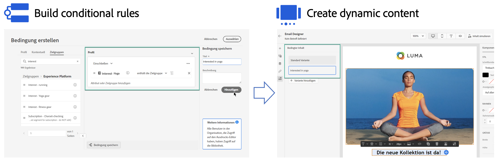

# Erste Schritte mit dynamischen Inhalten {#start-dynamic-content}

>[!BEGINSHADEBOX]

**Auf dieser Seite** Erfahren Sie, wie dynamische Inhalte bedingte Regeln verwenden, die aus Profilattributen, kontextuellen Ereignissen und Audiences erstellt wurden, um Ihre Nachrichten an Zielgruppenprofile anzupassen.

>[!ENDSHADEBOX]

>[!CONTEXTUALHELP]
>id="ajo_conditions_list"
>title="Bedingungen"
>abstract="Bedingte Regeln ermöglichen basierend auf Profilattributen, kontextbezogenen Ereignissen oder Zielgruppen das Anzeigen mehrerer Inhaltsvarianten in Ihren Nachrichten."

Dynamische Inhalte ermöglichen es Ihnen, den Inhalt Ihrer Nachrichten auf Grundlage von **bedingten Regeln**, die aus Profilattributen, kontextuellen Ereignissen oder Zielgruppen bestehen können, anzupassen. Bedingte Regeln werden mit einem visuellen Regel-Builder im Personalisierungseditor erstellt, in dem Sie sie zur weiteren Wiederverwendung in Ihren Journeys und Kampagnen speichern können.

Bedingte Regeln können im E-Mail-Designer und im Personalisierungseditor verwendet werden, um **dynamische Inhalte zu erstellen**, die an die Profile angepasst werden, an die sich Ihre Nachrichten richten.

* [Erfahren Sie, wie Sie mit bedingten Regeln arbeiten](create-conditions.md)
* [Erfahren Sie, wie Sie dynamische Inhalte erstellen](dynamic-content.md)

## Anleitungsvideo {#video}

Erfahren Sie, wie Sie mit dem Builder für Bedingungsregeln dynamische Inhalte erstellen.

>[!VIDEO](https://video.tv.adobe.com/v/3409815?quality=12)
