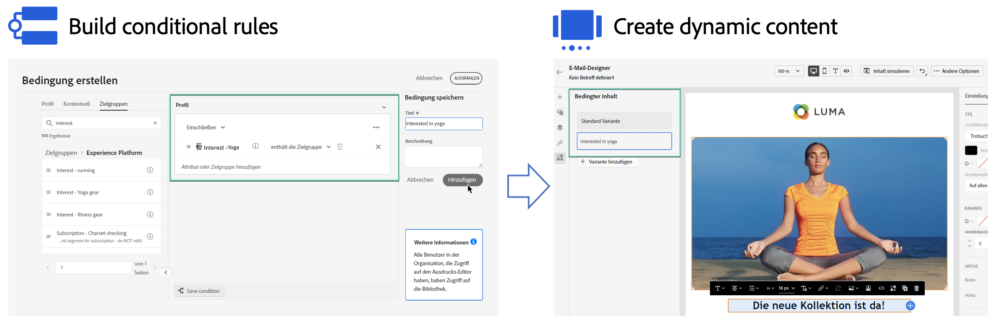

# Erste Schritte mit dynamischen Inhalten {#start-dynamic-content}

>[!CONTEXTUALHELP]
>id="ajo_conditions_list"
>title="Bedingungen"
>abstract="Bedingte Regeln ermöglichen basierend auf Profilattributen, kontextbezogenen Ereignissen oder Audience-Segmenten die Anzeige mehrerer Inhaltsvarianten in Ihren Nachrichten."

Dynamische Inhalte ermöglichen es Ihnen, den Inhalt Ihrer Nachrichten auf der Grundlage von **bedingten Regeln**, die aus Profilattributen, kontextbezogenen Ereignissen oder Audience-Segmenten bestehen können, anzupassen. Bedingte Regeln werden mit einem visuellen Regel-Builder im Ausdruckseditor erstellt, in dem Sie sie zur weiteren Wiederverwendung in Ihren Journeys und Kampagnen speichern können.

Bedingte Regeln können in Email Designer und im Ausdruckseditor verwendet werden, um **dynamische Inhalte zu erstellen**, die an die Profile angepasst werden, an die sich Ihre Nachrichten richten.

* [Erfahren Sie, wie Sie mit bedingten Regeln arbeiten](create-conditions.md)
* [Erfahren Sie, wie Sie dynamische Inhalte erstellen](dynamic-content.md)

## Anleitungsvideo {#video}

Erfahren Sie, wie Sie mit dem Builder für Bedingungsregeln dynamische Inhalte erstellen.

>[!VIDEO](https://video.tv.adobe.com/v/3409815?quality=12)
