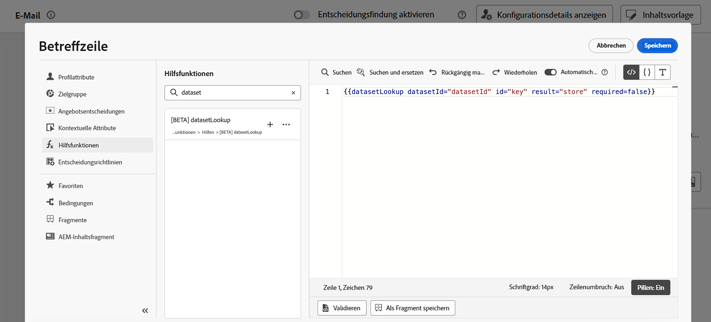

# Verwenden von Adobe Experience Platform-Daten für die Personalisierung (Beta) {#aep-data}

>[!AVAILABILITY]
>
>Diese Funktion steht derzeit allen Kundinnen und Kunden als öffentliche Betaversion zur Verfügung.
>
>Um diese Funktion verwenden zu können, müssen Sie zunächst die Bedingungen der Beta-Version für Ihre Organisation akzeptieren, die beim Hinzufügen der neuen Hilfsfunktionen „datasetLookup“ im Personalisierungseditor angezeigt werden.

Mit Journey Optimizer können Sie Daten aus Adobe Experience Platform im Personalisierungseditor nutzen, um [Ihre Inhalte zu personalisieren](../personalization/personalize.md). Hierzu müssen Datensätze, die für die Personalisierung der Suche erforderlich sind, zunächst wie nachfolgend beschrieben über einen API-Aufruf aktiviert werden. Anschließend können Sie die Daten verwenden, um Ihre Inhalte in [!DNL Journey Optimizer] zu personalisieren.

## Einschränkungen und Richtlinien der Beta-Version {#guidelines}

Bevor Sie beginnen, lesen Sie sich die folgenden Einschränkungen und Richtlinien durch:

### Aktivierung von Datensätzen {#enablement}

* Die **Datensatzgröße** ist für Produktionsdatensätze auf 5 GB und für Entwicklungs-Sandbox-Datensätze auf 1 GB beschränkt.
* **Es können jeweils maximal 50 Datensätze** pro Organisation für die Suche aktiviert werden.
* Die **Anzahl der Einträge** ist in Produktionsdatensätzen auf 5 Millionen und in Entwicklungs-Sandbox-Datensätzen auf 1 Million beschränkt.
* **Data Usage Labelling and Enforcement** wird derzeit nicht für Datensätze erzwungen, die für die Suche aktiviert sind.
* **Datensätze, die für die Suche aktiviert sind und bei der Personalisierung verwendet werden, sind nicht vor Löschvorägngen geschützt**. Sie müssen den Überblick darüber behalten, welche Datensätze für die Personalisierung verwendet werden, um sicherzustellen, dass sie nicht gelöscht oder entfernt werden.

### Personalisierung mithilfe der Daten aus [!DNL Adobe Experience Platform] {#perso}

* **Unterstützte Kanäle**: Derzeit ist diese Funktion nur für die Verwendung in E-Mail-, SMS- und Briefpost-Kanälen verfügbar.
* **Data Usage Labelling and Enforcement** wird derzeit nicht für Datensätze erzwungen, die für die Suche aktiviert sind.
* **Ausdrucksfragmente**: Die Personalisierung der Datensatzsuche kann derzeit nicht in Ausdrucksfragmenten platziert werden.

## Aktivieren eines Datensatzes für Datensuchen {#enable}

Um Daten aus Ihrem Datensatz für die Personalisierung nutzen zu können, müssen Sie einen API-Aufruf verwenden, um seinen Status abzurufen und den Suchdienst zu aktivieren.

### Voraussetzungen {#prerequisites-enable}

* Befolgen Sie die Anweisungen in [dieser Dokumentation](https://developer.adobe.com/journey-optimizer-apis/references/authentication/), um Ihre Umgebung für das Senden von API-Befehlen zu konfigurieren.
* Für das Entwicklerprojekt müssen die Adobe Journey Optimizer- und Adobe Experience Platform-APIs zum Projekt hinzugefügt werden.

  

* Sie müssen über die Berechtigung zum Verwalten von Datensätzen als Teil Ihrer Rolle verfügen.
* Das Schema, auf dem der Datensatz basiert, muss eine **primäre Identität** enthalten, die als Suchschlüssel fungieren kann.

### API-Aufrufstruktur {#call}

```
curl -s -XPATCH "https://platform.adobe.io/data/core/entity/lookup/dataSets/${DATASET_ID}/${ACTION}" \ -H "Authorization: Bearer ${ACCESS_TOKEN}" \ -H "x-api-key: ${API_KEY}" \ -H "x-gw-ims-org-id: ${IMS_ORG}" \ -H "x-sandbox-name: ${SANDBOX_NAME}"
```

Dabei gilt:

* Die **URL** lautet `https://platform.adobe.io/data/core/entity/lookup/dataSets/${DATASET_ID}/${ACTION}`
* **Dataset ID** ist der Datensatz, den Sie aktivieren möchten.
* **Action** ist „Aktivieren“ ODER „Deaktivieren“.
* **Access token** kann aus der Developer Console abgerufen werden.
* **API Key** kann aus der Developer Console abgerufen werden.
* **IMS Org ID** ist Ihre Adobe IMS ORG.
* **Sandbox Name** ist der Name der Sandbox, in der sich der Datensatz befindet (d. h. prod, dev).

>[!NOTE]
>
>Wenn beim Versuch, einen API-Aufruf zum Aktivieren von Datensätzen durchzuführen, der folgende Fehler auftritt, versuchen Sie, die Adobe Journey Optimizer-APIs aus Ihrem Entwicklerkonsolenprojekt zu entfernen und sie dann erneut hinzuzufügen.
>
>```
>
>"error_code": "403003", 
>"message": "Api Key is invalid"
>
>```

## Verwenden eines Datensatzes für die Personalisierung {#leverage}

Nachdem ein Datensatz mithilfe eines API-Aufrufs für die Personalisierung der Suche aktiviert wurde, können Sie seine Daten verwenden, um Ihre Inhalte in [!DNL Journey Optimizer] zu personalisieren.

1. Öffnen Sie den Personalisierungseditor, der in allen Kontexten verfügbar ist, in denen Sie Personalisierungen definieren können, z. B. Nachrichten. [Erfahren Sie, wie Sie mit dem Personalisierungseditor arbeiten](../personalization/personalization-build-expressions.md)

1. Navigieren Sie zur Liste der Hilfsfunktionen und fügen Sie die Hilfsfunktion **datasetLookup** in den Code-Bereich ein.

   

1. Diese Funktion bietet eine vordefinierte Syntax, mit der Sie Felder aus Ihren Adobe Experience Platform-Datensätzen aufrufen können. Es gilt folgende Syntax:

   ```
   {{datasetLookup datasetId="datasetId" id="key" result="store" required=false}}
   ```

   * **datasetId** ist die ID des Datensatzes, mit dem Sie arbeiten.
   * **id** ist die ID der Quellspalte, die mit der primären Identität des Nachschlagedatensatzes verknüpft werden soll.

     >[!NOTE]
     >
     >Der für dieses Feld eingegebene Wert kann entweder eine Feld-ID (*profile.packages.packageSKU*), ein in einem Journey-Ereignis übergebenes Feld (*context.journey.events.event_ID.productSKU*) oder ein statischer Wert (*sku007653*) sein. In jedem Fall verwendet das System den Wert und durchsucht den Datensatz, um zu überprüfen, ob er mit einem Schlüssel übereinstimmt.
     >
     >Wenn Sie einen Zeichenfolgenwert in Textform für den Schlüssel verwenden, lassen Sie den Text in Anführungszeichen stehen. Beispiel: `{{datasetLookup datasetId="datasetId" id="SKU1234" result="store" required=false}}`. Wenn Sie einen Attributwert als dynamischen Schlüssel verwenden, entfernen Sie die Anführungszeichen. Beispiel: `{{datasetLookup datasetId="datasetId" id=category.product.SKU result="SKU" required=false}}`

   * **result** ist ein beliebiger Name, den Sie angeben müssen, um auf alle Feldwerte zu verweisen, die Sie aus dem Datensatz abrufen wollen. Dieser Wert wird in Ihrem Code verwendet, um jedes Feld aufzurufen.

   * **required=false**: Wenn „required“ auf „TRUE“ gesetzt ist, wird die Nachricht nur gesendet, wenn ein übereinstimmender Schlüssel gefunden wird. Wenn der Wert auf „false“ gesetzt ist, ist kein übereinstimmender Schlüssel erforderlich, um die Nachricht zuzustellen.  Beachten Sie, dass bei Festlegung auf „false“ empfohlen wird, Fallback- oder Standardwerte in Ihrem Nachrichteninhalt zu berücksichtigen.

   +++Wo kann ich eine Datensatz-ID abrufen?

   Datensatz-IDs können in der Benutzeroberfläche von Adobe Experience Platform abgerufen werden. Erfahren Sie in der [Adobe Experience Platform-Dokumentation](https://experienceleague.adobe.com/de/docs/experience-platform/catalog/datasets/user-guide#view-datasets){target="_blank"}, wie Sie mit Datensätzen arbeiten können.

   

+++

1. Passen Sie die Syntax an Ihre Anforderungen an. In diesem Beispiel möchten wir Daten zu Passagierflügen abrufen. Es gilt folgende Syntax:

   ```
   {{datasetLookup datasetId="1234567890abcdtId" id=profile.upcomingFlightId result="flight"}}
   ```

   * Wir arbeiten mit dem Datensatz, dessen ID „1234567890abcdtId“ lautet.
   * Das Feld, das wir verwenden möchten, um einen Join mit dem Suchdatensatz herzustellen, lautet *profile.upcomingFlightId*,
   * Wir möchten alle Feldwerte unter der Referenz „Flug“ einbeziehen.

1. Nachdem die im Adobe Experience Platform-Datensatz aufzurufende Syntax konfiguriert wurde, können Sie angeben, welche Felder Sie abrufen möchten. Es gilt folgende Syntax:

   ```
   {{result.fieldId}}
   ```

   >[!NOTE]
   >
   >Stellen Sie bei Verweisen auf ein Datensatzfeld sicher, dass der Verweis mit dem vollständigen Feldpfad, der im Schema definiert ist, übereinstimmt.

   * **result** ist der Wert, den Sie dem Parameter **result** in der Hilfsfunktion **MultiEntity** zugewiesen haben. In diesem Beispiel „Flug“.
   * **fieldID** ist die ID des Feldes, das Sie abrufen möchten. Diese ID ist in der Benutzeroberfläche von [!DNL Adobe Experience Platform] sichtbar, wenn Sie das Eintragschema durchsuchen, das mit Ihrem Datensatz verknüpft ist:

     +++Wo kann ich eine Feld-ID abrufen?

     IDs für Felder können bei der Vorschau eines Datensatzes in der Benutzeroberfläche von Adobe Experience Platform abgerufen werden. In der [Adobe Experience Platform-Dokumentation](https://experienceleague.adobe.com/de/docs/experience-platform/catalog/datasets/user-guide#preview){target="_blank"} erfahren Sie, wie Sie eine Vorschau von Datensätzen erstellen können.

     

+++

   In diesem Beispiel möchten wir Informationen über die Einstiegszeit und den Flugsteig der Fluggäste verwenden. Fügen Sie daher die beiden folgenden Zeilen hinzu:

   * `{{flight._myorg.booking.boardingTime}}`
   * `{{flight._myorg.booking.gate}}`

1. Nun, da Ihr Code fertig ist, können Sie Ihren Inhalt wie gewohnt vervollständigen und ihn mit der Schaltfläche **Inhalt simulieren** testen, um die Personalisierung zu überprüfen. [Erfahren Sie, wie Sie Inhalte in der Vorschau anzeigen und testen können](../content-management/preview-test.md)


   
