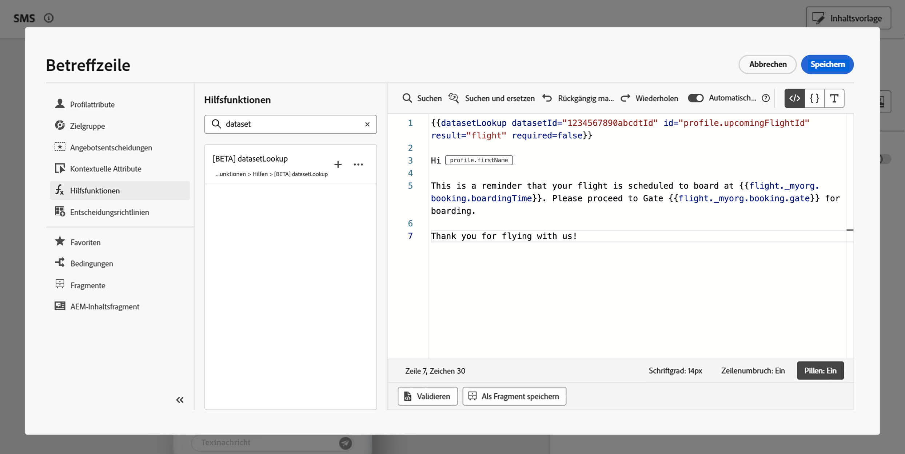

# Verwenden von Adobe Experience Platform-Daten für die Personalisierung (Beta) {#aep-data}

>[!AVAILABILITY]
>
>Diese Funktion ist derzeit nur in einer privaten Beta-Version verfügbar.
>
>Sie ist derzeit nur für den **E-Mail-Kanal** und Testzwecke in der Nicht-Produktions-Sandbox verfügbar, die Sie Adobe zur Verfügung gestellt haben, sowie für die Datensätze, die für die Beta-Version angefordert wurden.

Mit Journey Optimizer können Sie Daten aus Adobe Experience Platform im Personalisierungseditor nutzen, um [Ihre Inhalte zu personalisieren](../personalization/personalize.md). Gehen Sie dazu wie folgt vor:

1. Öffnen Sie den Personalisierungseditor, der in allen Kontexten verfügbar ist, in denen Sie Personalisierungen definieren können, z. B. Nachrichten. [Erfahren Sie, wie Sie mit dem Personalisierungseditor arbeiten](../personalization/personalization-build-expressions.md)

1. Navigieren Sie zur Liste der Hilfsfunktionen und fügen Sie die Hilfsfunktion **datasetLookup** in den Code-Bereich ein.

   

1. Diese Funktion bietet eine vordefinierte Syntax, mit der Sie Felder aus Ihren Adobe Experience Platform-Datensätzen aufrufen können. Es gilt folgende Syntax:

   ```
   {{entity.datasetId="datasetId" id="key" result="store"}}
   ```

   * **entity.datasetId** ist die ID des Datensatzes, mit dem Sie arbeiten.
   * **id** ist die ID der Quellspalte, die mit der primären Identität des Nachschlagedatensatzes verknüpft werden soll.

     >[!NOTE]
     >
     >Der für dieses Feld eingegebene Wert kann entweder eine Feld-ID (*profile.couponValue*), ein Feld, das in einem Journey-Ereignis (*context.Journey.events.event_ID.couponValue*) übergeben wird, oder ein statischer Wert (*couponAbcd*) sein. In jedem Fall verwendet das System den Wert und sucht in den Datensatz, um zu überprüfen, ob er mit einem Schlüssel übereinstimmt.

   * **result** ist ein beliebiger Name, den Sie angeben müssen, um auf alle Feldwerte zu verweisen, die Sie aus dem Datensatz abrufen wollen. Dieser Wert wird in Ihrem Code verwendet, um jedes Feld aufzurufen.

   +++Wo kann ich eine Datensatz-ID abrufen?

   Datensatz-IDs können in der Benutzeroberfläche von Adobe Experience Platform abgerufen werden. Erfahren Sie in der [Adobe Experience Platform-Dokumentation](https://experienceleague.adobe.com/de/docs/experience-platform/catalog/datasets/user-guide#view-datasets){target="_blank"}, wie Sie mit Datensätzen arbeiten können.

   

+++

1. Passen Sie die Syntax an Ihre Anforderungen an. In diesem Beispiel möchten wir Daten zu Passagierflügen abrufen. Es gilt folgende Syntax:

   ```
   {{entity.datasetId="1234567890abcdtId" id=profile.upcomingFlightId result="flight"}}
   ```

   * Wir arbeiten mit dem Datensatz, dessen ID „1234567890abcdtId“ lautet.
   * Das Feld, das wir verwenden möchten, um eine Verknüpfung mit dem Suchdatensatz herzustellen, lautet *profile.bevorstehendeFlightId*,
   * Wir möchten alle Feldwerte unter der Referenz „Flug“ einbeziehen.

1. Nachdem die im Adobe Experience Platform-Datensatz aufzurufende Syntax konfiguriert wurde, können Sie angeben, welche Felder Sie abrufen möchten. Es gilt folgende Syntax:

   ```
   {{result.fieldId}}
   ```

   * **result** ist der Wert, den Sie dem Parameter **result** in der Hilfsfunktion **MultiEntity** zugewiesen haben. In diesem Beispiel „Flug“.
   * **fieldID** ist die ID des Feldes, das Sie abrufen möchten. Diese ID ist in der Adobe Experience Platform-Benutzeroberfläche beim Durchsuchen Ihres Datensatzes sichtbar. Erweitern Sie den folgenden Abschnitt, um ein Beispiel anzuzeigen:

     +++Wo kann ich eine Feld-ID abrufen?

     IDs für Felder können bei der Vorschau eines Datensatzes in der Benutzeroberfläche von Adobe Experience Platform abgerufen werden. In der [Adobe Experience Platform-Dokumentation](https://experienceleague.adobe.com/de/docs/experience-platform/catalog/datasets/user-guide#preview){target="_blank"} erfahren Sie, wie Sie eine Vorschau von Datensätzen erstellen können.

     

+++

   In diesem Beispiel möchten wir Informationen über die Einstiegszeit und den Flugsteig der Fluggäste verwenden. Fügen Sie daher die beiden folgenden Zeilen hinzu:

   * `{{flight._myorg.booking.boardingTime}}`
   * `{{flight._myorg.booking.gate}}`

1. Nun, da Ihr Code fertig ist, können Sie Ihren Inhalt wie gewohnt vervollständigen und ihn mit der Schaltfläche **Inhalt simulieren** testen, um die Personalisierung zu überprüfen. [Erfahren Sie, wie Sie Inhalte in der Vorschau anzeigen und testen können](../content-management/preview-test.md)


   
