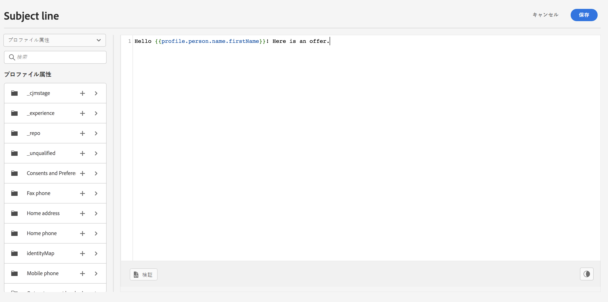
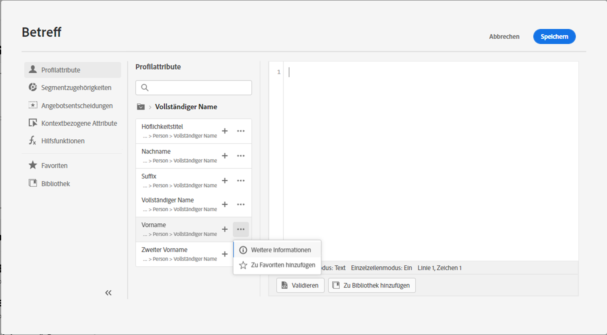
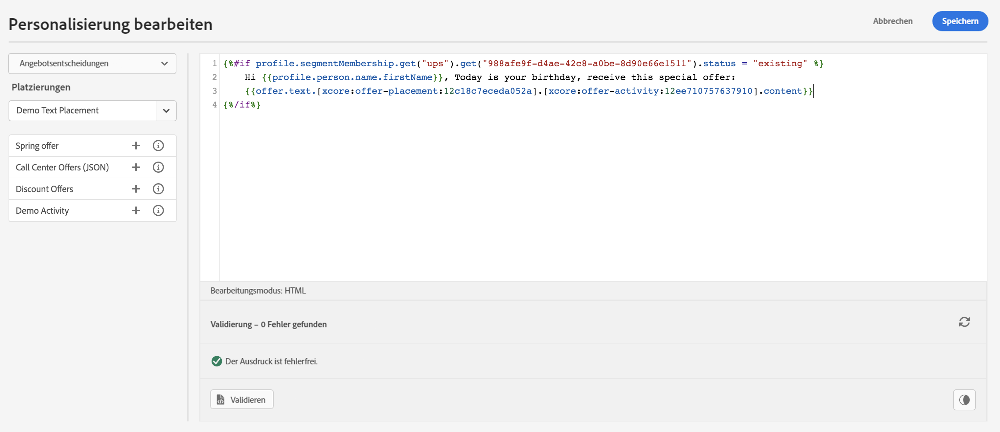

# Erste Schritte mit dem Ausdruckseditor {#build-personalization-expressions}

>[!CONTEXTUALHELP]
>id="ajo_perso_editor"
>title="Über den Ausdruckseditor"
>abstract="Mit dem Ausdruckseditor können Sie alle Daten auswählen, anordnen, anpassen und validieren, um eine benutzerdefinierte Personalisierung für Ihre Inhalte zu erstellen."

Der Ausdruckseditor ist die Kernkomponente der Personalisierung in [!DNL Journey Optimizer]. Er ist in jedem Kontext verfügbar, in dem Sie eine Personalisierung definieren müssen, wie z. B. E-Mails, Push-Benachrichtigungen und Angebote.

In der Benutzeroberfläche des Ausdruckseditors können Sie alle Daten auswählen, anordnen, anpassen und validieren, um eine benutzerdefinierte Personalisierung für Ihre Inhalte zu erstellen.

## Verfügbare Personalisierungsquellen {#sources}

Im linken Bildschirmbereich wird ein Domain-Selektor angezeigt, mit dem Sie die Quelle für die Personalisierung auswählen können. Verfügbare Quellen sind:

* **[!UICONTROL Profilattribute]**: Listet alle Verweise auf, die mit dem Profilschema verknüpft sind, das in der [Dokumentation des Adobe Experience Platform-Datenmodells (XDM)](https://experienceleague.adobe.com/docs/experience-platform/xdm/home.html?lang=de){target="_blank"} beschrieben wird.
* **[!UICONTROL Zielgruppen]** : listet alle Zielgruppen auf, die im Segmentierungsdienst von Adobe Experience Platform erstellt wurden. Weitere Informationen zur Segmentierung finden Sie [hier](https://experienceleague.adobe.com/docs/experience-platform/segmentation/home.html?lang=de){target="_blank"}.
* **[!UICONTROL Angebotsentscheidungen]**: Listet alle Angebote auf, die mit einer bestimmten Platzierung verbunden sind. Wählen Sie die Platzierung aus und fügen Sie dann die Angebote in den Inhalt ein. Eine vollständige Dokumentation zum Verwalten von Angeboten finden Sie in [diesem Abschnitt](../offers/get-started/starting-offer-decisioning.md).
* **[!UICONTROL Kontextuelle Attribute]**: Wenn eine Kanalaktionsaktivität (E-Mail, Push, SMS) in einer Journey verwendet wird, stehen in diesem Menü kontextuelle Journey-Felder zur Verfügung. Weiterführende Informationen finden Sie in [diesem Abschnitt](personalization-use-case.md).
* **[!UICONTROL Hilfsfunktionen]**: listet alle Hilfsfunktionen auf, die für die Durchführung von Datenoperationen wie Berechnungen, Datenformatierungen oder -konvertierungen, Bedingungen und die Bearbeitung von Daten im Rahmen der Personalisierung verfügbar sind. Weiterführende Informationen finden Sie in [diesem Abschnitt](functions/functions.md).

## Hinzufügen von Personalisierungsattributen {#add}

Klicken Sie auf die Schaltfläche „+“, um Ihrem Personalisierungsausdruck ein Attribut hinzuzufügen.

Über das Menü mit den Auslassungspunkten neben dem Symbol „+“ können Sie weitere Details für jede Variable abrufen und Ihre am häufigsten verwendeten Attribute zu den Favoriten hinzufügen. [Erfahren Sie, wie Sie Attribute zu den Favoriten hinzufügen können](personalization-favorites.md)

Darüber hinaus können Sie einen standardmäßigen Fallback-Text definieren, der angezeigt wird, wenn ein Profilattribut vom Typ Zeichenfolge leer ist. Klicken Sie dazu auf die Schaltfläche mit den Auslassungspunkten neben dem Attribut und wählen Sie **[!UICONTROL Einfügen mit Fallback-Text]**. Schreiben Sie den Text, der standardmäßig angezeigt werden soll, wenn der Wert des Attributs für ein Profil leer ist, und klicken Sie dann auf **[!UICONTROL Hinzufügen]**.

Im folgenden Beispiel können Sie mit dem Ausdruckseditor die Profile auswählen, die heute Geburtstag haben, und dann die Konfiguration vervollständigen, indem Sie ein spezifisches Angebot einfügen, das zu diesem Tag passt.

Sobald Ihr Personalisierungsausdruck fertig ist, müssen Sie ihn vom Ausdruckseditor validieren lassen. Weiterführende Informationen finden Sie in [diesem Abschnitt](personalization-validation.md).
