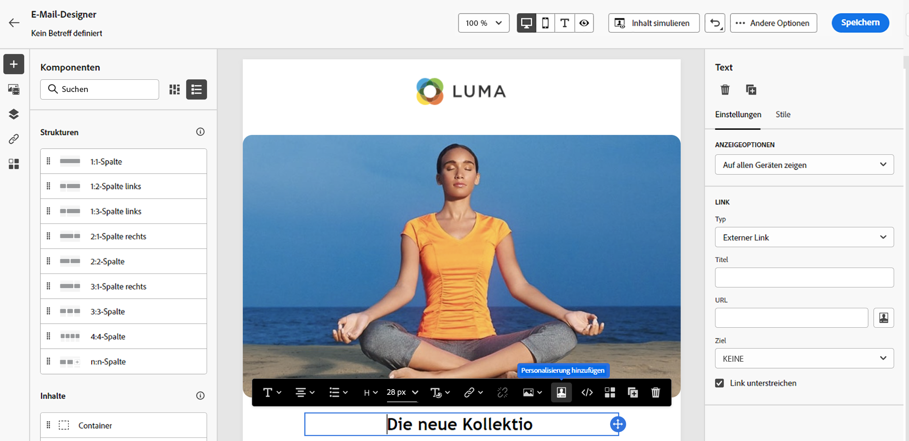

# Hinzufügen von Personalisierung {#build-personalization-expressions}

>[!CONTEXTUALHELP]
>id="ajo_perso_editor"
>title="Über den Personalisierungseditor"
>abstract="Mit dem Personalisierungseditor können Sie alle Daten auswählen, anordnen, anpassen und validieren, um eine benutzerdefinierte Personalisierung für Ihre Inhalte zu erstellen."

Der Personalisierungseditor ist die Kernkomponente der Personalisierung in [!DNL Journey Optimizer]. Er ist in jedem Kontext verfügbar, in dem Sie eine Personalisierung definieren müssen, wie z. B. E-Mails, Push-Benachrichtigungen und Angebote.

In der Benutzeroberfläche des Personalisierungseditors können Sie alle Daten auswählen, anordnen, anpassen und validieren, um eine benutzerdefinierte Personalisierung für Ihre Inhalte zu erstellen.


## Wo kann ich Personalisierung hinzufügen?

Mit dem Symbol „Personalisierung hinzufügen![ können Sie in allen Feldern **[!DNL Journey Optimizer]** Personalisierung ](assets/do-not-localize/add-perso-icon.svg).

### Nachrichten

In Nachrichten kann die Personalisierung an verschiedenen Stellen in Ihren Nachrichten hinzugefügt werden, z. B. im Feld **[!UICONTROL Betreffzeile]**.


Sie können sie auch in anderen Abschnitten Ihres Inhalts hinzufügen. Für Push[Benachrichtigungen ](../push/push-gs.md) beispielsweise Personalisierung in den Feldern **Titel**, **Text**, **Benutzerdefinierter Ton**, **Badges** und **Benutzerdefinierte Daten**.

### Email Designer

Designer Beim Bearbeiten von E-Mail[Inhalten in der E-Mail-](../email/get-started-email-design.md) können Sie mithilfe des Symbols in der kontextuellen Symbolleiste Personalisierungen in Textblöcken und in URLs hinzufügen.



### Angebote

Sie können eine Personalisierung hinzufügen, wenn Sie Textinhalte in Ihren **Angebotsdarstellungen“**. [Erfahren Sie, wie Sie personalisierte Angebote erstellen](../offers/offer-library/creating-personalized-offers.md)

### URLs

Mit Journey Optimizer können Sie auch **URLs** in Ihrer Nachricht personalisieren.  Personalisierte URLs führen Empfänger je nach den Profilattributen zu bestimmten Seiten einer Website oder zu einer personalisierten Microsite. Die URL-Personalisierung ist für folgende Arten von Links verfügbar: **Externer Link**, **Abmelde-Link** und **Opt-out**.

+++Siehe Beispiele für personalisierte URLs

* `https://www.adobe.com/users/{{profile.person.name.lastName}}`
* `https://www.adobe.com/users?uid={{profile.person.name.firstName}}`
* `https://www.adobe.com/usera?uid={{context.journey.technicalProperties.journeyUID}}`
* `https://www.adobe.com/users?uid={{profile.person.crmid}}&token={{context.token}}`

+++

{width="50%"}

>[!NOTE]
>
>Beim Bearbeiten einer personalisierten URL im Personalisierungseditor werden Hilfsfunktionen und die Zielgruppenzugehörigkeit aus Sicherheitsgründen deaktiviert.
>
>Leerzeichen werden in den Personalisierungs-Token, die in URLs verwendet werden, nicht unterstützt.

## Personalization-Quellen {#sources}

Im linken Bildschirmbereich wird ein Domain-Selektor angezeigt, mit dem Sie die Quelle für die Personalisierung auswählen können. Verfügbare Quellen sind:

* **[!UICONTROL Profilattribute]**: Listet alle Verweise auf, die mit dem Profilschema verknüpft sind, das in der [Dokumentation des Adobe Experience Platform-Datenmodells (XDM)](https://experienceleague.adobe.com/docs/experience-platform/xdm/home.html?lang=de){target="_blank"} beschrieben wird.
* **[!UICONTROL Zielgruppen]**: Listet alle im Segmentierungs-Service von Adobe Experience Platform erstellten Zielgruppen auf. Weitere Informationen zur Segmentierung finden Sie [hier](https://experienceleague.adobe.com/docs/experience-platform/segmentation/home.html?lang=de){target="_blank"}.
* **[!UICONTROL Angebotsentscheidungen]**: Listet alle Angebote auf, die mit einer bestimmten Platzierung verbunden sind. Wählen Sie die Platzierung aus und fügen Sie dann die Angebote in den Inhalt ein. Eine vollständige Dokumentation zum Verwalten von Angeboten finden Sie in [diesem Abschnitt](../offers/get-started/starting-offer-decisioning.md).
* **[!UICONTROL Kontextattribute]**: Wenn eine Kanalaktionsaktivität (E-Mail, Push, SMS) in einer Journey oder Kampagne verwendet wird, stehen für die Personalisierung Kontextattribute im Zusammenhang mit Ereignissen und Eigenschaften zur Verfügung. Ein Beispiel für die Personalisierung mit kontextuellen Attributen finden Sie in [diesem Abschnitt](personalization-use-case.md).

>[!NOTE]
>
>Beim Targeting einer Zielgruppe mit Anreicherungsattributen, die mithilfe eines Kompositions-Workflows generiert wurden, können Sie diese Anreicherungsattribute nutzen, um Ihre Nachricht zu personalisieren. [Erfahren Sie, wie Sie Zielgruppenanreicherungsattribute verwenden](../audience/about-audiences.md#enrichment)

## Hinzufügen von Personalisierung {#add}

>[!CONTEXTUALHELP]
>id="ajo_perso_editor_autocomplete"
>title="Automatisch vervollständigen"
>abstract="Durch Aktivieren dieser Option kann das System während der Eingabe automatisch Code vorschlagen und vervollständigen. Diese Funktion ist nur für HTML- und Textformate verfügbar und unterstützt Profil- und Kontextattribute. Wenn die Option deaktiviert ist, stellt der Editor stattdessen die automatische Vervollständigung von nativem HTML-Code bereit."

Im zentralen Arbeitsbereich erstellen Sie Ihre Personalisierungssyntax. Um ein Attribut zur Personalisierung Ihrer Nachricht zu verwenden, suchen Sie es im linken Navigationsbereich und klicken Sie auf die Schaltfläche `+` , um es zum Ausdruck hinzuzufügen.

Über das Menü mit den Auslassungspunkten neben dem Symbol `+` können Sie weitere Details für jedes Attribut abrufen und Ihre am häufigsten verwendeten Attribute zu den Favoriten hinzufügen. Zu Favoriten hinzugefügte Attribute sind über das Menü **[!UICONTROL Favoriten]** im linken Navigationsbereich zugänglich.

Darüber hinaus können Sie einen standardmäßigen Fallback-Text definieren, der angezeigt wird, wenn ein Profilattribut vom Typ Zeichenfolge leer ist. Klicken Sie dazu auf die Schaltfläche mit den Auslassungspunkten neben dem Attribut und wählen Sie **[!UICONTROL Einfügen mit Fallback-Text]**. Schreiben Sie den Text, der standardmäßig angezeigt werden soll, wenn der Wert des Attributs für ein Profil leer ist, und klicken Sie dann auf **[!UICONTROL Hinzufügen]**.


Im folgenden Beispiel können Sie mit dem Personalisierungseditor die Profile auswählen, die heute Geburtstag haben, und dann die Anpassung vervollständigen, indem Sie ein spezifisches Angebot einfügen, das zu diesem Tag passt.


## Tools für die Ausdrucksbearbeitung

Der zentrale Arbeitsbereich bietet verschiedene Tools, mit denen Sie Ihren Personalisierungsausdruck schreiben können.


Verfügbare Optionen sind:

1. **[!UICONTROL Suchen]**/**[!UICONTROL Suchen und Ersetzen]**: Durchsuchen Sie Ihren Ausdruck und ersetzen Sie automatisch Teile des Codes.
1. **[!UICONTROL Rückgängig]**/**[!UICONTROL Wiederholen]**: Rückgängig/Wiederholen des letzten Vorgangs.
1. **[!UICONTROL Automatisch vervollständigen]**: schlägt Code während der Eingabe automatisch vor und vervollständigt ihn. Diese Funktion ist nur für HTML- und Textformate verfügbar und unterstützt Profil- und Kontextattribute. Wenn die Option deaktiviert ist, stellt der Editor stattdessen die automatische Vervollständigung von nativem HTML-Code bereit.

   {width="70%" align="center" zoomable="yes"}

1. **[!UICONTROL HTML]**/**[!UICONTROL JSON]**/**[!UICONTROL Text]**: Identifizieren Sie das Format Ihres Codes. Dadurch kann das System die Funktion zur Validierung und automatischen Vervollständigung basierend auf der ausgewählten Sprache anpassen.
1. **[!UICONTROL Validate]**: Überprüfen Sie die Syntax Ihres Ausdrucks. Weiterführende Informationen finden Sie in [diesem Abschnitt](../personalization/personalization-build-expressions.md).
1. **[!UICONTROL Als Fragment speichern]**: Speichern Sie Ihren Ausdruck als Ausdrucksfragment. Weiterführende Informationen finden Sie in [diesem Abschnitt](../content-management/save-fragments.md#save-as-expression-fragment).
1. **[!UICONTROL Schriftgröße]**: Passt die Schriftgröße für die Inhalte im Editor an, um die Lesbarkeit zu verbessern.
1. **[!UICONTROL Zeilenumbruch]**: Aktiviert oder deaktiviert den Zeilenumbruch, sodass lange Ausdrücke auf einer einzelnen Zeile angezeigt oder im Editor umgebrochen werden können. Zu den Optionen gehören:
   * **Aus** (Standard) - Kein Zeilenumbruch. Lange Zeilen gehen über die Editor-Ansicht hinaus und erfordern einen horizontalen Bildlauf.
   * **Ein** - Schließt Zeilen in die Breite des Editors ein.
   * **Zeilenumbruchspalte** - Zeilenumbrüche, wenn eine Zeilenzeichenanzahl 80 Zeichen erreicht.
   * **Begrenzt** - Bettet Zeilen entweder mit der Editor-Breite oder mit 80 Zeichen ein, je nachdem, welcher Wert kleiner ist.

Im Navigationsbereich stehen zusätzliche Funktionen zur Verfügung, mit denen Sie Ihren Personalisierungsausdruck erstellen können.


* **[!UICONTROL Helper-Funktionen]** - Helper-Funktionen ermöglichen es Ihnen, Datenoperationen wie Berechnungen, Datenformatierungen oder -konvertierungen und Bedingungen durchzuführen und diese im Rahmen der Personalisierung zu bearbeiten. [Erfahren Sie mehr über die verfügbaren Hilfsfunktionen](functions/functions.md)

* **[!UICONTROL Favoriten]** - Attribute, die Sie den Favoriten hinzugefügt haben, werden in dieser Liste angezeigt. Auf diese Weise können Sie schnell auf Ihre am häufigsten verwendeten Elemente zugreifen. Um ein Attribut zu Ihren Favoriten hinzuzufügen, klicken Sie auf das Menü mit den Auslassungspunkten und wählen Sie **[!UICONTROL Zu Favoriten hinzufügen]**.

* **[!UICONTROL Bedingungen]** - Nutzen Sie die in der Bibliothek erstellten bedingten Regeln, um Ihren Nachrichten dynamische Inhalte hinzuzufügen. Auf diese Weise können Sie basierend auf Bedingungen mehrere Varianten Ihrer Nachricht erstellen. [Erfahren Sie, wie Sie dynamische Inhalte erstellen](../personalization/get-started-dynamic-content.md)

* **[!UICONTROL Fragments]** - Nutzen Sie Ausdrucksfragmente, die erstellt oder in der aktuellen Sandbox gespeichert wurden. Ein Fragment ist eine wiederverwendbare Komponente, die in [!DNL Journey Optimizer]-Kampagnen und -Journeys referenziert werden kann. Mit dieser Funktion können Sie mehrere benutzerdefinierte Inhaltsbausteine vorab erstellen, mit denen Marketing-Fachleute Inhalte schnell in einem verbesserten Design-Prozess zusammenstellen können.  [Erfahren Sie, wie Sie Ausdrucksfragmente für die Personalisierung verwenden](../personalization/use-expression-fragments.md)

Wenn Ihr Personalisierungsausdruck fertig ist, müssen Sie ihn vom Personalisierungseditor validieren lassen.  Weiterführende Informationen finden Sie in [diesem Abschnitt](../personalization/personalization-build-expressions.md).

## Mechanismen der Validierung {#validation-mechanisms}

Die Überprüfung Ihres Ausdrucks wird automatisch ausgeführt, wenn Sie auf die Schaltfläche **Hinzufügen** klicken, um das Editor-Fenster zu schließen. Sie können auch die Schaltfläche **Validieren** verwenden, um Ihre Personalisierungssyntax zu überprüfen.


Erweitern Sie den folgenden Abschnitt, um häufige Fehler bei der Validierung der Personalisierung anzuzeigen.

+++Häufige Fehler

* **Pfad „XYZ“ nicht gefunden**

Beim Versuch, auf ein Feld zu verweisen, das im Schema nicht definiert ist.

In diesem Fall ist **firstName1** nicht als Attribut im Profilschema definiert:

```
{{profile.person.name.firstName1}}
```

* **Typ für Variable „XYZ“ stimmt nicht überein. Array erwartet, Zeichenfolge gefunden.**

Beim Versuch, über eine Zeichenfolge statt über ein Array zu iterieren.

In diesem Fall ist **product** kein Array:

```
{{each profile.person.name.firstName as |product|}}
 {{product.productName}}
{{/each}}
```

* **Ungültige Handlebars-Syntax.`‘[XYZ}}’`** gefunden

Wenn eine ungültige Handlebars-Syntax verwendet wird.

Handlebar-Ausdrücke sind von **{{expression}}** umgeben.

```
   {{[profile.person.name.firstName}}
```

* **Ungültige Segmentdefinition**

```
No segment definition found for 988afe9f0-d4ae-42c8-a0be-8d90e66e151
```

+++

Bei Angeboten können spezifische Fehler auftreten. Erweitern Sie den folgenden Abschnitt, um weitere Details anzuzeigen:

+++ Spezifische Fehler im Zusammenhang mit Angeboten

Die Fehler bei der Integration von Angeboten in eine E-Mail-Nachricht oder Push-Benachrichtigung haben das folgende Muster:

```
Offer.<offerType>.[PlacementID].[ActivityID].<offer-attribute>
```

Die Validierung erfolgt während der Validierung des Personalisierungsinhalts im Personalisierungseditor.

<table> 
 <thead> 
  <tr> 
   <th> Fehlertitel<br /> </th> 
   <th> Validierung/Auflösung <br /> </th> 
  </tr> 
 </thead> 
 <tbody> 
  <tr> 
   <td>Ressource mit der ID placementID und dem Typ OfferPlacement nicht gefunden <br/>
Ressource mit der ID activityID und dem Typ OfferActivity nicht gefunden<br/></td> 
   <td>Überprüfen Sie, ob activityID und/oder placementID verfügbar ist.</td> 
  </tr> 
   <tr> 
   <td>Ressource konnte nicht validiert werden.</td> 
   <td>Der componentType in der Platzierung sollte mit dem Angebot offerType übereinstimmen.</td> 
  </tr> 
   <tr> 
   <td>Die öffentliche URL ist in der offerId des Angebots nicht vorhanden.</td> 
   <td>Für die Image-Angebote (alle personalisierten und Fallback-Angebote, die mit dem Entscheidungs- und Platzierungs-Paar verknüpft sind) sollte die öffentliche URL gefüllt sein (deliveryURL sollte nicht leer sein).</td> 
  </tr> 
  <tr> 
   <td>Die Entscheidung enthält Attribute, die nicht zu Profilen gehören.</td> 
   <td>Die Verwendung des Angebotsmodells sollte nur die Profilattribute enthalten.</td> 
  </tr> 
  <tr> 
   <td>Beim Abrufen der Entscheidungsverwendung ist ein Fehler aufgetreten.</td> 
   <td>Dieser Fehler kann auftreten, wenn die API versucht, das Angebotsmodell abzurufen.</td> 
  </tr>
  <tr> 
   <td>Angebotsattribut – Das Angebotsattribut ist ungültig.</td> 
   <td>Überprüfen Sie, ob das Angebotsattribut, auf das in der Angebots-Dropdown-Liste verwiesen wird, gültig ist. Folgende Attribute sind gültig: <br/>
Bild: deliveryURL, linkURL<br/>
Text: content<br/>
HTML: content<br/></td> 
  </tr> 
 </tbody> 
</table>

+++
