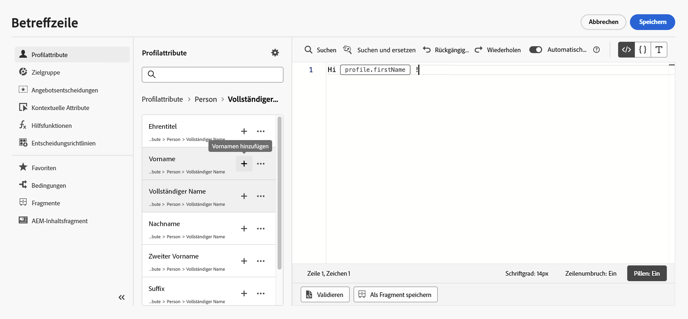
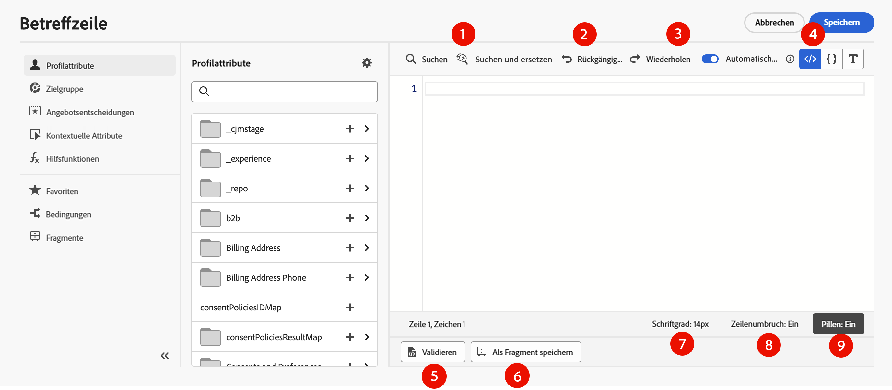

# Hinzufügen von Personalisierung {#build-personalization-expressions}

>[!CONTEXTUALHELP]
>id="ajo_perso_editor"
>title="Über den Personalisierungseditor"
>abstract="Mit dem Personalisierungseditor können Sie alle Daten auswählen, anordnen, anpassen und validieren, um eine benutzerdefinierte Personalisierung für Ihre Inhalte zu erstellen."

Der Personalisierungseditor ist die Kernkomponente der Personalisierung in [!DNL Journey Optimizer]. Er ist in jedem Kontext verfügbar, in dem Sie eine Personalisierung definieren müssen, wie z. B. E-Mails, Push-Benachrichtigungen und Angebote.

In der Benutzeroberfläche des Personalisierungseditors können Sie alle Daten auswählen, anordnen, anpassen und validieren, um eine benutzerdefinierte Personalisierung für Ihren Content zu erstellen.


## Wo kann ich eine Personalisierung hinzufügen? {#where}

Mit dem Symbol  können Sie in jedem Feld in **[!DNL Journey Optimizer]** Personalisierungen hinzufügen. Erweitern Sie die folgenden Abschnitte, um weitere Informationen zu erhalten.

+++Nachrichten

Die Personalisierung kann an verschiedenen Stellen in Ihren Nachrichten hinzugefügt werden, z. B. im Feld **[!UICONTROL Betreffzeile]**.


Sie kann auch in anderen Abschnitten Ihres Contents hinzugefügt werden. Zum Beispiel kann eine Personalisierung für [Push-Benachrichtigungen](../push/push-gs.md) in den Feldern **Titel**, **Textkörper**, **Benutzerdefinierter Ton**, **Badges** und **Benutzerdefinierte Daten** hinzugefügt werden.

+++

+++E-Mail-Designer

Beim Bearbeiten von E-Mail-Content im [E-Mail-Designer](../email/get-started-email-design.md) können Sie mithilfe des Symbols in der kontextuellen Symbolleiste Personalisierungen in Textblöcken und in URLs hinzufügen.


+++

+++Angebote

Sie können eine Personalisierung hinzufügen, wenn Sie Textinhalte in Ihren **Angebotsdarstellungen** verwenden. [Informationen zum Erstellen von personalisierten Angeboten](../offers/offer-library/creating-personalized-offers.md)

+++

+++URLs

Mit Journey Optimizer können Sie auch **URLs** in Ihrer Nachricht personalisieren.  Personalisierte URLs führen Empfangende je nach den Profilattributen zu bestimmten Seiten einer Website oder zu einer personalisierten Microsite. Die Personalisierung von URLs ist für diese Link-Typen verfügbar: **Externer Link**, **Abmelde-Link** und **Ausschluss**.

Beispiele für personalisierte URLs:

* `https://www.adobe.com/users/{{profile.person.name.lastName}}`
* `https://www.adobe.com/users?uid={{profile.person.name.firstName}}`
* `https://www.adobe.com/usera?uid={{context.journey.technicalProperties.journeyUID}}`
* `https://www.adobe.com/users?uid={{profile.person.crmid}}&token={{context.token}}`

{width="50%"}

>[!NOTE]
>
>Beim Bearbeiten einer personalisierten URL im Personalisierungseditor werden Hilfsfunktionen und die Zielgruppenzugehörigkeit aus Sicherheitsgründen deaktiviert.
>
>Leerzeichen werden in den Personalisierungs-Token, die in URLs verwendet werden, nicht unterstützt.

Journey Optimizer unterstützt auch vollständige/Basis-URL-Personalisierung. Diese Funktion ist derzeit für bestimmte Kundinnen und Kunden eingeschränkt verfügbar. Beispiel:

```
<a href="{{profile.social.link}}" />
<a href="{{profile.social.baseUrl}}/profile" />
<a href="https://{{profile.social.baseUrl}}/profile" />
```

>[!WARNING]
>
>Die Liste der zulässigen Domains muss Adobe im Voraus zur Verfügung gestellt werden.

+++

+++E-Mail-Konfiguration

Beim Erstellen einer E-Mail-Kanalkonfiguration können Sie personalisierte Werte für Subdomains, Header und URL-Tracking-Parameter definieren. [Weitere Informationen](../email/surface-personalization.md)

+++

## Personalisierungsquellen {#sources}

Im Navigationsbereich können Sie die Quelle für die Personalisierung auswählen. Verfügbare Quellen sind:

* **[!UICONTROL Profilattribute]**: Listet alle Verweise auf, die mit dem Profilschema verknüpft sind, wie in der [Dokumentation zum Adobe Experience Platform-Datenmodell (XDM)](https://experienceleague.adobe.com/docs/experience-platform/xdm/home.html?lang=de){target="_blank"} beschrieben.
* **[!UICONTROL Zielattribute]**: Dieser Ordner ist spezifisch für orchestrierte Kampagnen. Er enthält Attribute, die direkt auf der Kampagnen-Arbeitsfläche berechnet werden. [Informationen zum Hinzufügen von Personalisierungen in orchestrierten Kampagnen](../orchestrated/activities/channels.md#add-personalization)
* **[!UICONTROL Zielgruppen]**: Listet alle im Segmentierungs-Service von Adobe Experience Platform erstellten Zielgruppen auf. Weitere Informationen zur Segmentierung finden Sie [hier](https://experienceleague.adobe.com/docs/experience-platform/segmentation/home.html?lang=de){target="_blank"}.
* **[!UICONTROL Angebotsentscheidungen]**: Listet alle Angebote auf, die mit einer bestimmten Platzierung verbunden sind. Wählen Sie die Platzierung aus und fügen Sie dann die Angebote in den Inhalt ein. Eine vollständige Dokumentation zum Verwalten von Angeboten finden Sie in [diesem Abschnitt](../offers/get-started/starting-offer-decisioning.md).
* **[!UICONTROL Kontextattribute]**: Wenn eine Kanalaktionsaktivität (E-Mail, Push, SMS) in einer Journey oder Kampagne verwendet wird, stehen für die Personalisierung Kontextattribute im Zusammenhang mit Ereignissen und Eigenschaften zur Verfügung. Ein Beispiel für die Personalisierung mit kontextuellen Attributen finden Sie in [diesem Abschnitt](personalization-use-case.md). Darüber hinaus können Antworten benutzerdefinierter Aktionen für die Personalisierung verwendet werden. [Erfahren Sie, wie Sie Antworten benutzerdefinierter Aktionen in nativen Kanälen verwenden ](../action/action-response.md#response-in-channels).

>[!NOTE]
>
>Beim Targeting einer Zielgruppe mit Anreicherungsattributen, die mithilfe eines Kompositions-Workflows generiert wurden, können Sie diese Anreicherungsattribute nutzen, um Ihre Nachricht zu personalisieren. [Erfahren Sie, wie Sie Zielgruppenanreicherungsattribute verwenden](../audience/about-audiences.md#enrichment)

## Hinzufügen von Personalisierung {#add}

>[!CONTEXTUALHELP]
>id="ajo_perso_editor_autocomplete"
>title="Automatisch vervollständigen"
>abstract="Wenn diese Option über den Umschalter aktivieret ist, kann das System den Code während der Eingabe automatisch vervollständigen und Vorschläge unterbreiten. Diese Funktion ist nur für HTML- und Textformate verfügbar und unterstützt Profil- und Kontextattribute. Wenn der Editor über den Umschalter deaktiviert ist, stellt er stattdessen die automatische Vervollständigung von nativem HTML-Code bereit."

Im zentralen Arbeitsbereich erstellen Sie Ihre Personalisierungssyntax. Um ein Attribut zur Personalisierung Ihrer Nachricht zu verwenden, suchen Sie es im linken Navigationsbereich und klicken Sie auf die Schaltfläche `+`, um es zum Ausdruck hinzuzufügen.



Über das Menü mit den Auslassungspunkten neben dem Symbol `+` können Sie weitere Details für jedes Attribut abrufen und Ihre am häufigsten verwendeten Attribute zu den Favoriten hinzufügen. Zu Favoriten hinzugefügte Attribute sind über das Menü **[!UICONTROL Favoriten]** im Navigationsbereich zugänglich.

>[!NOTE]
>
>Im Bereich „Attribute“ werden standardmäßig nur ausgefüllte Attribute angezeigt. Um alle Attribute anzuzeigen, wählen Sie die Schaltfläche  oberhalb des Suchfelds und schalten Sie die Option **[!UICONTROL Nur ausgefüllte Attribute anzeigen]** aus.

Darüber hinaus können Sie einen standardmäßigen Fallback-Text definieren, der angezeigt wird, wenn ein Profilattribut vom Typ Zeichenfolge leer ist. Klicken Sie dazu auf die Schaltfläche mit den Auslassungspunkten neben dem Attribut und wählen Sie **[!UICONTROL Einfügen mit Fallback-Text]**. Schreiben Sie den Text, der standardmäßig angezeigt werden soll, wenn der Wert des Attributs für ein Profil leer ist, und klicken Sie dann auf **[!UICONTROL Hinzufügen]**.


Im folgenden Beispiel können Sie mit dem Personalisierungseditor die Profile auswählen, die heute Geburtstag haben, und dann die Anpassung vervollständigen, indem Sie ein spezifisches Angebot einfügen, das zu diesem Tag passt.


## Optionen für die Ausdrucksbearbeitung {#options}

Der zentrale Arbeitsbereich bietet verschiedene Tools, mit denen Sie Ihren Personalisierungsausdruck schreiben können.



Verfügbare Optionen sind:

1. **[!UICONTROL Suchen]**/**[!UICONTROL Suchen und Ersetzen]**: Durchsuchen Sie Ihren Ausdruck und ersetzen Sie automatisch Teile des Codes.
1. **[!UICONTROL Rückgängig machen]**/**[!UICONTROL Wiederholen]**: Machen Sie den letzten Vorgang rückgängig oder wiederholen Sie ihn.
1. **[!UICONTROL Automatisch vervollständigen]**: Vervollständigt Code automatisch während der Eingabe und unterbreitet Vorschläge. Diese Funktion ist nur für HTML- und Textformate verfügbar und unterstützt Profil- und Kontextattribute. Wenn der Editor über den Umschalter deaktiviert ist, stellt er stattdessen die automatische Vervollständigung von nativem HTML-Code bereit.

   {width="70%" align="center" zoomable="yes"}

1. **[!UICONTROL HTML]**/**[!UICONTROL JSON]**/**[!UICONTROL Text]**: Identifizieren Sie das Format Ihres Codes. Dadurch kann das System die Funktion zur Validierung und automatischen Vervollständigung basierend auf der ausgewählten Sprache anpassen.
1. **[!UICONTROL Validieren]**: Überprüfen Sie die Syntax Ihres Ausdrucks. Weiterführende Informationen finden Sie in [diesem Abschnitt](../personalization/personalization-build-expressions.md).
1. **[!UICONTROL Als Fragment speichern]**: Speichern Sie Ihren Ausdruck als Ausdrucksfragment. Weiterführende Informationen finden Sie in [diesem Abschnitt](../content-management/save-fragments.md#save-as-expression-fragment).
1. **[!UICONTROL Schriftgrad]**: Passt den Schriftgrad für den Content im Editor an, um die Lesbarkeit zu verbessern.
1. **[!UICONTROL Zeilenumbruch]**: Aktiviert oder deaktiviert den Zeilenumbruch, sodass lange Ausdrücke in einer einzelnen Zeile angezeigt oder im Editor umgebrochen werden können. Zu den Optionen gehören:
   * **Aus** (Standard): Kein Zeilenumbruch. Lange Zeilen gehen über die Ansicht des Editors hinaus und erfordern einen horizontalen Bildlauf.
   * **Ein**: Passt Zeilen mit Umbrüchen an die Breite des Editors an.
   * **Zeilenumbruchspalte**: Fügt Zeilenumbrüche ein, wenn eine Zeile 80 Zeichen erreicht.
   * **Begrenzt**: Fügt Zeilenumbrüche angepasst an die Editor-Breite oder bei Erreichen von 80 Zeichen ein, je nachdem, welcher Wert kleiner ist.
1. **[!UICONTROL Pillen]**: Attribute werden als kompakte „Pillen“ angezeigt, um die Lesbarkeit zu verbessern, indem lange Attributpfade ausgeblendet werden. Klicken Sie auf ein Attribut, um dessen vollständigen Pfad anzuzeigen.

   >[!NOTE]
   >
   >Diese Option ist nur für Profilattribute, kontextuelle Attribute und dynamische Medien verfügbar.

Im Navigationsbereich stehen zusätzliche Funktionen zur Verfügung, mit denen Sie Ihren Personalisierungsausdruck erstellen können.


* **[!UICONTROL Hilfsfunktionen]**: Listet alle Hilfsfunktionen auf, die für die Durchführung von Datenoperationen wie Berechnungen, Datenformatierungen oder -konvertierungen, Bedingungen und die Bearbeitung von Daten im Rahmen der Personalisierung verfügbar sind. [Weitere Informationen zu den verfügbaren Hilfsfunktionen](functions/functions.md)

* **[!UICONTROL Favoriten]**: Attribute, die Sie den Favoriten hinzugefügt haben, werden in dieser Liste angezeigt. Auf diese Weise können Sie schnell auf Ihre am häufigsten verwendeten Elemente zugreifen. Um ein Attribut zu Ihren Favoriten hinzuzufügen, klicken Sie auf das Menü mit den Auslassungspunkten und wählen Sie **[!UICONTROL Zu Favoriten hinzufügen]** aus.

* **[!UICONTROL Bedingungen]**: Nutzen Sie die in der Bibliothek erstellten bedingten Regeln, um dynamischen Content in Ihre Nachrichten einzufügen. Auf diese Weise können Sie basierend auf Bedingungen mehrere Varianten Ihrer Nachricht erstellen. [Informationen zum Erstellen von dynamischem Content](../personalization/get-started-dynamic-content.md)

* **[!UICONTROL Fragmente]**: Nutzen Sie Ausdrucksfragmente, die in der aktuellen Sandbox erstellt oder gespeichert wurden. Ein Fragment ist eine wiederverwendbare Komponente, die in [!DNL Journey Optimizer]-Kampagnen und -Journeys referenziert werden kann. Mit dieser Funktion können Sie mehrere benutzerdefinierte Inhaltsbausteine vorab erstellen, mit denen Marketing-Fachleute Inhalte schnell in einem verbesserten Design-Prozess zusammenstellen können.  [Informationen zur Verwendung von Ausdrucksfragmenten](../personalization/use-expression-fragments.md)

Wenn Ihr Personalisierungsausdruck fertig ist, müssen Sie ihn vom Personalisierungseditor validieren lassen.  Weiterführende Informationen finden Sie in [diesem Abschnitt](../personalization/personalization-build-expressions.md).

## Mechanismen der Validierung {#validation-mechanisms}

Die Validierung Ihres Ausdrucks wird automatisch durchgeführt, wenn Sie auf die Schaltfläche **Hinzufügen** klicken, wodurch das Editorfenster geschlossen wird. Sie können Ihre Personalisierungssyntax auch mit der Schaltfläche **Validieren** überprüfen.


Erweitern Sie den folgenden Abschnitt, um Fehler anzuzeigen, die häufig bei der Validierung von Personalisierungen auftreten.

+++Häufige Fehler

* **Pfad „XYZ“ nicht gefunden**

Beim Versuch, auf ein Feld zu verweisen, das im Schema nicht definiert ist.

In diesem Fall ist **firstName1** nicht als Attribut im Profilschema definiert:

```
{{profile.person.name.firstName1}}
```

* **Typ für Variable „XYZ“ stimmt nicht überein. Array erwartet, Zeichenfolge gefunden.**

Beim Versuch, über eine Zeichenfolge, statt über ein Array zu iterieren:

In diesem Fall ist **product** kein Array:

```
{{each profile.person.name.firstName as |product|}}
 {{product.productName}}
{{/each}}
```

* **Ungültige Handlebars-Syntax.`'[XYZ}}'`** gefunden

Wenn eine ungültige Handlebars-Syntax verwendet wird.

Handlebar-Ausdrücke sind von **{{expression}}** umgeben.

```
   {{[profile.person.name.firstName}}
```

* **Ungültige Segmentdefinition**

```
No segment definition found for 988afe9f0-d4ae-42c8-a0be-8d90e66e151
```

+++

Bei Angeboten können spezifische Fehler auftreten. Erweitern Sie den folgenden Abschnitt, um weitere Informationen zu erhalten:

+++ Spezifische Fehler im Zusammenhang mit Angeboten

Die Fehler bei der Integration von Angeboten in eine E-Mail-Nachricht oder Push-Benachrichtigung haben das folgende Muster:

```
Offer.<offerType>.[PlacementID].[ActivityID].<offer-attribute>
```

Die Validierung erfolgt während der Validierung des Personalisierungsinhalts im Personalisierungseditor.

<table> 
 <thead> 
  <tr> 
   <th> Fehlertitel<br /> </th> 
   <th> Validierung/Auflösung <br /> </th> 
  </tr> 
 </thead> 
 <tbody> 
  <tr> 
   <td>Ressource mit der ID placementID und dem Typ OfferPlacement nicht gefunden <br/>
Ressource mit der ID activityID und dem Typ OfferActivity nicht gefunden<br/></td> 
   <td>Überprüfen Sie, ob activityID und/oder placementID verfügbar ist.</td> 
  </tr> 
   <tr> 
   <td>Ressource konnte nicht validiert werden.</td> 
   <td>Der componentType in der Platzierung sollte mit dem Angebot offerType übereinstimmen.</td> 
  </tr> 
   <tr> 
   <td>Die öffentliche URL ist in der offerId des Angebots nicht vorhanden.</td> 
   <td>Für die Image-Angebote (alle personalisierten und Fallback-Angebote, die mit dem Entscheidungs- und Platzierungs-Paar verknüpft sind) sollte die öffentliche URL gefüllt sein (deliveryURL sollte nicht leer sein).</td> 
  </tr> 
  <tr> 
   <td>Die Entscheidung enthält Attribute, die nicht zu Profilen gehören.</td> 
   <td>Die Verwendung des Angebotsmodells sollte nur die Profilattribute enthalten.</td> 
  </tr> 
  <tr> 
   <td>Beim Abrufen der Entscheidungsverwendung ist ein Fehler aufgetreten.</td> 
   <td>Dieser Fehler kann auftreten, wenn die API versucht, das Angebotsmodell abzurufen.</td> 
  </tr>
  <tr> 
   <td>Angebotsattribut – Das Angebotsattribut ist ungültig.</td> 
   <td>Überprüfen Sie, ob das Angebotsattribut, auf das in der Angebots-Dropdown-Liste verwiesen wird, gültig ist. Folgende Attribute sind gültig: <br/>
Bild: deliveryURL, linkURL<br/>
Text: content<br/>
HTML: content<br/></td> 
  </tr> 
 </tbody> 
</table>

+++
