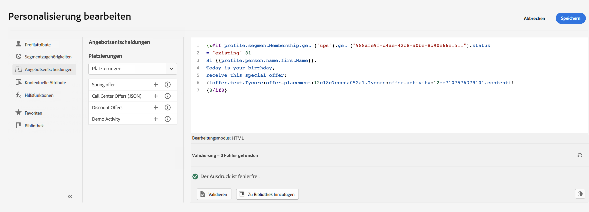

# Über den Ausdruckseditor {#build-personalization-expressions}

Der Ausdruckseditor ist die Kernkomponente der Personalisierung in [!DNL Journey Optimizer]. Er ist in jedem Kontext verfügbar, in dem Sie eine Personalisierung definieren müssen, wie z. B. E-Mails, Push-Benachrichtigungen und Angebote.

In der Benutzeroberfläche des Ausdruckseditors können Sie alle Daten auswählen, anordnen, anpassen und validieren, um eine benutzerdefinierte Personalisierung für Ihre Inhalte zu erstellen.

Im linken Bildschirmbereich wird ein Domain-Selektor angezeigt, mit dem Sie die Quelle für die Personalisierung auswählen können.

Verfügbare Quellen sind:

* **[!UICONTROL Profilattribute]**: Listet alle Verweise auf, die mit dem Profilschema verknüpft sind, das in der [Dokumentation des Adobe Experience Platform-Datenmodells (XDM)](https://experienceleague.adobe.com/docs/experience-platform/xdm/home.html?lang=de){target=&quot;_blank&quot;} beschrieben wird.
* **[!UICONTROL Segmentzugehörigkeit]**: Listet alle im Segmentierungs-Service von Adobe Experience Platform erstellten Segmente auf. Weitere Informationen zur Segmentierung finden Sie [hier](https://experienceleague.adobe.com/docs/experience-platform/segmentation/home.html?lang=de){target=&quot;_blank&quot;}.
* **[!UICONTROL Angebotsentscheidungen]**: Listet alle Angebote auf, die mit einer bestimmten Platzierung verbunden sind. Wählen Sie die Platzierung aus und fügen Sie dann die Angebote in den Inhalt ein. Eine vollständige Dokumentation zum Verwalten von Angeboten finden Sie in [diesem Abschnitt](../messages/deliver-personalized-offers.md).
* **[!UICONTROL Kontextuelle Attribute]**: Wenn die Aktivität **Nachricht** in einer Journey verwendet wird, stehen in diesem Menü kontextbezogene Journey-Felder zur Verfügung. Weiterführende Informationen finden Sie in diesem [Abschnitt](personalization-use-case.md).
* **[!UICONTROL Hilfsfunktionen]**: listet alle Hilfsfunktionen auf, die für die Durchführung von Datenoperationen wie Berechnungen, Datenformatierungen oder -konvertierungen, Bedingungen und die Bearbeitung von Daten im Rahmen der Personalisierung verfügbar sind. Weiterführende Informationen finden Sie in diesem [Abschnitt](functions/functions.md).

Bei der Auswahl wird die Referenz im Editor hinzugefügt.

>[!NOTE]
>
>Das Infosymbol neben dem Symbol „+“ öffnet eine QuickInfo mit weiteren Details zu jeder Variablen.
>
>Sie können die am häufigsten verwendeten Attribute zu Favoriten hinzufügen. Weiterführende Informationen finden Sie in [diesem Abschnitt](personalization-favorites.md).

Im folgenden Beispiel können Sie mit dem Ausdruckseditor die Profile auswählen, die heute Geburtstag haben, und dann die Konfiguration vervollständigen, indem Sie ein spezifisches Angebot einfügen, das zu diesem Tag passt.

Sobald Ihr Personalisierungsausdruck fertig ist, müssen Sie ihn vom Ausdruckseditor validieren lassen. Weiterführende Informationen finden Sie in [diesem Abschnitt](personalization-validation.md).
