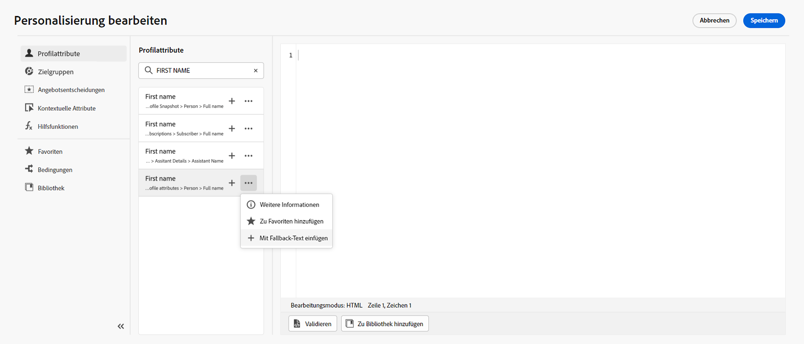

# Über den Ausdruckseditor {#build-personalization-expressions}

>[!CONTEXTUALHELP]
>id="ajo_perso_editor"
>title="Über den Ausdruckseditor"
>abstract="Mit dem Ausdruckseditor können Sie alle Daten auswählen, anordnen, anpassen und validieren, um eine benutzerdefinierte Personalisierung für Ihren Inhalt zu erstellen."

Der Ausdruckseditor ist das Kernstück der Personalisierung in [!DNL Journey Optimizer]. Es ist in jedem Kontext verfügbar, in dem Sie Personalisierungen definieren müssen, wie E-Mails, Push-Benachrichtigungen und Angebote.

In der Benutzeroberfläche des Ausdruckseditors wählen, ordnen, anpassen und validieren Sie alle Daten, um eine benutzerdefinierte Personalisierung für Ihren Inhalt zu erstellen.

Im linken Teil des Bildschirms wird eine Domain-Auswahl angezeigt, mit der Sie die Quelle für die Personalisierung auswählen können.

Verfügbare Quellen sind:

* **[!UICONTROL Profile attributes]** : listet alle Verweise auf, die mit dem Profilschema verknüpft sind, wie unter [Dokumentation zum Adobe Experience Platform-Datenmodell (XDM)](https://experienceleague.adobe.com/docs/experience-platform/xdm/home.html){target=&quot;_blank&quot;}.
* **[!UICONTROL Segment memberships]** : listet alle Segmente auf, die im Segmentierungsdienst von Adobe Experience Platform erstellt wurden. Weitere Informationen zur Segmentierung verfügbar [here](https://experienceleague.adobe.com/docs/experience-platform/segmentation/home.html){target=&quot;_blank&quot;}.
* **[!UICONTROL Offer decisions]** : listet alle Angebote auf, die mit einer bestimmten Platzierung verknüpft sind. Wählen Sie die Platzierung aus und fügen Sie dann die Angebote in Ihren Inhalt ein. Eine vollständige Dokumentation zur Verwaltung von Angeboten finden Sie unter [diesem Abschnitt](../email/add-offers-email.md).
* **[!UICONTROL Contextual attributes]** : Wenn in einer Journey eine Kanalaktionsaktivität (E-Mail, Push, SMS) verwendet wird, stehen über dieses Menü kontextbezogene Journey-Felder zur Verfügung. Weitere Informationen finden Sie unter [diesem Abschnitt](personalization-use-case.md).
* **[!UICONTROL Helper functions]** : listet alle Hilfsfunktionen auf, die für die Durchführung von Datenvorgängen wie Berechnungen, Datenformatierungen oder Konvertierungen, Bedingungen und deren Bearbeitung im Kontext der Personalisierung verfügbar sind. Weitere Informationen finden Sie unter [diesem Abschnitt](functions/functions.md).

Klicken Sie auf die Schaltfläche + , um dem Editor ein Attribut hinzuzufügen.

>[!NOTE]
>
>Das Menü mit den Auslassungspunkten neben dem Symbol &quot;+&quot;ermöglicht es Ihnen, weitere Details für jede Variable abzurufen und Ihre am häufigsten verwendeten Attribute zu [Favoriten](personalization-favorites.md).

Im folgenden Beispiel können Sie mit dem Ausdruckseditor die Profile auswählen, die heute Geburtstag haben, und dann die Anpassung abschließen, indem Sie ein spezifisches Angebot für diesen Tag einfügen.

Sobald Ihr Personalisierungsausdruck fertig ist, müssen Sie ihn vom Ausdruckseditor validieren lassen. Weitere Informationen finden Sie unter [diesem Abschnitt](personalization-validation.md).
