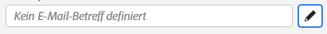
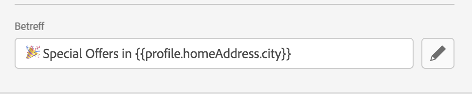
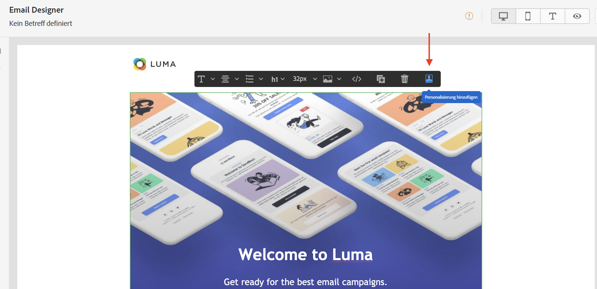
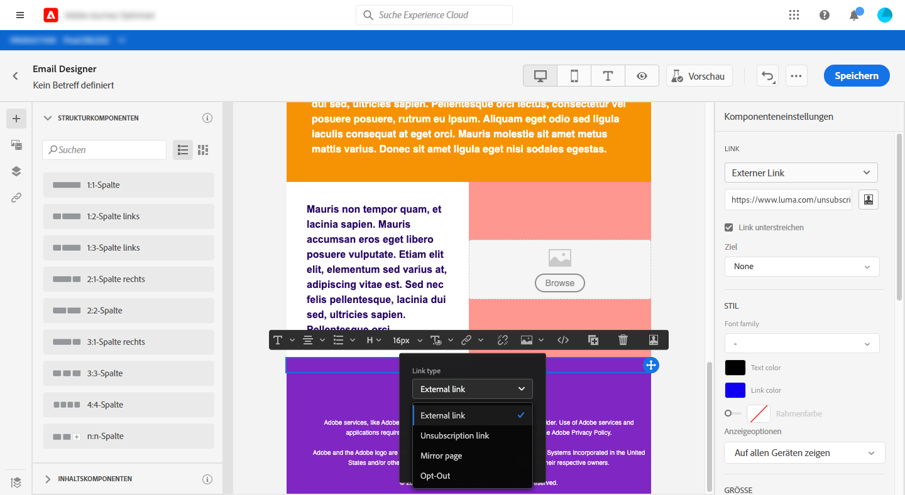
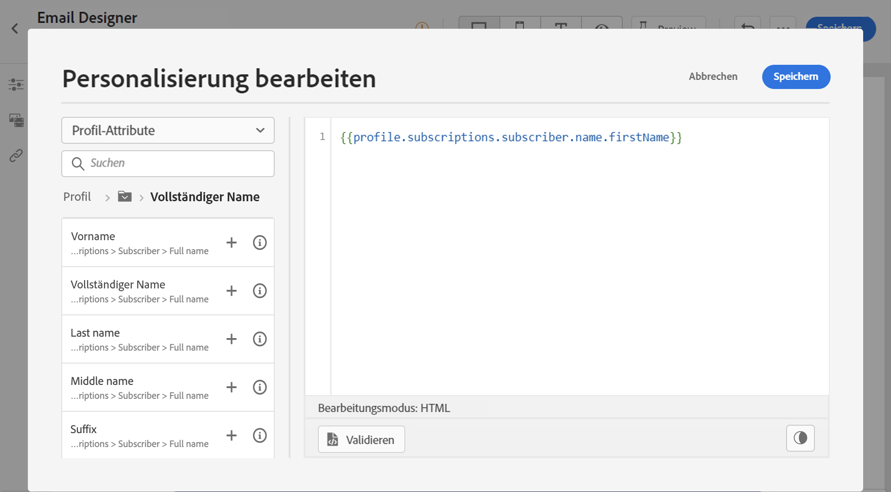
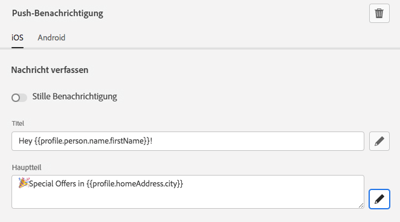

# Personalisierungskontexte{#personalization-areas}

Es gibt verschiedene Möglichkeiten, um den Inhalt und die Darstellung von Nachrichten in [!DNL Journey Optimizer] zu personalisieren.

Sie können den Personalisierungseditor (auch Ausdruckseditor genannt) in allen Feldern mit dem Editor-Symbol öffnen und die Personalisierung definieren.

## E-Mails personalisieren {#personalize-emails}

Wenn Sie eine E-Mail erstellen, können Sie im Fenster **[!UICONTROL Betreffzeile]** der Nachricht eine Personalisierung hinzufügen.

In E-Mail-Designer können Sie den Inhalt personalisieren:

* Im **message**: Klicken Sie in einen Textblock und klicken Sie auf das **Personalisierung hinzufügen** in der dedizierten Symbolleiste. Weiterführende Informationen zur Benutzeroberfläche von E-Mail-Designer finden Sie in [diesem Abschnitt](../email/get-started-email-design.md).

   

* Für einen **Link**: Wählen Sie Text oder ein Bild in einem Textblock aus und klicken Sie in der kontextuellen Symbolleiste auf das Symbol **Link einfügen**. Im Fenster können Sie einen Personalisierungsblock hinzufügen, indem Sie auf das Symbol **Personalisierung hinzufügen** klicken.

   

In beiden Fällen greifen Sie auf den Personalisierungseditor zu.

## Push-Benachrichtigungen personalisieren {#personalize-push}

Sie können **Push-Benachrichtigungen** auch in den folgenden Feldern personalisieren:

* **Titel**
* **Textkörper**
* **Benutzerdefinierter Benachrichtigungston**
* **Badges**
* **Benutzerspezifische Daten**

Weitere Informationen zur Konfiguration von Push-Benachrichtigungen finden Sie in [diesem Abschnitt](../push/push-gs.md).

## Angebote personalisieren {#personalize-offers}

Sie können auch auf den Personalisierungs-Editor zugreifen, wenn Sie den Angebotsdarstellungen Inhalte vom Typ Text hinzufügen.

Weitere Informationen zur Verwaltung von Inhalten mit dem Entscheidungs-Management finden Sie in [diesem Abschnitt](../offers/offer-library/creating-personalized-offers.md#custom-text).

## Erstellen von personalisierten URLs{#personalize-urls}

Personalisierte URLs führen Empfänger je nach den Profilattributen zu bestimmten Seiten einer Website oder zu einer personalisierten Microsite. In Adobe Journey Optimizer können Sie jetzt zu URLs im Nachrichteninhalt eine Personalisierung hinzufügen. Die URL-Personalisierung kann auf Text und Bilder angewendet werden und Profil- oder kontextuelle Daten verwenden.

Erfahren Sie in [diesem Abschnitt](personalization-syntax.md#perso-urls), wie Sie eine personalisierte URL einfügen können.

