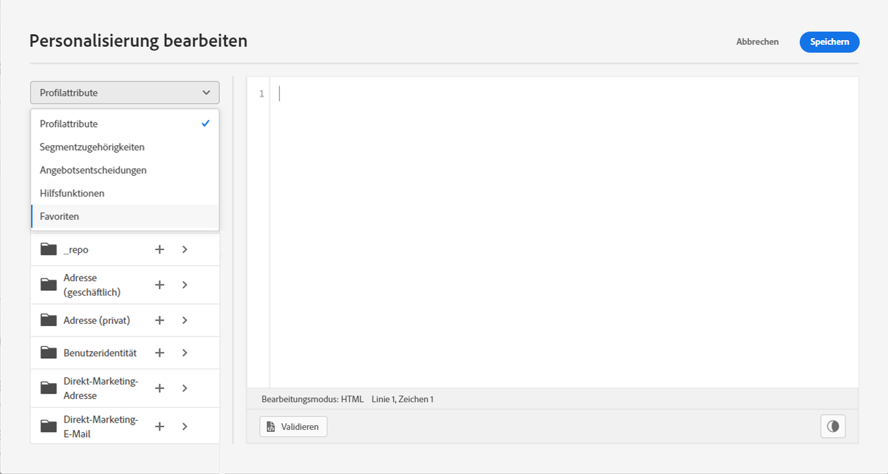

# Hinzufügen von Attributen zu Favoriten {#fav}

Durch das Hinzufügen verschiedener Attribute zum Favoritenmenü erhalten Sie schnellen Zugriff auf die am häufigsten verwendeten Elemente. Um Ihren Favoriten ein Attribut hinzuzufügen, klicken Sie auf das Menü mit den Auslassungspunkten und wählen Sie **[!UICONTROL Zu Favoriten hinzufügen]**.

Verwenden Sie zum Zugriff auf von Ihnen bevorzugte Elemente die **[!UICONTROL Favoriten]** Menüoption im Dropdown-Menü.

Aus dieser Liste können Sie das Personalisierungsobjekt schnell zu Ihrem aktuellen Ausdruck hinzufügen.

Wenn Sie ein Element nicht mehr in Ihrer Favoritenliste sehen möchten, können Sie es aus Favoriten entfernen.

