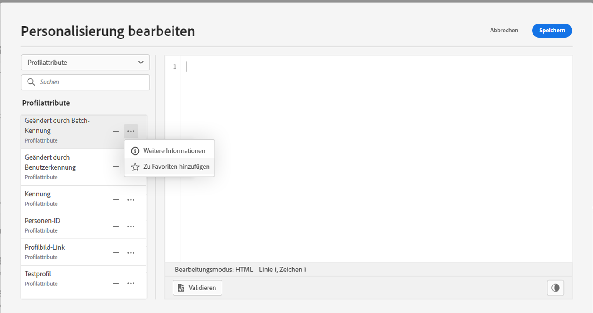
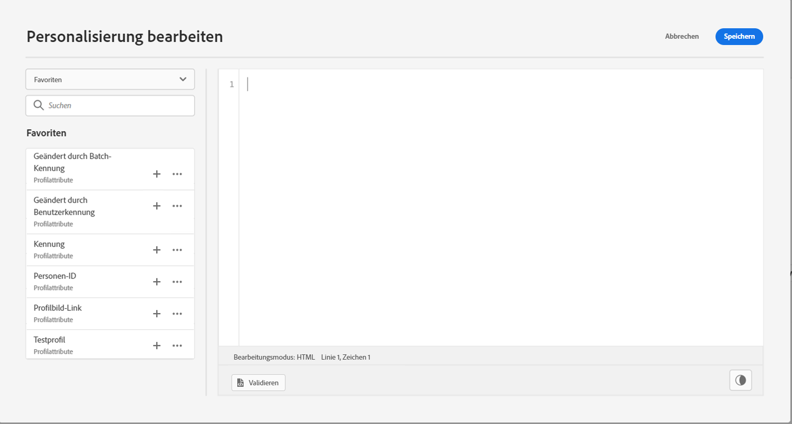
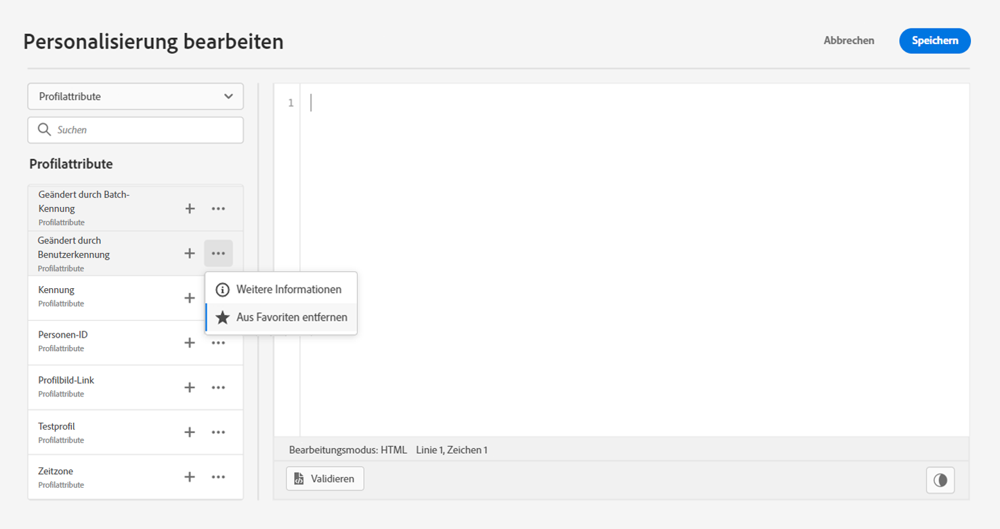

# Hinzufügen von Attributen zu Favoriten {#fav}

Durch das Hinzufügen verschiedener Attribute zum Favoritenmenü erhalten Sie schnellen Zugriff auf die am häufigsten verwendeten Elemente. Um ein Attribut zu Ihren Favoriten hinzuzufügen, klicken Sie auf das Menü mit den Auslassungspunkten und wählen Sie **[!UICONTROL Zu Favoriten hinzufügen]**.

Um auf die von Ihnen favorisierten Elemente zuzugreifen, verwenden Sie das Menü **[!UICONTROL Favoriten]** im linken Bereich.

Aus dieser Liste können Sie das Personalisierungsobjekt schnell zu Ihrem aktuellen Ausdruck hinzufügen.

Wenn Sie ein Element nicht mehr in Ihrer Favoritenliste sehen möchten, können Sie es aus den Favoriten entfernen.

