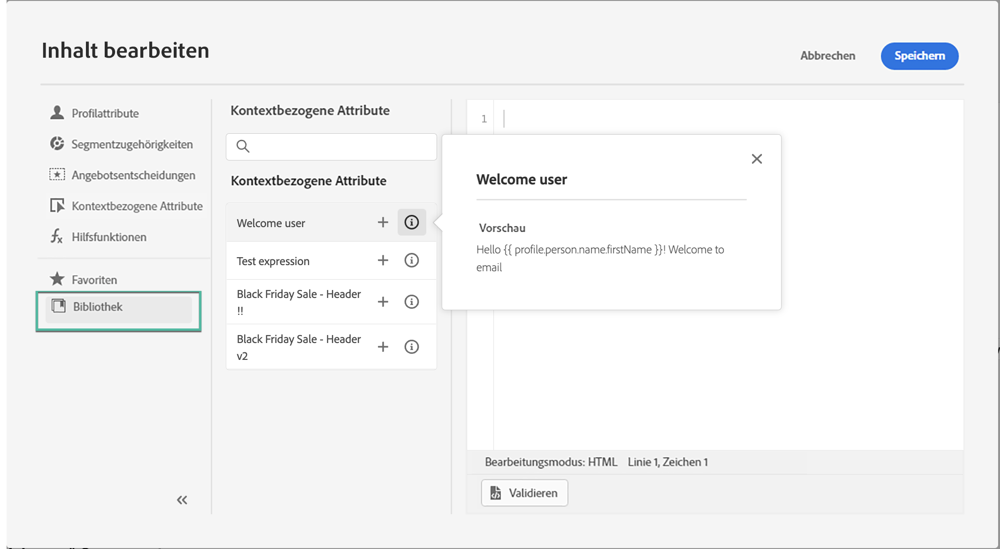
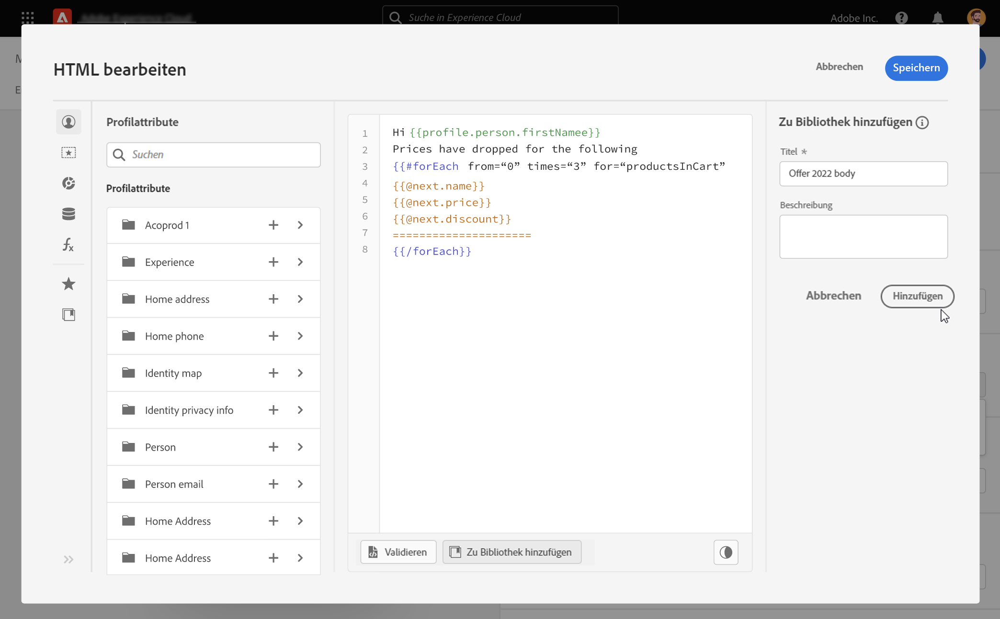

# Arbeiten mit gespeicherten Ausdrücken {#expression-library}

>[!CONTEXTUALHELP]
>id="ajo_perso_library"
>title="Über die Ausdrucksbibliothek"
>abstract="[!DNL Journey Optimizer] bietet eine Bibliothek, in der Sie auf gespeicherte Personalisierungsausdrücke zugreifen können, die von Admin-Benutzern konfiguriert wurden. "

[!DNL Journey Optimizer] bietet eine Bibliothek, in der Sie auf zuvor gespeicherte Personalisierungsausdrücke zugreifen können, die von Admin-Benutzern hinzugefügt wurden.

➡️ [In diesem Video erfahren Sie, wie Sie mit gespeicherten Ausdrücken arbeiten](#video-preview)

Um auf die gespeicherten Ausdrücke zuzugreifen, klicken Sie auf die Schaltfläche **[!UICONTROL Bibliothek]** im linken Bereich. Die Liste enthält alle Ausdrücke, die von Admin-Benutzern gespeichert wurden (siehe [Speichern von Ausdrücken in der Bibliothek](#save-expressions)).

>[!NOTE]
>
>Über die Informationsschaltfläche erhalten Sie weitere Informationen zum Inhalt eines gespeicherten Ausdrucks. Wenn Sie über die entsprechenden Berechtigungen zum Verwalten von Bibliothekselementen verfügen, wird die Informationsschaltfläche im Drei-Punkt-Menü angezeigt.

Klicken Sie auf „+“, um den Ausdruck in den Editor einzufügen. Anschließend können Sie Ihre Personalisierungsinhalte wie gewohnt anpassen und validieren. [Weitere Informationen](../personalization/personalization-build-expressions.md)

## Speichern eines Ausdrucks in der Bibliothek {#save-expressions}

[!DNL Journey Optimizer] ermöglicht es Admin-Benutzern, Personalisierungsausdrücke in der Bibliothek zu speichern. Diese Ausdrücke stehen dann allen Benutzern zur Verfügung, um Personalisierungsinhalte zu erstellen.

Gehen Sie wie folgt vor, um einen Ausdruck in der Bibliothek zu speichern:

1. Erstellen Sie in der Editor-Benutzeroberfläche den Ausdruck und klicken Sie auf **[!UICONTROL Zur Bibliothek hinzufügen]**.

   >[!NOTE]
   >
   >Wenn die Schaltfläche nicht sichtbar ist, überprüfen Sie in der Admin Console, ob Sie über die erforderlichen Berechtigungen verfügen (siehe [Berechtigungsebenen](../administration/high-low-permissions.md)).

   

1. Geben Sie im rechten Bereich einen Titel und eine Beschreibung für den Ausdruck ein, damit Benutzer ihn leichter finden können. Klicken Sie dann auf **[!UICONTROL Hinzufügen]**.

   

1. Der Ausdruck wird zur Bibliothek hinzugefügt. Benutzer können ihn nun verwenden, um ihre Personalisierungsinhalte zu erstellen.

>[!NOTE]
>
>* Ausdrücke dürfen 200 KB nicht überschreiten.
>
>* Gespeicherte Ausdrücke werden nach Erstellungsdatum sortiert, wobei der zuletzt hinzugefügte Ausdruck in der Liste zuerst angezeigt wird.

Um einen vorhandenen Ausdruck zu bearbeiten, fügen Sie ihn zum Editor hinzu und ändern Sie ihn dann entsprechend Ihren Anforderungen. Klicken Sie auf **[!UICONTROL Zur Bibliothek hinzufügen]**, um die Syntax zu überprüfen und den Ausdruck zu speichern.

Um einen Ausdruck zu löschen, klicken Sie auf die Suchschaltfläche und dann auf **[!UICONTROL Löschen]**.

## Anleitungsvideo{#video}

Erfahren Sie, wie Sie gespeicherte Elemente der Personalisierungsbibliothek in einer Nachricht verwenden und wie Sie Elemente der Personalisierungsbibliothek erstellen und verwalten.

>[!VIDEO](https://video.tv.adobe.com/v/340941?quality=12)

