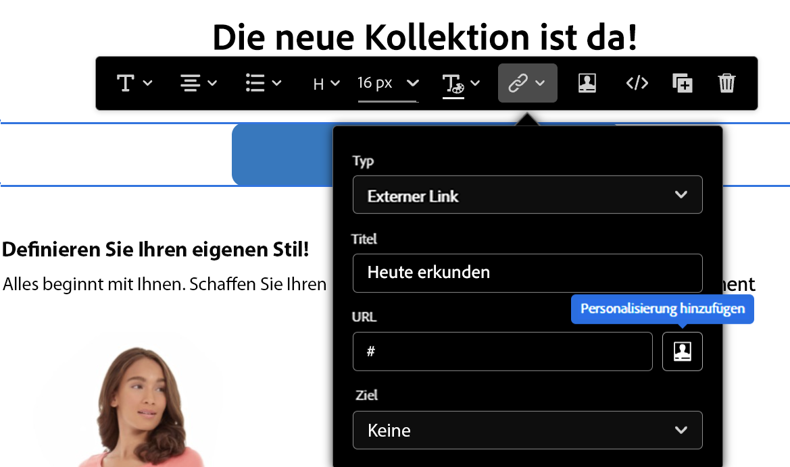

# Personalisierungssyntax {#personalization-syntax}

Personalisierung in [!DNL Journey Optimizer] basiert auf der Vorlagensyntax namens Handlebars.
Eine vollständige Beschreibung der Handlebars-Syntax finden Sie unter [HandlebarsJS-Dokumentation](https://handlebarsjs.com/).

Es verwendet eine Vorlage und ein Eingabeobjekt, um HTML- oder andere Textformate zu generieren. Handlebars-Vorlagen sehen wie normaler Text mit eingebetteten Handlebars-Ausdrücken aus.

Beispiel für einfache Ausdrücke:

`{{profile.person.name}}`

wobei:

* `profile` ist ein Namespace.
* `person.name` ist ein Token, das aus Attributen besteht. Die Attributstruktur wird in einem Adobe Experience Platform-XDM-Schema definiert. [Weitere Infos](https://experienceleague.adobe.com/docs/experience-platform/xdm/home.html){target=&quot;_blank&quot;}.

## Allgemeine Syntaxregeln {#general-rules}

Kennungen können ein beliebiges Unicode-Zeichen sein, mit Ausnahme der folgenden:

```
Whitespace ! " # % & ' ( ) * + , . / ; < = > @ [ \ ] ^ ` { | } ~
```

Bei der Syntax wird zwischen Groß- und Kleinschreibung unterschieden.

Die Worte **true**, **false**, **null** und **undefined** sind nur im ersten Teil eines Pfadausdrucks zulässig.

In Handlebars werden die von der {{expression}} are **HTML-maskiert**. Wenn der Ausdruck `&`, wird die zurückgegebene HTML-maskierte Ausgabe als `&amp;`. Wenn Sie nicht möchten, dass Handlebars einen Wert maskieren, verwenden Sie den &quot;Triple-stash&quot;.

Bezüglich der Argumente für literale Funktionen unterstützt der Vorlagensprachparser keinen einfachen unescapten umgekehrten Schrägstrich (`\`). Dieses Zeichen muss mit einem zusätzlichen umgekehrten Schrägstrich (`\`). Beispiel :

``

## Profil

Mit diesem Namespace können Sie auf alle Attribute verweisen, die im Profilschema definiert sind, das unter [Dokumentation zum Adobe Experience Platform-Datenmodell (XDM)](https://experienceleague.adobe.com/docs/experience-platform/xdm/home.html){target=&quot;_blank&quot;}.

Die Attribute müssen im Schema definiert werden, bevor sie in einer [!DNL Journey Optimizer] Gestaltungsbaustein.

>[!NOTE]
>
>Erfahren Sie, wie Sie Profilattribute in Bedingungen nutzen können in [diesem Abschnitt](functions/helpers.md#if-function).

**Beispielverweise:**

`{{profile.person.name.fullName}}`

`{{profile.person.name.firstName}}`

`{{profile.person.gender}}`

`{{profile.personalEmail.address}}`

`{{profile.mobilePhone.number}}`

`{{profile.homeAddress.city}}`

`{{profile.faxPhone.number}}`

## Segmente{#perso-segments}

Erfahren Sie, wie Sie Profilattribute in Bedingungen nutzen können in [diesem Abschnitt](functions/helpers.md#if-function).

>[!NOTE]
>Weitere Informationen zum Segmentierungs- und Segmentierungsdienst finden Sie unter [diesem Abschnitt](../segment/about-segments.md).

## Angebote {#offers-syntax}

Mit diesem Namespace können Sie auf vorhandene Angebotsentscheidungen verweisen.
Um auf ein Angebot zu verweisen, müssen Sie einen Pfad mit den verschiedenen Informationen deklarieren, die ein Angebot definieren.

Dieser Pfad weist die folgende Struktur auf:

`offers.Type.[Placement Id].[Activity Id].Attribute`

wobei:

* `offers` identifiziert den Pfadausdruck, der zum Angebots-Namespace gehört
* `Type`  bestimmt den Typ der Angebotsdarstellung. Mögliche Werte sind: `image`, `html` und `text`
* `Placement Id` und `Activity Id` Platzierungs- und Aktivitäts-IDs
* `Attributes` sind angebotspezifische Attribute, die vom Angebotstyp abhängen. Beispiel: `deliveryUrl` für Bilder

Weitere Informationen zur Decisions-API und zur Angebotsdarstellung finden Sie unter [diese Seite](../offers/api-reference/offer-delivery-api/decisioning-api.md)

Alle Verweise werden mit einem Validierungsmechanismus, der unter [diese Seite](personalization-validation.md)

**Beispielverweise:**

* Speicherort, an dem das Bild gehostet wird:

   `offers.image.[offers:xcore:offer-placement:126f767d74b0da80].[xcore:offer-activity:125e2c6889798fd9].deliveryUrl`

* Ziel-URL beim Klicken auf das Bild:

   `offers.image.[offers:xcore:offer-placement:126f767d74b0da80].[xcore:offer-activity:125e2c6889798fd9].linkUrl`

* Textinhalt des Angebots, der von der Entscheidungs-Engine stammt:

   `offers.text.[offers:xcore:offer-placement:126f767d74b0da80].[xcore:offer-activity:125e2c6889798fd9].content`

* HTML-Inhalt des Angebots, der von der Decisioning-Engine stammt:

   `offers.html.[offers:xcore:offer-placement:126f767d74b0da80].[xcore:offer-activity:125e2c6889798fd9].content`


## Helfer{#helpers-all}

Ein Handlebars Helper ist eine einfache Kennung, der Parameter folgen können.
Jeder Parameter ist ein Handlebars-Ausdruck. Auf diese Helfer kann von jedem Kontext in einer Vorlage zugegriffen werden.

Diese Block-Helfer werden durch ein # identifiziert, das dem Helper-Namen vorangeht, und benötigen ein entsprechendes schließendes /, gleichnamiges -Zeichen.
Blöcke sind Ausdrücke mit Blocköffnung ({{# }}) and closing ({{/}}).


>[!NOTE]
>
>Die Hilfsfunktionen werden im Abschnitt [diesem Abschnitt](functions/helpers.md).

## Literaltypen {#literal-types}

[!DNL Adobe Journey Optimizer] unterstützt die folgenden Literaltypen:

| Literal | Definition |
| ------- | ---------- |
| Zeichenfolge | Ein Datentyp, der aus Zeichen besteht, die von doppelten Anführungszeichen umgeben sind. <br>Beispiele: `"prospect"`, `"jobs"`, `"articles"` |
| Boolesch | Ein Datentyp, der entweder &quot;true&quot;oder &quot;false&quot;ist. |
| Ganzzahl | Ein Datentyp, der eine ganze Zahl darstellt. Sie kann positiv, negativ oder null sein. <br>Beispiele: `-201`, `0`, `412` |
| Array | Ein Datentyp, der als Gruppe anderer Literalwerte besteht. Zur Gruppierung werden eckige Klammern und Kommas verwendet, um zwischen verschiedenen Werten zu trennen. <br> **Hinweis:** Sie können nicht direkt auf die Eigenschaften von Elementen in einem Array zugreifen. <br> Beispiele: `[1, 4, 7]`, `["US", "FR"]` |

>[!CAUTION]
>
>Die Verwendung von **xEvent** in Personalisierungsausdrücken nicht verfügbar ist. Jeder Verweis auf xEvent führt zu Validierungsfehlern.

## URL-Personalisierung{#perso-urls}

Personalisierte URLs führen Empfänger je nach Profilattributen zu bestimmten Seiten einer Website oder zu einer personalisierten Microsite. In Adobe Journey Optimizer können Sie URLs in Ihrem Nachrichteninhalt Personalisierung hinzufügen. Die URL-Personalisierung kann auf Text und Bilder angewendet werden und Profildaten oder Kontextdaten verwenden.

Mit Journey Optimizer können Sie eine oder mehrere URLs in Ihrer Nachricht personalisieren, indem Sie ihnen Personalisierungsfelder hinzufügen. Gehen Sie wie folgt vor, um eine URL zu personalisieren:

1. Erstellen Sie einen Link in Ihrem Nachrichteninhalt. [Weitere Infos](../email/message-tracking.md#insert-links)
1. Wählen Sie über das Personalisierungssymbol die Attribute aus. Das Personalisierungssymbol steht nur für diese Relationstypen zur Verfügung: **Externer Link**, **Abmelde-Link** und **Opt-out**.



>[!NOTE]
>
>Wenn Sie im Ausdruckseditor eine personalisierte URL bearbeiten, sind Hilfsfunktionen und die Segmentzugehörigkeit aus Sicherheitsgründen deaktiviert.

**Beispiel für personalisierte URLs**

* `https://www.adobe.com/users/{{profile.person.name.lastName}}`
* `https://www.adobe.com/users?uid={{profile.person.name.firstName}}`
* `https://www.adobe.com/usera?uid={{context.journey.technicalProperties.journeyUID}}`
* `https://www.adobe.com/users?uid={{profile.person.crmid}}&token={{context.token}}`

>[!CAUTION]
>
>Leerzeichen werden in den Personalisierungstoken, die in URLs verwendet werden, nicht unterstützt.
