# Anwendungsfall: Personalisierung Warenkorbabbruch-E-Mail {#personalization-use-case-helper-functions}

In diesem Beispiel personalisieren Sie den Textkörper einer E-Mail-Nachricht. Diese Nachricht richtet sich an Kunden, die Artikel in ihrem Warenkorb gelassen, aber noch nicht gekauft haben.

Sie werden die folgenden Arten von Hilfsfunktionen verwenden:

* Die String-Funktion `upperCase` , mit der der Vorname des Kunden in Großbuchstaben eingefügt wird. [Weitere Informationen](functions/string.md#upper).
* Der `each`-Helfer, um die Artikel im Warenkorb aufzulisten. [Weitere Informationen](functions/helpers.md#each).
* Der `if`-Helfer, um eine produktspezifische Anmerkung einzufügen, wenn sich das zugehörige Produkt im Warenkorb befindet. [Weitere Informationen](functions/helpers.md#if-function).

<!-- **Context**: personalization based on contextual data from the journey -->

Bevor Sie beginnen, sollten Sie wissen, wie Sie diese Elemente konfigurieren:
* Eine E-Mail-Nachricht. [Weitere Informationen](../create-message.md)
* Der Hauptteil einer E-Mail. [Weitere Informationen](../create-email-content.md).
* Ein Einzelereignis. [Weitere Informationen](../event/about-events.md).
* Eine Journey, die mit einem Ereignis beginnt. [Weitere Informationen](../building-journeys/using-the-journey-designer.md).

Führen Sie folgende Schritte aus:
1. [E-Mail-Nachricht erstellen](#configure-email).
2. [Geben Sie den Vornamen des Kunden in Großbuchstaben](#uppercase-function) ein.
3. [Erstellen Sie das Anfangsereignis und die Journey](#create-context).
4. [Fügen Sie den Inhalt des Warenkorbs zur E-Mail](#each-helper) hinzu.
5. [Fügen Sie eine produktspezifische Notiz](#if-helper) ein.
6. [Testen und Veröffentlichen der Journey](#test-and-publish).

## Schritt 1: E-Mail erstellen{#configure-email}

1. Erstellen oder ändern Sie eine E-Mail-Nachricht und klicken Sie auf **[!UICONTROL Email Designer]**.
   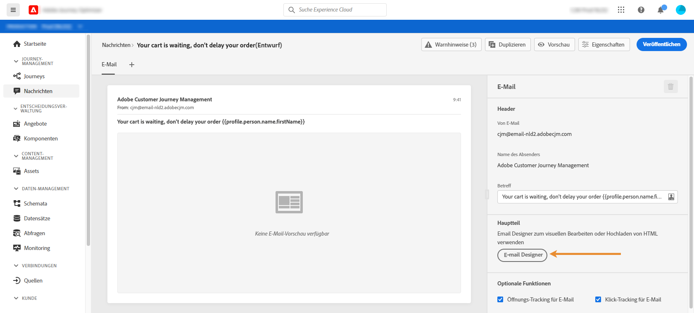

2. Ziehen Sie drei Strukturkomponenten aus der linken Palette der Startseite von Email Designer in den Nachrichten-Textkörper.

3. Ziehen Sie eine HTML-Inhaltskomponente per Drag-and-Drop auf jede neue Strukturkomponente.

   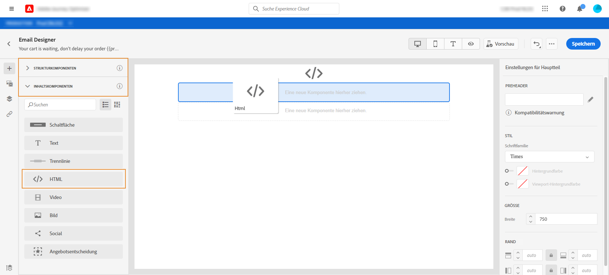

## Schritt 2: Vorname des Kunden in Großbuchstaben einfügen {#uppercase-function}

1. Klicken Sie auf der Startseite von Email Designer auf die HTML-Komponente, der Sie den Vornamen des Kunden hinzufügen möchten.
2. Klicken Sie in der dedizierten Symbolleiste auf **[!UICONTROL Quellcode anzeigen]**.

   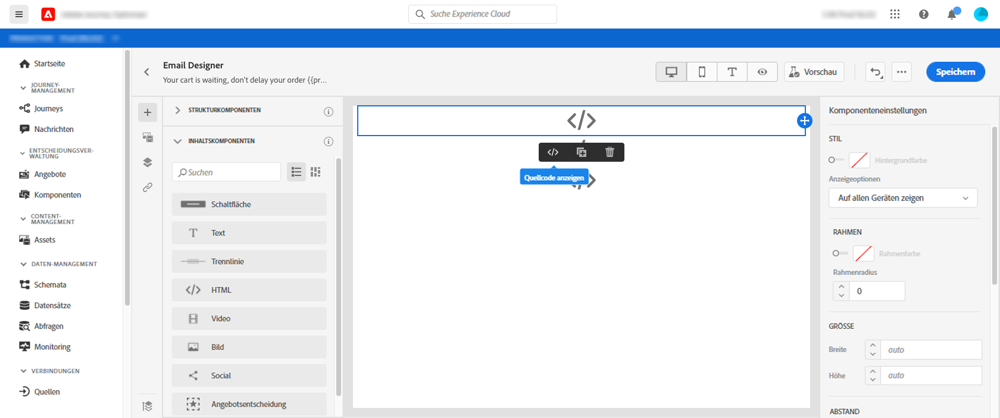

3. Fügen Sie im Fenster **[!UICONTROL HTML bearbeiten]** die String-Funktion `upperCase` hinzu:
   1. Wählen Sie in der Liste **[!UICONTROL Hilfsfunktionen]** aus.
   2. Verwenden Sie das Suchfeld, um &quot;Großbuchstaben&quot;zu finden.
   3. Fügen Sie aus den Suchergebnissen die Funktion `upperCase` hinzu. Klicken Sie dazu auf das Pluszeichen (+) neben `: string`.

      Der Ausdruckseditor zeigt diesen Ausdruck:

      ```handlebars
      
      ```

      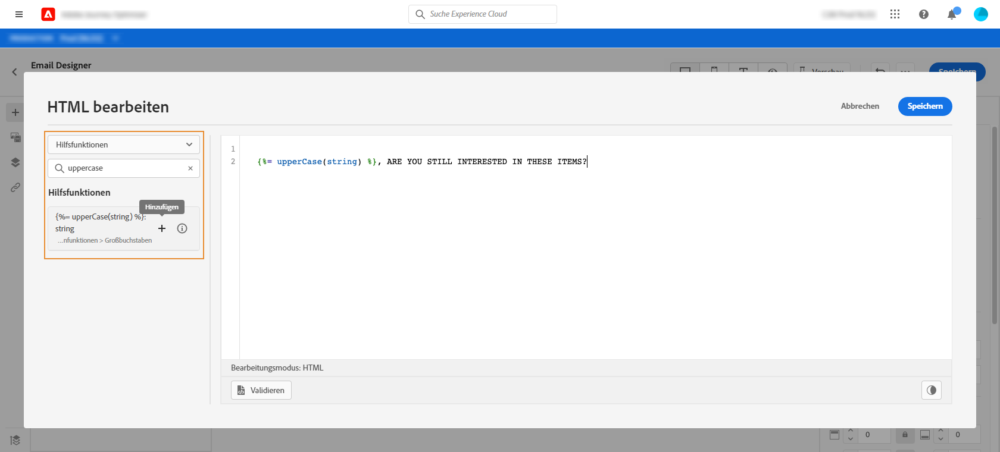

4. Entfernen Sie den Platzhalter &quot;string&quot;(Zeichenfolge) aus dem Ausdruck.
5. Fügen Sie das Vorname-Token hinzu:
   1. Wählen Sie in der Liste **[!UICONTROL Profil]** aus.
   2. Wählen Sie **[!UICONTROL Profil]** > **[!UICONTROL Person]** > **[!UICONTROL Vollständiger Name]**.
   3. Fügen Sie dem Ausdruck das Token **[!UICONTROL Vorname]** hinzu.

      Der Ausdruckseditor zeigt diesen Ausdruck:

      ```handlebars
      
      ```

      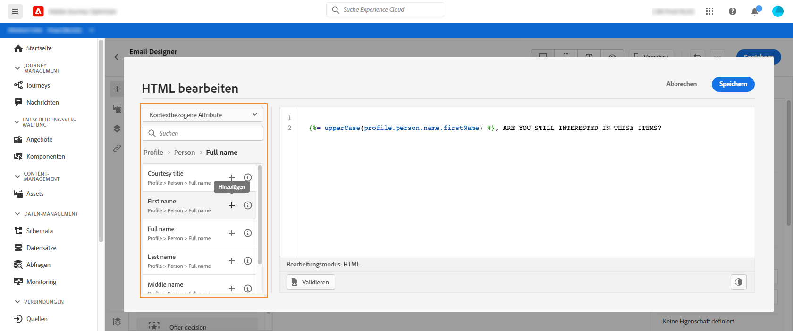

      Erfahren Sie mehr über den Datentyp [Personenname](https://experienceleague.adobe.com/docs/experience-platform/xdm/data-types/person-name.html).

6. Klicken Sie auf **[!UICONTROL Validate]** und dann auf **[!UICONTROL Save]**.

   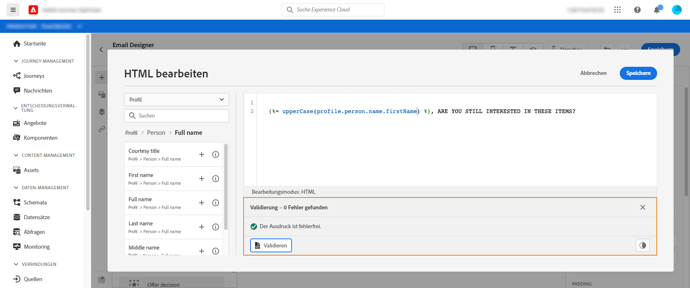
7. Speichern Sie die Nachricht.

## Schritt 3: Erstellen des Anfangsereignisses und der zugehörigen Journey {#create-context}

Der Warenkorbinhalt ist kontextbezogene Informationen von der Journey. Daher müssen Sie ein Anfangsereignis und die E-Mail einer Journey hinzufügen, bevor Sie der E-Mail Warenkorbspezifische Informationen hinzufügen können.

1. Erstellen Sie ein Ereignis, dessen Schema das Array `productListItems` enthält.
2. Definieren Sie alle Felder aus diesem Array als Payload-Felder für dieses Ereignis.

   Erfahren Sie mehr über den [Produktlistenelement-Datentyp](https://experienceleague.adobe.com/docs/experience-platform/xdm/data-types/product-list-item.html).

3. Erstellen Sie eine Journey, die mit diesem Ereignis beginnt.
4. Fügen Sie die Nachricht zum Journey hinzu.
5. Beenden Sie die Journey mit einer Endaktivität.

   Da Sie die Nachricht noch nicht veröffentlicht haben, können Sie die Journey weder testen noch veröffentlichen.

   

6. Klicken Sie auf **[!UICONTROL OK]**.

   Eine Meldung informiert Sie darüber, dass der Journey-Kontext an die Nachricht übergeben wurde.

   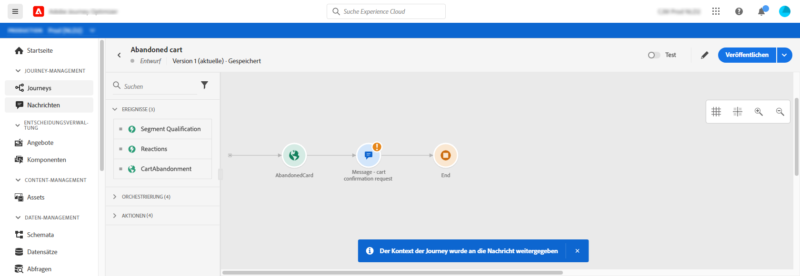

## Schritt 4: Liste der Artikel aus dem Warenkorb einfügen {#each-helper}

1. Öffnen Sie die Nachricht erneut.

   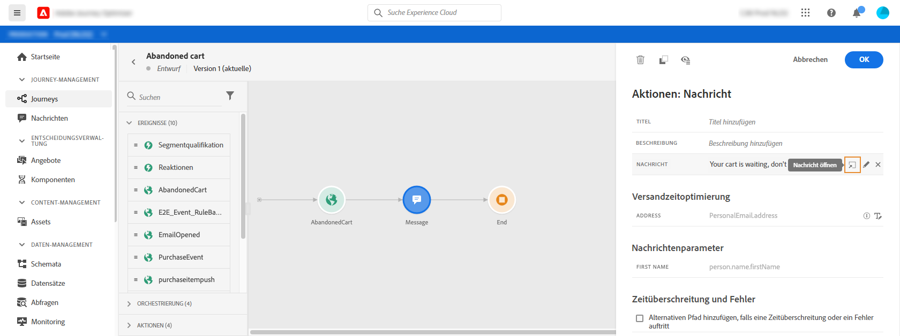

2. Klicken Sie auf der Startseite von Email Designer auf die HTML-Komponente, in der Sie den Inhalt des Warenkorbs auflisten möchten.
3. Klicken Sie in der dedizierten Symbolleiste auf **[!UICONTROL Quellcode anzeigen]**.

   

4. Fügen Sie im Fenster **[!UICONTROL HTML bearbeiten]** den Helfer `each` hinzu:
   1. Wählen Sie in der Liste **[!UICONTROL Hilfsfunktionen]** aus.
   2. Verwenden Sie das Suchfeld, um &quot;jedes&quot;zu finden.
   3. Fügen Sie aus den Suchergebnissen den Helfer `each` hinzu.

      Der Ausdruckseditor zeigt diesen Ausdruck:

      ```handlebars
      {{#each someArray as |variable|}} {{/each}}
      ```

      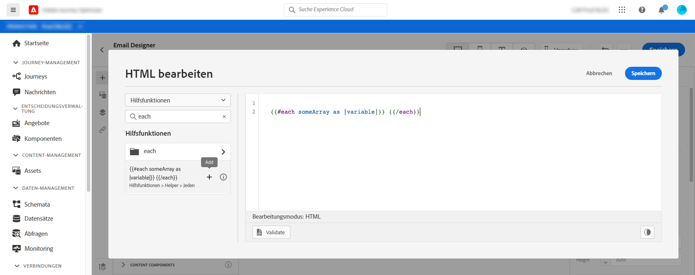

5. Fügen Sie dem Ausdruck das Array `productListItems` hinzu:

   1. Entfernen Sie den Platzhalter &quot;someArray&quot;aus dem Ausdruck.
   2. Wählen Sie in der Liste **[!UICONTROL Kontext]** aus.

      Die Option **[!UICONTROL Kontext]** ist erst verfügbar, nachdem der Journey-Kontext an die Nachricht übergeben wurde.

   3. Wählen Sie **[!UICONTROL Journey Orchestration]** > **[!UICONTROL Ereignisse]** > ***[!UICONTROL Ereignisname]*** und erweitern Sie dann den Knoten **[!UICONTROL productListItems]**.

      In diesem Beispiel steht *event_name* für den Namen Ihres Ereignisses.

   4. Fügen Sie dem Ausdruck das Token **[!UICONTROL Product]** hinzu.

      Der Ausdruckseditor zeigt diesen Ausdruck:

      ```handlebars
      {{#each context.journey.events.event_ID.productListItems.product as |variable|}} {{/each}}
      ```
      In diesem Beispiel stellt *event_ID* die ID Ihres Ereignisses dar.

      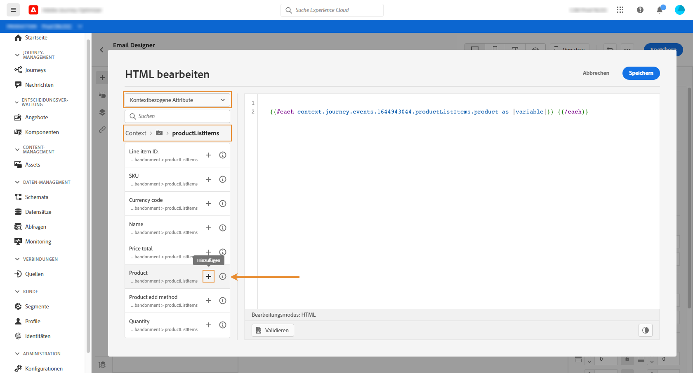

   5. Ändern Sie den Ausdruck:
      1. Entfernen Sie die Zeichenfolge &quot;.product&quot;.
      2. Ersetzen Sie den Platzhalter &quot;variable&quot;durch &quot;product&quot;.

      Dieses Beispiel zeigt den geänderten Ausdruck:

      ```handlebars
      {{#each context.journey.events.event_ID.productListItems as |product|}}
      ```
6. Fügen Sie diesen Code zwischen dem öffnenden `{{#each}}` -Tag und dem schließenden `{/each}}` -Tag ein:

   ```html
   <table>
      <tbody>
         <tr>
            <td><b>#name</b></td>
            <td><b>#quantity</b></td>
            <td><b>$#priceTotal</b></td>
         </tr>
      </tbody>
   </table>
   ```

7. Fügen Sie die Personalisierungstoken für den Artikelnamen, die Menge und den Preis hinzu:

   1. Entfernen Sie den Platzhalter &quot;#name&quot;aus der HTML-Tabelle.
   2. Fügen Sie aus den vorherigen Suchergebnissen das Token **[!UICONTROL Name]** zum Ausdruck hinzu.

   Wiederholen Sie diese Schritte zweimal:
   * Ersetzen Sie den Platzhalter &quot;#quantity&quot;durch das Token **[!UICONTROL Quantity]** .
   * Ersetzen Sie den Platzhalter &quot;#priceTotal&quot;durch das Token **[!UICONTROL Gesamtpreis]** .

   Dieses Beispiel zeigt den geänderten Ausdruck:

   ```handlebars
   {{#each context.journey.events.event_ID.productListItems as |product|}}
      <table>
         <tbody>
            <tr>
               <td><b>{{context.journey.events.event_ID.productListItems.name}}</b></td>
               <td><b>{{context.journey.events.event_ID.productListItems.quantity}}</b></td>
               <td><b>${{context.journey.events.event_ID.productListItems.priceTotal}}</b></td>
            </tr>
         </tbody>
      </table>
   {{/each}}
   ```
8. Klicken Sie auf **[!UICONTROL Validate]** und dann auf **[!UICONTROL Save]**.
   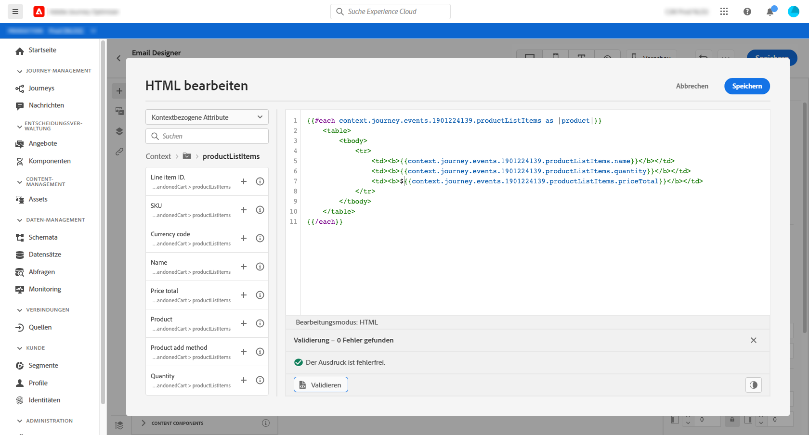

## Schritt 5: Eine produktspezifische Anmerkung einfügen {#if-helper}

1. Klicken Sie auf der Startseite von Email Designer auf die HTML-Komponente, in die Sie die Notiz einfügen möchten.
2. Klicken Sie in der dedizierten Symbolleiste auf **[!UICONTROL Quellcode anzeigen]**.

   

3. Fügen Sie im Fenster **[!UICONTROL HTML bearbeiten]** den Helfer `if` hinzu:
   1. Wählen Sie in der Liste **[!UICONTROL Hilfsfunktionen]** aus.
   2. Verwenden Sie das Suchfeld, um &quot;if&quot; zu finden.
   3. Fügen Sie aus den Suchergebnissen den Helfer `if` hinzu.

      Der Ausdruckseditor zeigt diesen Ausdruck:

      ```handlebars
       render_1
          render_2
          default_render
      
      ```
      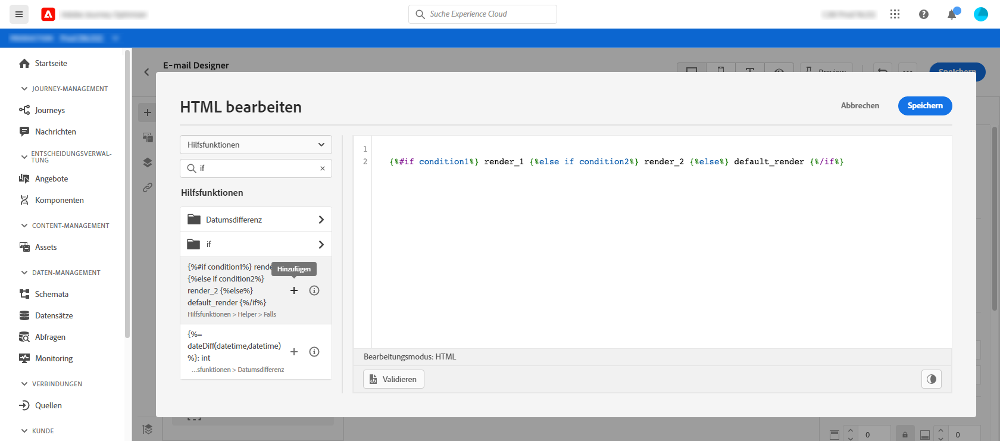

4. Entfernen Sie diese Bedingung aus dem Ausdruck:

   ```handlebars
    render_2
   ```

   Dieses Beispiel zeigt den geänderten Ausdruck:

   ```handlebars
    render_1
       default_render
   
   ```

5. Fügen Sie der Bedingung das Produktname-Token hinzu:
   1. Entfernen Sie den Platzhalter &quot;Bedingung1&quot;aus dem Ausdruck.
   2. Wählen Sie in der Liste **[!UICONTROL Kontext]** aus.
   3. Wählen Sie **[!UICONTROL Journey Orchestration]** > **[!UICONTROL Ereignisse]** > ***[!UICONTROL Ereignisname]*** und erweitern Sie dann den Knoten **[!UICONTROL productListItems]**.

      In diesem Beispiel steht *event_name* für den Namen Ihres Ereignisses.

   4. Fügen Sie dem Ausdruck das Token **[!UICONTROL Name]** hinzu.

      Der Ausdruckseditor zeigt diesen Ausdruck:

      ```handlebars
      
         render_1
          default_render
      
      ```
      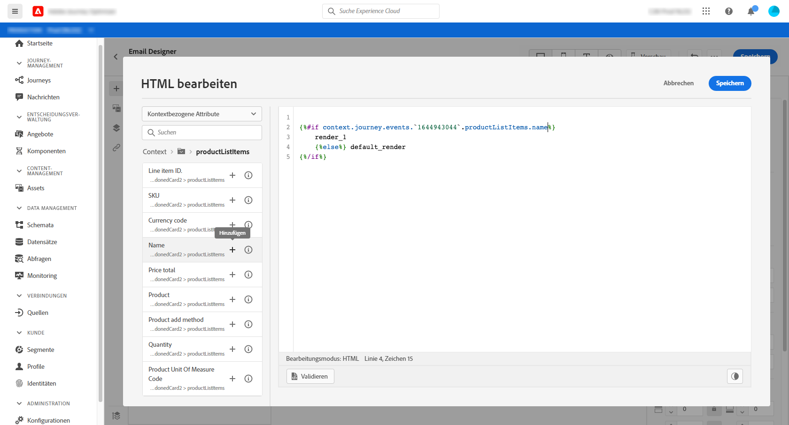

6. Ändern Sie den Ausdruck:
   1. Geben Sie im Ausdruckseditor den Produktnamen nach dem Token `name` an.

      Verwenden Sie diese Syntax, wobei *product_name* den Namen Ihres Produkts darstellt:

      ```javascript
      = "product_name"
      ```

      In diesem Beispiel lautet der Produktname &quot;Juno Jacket&quot;:

      ```handlebars
      
         render_1
          default_render
      
      ```

   2. Ersetzen Sie den Platzhalter &quot;render_1&quot;durch den Text der Notiz.

      Beispiel:

      ```handlebars
      
         Due to longer than usual lead times on the Juno Jacket, please expect item to ship two weeks after purchase.
          default_render
      
      ```
   3. Entfernen Sie den Platzhalter &quot;default_render&quot;aus dem Ausdruck.
7. Klicken Sie auf **[!UICONTROL Validate]** und dann auf **[!UICONTROL Save]**.

   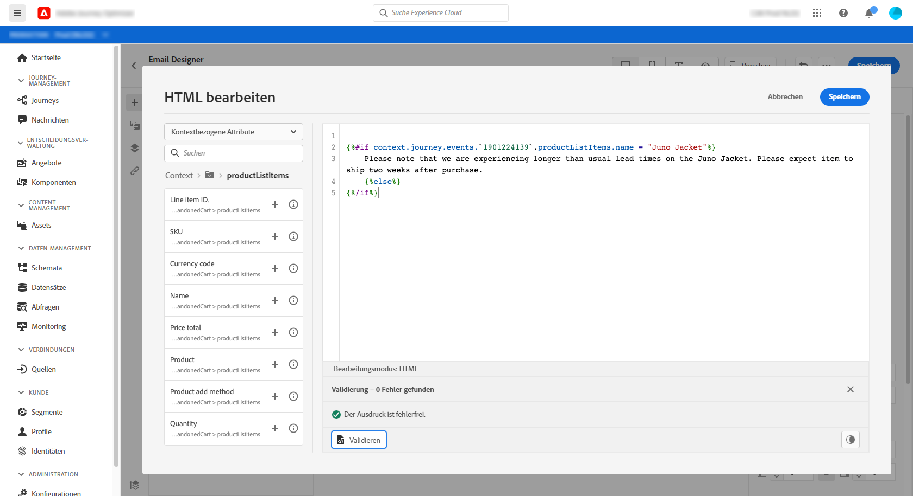

8. Speichern und veröffentlichen Sie die Nachricht.

## Schritt 6: Journey testen und veröffentlichen {#test-and-publish}

1. Öffnen Sie die Journey. Wenn die Journey bereits geöffnet ist, aktualisieren Sie die Seite.
2. Schalten Sie den Umschalter **[!UICONTROL Test]** ein und klicken Sie dann auf **[!UICONTROL Trigger an event]**.

   Sie können den Testmodus erst aktivieren, nachdem Sie die Nachricht veröffentlicht haben.

   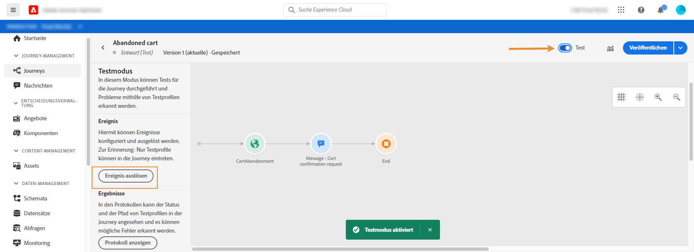

3. Geben Sie im Fenster **[!UICONTROL Ereigniskonfiguration]** die Eingabewerte ein und klicken Sie dann auf **[!UICONTROL Senden]**.

   Der Testmodus funktioniert nur mit Testprofilen.

   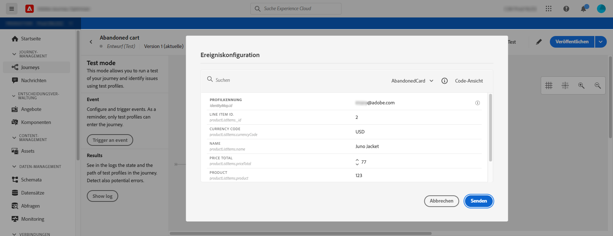

   Die E-Mail wird an die Adresse des Testprofils gesendet.

   In diesem Beispiel enthält die E-Mail den Hinweis über die Juno Jacket, da dieses Produkt im Warenkorb enthalten ist:

   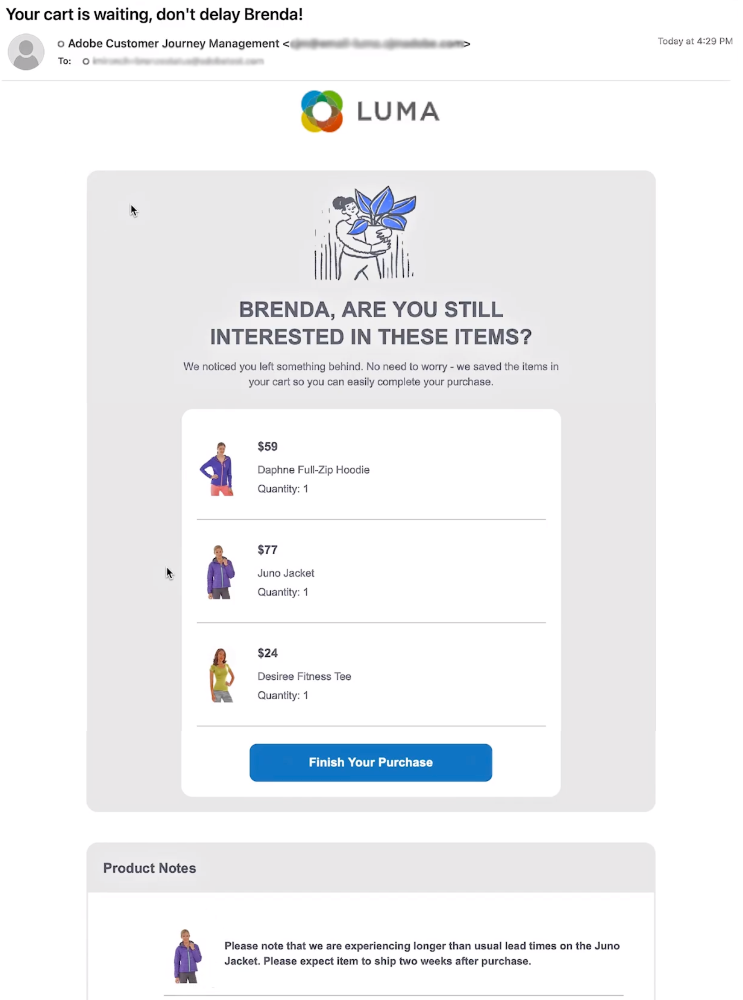

4. Vergewissern Sie sich, dass kein Fehler vorliegt, und veröffentlichen Sie dann die Journey.


## Verwandte Themen

### Handlebars-Funktionen

[Helper](functions/helpers.md)

[Zeichenfolgen-Funktionen](functions/string.md)

### Anwendungsbeispiele

[Personalisierung mit Profilinformationen, Kontext und Angebot](personalization-use-case.md)

[Personalisierung mit entscheiden-basiertem Angebot](../offers/offers-e2e.md)

## Tutorial{#helper-functions-video}

>[!VIDEO](https://video.tv.adobe.com/v/334244?quality=12)