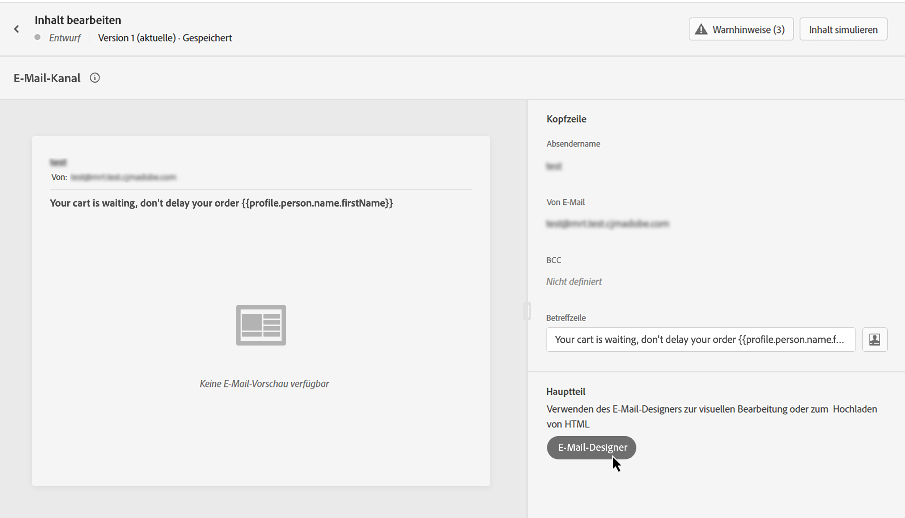
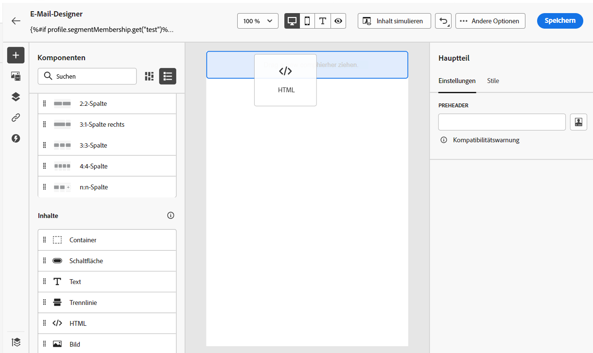
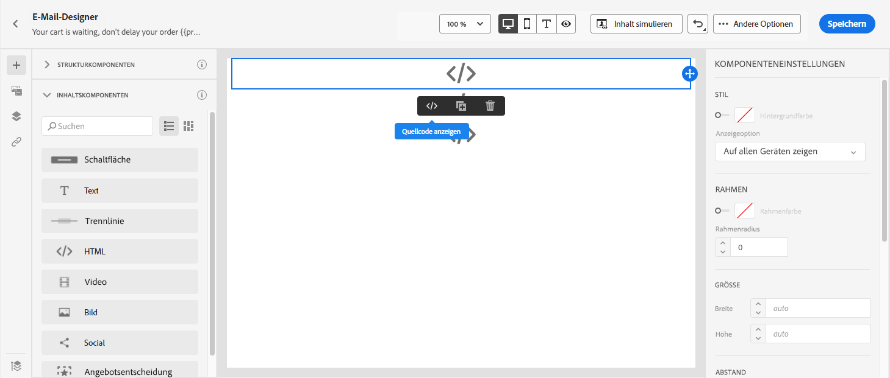
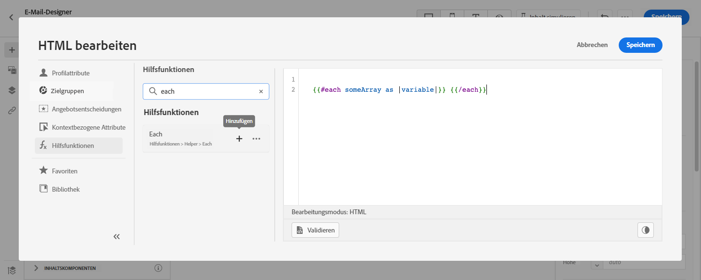
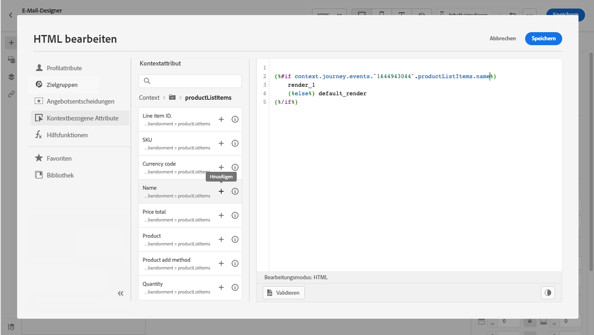
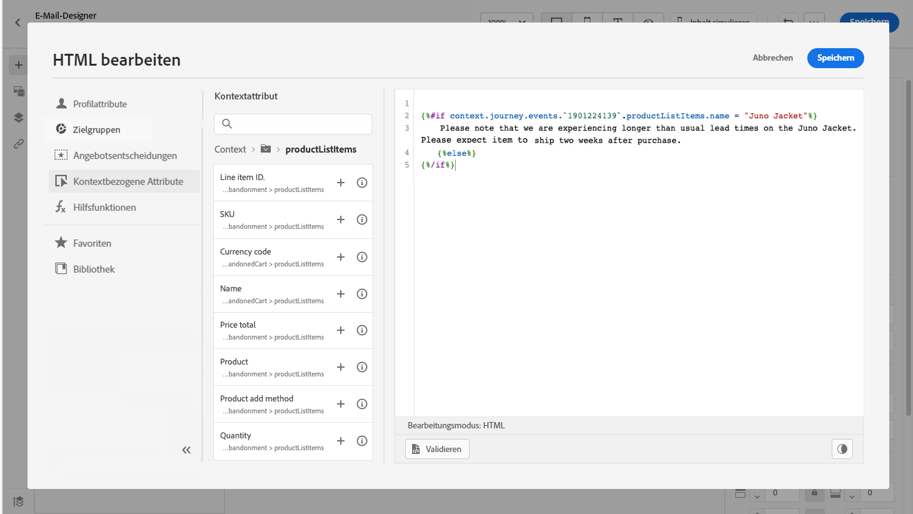

# Anwendungsfall: Personalisierung Warenkorbabbruch-E-Mail {#personalization-use-case-helper-functions}

In diesem Beispiel personalisieren Sie den Textkörper einer E-Mail-Nachricht. Diese Nachricht richtet sich an Kunden, die Artikel in ihrem Warenkorb gelassen, aber noch nicht gekauft haben.

Sie werden die folgenden Arten von Hilfsfunktionen verwenden:

* Die `upperCase` Zeichenfolgen-Funktion, um den Vornamen des Kunden in Großbuchstaben einzufügen. [Weitere Infos](functions/string.md#upper).
* Die `each` um die Artikel im Warenkorb aufzulisten. [Weitere Infos](functions/helpers.md#each).
* Die `if` Helper, um eine produktspezifische Anmerkung einzufügen, wenn sich das zugehörige Produkt im Warenkorb befindet. [Weitere Infos](functions/helpers.md#if-function).

<!-- **Context**: personalization based on contextual data from the journey -->

➡️ [In diesem Video erfahren Sie, wie Sie Hilfsfunktionen verwenden.](#video)

Bevor Sie beginnen, sollten Sie wissen, wie Sie diese Elemente konfigurieren:

* Ein Einzelereignis. [Weitere Infos](../event/about-events.md).
* Eine Journey, die mit einem Ereignis beginnt. [Weitere Infos](../building-journeys/using-the-journey-designer.md).
* Eine E-Mail-Nachricht in Ihrer Journey. [Weitere Infos](../email/create-email.md)
* Der Hauptteil einer E-Mail. [Weitere Infos](../email/content-from-scratch.md).

Führen Sie die folgenden Schritte aus:

1. [Erstellen des ursprünglichen Ereignisses und der Journey](#create-context).
1. [E-Mail-Nachricht erstellen](#configure-email).
1. [Vorname des Kunden in Großbuchstaben einfügen](#uppercase-function).
1. [Hinzufügen des Warenkorbinhalts zur E-Mail](#each-helper).
1. [Eine produktspezifische Anmerkung einfügen](#if-helper).
1. [Testen und Veröffentlichen der Journey](#test-and-publish).

## Schritt 1: Erstellen des Anfangsereignisses und der zugehörigen Journey {#create-context}

Der Warenkorbinhalt ist eine kontextbezogene Information aus der Journey. Daher müssen Sie ein Anfangsereignis und die E-Mail zu einer Journey hinzufügen, bevor Sie der E-Mail Warenkorbspezifische Informationen hinzufügen können.

1. Erstellen Sie ein Ereignis, dessen Schema die `productListItems` Array.
1. Definieren Sie alle Felder aus diesem Array als Payload-Felder für dieses Ereignis.

   Erfahren Sie mehr über den Datentyp des Produktlistenelements [Dokumentation zu Adobe Experience Platform](https://experienceleague.adobe.com/docs/experience-platform/xdm/data-types/product-list-item.html){target=&quot;_blank&quot;}.

1. Erstellen Sie eine Journey, die mit diesem Ereignis beginnt.
1. Hinzufügen einer **Email** Aktivität zur Journey hinzu.

   

## Schritt 2: E-Mail erstellen{#configure-email}

1. Im **Email** Aktivität, klicken Sie auf **[!UICONTROL Edit content]** Klicken Sie auf **[!UICONTROL Email Designer]**.

   

1. Ziehen Sie drei Strukturkomponenten aus der linken Palette der Startseite von Email Designer in den Nachrichten-Textkörper.

1. Ziehen Sie eine HTML-Inhaltskomponente per Drag-and-Drop auf jede neue Strukturkomponente.

   

## Schritt 3: Vorname des Kunden in Großbuchstaben einfügen {#uppercase-function}

1. Klicken Sie auf der Startseite von Email Designer auf die HTML-Komponente, der Sie den Vornamen des Kunden hinzufügen möchten.
1. Klicken Sie in der dedizierten Symbolleiste auf **[!UICONTROL Show the source code]**.

   

1. Im **[!UICONTROL Edit HTML]** -Fenster, fügen Sie die `upperCase` Zeichenfolgen-Funktion:
   1. Wählen Sie im linken Menü die Option **[!UICONTROL Helper functions]**.
   1. Verwenden Sie das Suchfeld, um &quot;Großbuchstaben&quot;zu finden.
   1. Fügen Sie aus den Suchergebnissen die `upperCase` -Funktion. Klicken Sie dazu auf das Pluszeichen (+) neben `: string`.

      Der Ausdruckseditor zeigt diesen Ausdruck:

      ```handlebars
      
      ```

      

1. Entfernen Sie den Platzhalter &quot;string&quot;(Zeichenfolge) aus dem Ausdruck.
1. Fügen Sie das Vorname-Token hinzu:
   1. Wählen Sie im linken Menü die Option **[!UICONTROL Profile attributes]**.
   1. Auswählen **[!UICONTROL Person]** > **[!UICONTROL Full name]**.
   1. Fügen Sie die **[!UICONTROL First name]** Token zum Ausdruck.

      Der Ausdruckseditor zeigt diesen Ausdruck:

      ```handlebars
      
      ```

      

      Erfahren Sie mehr über den Datentyp des Personennamens in [Dokumentation zu Adobe Experience Platform](https://experienceleague.adobe.com/docs/experience-platform/xdm/data-types/person-name.html){target=&quot;_blank&quot;}.

1. Klicken **[!UICONTROL Validate]** Klicken Sie auf **[!UICONTROL Save]**.

   

1. Speichern Sie die Nachricht.

## Schritt 4: Liste der Artikel aus dem Warenkorb einfügen {#each-helper}

1. Öffnen Sie den Nachrichteninhalt erneut.

1. Klicken Sie auf der Startseite von Email Designer auf die HTML-Komponente, in der Sie den Inhalt des Warenkorbs auflisten möchten.
1. Klicken Sie in der dedizierten Symbolleiste auf **[!UICONTROL Show the source code]**.

   

1. Im **[!UICONTROL Edit HTML]** -Fenster, fügen Sie die `each` Helper:
   1. Wählen Sie im linken Menü die Option **[!UICONTROL Helper functions]**.
   1. Verwenden Sie das Suchfeld, um &quot;jedes&quot;zu finden.
   1. Fügen Sie aus den Suchergebnissen die `each` Helper.

      Der Ausdruckseditor zeigt diesen Ausdruck:

      ```handlebars
      {{#each someArray as |variable|}} {{/each}}
      ```

      

1. Fügen Sie die `productListItems` -Array zum Ausdruck:

   1. Entfernen Sie den Platzhalter &quot;someArray&quot;aus dem Ausdruck.
   1. Wählen Sie im linken Menü die Option **[!UICONTROL Contextual attributes]**.

      **[!UICONTROL Contextual attributes]** sind nur verfügbar, nachdem der Journey-Kontext an die Nachricht übergeben wurde.

   1. Auswählen **[!UICONTROL Journey Optimizer]** > **[!UICONTROL Events]** > ***[!UICONTROL event_name]*** und erweitern Sie dann die **[!UICONTROL productListItems]** Knoten.

      In diesem Beispiel *event_name* stellt den Namen Ihres Ereignisses dar.

   1. Fügen Sie die **[!UICONTROL Product]** Token zum Ausdruck.

      Der Ausdruckseditor zeigt diesen Ausdruck:

      ```handlebars
      {{#each context.journey.events.event_ID.productListItems.product as |variable|}} {{/each}}
      ```
      In diesem Beispiel *event_ID* stellt die ID Ihres Ereignisses dar.

      

   1. Ändern Sie den Ausdruck:
      1. Entfernen Sie die Zeichenfolge &quot;.product&quot;.
      1. Ersetzen Sie den Platzhalter &quot;variable&quot;durch &quot;product&quot;.

      Dieses Beispiel zeigt den geänderten Ausdruck:

      ```handlebars
      {{#each context.journey.events.event_ID.productListItems as |product|}}
      ```


1. Fügen Sie diesen Code zwischen dem ersten `{{#each}}` -Tag und das schließende -Tag `{/each}}` Tag:

   ```html
   <table>
      <tbody>
         <tr>
            <td><b>#name</b></td>
            <td><b>#quantity</b></td>
            <td><b>$#priceTotal</b></td>
         </tr>
      </tbody>
   </table>
   ```

1. Fügen Sie die Personalisierungstoken für den Artikelnamen, die Menge und den Preis hinzu:

   1. Entfernen Sie den Platzhalter &quot;#name&quot;aus der HTML-Tabelle.
   1. Fügen Sie aus den vorherigen Suchergebnissen die **[!UICONTROL Name]** Token zum Ausdruck.

   Wiederholen Sie diese Schritte zweimal:

   * Ersetzen Sie den Platzhalter &quot;#quantity&quot;durch den **[!UICONTROL Quantity]** Token.
   * Ersetzen Sie den Platzhalter &quot;#priceTotal&quot;durch den **[!UICONTROL Total price]** Token.

   Dieses Beispiel zeigt den geänderten Ausdruck:

   ```handlebars
   {{#each context.journey.events.event_ID.productListItems as |product|}}
      <table>
         <tbody>
            <tr>
               <td><b>{{context.journey.events.event_ID.productListItems.name}}</b></td>
               <td><b>{{context.journey.events.event_ID.productListItems.quantity}}</b></td>
               <td><b>${{context.journey.events.event_ID.productListItems.priceTotal}}</b></td>
            </tr>
         </tbody>
      </table>
   {{/each}}
   ```

1. Klicken **[!UICONTROL Validate]** Klicken Sie auf **[!UICONTROL Save]**.

   

## Schritt 5: Eine produktspezifische Anmerkung einfügen {#if-helper}

1. Klicken Sie auf der Startseite von Email Designer auf die HTML-Komponente, in die Sie die Notiz einfügen möchten.
1. Klicken Sie in der dedizierten Symbolleiste auf **[!UICONTROL Show the source code]**.

   

1. Im **[!UICONTROL Edit HTML]** -Fenster, fügen Sie die `if` Helper:
   1. Wählen Sie im linken Menü die Option **[!UICONTROL Helper functions]**.
   1. Verwenden Sie das Suchfeld, um &quot;if&quot; zu finden.
   1. Fügen Sie aus den Suchergebnissen die `if` Helper.

      Der Ausdruckseditor zeigt diesen Ausdruck:

      ```handlebars
       render_1
          render_2
          default_render
      
      ```

      

1. Entfernen Sie diese Bedingung aus dem Ausdruck:

   ```handlebars
    render_2
   ```

   Dieses Beispiel zeigt den geänderten Ausdruck:

   ```handlebars
    render_1
       default_render
   
   ```

1. Fügen Sie der Bedingung das Produktname-Token hinzu:
   1. Entfernen Sie den Platzhalter &quot;Bedingung1&quot;aus dem Ausdruck.
   1. Wählen Sie im linken Menü die Option **[!UICONTROL Contextual attributes]**.
   1. Auswählen **[!UICONTROL Journey Orchestration]** > **[!UICONTROL Events]** > ***[!UICONTROL event_name]*** und erweitern Sie dann die **[!UICONTROL productListItems]** Knoten.

      In diesem Beispiel *event_name* stellt den Namen Ihres Ereignisses dar.

   1. Fügen Sie die **[!UICONTROL Name]** Token zum Ausdruck.

      Der Ausdruckseditor zeigt diesen Ausdruck:

      ```handlebars
      
         render_1
          default_render
      
      ```

      

1. Ändern Sie den Ausdruck:
   1. Geben Sie im Ausdruckseditor den Produktnamen nach der `name` Token.

      Verwenden Sie diese Syntax, wobei *product_name* steht für den Namen Ihres Produkts:

      ```javascript
      = "product_name"
      ```

      In diesem Beispiel lautet der Produktname &quot;Juno Jacket&quot;:

      ```handlebars
      
         render_1
          default_render
      
      ```

   1. Ersetzen Sie den Platzhalter &quot;render_1&quot;durch den Text der Notiz.

      Beispiel:

      ```handlebars
      
         Due to longer than usual lead times on the Juno Jacket, please expect item to ship two weeks after purchase.
          default_render
      
      ```

   1. Entfernen Sie den Platzhalter &quot;default_render&quot;aus dem Ausdruck.
1. Klicken **[!UICONTROL Validate]** Klicken Sie auf **[!UICONTROL Save]**.

   

1. Speichern Sie die Nachricht.

## Schritt 6: Testen und Veröffentlichen der Journey {#test-and-publish}

1. Aktivieren Sie die **[!UICONTROL Test]** Umschalten und klicken Sie dann auf **[!UICONTROL Trigger an event]**.

   

1. Im **[!UICONTROL Event configuration]** Fenster, geben Sie die Eingabewerte ein und klicken Sie auf **[!UICONTROL Send]**.

   Der Testmodus funktioniert nur mit Testprofilen.

   

   Die E-Mail wird an die Adresse des Testprofils gesendet.

   In diesem Beispiel enthält die E-Mail den Hinweis über die Juno Jacket, da dieses Produkt im Warenkorb enthalten ist:

   

1. Vergewissern Sie sich, dass kein Fehler vorliegt, und veröffentlichen Sie dann die Journey.


## Verwandte Themen {#related-topics}

### Handlebars-Funktionen {#handlebars}

* [Helfer](functions/helpers.md)

* [Zeichenfolgen-Funktionen](functions/string.md)

### Anwendungsbeispiele {#use-case}

* [Personalisierung mit Profilinformationen, Kontext und Angebot](personalization-use-case.md)

* [Personalisierung mit entscheiden-basiertem Angebot](../offers/offers-e2e.md)

## Anleitungsvideo{#video}

Erfahren Sie, wie Sie Hilfsfunktionen verwenden.

>[!VIDEO](https://video.tv.adobe.com/v/334244?quality=12)
