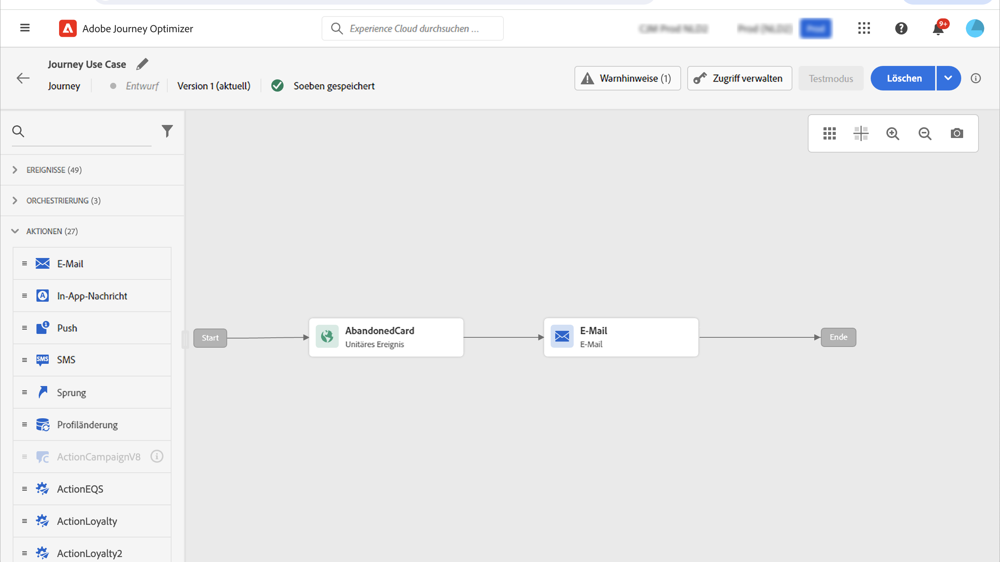
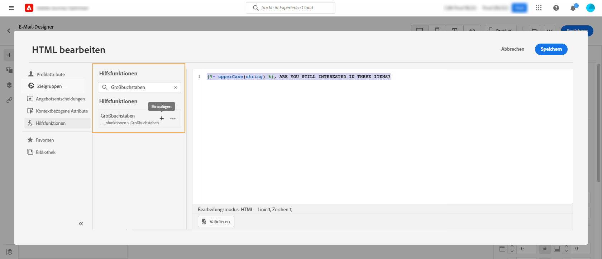
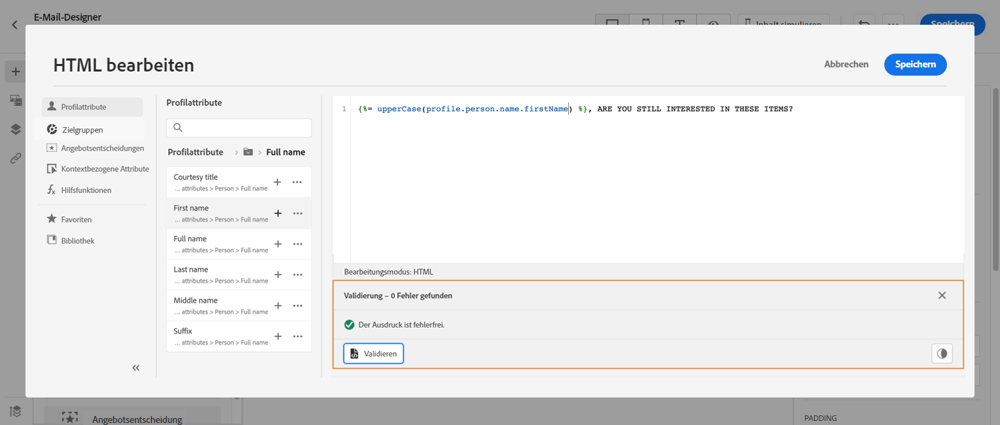
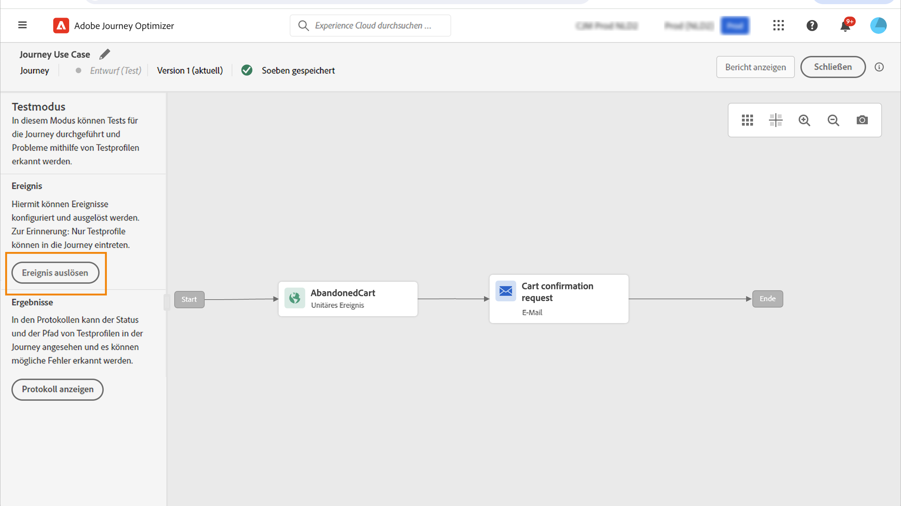

# Personalisierung – Anwendungsfall: E-Mail bei Warenkorbabbruch {#personalization-use-case-helper-functions}

In diesem Beispiel personalisieren Sie den Textkörper einer E-Mail-Nachricht. Diese Nachricht richtet sich an Kunden, die zwar Artikel in ihren Einkaufswagen abgelegt, aber ihren Einkauf nicht abgeschlossen haben.

Sie werden die folgenden Arten von Hilfsfunktionen verwenden:

* Die Zeichenfolgen-Funktion `upperCase`, mit der der Vorname des Kunden in Großbuchstaben eingefügt wird. [Weitere Informationen](functions/string.md#upper).
* Der Helper `each`, um die Artikel im Warenkorb aufzulisten. [Weitere Informationen](functions/helpers.md#each).
* Der Helper `if`, um eine produktspezifische Anmerkung einzufügen, wenn sich das zugehörige Produkt im Warenkorb befindet. [Weitere Informationen](functions/helpers.md#if-function).

<!-- **Context**: personalization based on contextual data from the journey -->

➡️ [Im Video erfahren Sie, wie Sie Helper-Funktionen verwenden](#video)

Bevor Sie beginnen, sollten Sie wissen, wie Sie diese Elemente konfigurieren:

* Ein unitäres Ereignis. [Weitere Informationen](../event/about-events.md).
* Eine Journey, die mit einem Ereignis beginnt. [Weitere Informationen](../building-journeys/using-the-journey-designer.md).
* Eine E-Mail-Nachricht in Ihrer Journey. [Weitere Informationen](../email/create-email.md)
* Der Textkörper einer E-Mail. [Weitere Informationen](../email/content-from-scratch.md).

Führen Sie folgende Schritte aus:

1. [Erstellen Sie das Anfangsereignis und die Journey](#create-context).
1. [Erstellen Sie eine E-Mail-Nachricht](#configure-email).
1. [Geben Sie den Vornamen des Kunden in Großbuchstaben ein](#uppercase-function).
1. [Fügen Sie den Inhalt des Warenkorbs zur E-Mail hinzu](#each-helper).
1. [Fügen Sie eine produktspezifische Anmerkung ein](#if-helper).
1. [Testen und Veröffentlichen der Journey](#test-and-publish).

## Schritt 1: Anfangsereignis und die zugehörige Journey erstellen {#create-context}

Der Warenkorbinhalt ist kontextuelle Information aus der Journey. Daher müssen Sie einer Journey ein Anfangsereignis und die E-Mail hinzufügen, bevor Sie der E-Mail Warenkorb-spezifische Informationen hinzufügen können.

1. Erstellen Sie ein Ereignis, dessen Schema das Array `productListItems` enthält.
1. Definieren Sie alle Felder aus diesem Array als Payload-Felder für dieses Ereignis.

   Weitere Informationen zum Datentyp des Produktlistenelements finden sich in der [Dokumentation zu Adobe Experience Platform](https://experienceleague.adobe.com/docs/experience-platform/xdm/data-types/product-list-item.html?lang=de){target="_blank"}.

1. Erstellen Sie eine Journey, die mit diesem Ereignis beginnt.
1. Fügen Sie die Aktivität **E-Mail** zur Journey hinzu.

   

## Schritt 2: E-Mail erstellen{#configure-email}

1. Klicken sie in der Aktivität **E-Mail** auf **[!UICONTROL Inhalt bearbeiten]** und anschließend auf **[!UICONTROL E-Mail-Designer]**.

   

1. Ziehen Sie drei Strukturkomponenten aus der linken Palette der Startseite von E-Mail-Designer in den Textkörper der Nachricht.

1. Ziehen Sie eine HTML-Inhaltskomponente per Drag-and-Drop auf jede neue Strukturkomponente.

   

## Schritt 3: Vornamen des Kunden bzw. der Kundin in Großbuchstaben einfügen {#uppercase-function}

1. Klicken Sie auf der Startseite von E-Mail-Designer auf die HTML-Komponente, der Sie den Vornamen des Kunden hinzufügen möchten.
1. Klicken Sie in der kontextuellen Symbolleiste auf **[!UICONTROL Quellcode anzeigen]**.

   

1. Fügen Sie im Fenster **[!UICONTROL HTML bearbeiten]** die Zeichenfolgen-Funktionen `upperCase` hinzu:
   1. Wählen Sie im linken Menü die Option **[!UICONTROL Hilfsfunktionen]**.
   1. Verwenden Sie das Suchfeld, um „Großbuchstaben“ zu finden.
   1. Fügen Sie die Funktion `upperCase` aus den Suchergebnissen hinzu. Klicken Sie dazu auf das Pluszeichen (+) neben `: string`.

      Der Ausdruckseditor zeigt diesen Ausdruck:

      ```handlebars
      
      ```

      

1. Entfernen Sie den Platzhalter „string“ (Zeichenfolge) aus dem Ausdruck.
1. Fügen Sie das Vorname-Token hinzu:
   1. Wählen Sie im linken Menü die Option **[!UICONTROL Profilattribute]**.
   1. Wählen Sie **[!UICONTROL Person]** > **[!UICONTROL Vollständiger Name]**.
   1. Fügen Sie dem Ausdruck das Token **[!UICONTROL Vorname]** hinzu.

      Der Ausdruckseditor zeigt diesen Ausdruck:

      ```handlebars
      
      ```

      

      Weitere Informationen zum Datentyp des Personennamens finden sich in der [Dokumentation zu Adobe Experience Platform](https://experienceleague.adobe.com/docs/experience-platform/xdm/data-types/person-name.html?lang=de){target="_blank"}.

1. Klicken Sie auf **[!UICONTROL Validieren]** und dann auf **[!UICONTROL Speichern]**.

   

1. Speichern Sie die Nachricht.

## Schritt 4: Liste der Artikel aus dem Warenkorb einfügen {#each-helper}

1. Öffnen Sie den Nachrichteninhalt erneut.

1. Klicken Sie auf der Startseite von E-Mail-Designer auf die HTML-Komponente, in der Sie den Inhalt des Warenkorbs auflisten möchten.
1. Klicken Sie in der kontextuellen Symbolleiste auf **[!UICONTROL Quellcode anzeigen]**.

   

1. Fügen Sie im Fenster **[!UICONTROL HTML bearbeiten]** den Helper `each` hinzu:
   1. Wählen Sie im linken Menü die Option **[!UICONTROL Hilfsfunktionen]**.
   1. Verwenden Sie das Suchfeld, um „each“ zu finden.
   1. Fügen Sie von den Suchergebnissen den Helper `each` hinzu.

      Der Ausdruckseditor zeigt diesen Ausdruck:

      ```handlebars
      {{#each someArray as |variable|}} {{/each}}
      ```

      

1. Fügen Sie dem Ausdruck das Array `productListItems` hinzu:

   1. Entfernen Sie den Platzhalter „someArray“ aus dem Ausdruck.
   1. Wählen Sie im linken Menü die Option **[!UICONTROL Kontextuelle Attribute]**.

      **[!UICONTROL Kontextuelle Attribute]** sind erst verfügbar, nachdem der Journey-Kontext an die Nachricht übergeben wurde.

   1. Wählen Sie **[!UICONTROL Journey Optimizer]** > **[!UICONTROL Ereignisse]** > ***[!UICONTROL event_name]*** aus und erweitern Sie dann den Knoten **[!UICONTROL productListItems]**.

      In diesem Beispiel steht *event_name* für den Namen Ihres Ereignisses.

   1. Fügen Sie dem Ausdruck das Token **[!UICONTROL Produkt]** hinzu.

      Der Ausdruckseditor zeigt diesen Ausdruck:

      ```handlebars
      {{#each context.journey.events.event_ID.productListItems.product as |variable|}} {{/each}}
      ```

      In diesem Beispiel steht *event_ID* für die Kennung Ihres Ereignisses.

      

   1. Ändern Sie den Ausdruck:
      1. Entfernen Sie die Zeichenfolge „product“.
      1. Ersetzen Sie den Platzhalter „variable“ durch „product“.

      Dieses Beispiel zeigt den geänderten Ausdruck:

      ```handlebars
      {{#each context.journey.events.event_ID.productListItems as |product|}}
      ```


1. Fügen Sie diesen Code zwischen dem öffnenden `{{#each}}`-Tag und dem schließenden `{/each}}`-Tag ein:

   ```html
   <table>
      <tbody>
         <tr>
            <td><b>#name</b></td>
            <td><b>#quantity</b></td>
            <td><b>$#priceTotal</b></td>
         </tr>
      </tbody>
   </table>
   ```

1. Fügen Sie die Personalisierungs-Token für den Artikelnamen, die Menge und den Preis hinzu:

   1. Entfernen Sie den Platzhalter „#name“ aus der HTML-Tabelle.
   1. Fügen Sie dem Ausdruck das Token **[!UICONTROL Name]** aus den vorherigen Suchergebnissen hinzu.

   Wiederholen Sie diese Schritte zweimal:

   * Ersetzen Sie den Platzhalter „#quantity“ durch das Token **[!UICONTROL Menge]** .
   * Ersetzen Sie den Platzhalter „#priceTotal“ durch das Token **[!UICONTROL Gesamtpreis]** .

   Dieses Beispiel zeigt den geänderten Ausdruck:

   ```handlebars
   {{#each context.journey.events.event_ID.productListItems as |product|}}
      <table>
         <tbody>
            <tr>
               <td><b>{{context.journey.events.event_ID.productListItems.name}}</b></td>
               <td><b>{{context.journey.events.event_ID.productListItems.quantity}}</b></td>
               <td><b>${{context.journey.events.event_ID.productListItems.priceTotal}}</b></td>
            </tr>
         </tbody>
      </table>
   {{/each}}
   ```

1. Klicken Sie auf **[!UICONTROL Validieren]** und dann auf **[!UICONTROL Speichern]**.

   

## Schritt 5: Eine produktspezifische Anmerkung einfügen {#if-helper}

1. Klicken Sie auf der Startseite von E-Mail-Designer auf die HTML-Komponente, in der Sie die Anmerkung einfügen möchten.
1. Klicken Sie in der kontextuellen Symbolleiste auf **[!UICONTROL Quellcode anzeigen]**.

   

1. Fügen Sie im Fenster **[!UICONTROL HTML bearbeiten]** den Helper `if` hinzu:
   1. Wählen Sie im linken Menü die Option **[!UICONTROL Hilfsfunktionen]**.
   1. Verwenden Sie das Suchfeld, um „if“ zu finden.
   1. Fügen Sie von den Suchergebnissen den Helper `if` hinzu.

      Der Ausdruckseditor zeigt diesen Ausdruck:

      ```handlebars
       render_1
          render_2
          default_render
      
      ```

      

1. Entfernen Sie diese Bedingung aus dem Ausdruck:

   ```handlebars
    render_2
   ```

   Dieses Beispiel zeigt den geänderten Ausdruck:

   ```handlebars
    render_1
       default_render
   
   ```

1. Fügen Sie der Bedingung das Produktname-Token hinzu:
   1. Entfernen Sie den Platzhalter „condition1“ aus dem Ausdruck.
   1. Wählen Sie im linken Menü die Option **[!UICONTROL Kontextuelle Attribute]**.
   1. Wählen Sie **[!UICONTROL Journey Orchestration]** > **[!UICONTROL Ereignisse]** > ***[!UICONTROL event_name]*** aus und erweitern Sie dann den Knoten **[!UICONTROL productListItems]**.

      In diesem Beispiel steht *event_name* für den Namen Ihres Ereignisses.

   1. Fügen Sie dem Ausdruck das Token **[!UICONTROL Name]** hinzu.

      Der Ausdruckseditor zeigt diesen Ausdruck:

      ```handlebars
      
         render_1
          default_render
      
      ```

      

1. Ändern Sie den Ausdruck:
   1. Geben Sie im Ausdruckseditor den Produktnamen nach dem Token `name` an.

      Verwenden Sie diese Syntax, wobei *product_name* den Namen Ihres Produkts darstellt:

      ```javascript
      = "product_name"
      ```

      In diesem Beispiel lautet der Produktname „Juno Jacket“:

      ```handlebars
      
         render_1
          default_render
      
      ```

   1. Ersetzen Sie den Platzhalter „render_1“ durch den Text der Anmerkung.

      Beispiel:

      ```handlebars
      
         Due to longer than usual lead times on the Juno Jacket, please expect item to ship two weeks after purchase.
          default_render
      
      ```

   1. Entfernen Sie den Platzhalter „default_render“ aus dem Ausdruck.
1. Klicken Sie auf **[!UICONTROL Validieren]** und dann auf **[!UICONTROL Speichern]**.

   

1. Speichern Sie die Nachricht.

## Schritt 6: Journey testen und veröffentlichen {#test-and-publish}

1. Aktivieren Sie den Umschalter **[!UICONTROL Test]** und klicken Sie dann auf **[!UICONTROL Ereignis auslösen]**.

   

1. Geben Sie im Fenster **[!UICONTROL Ereigniskonfiguration]** die Eingabewerte ein und klicken Sie dann auf **[!UICONTROL Senden]**.

   Der Testmodus funktioniert nur mit Testprofilen.

   

   Die E-Mail wird an die Adresse des Testprofils gesendet.

   In diesem Beispiel enthält die E-Mail die Anmerkung zur Jacke Juno (Juno Jacket), da sich dieses Produkt im Warenkorb befindet:

   

1. Vergewissern Sie sich, dass kein Fehler vorliegt, und veröffentlichen Sie die Journey.


## Verwandte Themen {#related-topics}

### Handlebars-Funktionen {#handlebars}

* [Helper](functions/helpers.md)

* [Zeichenfolgen-Funktionen](functions/string.md)

### Anwendungsfälle {#use-case}

* [Personalisierung mit Profilinformationen, Kontext und Angebot](personalization-use-case.md)

* [Personalisierung mit entscheidungsbasiertem Angebot](../offers/offers-e2e.md)

## Anleitungsvideo{#video}

Erfahren Sie, wie Sie Hilfsfunktionen verwenden.

>[!VIDEO](https://video.tv.adobe.com/v/334244?quality=12)
