# Personalisierung – Anwendungsfall: Benachrichtigung über den Bestellstatus {#personalization-use-case}

>[!BEGINSHADEBOX]

**Auf dieser Seite** Führen Sie ein Anwendungsbeispiel für den Bestellstatus aus, in dem Profil-, Angebotsentscheidungs- und kontextuelle Journey-Daten kombiniert werden, um eine Push-Benachrichtigung in Adobe Journey Optimizer zu personalisieren.

>[!ENDSHADEBOX]

In diesem Anwendungsfall erfahren Sie, wie Sie mehrere Personalisierungsarten in einer einzigen Push-Benachrichtigung verwenden. Es werden drei Arten der Personalisierung verwendet:

* **Profil**: Personalisierung von Nachrichten basierend auf einem Profilfeld
* **Angebotsentscheidung**: Personalisierung basierend auf Entscheidungs-Management-Variablen
* **Kontext**: Personalisierung basierend auf kontextuellen Daten aus der Journey

Das Ziel dieses Beispiels ist es, jedes Mal, wenn eine Kundenbestellung aktualisiert wird, ein Ereignis an [!DNL Journey Optimizer] zu senden. Anschließend wird eine Push-Benachrichtigung mit Informationen zur Bestellung und einem personalisierten Angebot an den Kunden gesendet.

Für diesen Anwendungsfall müssen die folgenden Voraussetzungen gegeben sein:

* Konfigurieren eines Bestellereignisses mit Bestellnummer, Status und Artikelnamen. Siehe diesen [Abschnitt](../event/about-events.md).
* Informationen zum Erstellen einer Entscheidung finden Sie in diesem [Abschnitt](../offers/offer-activities/create-offer-activities.md).

➡️ [Einen ähnlichen Anwendungsfall finden Sie im Video](#video)

## Schritt 1 – Journey erstellen {#create-journey}

1. Klicken Sie auf das Menü **[!UICONTROL Journey]** und erstellen Sie eine neue Journey.

   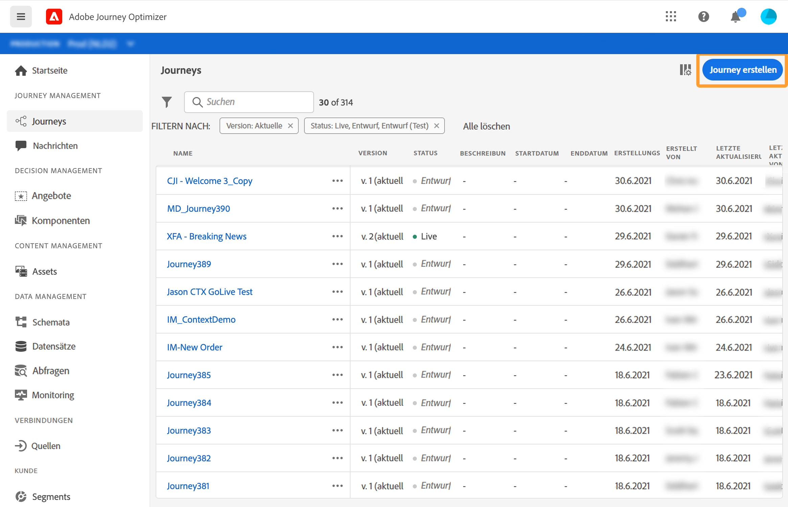

1. Fügen Sie Ihr Eintrittsereignis und die Aktionsaktivität **Push** hinzu.

   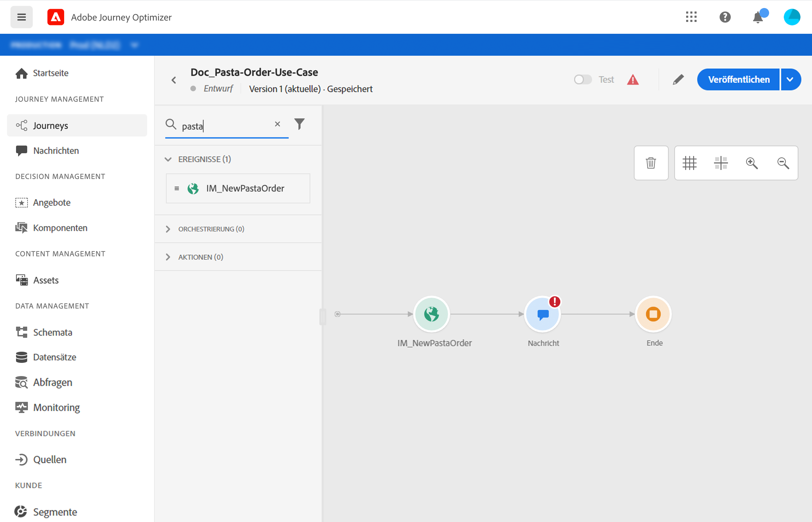

1. Konfigurieren und gestalten Sie Ihre Push-Benachrichtigung. Siehe diesen [Abschnitt](../push/create-push.md).

## Schritt 2 – Personalisierung in Profil hinzufügen {#add-perso}

1. Klicken Sie in der Aktivität **Push** auf **Inhalt bearbeiten**.

1. Klicken Sie auf das Feld **Titel**.

   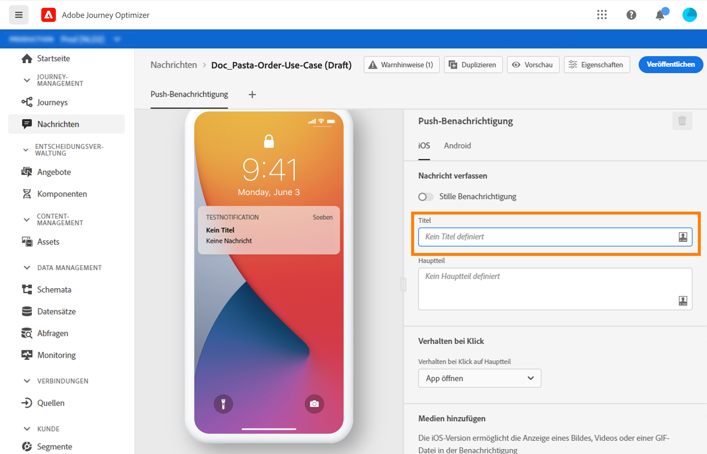

1. Geben Sie den Betreff ein und fügen Sie eine Personalisierung des Profils hinzu. Verwenden Sie die Suchleiste, um das Feld „Vorname“ des Profils zu finden. Setzen Sie den Cursor im Betrefftext an die Stelle, an der Sie das Personalisierungsfeld einfügen möchten, und klicken Sie auf das Symbol **+**. Klicken Sie auf **Speichern**.

   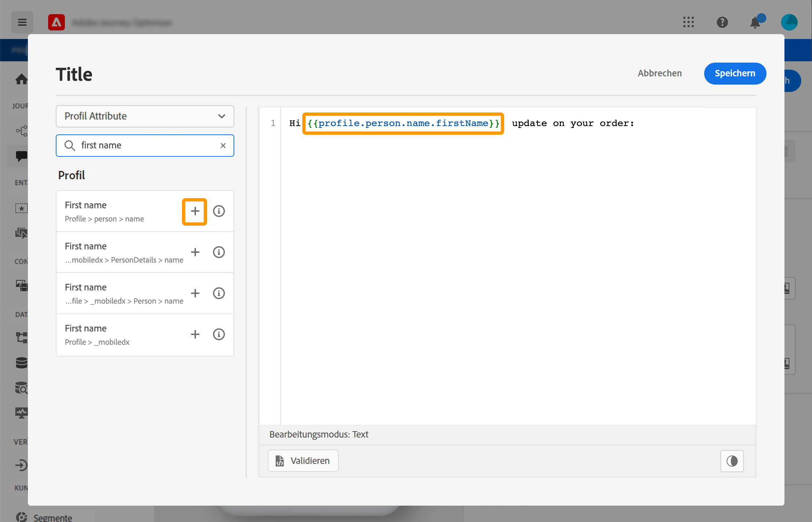

## Schritt 3 – Personalisierung für kontextuelle Daten hinzufügen {#add-perso-contextual-data}

1. Klicken sie in der Aktivität **Push** auf **Inhalt bearbeiten** und anschließend auf das Feld **Titel**.

   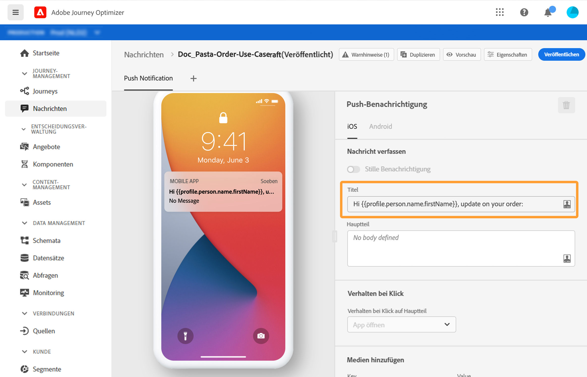

1. Wählen Sie das Menü **Kontextuelle Attribute**. Kontextuelle Attribute sind nur verfügbar, wenn eine Journey kontextuelle Daten an die Nachricht übergeben hat. Klicken Sie auf **Journey Orchestration**. Die folgenden kontextuellen Informationen werden angezeigt:

   * **Ereignisse**: In dieser Kategorie werden alle Felder aus den Ereignissen neu gruppiert, die vor der Kanalaktionsaktivität in der Journey platziert wurden.
   * **Journey-Eigenschaften**: die technischen Felder, die sich auf die Journey für ein bestimmtes Profil beziehen, z. B. die Journey-ID oder die aufgetretenen Fehler. Weitere Informationen zu Datensätzen finden Sie in der [Dokumentation zu Journey Orchestration](../building-journeys/expression/journey-properties.md).

   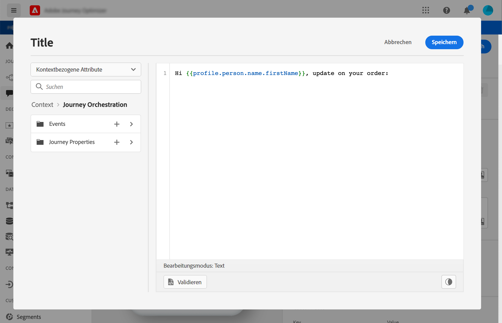

1. Erweitern Sie das Element **Ereignis** und suchen Sie das Feld für die Bestellnummer, das sich auf Ihr Ereignis bezieht. Sie können auch das Suchfeld verwenden. Klicken Sie auf das Symbol **+**, um das Personalisierungsfeld in den Betrefftext einzufügen. Klicken Sie auf **Speichern**.

   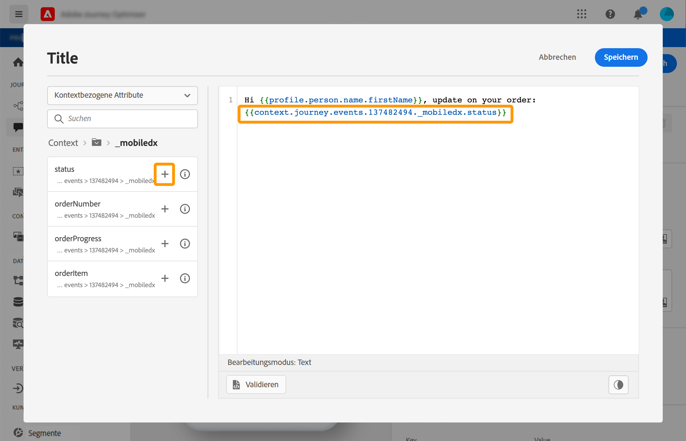

1. Klicken Sie nun auf das Feld **Textkörper**.

   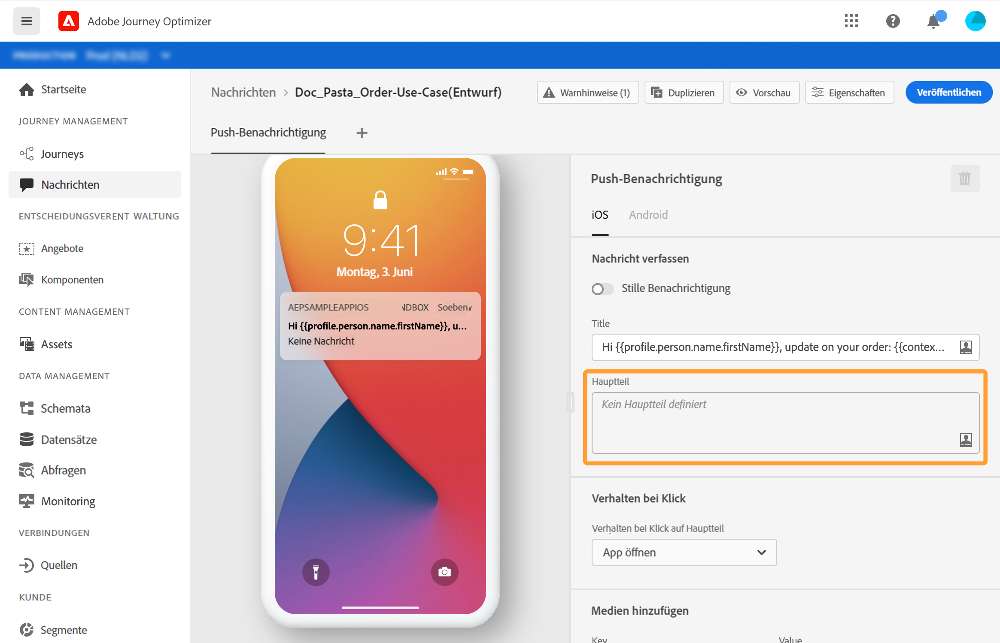

1. Geben Sie die Nachricht ein und fügen Sie vom Menü **[!UICONTROL Kontextuelle Attribute]** den Bestellartikelnamen und den Bestellstatus ein.

   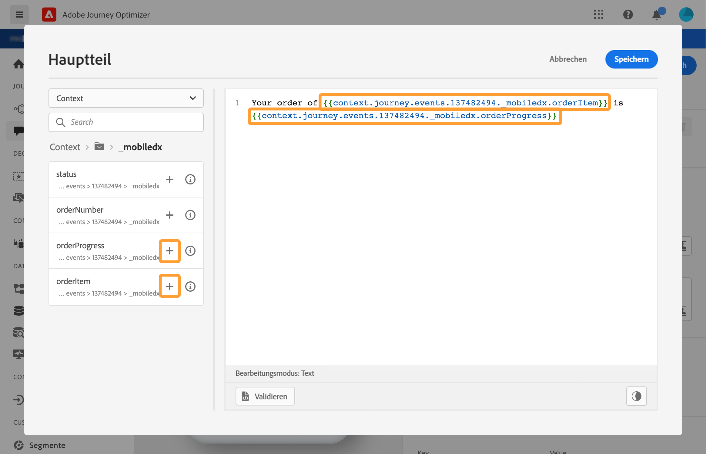

1. Wählen Sie aus dem linken Menü **Angebotsentscheidungen** aus, um eine Entscheidungs-Variable einzufügen. Wählen Sie die Platzierung aus und klicken Sie neben der Entscheidung auf das Symbol **+**, um sie dem Textkörper hinzuzufügen.

   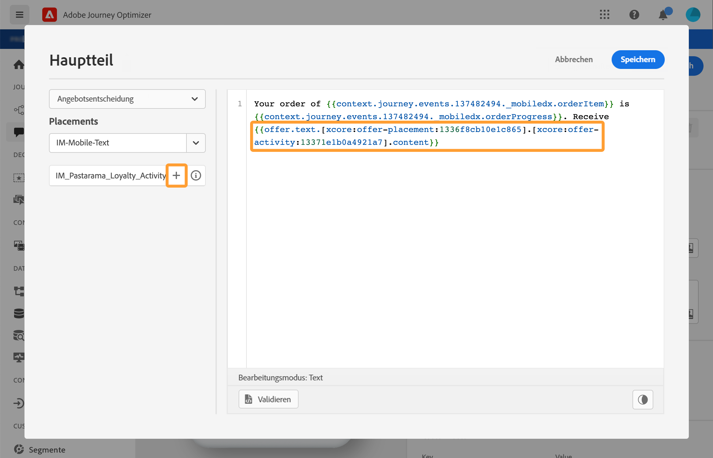

1. Klicken Sie auf „Validieren“, um sicherzustellen, dass keine Fehler vorhanden sind, und danach auf **Speichern**.

   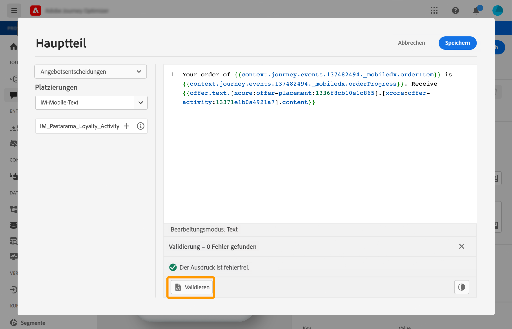

## Schritt 4 – Journey testen und veröffentlichen {#test-publish}

1. Klicken Sie auf die Schaltfläche **Test** und dann auf **Ereignis auslösen**.

   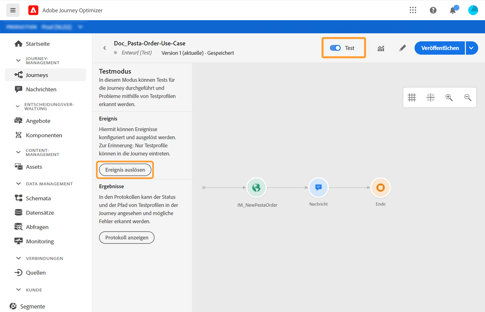

1. Geben Sie die verschiedenen Werte zum Bestehen des Tests ein. Der Testmodus funktioniert nur mit Testprofilen. Die Profilkennung muss mit einem Testprofil übereinstimmen. Klicken Sie auf **Senden**.

   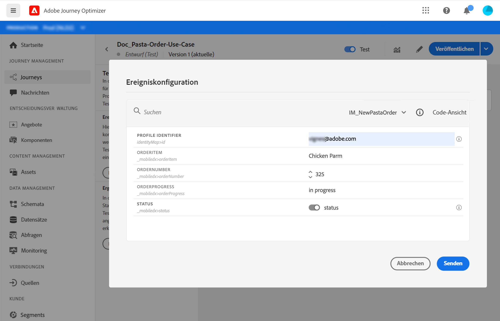

   Die Push-Benachrichtigung wird gesendet und auf dem Handy des Testprofils angezeigt.

   

1. Vergewissern Sie sich, dass kein Fehler vorliegt, und veröffentlichen Sie die Journey.

## Anleitungsvideo {#video}

Das folgende Video zeigt ein ähnliches Anwendungsbeispiel, in dem kontextbezogene Daten von einer Journey zur Personalisierung einer E-Mail genutzt werden.

>[!VIDEO](https://video.tv.adobe.com/v/3428526?captions=ger&quality=12)

## Kurzübersicht {#quick-reference}

Dieser Abschnitt enthält strukturiertes Wissen zur Unterstützung von Interpretation, Abrufen und Antworten auf Fragen zu diesem Thema.

Zum vollständigen Verständnis sollten diese Informationen mit der Dokumentation auf dieser Seite kombiniert werden. Keine der beiden Quellen ist für Einzelpersonen gedacht. Die Seite beschreibt die Funktion, während dieser Abschnitt zusätzlichen Kontext bietet, der dabei hilft, Begriffe, Absichten, Anwendbarkeit und Begrenzungen zu unterscheiden.

>[!BEGINTABS]

>[!TAB Übersicht]

**TL;DR**

Auf dieser Seite wird ein Anwendungsfall für Push-Benachrichtigungen zum Bestellstatus vorgestellt, in dem drei Arten der Personalisierung - Profilfeld, Angebotsentscheidung und kontextuelle Journey-Daten - in einer einzigen Nachricht kombiniert werden.

**Intents**

* Erstellen einer Journey mit einem Bestellereignis und einer Push-Aktionsaktivität
* Hinzufügen einer profilbasierten Personalisierung (Vorname des Kunden) zum Push-Titel
* Hinzufügen einer kontextuellen Datenpersonalisierung (Bestellnummer, Artikelname, Bestellstatus) aus dem Journey-Ereignis
* Hinzufügen der Personalisierung von Angebotsentscheidungen zum Push-Text
* Testen der Journey im Testmodus und Veröffentlichen

>[!TAB Glossar]

* **Profilpersonalisierung**: Personalization basierend auf einem Profilfeld wie Vorname, auf das über `profile.*` zugegriffen wird. *(produktspezifisch)*
* **Angebotsentscheidung**: Personalization auf der Grundlage von Entscheidungs-Management-Variablen; wird über das Menü Angebotsentscheidungen im Personalisierungseditor eingefügt. *(produktspezifisch)*
* **Kontextuelle Personalisierung**: Personalization basierend auf Daten von der Journey - Ereignisfelder (z. B. Bestellnummer, Artikelname, Bestellstatus) und Journey-Eigenschaften (z. B. Journey-ID, Fehler). Nur verfügbar, wenn eine Journey kontextuelle Daten an die Nachricht übergeben hat. *(produktspezifisch)*
* **Journey-Eigenschaften**: Technische Felder, die sich auf die Journey für ein bestimmtes Profil beziehen - wie z. B. die Journey-ID oder aufgetretene Fehler -, zugänglich unter Kontextuelle Attribute > Journey Orchestration. *(produktspezifisch)*

>[!TAB Terminologie]

* **Kanonischer Name:** Kontextuelle Personalisierung — Varianten: kontextbasierte Personalisierung, Journey-Kontext-Personalisierung
* **Synonyme:** &quot;Journey Orchestration&quot; (Benutzeroberflächen-Beschriftung im Kontextattribut-Menü) = kontextuelle Journey-Datenquelle
* **Nicht verwechseln:** Profilpersonalisierung (statische Profilfeldwerte, immer verfügbar) ≠ Kontextuelle Personalisierung (Journey-Ereignis- und -Eigenschaftsdaten, nur verfügbar, nachdem der Journey-Kontext an die Nachricht übergeben wurde) ≠ Personalisierung der Angebotsentscheidung (Entscheidungs-Management-Variablen)

>[!TAB Leitplanken und Einschränkungen]

* Kontextuelle Attribute sind im Personalisierungseditor nur verfügbar, wenn eine Journey kontextuelle Daten an die Nachricht übergeben hat.
* Der Testmodus funktioniert nur mit Testprofilen. Die in der Ereigniskonfiguration eingegebene Profilkennung muss einem vorhandenen Testprofil entsprechen.

>[!TAB FAQs]

**F: Welche drei Personalisierungstypen werden in diesem Anwendungsfall kombiniert?**

Profilpersonalisierung (Vorname des Kunden aus `profile.*`), kontextuelle Datenpersonalisierung (Bestellnummer, Elementname und Bestellstatus aus dem Journey-Ereignis) und Personalisierung der Angebotsentscheidung (ein in den Textkörper eingefügtes Entscheidungs-Management-Angebot).

**F: Woher kommen kontextuelle Attribute im Personalisierungseditor?**

Kontextattribute stammen aus Ereignissen, die vor der Kanalaktionsaktivität im Journey platziert wurden, und aus technischen Journey-Eigenschaften. Sie werden im Personalisierungseditor unter Kontextuelle Attribute > Journey Orchestration > Ereignisse (Ereignisfelder) oder Journey-Eigenschaften (Journey-Metadaten) angezeigt.

**F: Was sind die Voraussetzungen für diesen Anwendungsfall?**

Ein Bestellereignis muss mit den Feldern Bestellnummer, Status und Artikelname konfiguriert werden und im Entscheidungs-Management muss eine Entscheidung vorhanden sein.

**F: Wie kann ich die Push-Benachrichtigung in diesem Anwendungsfall testen?**

Klicken Sie auf die Schaltfläche Test auf der Journey, klicken Sie dann auf &quot;Trigger eines Ereignisses“ und geben Sie die Ereigniswerte in das Fenster Ereigniskonfiguration ein. Der Testmodus funktioniert nur mit Testprofilen. Die Profilkennung muss mit einem vorhandenen Testprofil übereinstimmen.

>[!ENDTABS]

<!-- ai-section-version: 1 | source-hash: ae5284c7 -->
