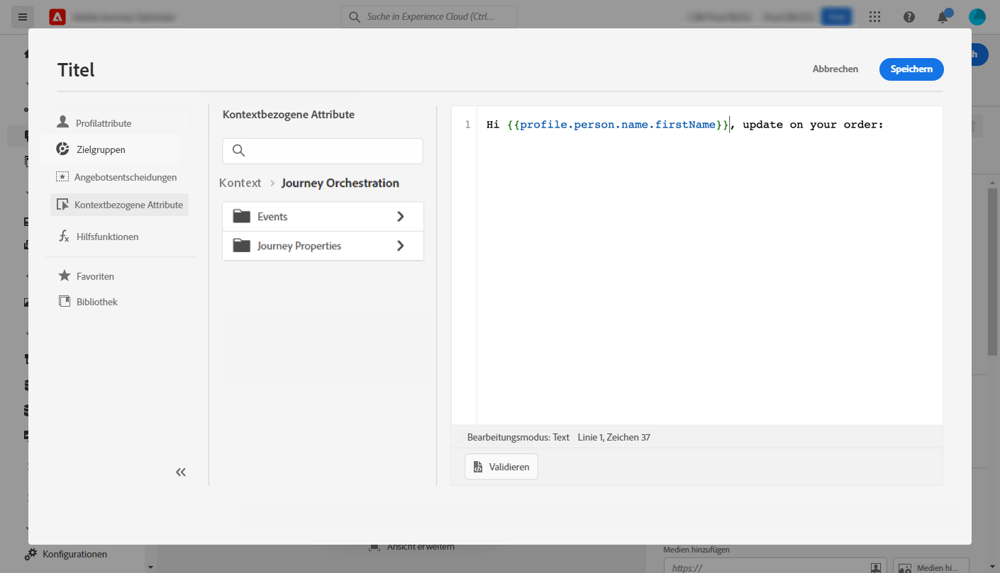
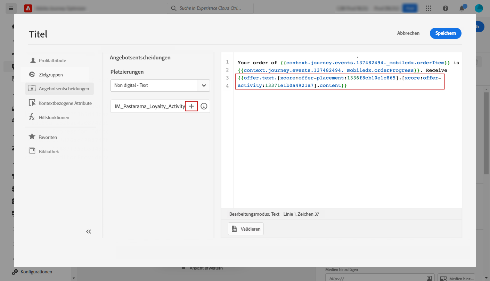
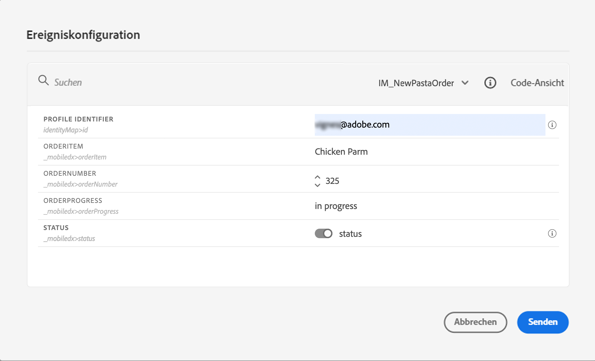

# Personalisierung – Anwendungsfall: Benachrichtigung über den Bestellstatus {#personalization-use-case}

In diesem Anwendungsfall erfahren Sie, wie Sie mehrere Personalisierungsarten in einer einzigen Push-Benachrichtigung verwenden. Es werden drei Arten der Personalisierung verwendet:

* **Profil**: Personalisierung von Nachrichten basierend auf einem Profilfeld
* **Angebotsentscheidung**: Personalisierung basierend auf Offer-Decisioning-Variablen
* **Kontext**: Personalisierung basierend auf Kontextdaten aus der Journey

Das Ziel dieses Beispiels ist es, jedes Mal, wenn eine Kundenbestellung aktualisiert wird, ein Ereignis an [!DNL Journey Optimizer] zu senden. Anschließend wird eine Push-Benachrichtigung mit Informationen zur Bestellung und einem personalisierten Angebot an den Kunden gesendet.

Für diesen Anwendungsfall müssen die folgenden Voraussetzungen gegeben sein:

* Erstellen und gestalten einer Push-Benachrichtigung, ohne sie zu veröffentlichen. Siehe diesen [Abschnitt](../messages/create-message.md).
* Konfigurieren eines Bestellereignisses mit Bestellnummer, Status und Artikelnamen. Siehe diesen [Abschnitt](../event/about-events.md).
* Erstellen einer Entscheidung (früher als „Angebotsaktivität“ bezeichnet), siehe diesen [Abschnitt](../offers/offer-activities/create-offer-activities.md).

## Schritt 1 – Personalisierung in Profil hinzufügen {#add-perso}

1. Klicken Sie auf das Menü **[!UICONTROL Nachricht]** und wählen Sie Ihre Nachricht aus.

   

1. Klicken Sie auf das Feld **Titel**.

   

1. Geben Sie den Betreff ein und fügen Sie eine Personalisierung aus dem Profil hinzu. Verwenden Sie die Suchleiste, um das Feld „Vorname“ des Profils zu finden. Setzen Sie den Cursor im Betrefftext an die Stelle, an der Sie das Personalisierungsfeld einfügen möchten, und klicken Sie auf das Symbol **+**. Klicken Sie auf **Speichern**.

   

   >[!NOTE]
   >
   >Belassen Sie die Nachricht als Entwurf. Veröffentlichen Sie sie noch nicht.

## Schritt 2 – Journey erstellen {#create-journey}

1. Klicken Sie auf das Menü **[!UICONTROL Journey]** und erstellen Sie eine neue Journey.

   

1. Fügen Sie Ihr Eintrittsereignis, eine **Nachricht** und eine **Ende**-Aktivität hinzu.

   

1. Wählen Sie in der Aktivität **Nachricht** die zuvor erstellte Nachricht aus. Klicken Sie auf **OK**.

   

   Es wird eine Meldung angezeigt, die Sie darüber informiert, dass die Daten des Eintrittsereignisses und die Journey-Eigenschaften an die Nachricht übergeben wurden.

   

   >[!NOTE]
   >
   >Die Meldung wird mit einem Warnsymbol angezeigt. Dies liegt daran, dass die Nachricht noch nicht veröffentlicht wurde.

## Schritt 3 – Personalisierung für Kontextdaten hinzufügen  {#add-perso-contextual-data}

1. Klicken Sie in der Aktivität **Nachricht** auf das Symbol **Nachricht öffnen**. Die Nachricht wird in einer neuen Registerkarte geöffnet.

   

1. Klicken Sie auf das Feld **Titel**.

   

1. Wählen Sie die Kategorie **Kontext**. Dieses Element ist nur verfügbar, wenn eine Journey Kontextdaten an die Nachricht übergeben hat. Klicken Sie auf **Journey Orchestration**. Die folgenden Kontextinformationen werden angezeigt:

   * **Ereignisse**: Diese Kategorie gruppiert alle Felder aus den Ereignissen neu, die vor der Aktivität **Nachrichten** in der Journey platziert wurden.
   * **Journey-Eigenschaften**: die technischen Felder, die sich auf die Journey für ein bestimmtes Profil beziehen, z. B. die Fahrt-ID oder die aufgetretenen spezifischen Fehler. Weitere Informationen finden Sie in der [Dokumentation zu Journey Orchestration](../building-journeys/expression/journey-properties.md).

   

1. Erweitern Sie das Element **Ereignis** und suchen Sie das Feld für die Bestellnummer, das sich auf Ihr Ereignis bezieht. Sie können auch das Suchfeld verwenden. Klicken Sie auf das Symbol **+**, um das Personalisierungsfeld in den Betrefftext einzufügen. Klicken Sie auf **Speichern**.

   

1. Klicken Sie nun auf das Feld **Textkörper**.

   

1. Geben Sie die Nachricht ein und fügen Sie in der Kategorie **Kontext** den Bestellartikelnamen und den Bestellstatus ein.

   

1. Wählen Sie aus der Dropdown-Liste **Angebotsentscheidung** aus, um eine Offer Decisioning-Variable einzufügen. Wählen Sie die Platzierung aus und klicken Sie auf das Symbol **+** neben der Entscheidung (früher als „Angebotsaktivität“ bezeichnet), um sie dem Textkörper hinzuzufügen.

   

1. Klicken Sie auf „Validieren“, um sicherzustellen, dass keine Fehler auftreten, und klicken Sie auf **Speichern**.

   

1. Veröffentlichen Sie jetzt die Nachricht.

   

## Schritt 4 – Journey testen und veröffentlichen  {#test-publish}

1. Öffnen Sie die Journey erneut. Wenn die Journey bereits geöffnet ist, müssen Sie die Seite aktualisieren. Nachdem die Nachricht veröffentlicht wurde, können Sie sehen, dass die Journey nicht fehlerhaft ist. Klicken Sie auf die Schaltfläche **Test** und dann auf **Ereignis auslösen**.

   

1. Geben Sie die verschiedenen Werte zum Bestehen des Tests ein. Der Testmodus funktioniert nur mit Testprofilen. Die Profilkennung muss mit einem Testprofil übereinstimmen. Klicken Sie auf **Senden**.

   

   Die Push-Benachrichtigung wird gesendet und auf dem Handy des Testprofils angezeigt.

   

1. Vergewissern Sie sich, dass kein Fehler vorliegt, und veröffentlichen Sie die Journey.
