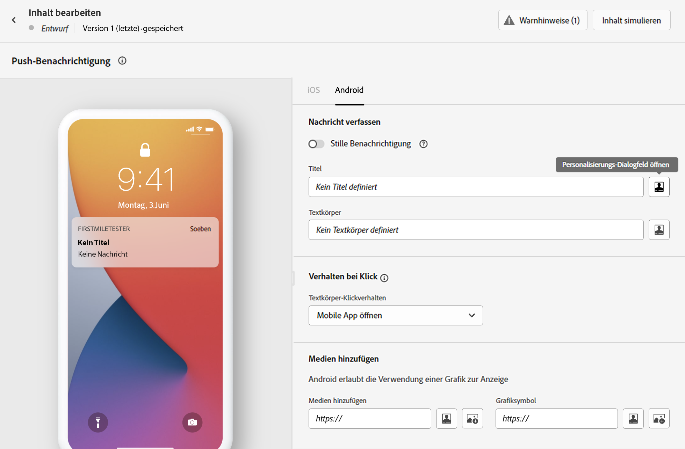
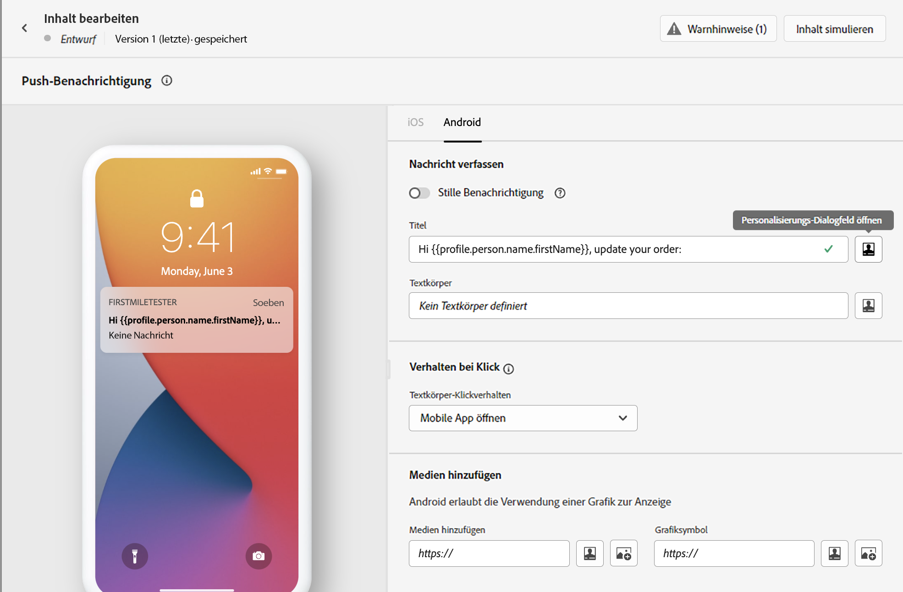
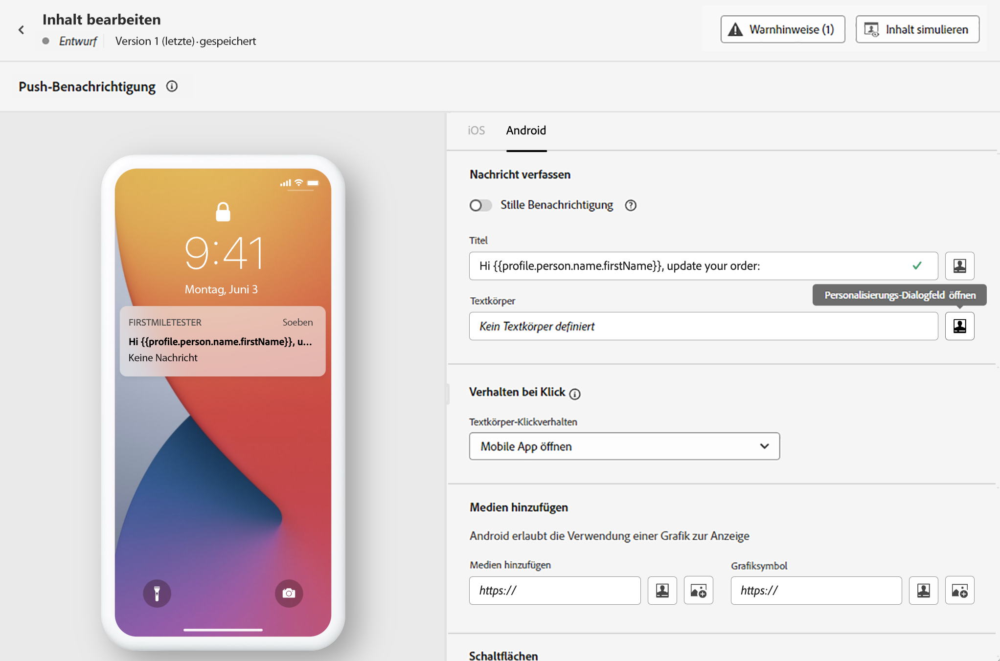
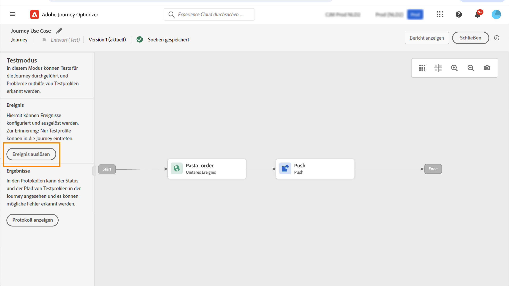

# Personalisierung – Anwendungsfall: Benachrichtigung über den Bestellstatus {#personalization-use-case}

In diesem Anwendungsfall erfahren Sie, wie Sie mehrere Personalisierungsarten in einer einzigen Push-Benachrichtigung verwenden. Es werden drei Arten der Personalisierung verwendet:

* **Profil**: Personalisierung von Nachrichten basierend auf einem Profilfeld
* **Angebotsentscheidung**: Personalisierung basierend auf Offer-Decisioning-Variablen
* **Kontext**: Personalisierung basierend auf Kontextdaten aus der Journey

Das Ziel dieses Beispiels ist es, jedes Mal, wenn eine Kundenbestellung aktualisiert wird, ein Ereignis an [!DNL Journey Optimizer] zu senden. Anschließend wird eine Push-Benachrichtigung mit Informationen zur Bestellung und einem personalisierten Angebot an den Kunden gesendet.

Für diesen Anwendungsfall müssen die folgenden Voraussetzungen gegeben sein:

* Konfigurieren eines Bestellereignisses mit Bestellnummer, Status und Artikelnamen. Siehe diesen [Abschnitt](../event/about-events.md).
* Informationen zum Erstellen einer Entscheidung finden Sie in diesem [Abschnitt](../offers/offer-activities/create-offer-activities.md).

## Schritt 1 – Journey erstellen {#create-journey}

1. Klicken Sie auf das Menü **[!UICONTROL Journey]** und erstellen Sie eine neue Journey.

   

1. Fügen Sie Ihr Eintrittsereignis und ein **Push** Aktionsaktivität.

   

1. Konfigurieren und gestalten Sie Ihre Push-Benachrichtigung. Siehe diesen [Abschnitt](../messages/get-started-content.md).

## Schritt 2 – Personalisierung in Profil hinzufügen {#add-perso}

1. Im **Push** Aktivität, klicken Sie auf **Inhalt bearbeiten**.

1. Klicken Sie auf das Feld **Titel**.

   

1. Geben Sie den Betreff ein und fügen Sie eine Personalisierung aus dem Profil hinzu. Verwenden Sie die Suchleiste, um das Feld „Vorname“ des Profils zu finden. Setzen Sie den Cursor im Betrefftext an die Stelle, an der Sie das Personalisierungsfeld einfügen möchten, und klicken Sie auf das Symbol **+**. Klicken Sie auf **Speichern**.

   

## Schritt 3 – Personalisierung für Kontextdaten hinzufügen  {#add-perso-contextual-data}

1. Im **Push** Aktivität, klicken Sie auf **Inhalt bearbeiten** und klicken Sie auf **Titel** -Feld.

   

1. Wählen Sie das Menü **Kontextattribute**. Kontextattribute sind nur verfügbar, wenn eine Journey Kontextdaten an die Nachricht übergeben hat. Klicken Sie auf **Journey Orchestration**. Die folgenden Kontextinformationen werden angezeigt:

   * **Veranstaltungen**: Diese Kategorie enthält alle Felder aus den Ereignissen, die vor der Aktivität Kanalaktion in der Journey platziert wurden.
   * **Journey-Eigenschaften**: die technischen Felder, die sich auf die Journey für ein bestimmtes Profil beziehen, z. B. die Fahrt-ID oder die aufgetretenen spezifischen Fehler. Weitere Informationen finden Sie in der [Dokumentation zu Journey Orchestration](../building-journeys/expression/journey-properties.md).

   

1. Erweitern Sie das Element **Ereignis** und suchen Sie das Feld für die Bestellnummer, das sich auf Ihr Ereignis bezieht. Sie können auch das Suchfeld verwenden. Klicken Sie auf das Symbol **+**, um das Personalisierungsfeld in den Betrefftext einzufügen. Klicken Sie auf **Speichern**.

   

1. Klicken Sie nun auf das Feld **Textkörper**.

   

1. Geben Sie die Nachricht ein und fügen Sie vom Menü **[!UICONTROL Kontextuelle Attribute]** den Bestellartikelnamen und den Bestellstatus ein.

   

1. Wählen Sie aus dem linken Menü **Angebotsentscheidungen**, um eine Offer-Decisioning-Variable einzufügen. Wählen Sie die Platzierung aus und klicken Sie neben der Entscheidung auf das Symbol **+**, um sie dem Textkörper hinzuzufügen.

   

1. Klicken Sie auf „Validieren“, um sicherzustellen, dass keine Fehler auftreten, und klicken Sie auf **Speichern**.

   

## Schritt 4 – Journey testen und veröffentlichen  {#test-publish}

1. Klicken Sie auf die Schaltfläche **Test** und dann auf **Ereignis auslösen**.

   

1. Geben Sie die verschiedenen Werte zum Bestehen des Tests ein. Der Testmodus funktioniert nur mit Testprofilen. Die Profilkennung muss mit einem Testprofil übereinstimmen. Klicken Sie auf **Senden**.

   

   Die Push-Benachrichtigung wird gesendet und auf dem Handy des Testprofils angezeigt.

   

1. Vergewissern Sie sich, dass kein Fehler vorliegt, und veröffentlichen Sie die Journey.
