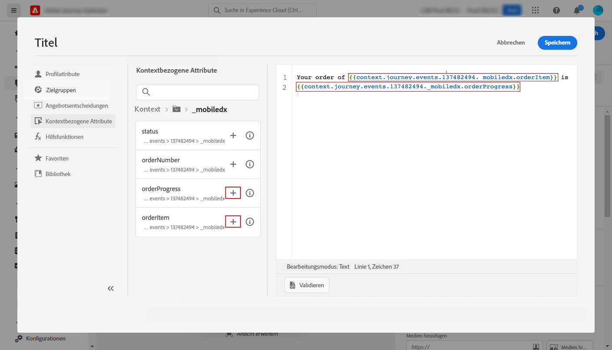
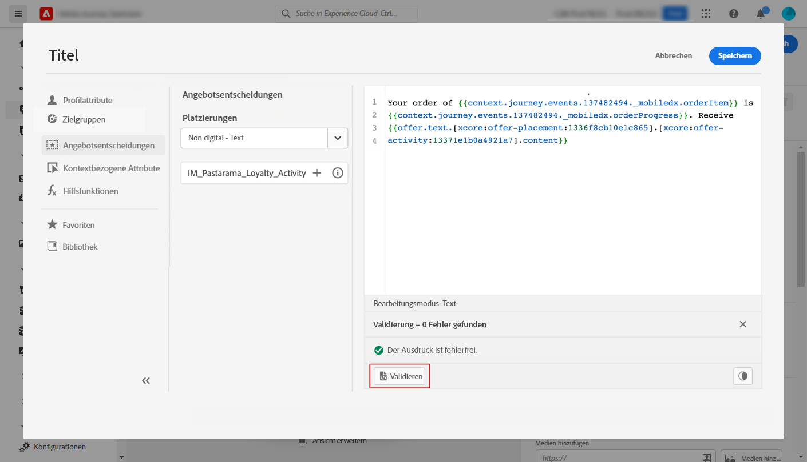

# Personalisierungsanwendungsfall {#personalization-use-case}

In diesem Anwendungsfall erfahren Sie, wie Sie mehrere Personalisierungsarten in einer einzigen Push-Benachrichtigung verwenden. Es werden drei Arten der Personalisierung verwendet:

* Profil: Personalisierung von Nachrichten basierend auf einem Profil-Feld
* Beschluss des Angebots: Personalisierung basierend auf Angebot-Entscheidungsvariablen
* Kontext: Personalisierung basierend auf Kontextdaten der Journey

Ziel dieses Beispiels ist es, ein Ereignis bei jeder Aktualisierung einer Kundenbestellung an Journey Optimizer zu senden. Anschließend wird eine Push-Benachrichtigung mit Informationen zur Bestellung und einem personalisierten Angebot an den Kunden gesendet.

Für diesen Anwendungsfall sind die folgenden Voraussetzungen erforderlich:

* eine Push-Benachrichtigung erstellen und entwerfen, ohne sie zu veröffentlichen. Siehe diesen [Abschnitt](../create-message.md).
* ein Ereignis mit Bestellnummer, Status und Artikelnamen konfigurieren. Siehe diesen [Abschnitt](../event/about-events.md).
* eine Entscheidung zu erstellen (früher &quot;Angebot-Aktivität&quot;), siehe [Abschnitt](../offers/offer-activities/create-offer-activities.md).

## Schritt 1: Hinzufügen Personalisierung auf Profil

1. Klicken Sie auf das Menü **[!UICONTROL Nachricht]** und wählen Sie Ihre Nachricht aus.

   

1. Klicken Sie auf das Feld **Titel**.

   

1. Geben Sie den Betreff ein und fügen Sie eine Personalisierung des Profils hinzu. Verwenden Sie die Suchleiste, um das Vornamenfeld des Profils zu finden. Platzieren Sie im Betreff den Cursor an der Stelle, an der Sie das Personalisierungsfeld einfügen möchten, und klicken Sie auf das Symbol **+**. Klicken Sie auf **Speichern**.

   

   >[!NOTE]
   >
   >Lassen Sie die Nachricht im Entwurf. Veröffentlichen Sie es noch nicht.

## Schritt 2: Erstellen der Journey

1. Klicken Sie auf das Menü **[!UICONTROL Journey]** und erstellen Sie eine neue Journey.

   

1. hinzufügen Sie Ihr Ereignis für die Eingabe, eine **Meldung** und eine **End**-Aktivität.

   

1. Wählen Sie in der Aktivität **Meldung** die zuvor erstellte Meldung aus. Klicken Sie auf **OK**.

   

   Es wird eine Meldung angezeigt, die Sie darüber informiert, dass die Daten zum Ereignis der Einsendung und die Journey-Eigenschaften an die Nachricht übergeben wurden.

   

   >[!NOTE]
   >
   >Die Meldung wird mit einem Warnsymbol angezeigt. Dies liegt daran, dass die Nachricht noch nicht veröffentlicht wurde.

## Schritt 3: Hinzufügen Personalisierung für Kontextdaten

1. Klicken Sie in der Aktivität **Meldung** auf das Symbol **Nachricht öffnen**. Die Nachricht wird in einer neuen Registerkarte geöffnet.

   

1. Klicken Sie auf das Feld **Titel**.

   

1. Wählen Sie die Kategorie **Kontext**. Dieses Element ist nur verfügbar, wenn eine Journey Kontextdaten an die Nachricht übergeben hat. Klicken Sie auf **Journey Orchestration**. Die folgenden Kontextinformationen werden angezeigt:

   * **Ereignisse**: Diese Kategorie gruppiert alle Felder aus den Ereignissen, die vor der  **** Nachrichten-Aktivität in der Journey platziert wurden.
   * **Journey-Eigenschaften**: die technischen Felder für die Journey für ein bestimmtes Profil, z. B. die Journey-ID oder die spezifischen aufgetretenen Fehler. Weitere Informationen finden Sie in der [Journey Orchestration-Dokumentation](https://experienceleague.adobe.com/docs/journeys/using/building-advanced-conditions-journeys/syntax/journey-properties.html#building-advanced-conditions-journeys).

   

1. Erweitern Sie das Element **Ereignis** und suchen Sie das Feld für die Bestellnummer, das sich auf Ihr Ereignis bezieht. Sie können auch das Suchfeld verwenden. Klicken Sie auf das Symbol **+**, um das Personalisierungsfeld in den Betreff-Text einzufügen. Klicken Sie auf **Speichern**.

   

1. Klicken Sie nun auf das Feld **Body**.

   

1. Geben Sie die Meldung ein und fügen Sie in der Kategorie **Kontext** den Bestellartikelnamen und den Bestellstatus ein.

   

1. Wählen Sie aus der Dropdownliste **Angebot Decision** aus, um eine offer decisioning-Variable einzufügen. Wählen Sie die Platzierung aus und klicken Sie auf das Symbol **+** neben der Entscheidung (vorher als &quot;Angebot-Aktivität&quot;bezeichnet), um sie dem Textkörper hinzuzufügen.

   

1. Klicken Sie auf Bestätigen, um sicherzustellen, dass keine Fehler auftreten, und klicken Sie auf **Speichern**.

   

1. Veröffentlichen Sie jetzt die Nachricht.

   

## Schritt 4: Journey testen und veröffentlichen

1. Öffnen Sie die Journey erneut. Wenn die Journey bereits geöffnet ist, müssen Sie die Seite aktualisieren. Nachdem die Nachricht veröffentlicht wurde, können Sie sehen, dass die Journey nicht fehlerhaft ist. Klicken Sie auf die Schaltfläche **Test** und dann auf **Trigger eines Ereignisses**.

   

1. Geben Sie die verschiedenen Werte ein, die der Test bestehen soll. Der Testmodus funktioniert nur mit Test-Profilen. Die Profil-ID muss mit einem Test-Profil übereinstimmen. Klicken Sie auf **Senden**.

   

   Die Push-Benachrichtigung wird gesendet und auf dem Handy des Test-Profils angezeigt.

   

1. Vergewissern Sie sich, dass kein Fehler vorliegt, und veröffentlichen Sie die Journey.

