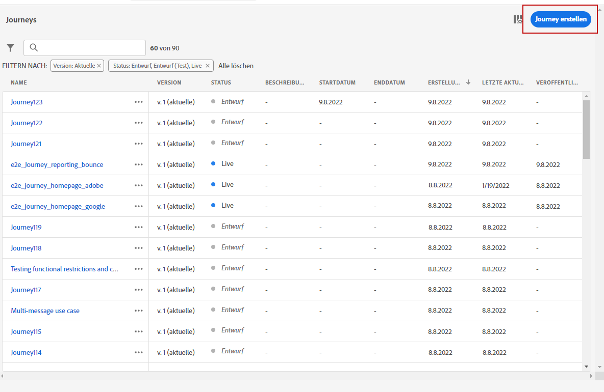
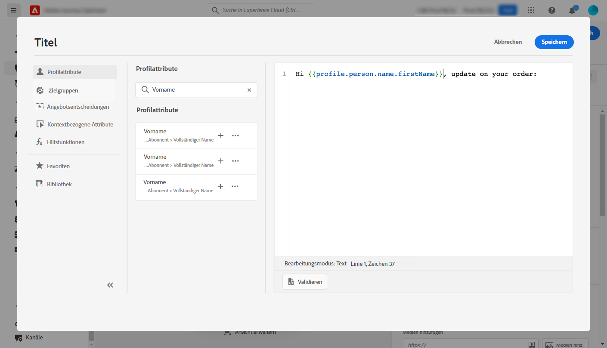
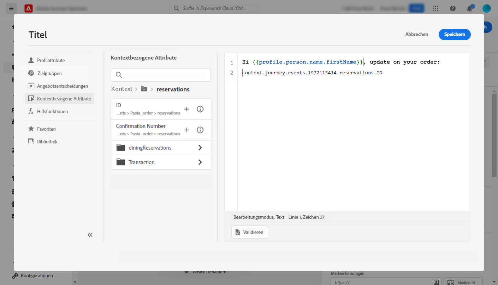

# Anwendungsfall: Personalisierung Bestellstatus-Benachrichtigung {#personalization-use-case}

In diesem Anwendungsbeispiel erfahren Sie, wie Sie mehrere Personalisierungstypen in einer Push-Benachrichtigung verwenden. Drei Personalisierungsarten werden verwendet:

* **Profil**: Personalisierung von Nachrichten basierend auf einem Profilfeld
* **Angebotsentscheidung**: Personalisierung basierend auf Entscheidungsverwaltungsvariablen
* **Kontext**: Personalisierung basierend auf Kontextdaten aus der Journey

Ziel dieses Beispiels ist es, ein Ereignis an [!DNL Journey Optimizer] jedes Mal, wenn eine Kundenbestellung aktualisiert wird. Anschließend wird eine Push-Benachrichtigung mit Informationen zur Bestellung und einem personalisierten Angebot an den Kunden gesendet.

Für diesen Anwendungsfall sind die folgenden Voraussetzungen erforderlich:

* konfigurieren Sie ein Bestellereignis, das die Bestellnummer, den Status und den Elementnamen enthält. Siehe hierzu [Abschnitt](../event/about-events.md).
* eine Entscheidung erstellen, siehe [Abschnitt](../offers/offer-activities/create-offer-activities.md).

## Schritt 1: Erstellen der Journey {#create-journey}

1. Klicken Sie auf **[!UICONTROL Journeys]** und erstellen Sie eine neue Journey.

   

1. Fügen Sie Ihr Eintrittsereignis und ein **Push** Aktionsaktivität.

   

1. Konfigurieren und gestalten Sie Ihre Push-Benachrichtigung. Siehe hierzu [Abschnitt](../push/create-push.md).

## Schritt 2: Hinzufügen einer Personalisierung zum Profil {#add-perso}

1. Im **Push** Aktivität, klicken Sie auf **Inhalt bearbeiten**.

1. Klicken Sie auf **Titel** -Feld.

   

1. Geben Sie den Betreff ein und fügen Sie eine Profilpersonalisierung hinzu. Verwenden Sie die Suchleiste, um das Vorname-Feld des Profils zu finden. Platzieren Sie den Cursor an der Stelle im Betrefftext, an der Sie das Personalisierungsfeld einfügen möchten, und klicken Sie auf die Schaltfläche **+** Symbol. Klicken **Speichern**.

   

## Schritt 3: Personalisierung für Kontextdaten hinzufügen {#add-perso-contextual-data}

1. Im **Push** Aktivität, klicken Sie auf **Inhalt bearbeiten** und klicken Sie auf **Titel** -Feld.

   

1. Wählen Sie die **Kontextattribute** Menü. Kontextattribute sind nur verfügbar, wenn eine Journey Kontextdaten an die Nachricht übergeben hat. Klicken **Journey Orchestration**. Die folgenden Kontextinformationen werden angezeigt:

   * **Veranstaltungen**: Diese Kategorie enthält alle Felder aus den Ereignissen, die vor der Kanalaktionsaktivität in der Journey platziert wurden.
   * **Journey-Eigenschaften**: die technischen Felder, die sich auf die Journey für ein bestimmtes Profil beziehen, z. B. die Journey-ID oder die spezifischen aufgetretenen Fehler. Weitere Informationen finden Sie unter [Dokumentation zu Journey Orchestration](../building-journeys/expression/journey-properties.md).

   

1. Erweitern Sie die **Veranstaltungen** und suchen Sie nach dem Feld für die Bestellnummer, das mit Ihrem Ereignis verbunden ist. Sie können auch das Suchfeld verwenden. Klicken Sie auf **+** -Symbol, um das Personalisierungsfeld in den Betreff-Text einzufügen. Klicken **Speichern**.

   

1. Klicken Sie nun auf **body** -Feld.

   

1. Geben Sie die Nachricht ein und fügen Sie sie aus dem **[!UICONTROL Contextual attributes]** -Menü den Namen des Bestellelements und den Bestellfortschritt.

   

1. Wählen Sie im linken Menü die Option **Angebotsentscheidungen** , um eine Entscheidungsvariable einzufügen. Wählen Sie die Platzierung aus und klicken Sie auf die **+** neben der Entscheidung klicken, um sie dem Text hinzuzufügen.

   

1. Klicken Sie auf Bestätigen , um sicherzustellen, dass keine Fehler vorliegen, und klicken Sie auf **Speichern**.

   

## Schritt 4: Testen und Veröffentlichen der Journey {#test-publish}

1. Klicken Sie auf **Test** und klicken Sie auf **Ereignis auslösen**.

   

1. Geben Sie die verschiedenen Werte ein, die im Test bestanden werden sollen. Der Testmodus funktioniert nur mit Testprofilen. Die Profilkennung muss einem Testprofil entsprechen. Klicken **Senden**.

   

   Die Push-Benachrichtigung wird auf dem Mobiltelefon des Testprofils gesendet und angezeigt.

   

1. Vergewissern Sie sich, dass kein Fehler vorliegt, und veröffentlichen Sie die Journey.
