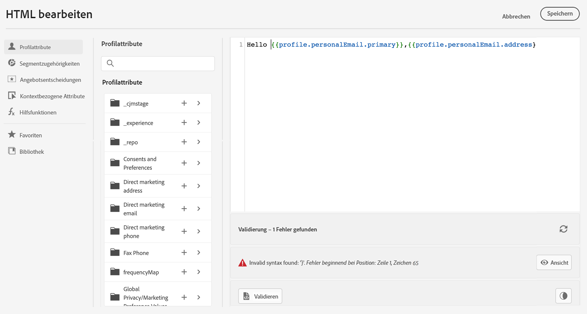

# Validierung der Personalisierung {#personalization-validation}

## Mechanismen der Validierung {#validation-mechanisms}

Verwenden Sie im Bildschirm **Ausdruckseditor** die Schaltfläche **Validieren**, um Ihre Personalisierungssyntax zu überprüfen.

>[!NOTE]
> Die Validierung wird automatisch durchgeführt, wenn Sie auf den Button **Hinzufügen** klicken, was das Editor-Fenster schließt.
>



>[!IMPORTANT]
> Wenn die Personalisierungssyntax ungültig ist, können Sie das Fenster des Ausdruckseditors nicht schließen.
>

## Häufige Fehler {#common-errors}

* **Pfad „XYZ“ nicht gefunden**

Beim Versuch, auf ein Feld zu verweisen, das im Schema nicht definiert ist.

In diesem Fall ist **firstName1** nicht als Attribut im Profilschema definiert:

```
{{profile.person.name.firstName1}}
```

* **Typ für Variable „XYZ“ stimmt nicht überein. Array erwartet, Zeichenfolge gefunden.**

Beim Versuch, über eine Zeichenfolge statt über ein Array zu iterieren:

In diesem Fall ist **product** kein Array:

```
{{each profile.person.name.firstName as |product|}}
 {{product.productName}}
{{/each}}
```

* **Ungültige Handlebars-Syntax.`‘[XYZ}}’`** gefunden

Wenn eine ungültige Handlebars-Syntax verwendet wird.

Handlebar-Ausdrücke sind von **{{expression}}** umgeben.

```
   {{[profile.person.name.firstName}}
```

* **Ungültige Segmentdefinition**

```
No segment definition found for 988afe9f0-d4ae-42c8-a0be-8d90e66e151
```

## Spezifische Fehler im Zusammenhang mit Angeboten {#specific-errors}

Die Fehler bei der Integration von Angeboten in eine E-Mail-Nachricht oder Push-Benachrichtigung haben das folgende Muster:

```
Offer.<offerType>.[PlacementID].[ActivityID].<offer-attribute>
```

Die Validierung erfolgt während der Validierung des Personalisierungsinhalts im Ausdruckseditor.

<table> 
 <thead> 
  <tr> 
   <th> Fehlertitel<br /> </th> 
   <th> Validierung/Auflösung <br /> </th> 
  </tr> 
 </thead> 
 <tbody> 
  <tr> 
   <td>Ressource mit der ID placementID und dem Typ OfferPlacement nicht gefunden <br/>
Ressource mit der ID activityID und dem Typ OfferActivity nicht gefunden<br/></td> 
   <td>Überprüfen Sie, ob activityID und/oder placementID verfügbar ist.</td> 
  </tr> 
   <tr> 
   <td>Ressource konnte nicht validiert werden.</td> 
   <td>Der componentType in der Platzierung sollte mit dem Angebot offerType übereinstimmen.</td> 
  </tr> 
   <tr> 
   <td>Die öffentliche URL ist in der offerId des Angebots nicht vorhanden.</td> 
   <td>Für die Image-Angebote (alle personalisierten und Fallback-Angebote, die mit dem Entscheidungs- und Platzierungs-Paar verknüpft sind) sollte die öffentliche URL gefüllt sein (deliveryURL sollte nicht leer sein).</td> 
  </tr> 
  <tr> 
   <td>Die Entscheidung enthält Attribute, die nicht zu Profilen gehören.</td> 
   <td>Die Verwendung des Angebotsmodells sollte nur die Profilattribute enthalten.</td> 
  </tr> 
  <tr> 
   <td>Beim Abrufen der Entscheidungsverwendung ist ein Fehler aufgetreten.</td> 
   <td>Dieser Fehler kann auftreten, wenn die API versucht, das Angebotsmodell abzurufen.</td> 
  </tr>
  <tr> 
   <td>Angebotsattribut – Das Angebotsattribut ist ungültig.</td> 
   <td>Überprüfen Sie, ob das Angebotsattribut, auf das in der Angebots-Dropdown-Liste verwiesen wird, gültig ist. Folgende Attribute sind gültig: <br/>
Bild: deliveryURL, linkURL<br/>
Text: content<br/>
HTML: content<br/></td> 
  </tr> 
 </tbody> 
</table>
