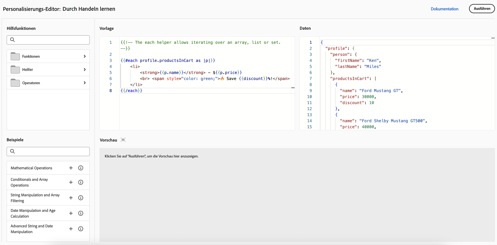

# Erste Schritte bei der Personalisierung{#add-personalization}

>[!CONTEXTUALHELP]
>id="ajo_homepage_card5"
>title="Personalisieren von Erlebnissen"
>abstract="Passen Sie Ihre Nachrichten mit **Adobe Journey Optimizer** mithilfe der über die jeweiligen Empfängerinnen und Empfänger verfügbaren Daten und Informationen an sie an. Dabei kann es sich z. B. um den Vornamen, die Interessen, den Wohnort oder zuvor gekaufte Artikel der Empfängerin bzw. des Empfängers handeln."

Mit den Personalisierungs-Funktionen von [!DNL Adobe Journey Optimizer] können Sie Ihre Nachrichten an jede einzelne Empfängerin bzw. jeden einzelnen Empfänger anhand der vorhandenen Daten anpassen. Dabei kann es sich z. B. um den Vornamen, die Interessen, den Wohnort oder zuvor gekaufte Artikel der Empfängerin bzw. des Empfängers handeln.

## Funktionsweise der Personalisierung

Mit dem **Personalisierungseditor** können Sie alle Daten auswählen, anordnen, anpassen und validieren, um eine benutzerdefinierte Personalisierung für Ihren Content zu erstellen. Außerdem können Sie verschiedene Tools wie Hilfsfunktionen oder vordefinierte Ausdrücke nutzen, um Nachrichten effektiv anzupassen.

Journey Optimizer verwendet eine Inline-Personalisierungssyntax, die auf Handlebars basiert. Damit können Sie Ausdrücke mit Inhalten erstellen, die von doppelten geschweiften Klammern **`{{}}`** eingeschlossen sind.

Bei der Verarbeitung der Nachricht ersetzt Journey Optimizer den Ausdruck durch die im Experience Platform-Datensatz enthaltenen Daten. Beispielsweise wird `Hello {{profile.person.name.firstName}} {{profile.person.name.lastName}}` dynamisch zu `Hello John Doe`.

Mit dieser Syntax können Sie Nachrichten über mehrere Felder hinweg personalisieren, einschließlich E-Mail-Betreffzeilen, Nachrichtentexten, Push-Benachrichtigungen oder URLs.

## Für die Personalisierung verwendete Daten

Die Personalisierung basiert auf den Profildaten, die von dem in Adobe Experience Platform definierten Schema **XDM-Profil für Einzelpersonen** verwaltet werden. Das Schema **XDM-Profil für Einzelpersonen** ist das einzige Schema, das Sie zum Personalisieren von Content in [!DNL Journey Optimizer] verwenden können. Weitere Informationen finden Sie in der [Dokumentation zum Adobe Experience Platform-Datenmodell (XDM)](https://experienceleague.adobe.com/docs/experience-platform/xdm/home.html?lang=de){target="_blank"}.

Sie können auch **berechnete Attribute** nutzen, um Ihren Content zu personalisieren. Berechnete Attribute ermöglichen es Ihnen, einzelne Verhaltensereignisse in berechnete Profilattribute zusammenzufassen, die in Adobe Experience Platform verfügbar sind. [Informationen zum Arbeiten mit berechneten Attributen](../audience/computed-attributes.md)

[!DNL Journey Optimizer] ermöglicht es Ihnen zudem, Daten aus Adobe Experience Platform im Personalisierungseditor zu nutzen, um Ihren Content zu personalisieren. Hierzu müssen Datensätze, die für die Personalisierung der Suche erforderlich sind, zunächst über einen API-Aufruf aktiviert werden. Anschließend können Sie die Daten verwenden, um Ihren Content in Journey Optimizer zu personalisieren. Diese Funktion ist derzeit in der Beta-Version verfügbar. [Weitere Informationen](../personalization/aep-data-perso.md)

## Personalisierung – Lernen und Experimentieren {#playground}

**[!DNL Adobe Journey Optimizer]** enthält ein interaktives Tool, mit dem Sie die Personalisierungsfunktionen kennenlernen und mit diesen experimentieren können.

Dieser Playground bietet eine simulierte Umgebung zum Schreiben und Testen von Personalisierungs-Code mithilfe von Beispieldaten, ohne dass Live-Datensätze erforderlich sind. Sie können vordefinierte Code-Beispiele nutzen, Platzhalterprofil-Payloads bearbeiten und eine Vorschau der Ausgabe des Personalisierungs-Codes in Echtzeit anzeigen.

➡️ [Zugriff auf den Personalisierungs-Playground](https://experienceleague.adobe.com/de/apps/journey-optimizer/ajo-personalization){target="_blank"}

## Tauchen wir tiefer in die Materie ein

Jetzt, da Sie über Kenntnisse zur Personalisierung in **[!DNL Journey Optimizer]** verfügen, ist es an der Zeit, diese Dokumentationsabschnitte zu vertiefen und mit der Funktion zu arbeiten.

<table style="table-layout:fixed"><tr style="border: 0;">
<td>

<a href="personalization-build-expressions.md"><strong>Hinzufügen von Personalisierung</strong></a>

</td>
<td>

<a href="../personalization/personalization-syntax.md"><strong>Personalisierungssyntax</strong>

</td>
<td>

<a href="../personalization/functions/functions.md"><strong>Liste mit Hilfsfunktionen</strong></a>

</td>
<td>

<a href="../personalization/personalization-use-case.md"><strong>Anwendungsszenarien für die Personalisierung</strong></a>

</td>
</tr></table>

## Anleitungsvideos{#video-perso}

Erfahren Sie, wie Sie kontextuelle Ereignisinformationen von einer Journey verwenden können, um eine Nachricht zu personalisieren.

>[!VIDEO](https://video.tv.adobe.com/v/3448148?captions=ger&quality=12)

Erfahren Sie, wie Sie einer Nachricht eine profilbasierte Personalisierung hinzufügen und die Zielgruppenzugehörigkeit als Vorbedingung für einen Personalisierungsbaustein verwenden.

>[!VIDEO](https://video.tv.adobe.com/v/334078?quality=12)

Erfahren Sie, wie Sie den Personalisierungseditor-Playground nutzen können, um Personalisierungs-Code mithilfe von Beispieldaten zu schreiben und zu testen.

>[!VIDEO](https://video.tv.adobe.com/v/3475961?captions=ger&quality=12)

Weitere Video-Tutorials zu Personalisierungsfunktionen und Best Practices finden Sie in den [Personalisierungs-Tutorials](https://experienceleague.adobe.com/de/docs/journey-optimizer-learn/tutorials/personalize-content/personalization-editor-overview){target="_blank"}
