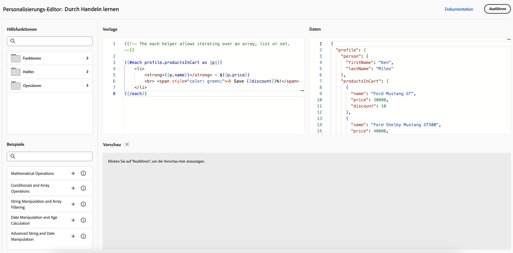

# Erste Schritte mit der Personalisierung{#add-personalization}

>[!BEGINSHADEBOX]

**Auf dieser Seite:** Erste Schritte mit der Personalisierung in Adobe Journey Optimizer, einschließlich der Funktionsweise des Personalisierungseditors, der Profildaten, die Sie verwenden können, des Lernspielplatzes und der Inline-Bearbeitung.

>[!ENDSHADEBOX]

>[!CONTEXTUALHELP]
>id="ajo_homepage_card5"
>title="Personalisieren von Erlebnissen"
>abstract="Passen Sie Ihre Nachrichten mit **Adobe Journey Optimizer** mithilfe der über die jeweiligen Empfängerinnen und Empfänger verfügbaren Daten und Informationen an sie an. Dabei kann es sich z. B. um den Vornamen, die Interessen, den Wohnort oder zuvor gekaufte Artikel der Empfängerin bzw. des Empfängers handeln."

Mit den Personalisierungs-Funktionen von [!DNL Adobe Journey Optimizer] können Sie Ihre Nachrichten an jede einzelne Empfängerin bzw. jeden einzelnen Empfänger anhand der vorhandenen Daten anpassen. Dabei kann es sich z. B. um den Vornamen, die Interessen, den Wohnort oder zuvor gekaufte Artikel der Empfängerin bzw. des Empfängers handeln.

## Funktionsweise der Personalisierung

Mit dem **Personalisierungseditor** können Sie alle Daten auswählen, anordnen, anpassen und validieren, um eine benutzerdefinierte Personalisierung für Ihren Content zu erstellen. Außerdem können Sie verschiedene Tools wie Hilfsfunktionen oder vordefinierte Ausdrücke nutzen, um Nachrichten effektiv anzupassen.

Journey Optimizer verwendet eine Inline-Personalisierungssyntax, die auf Handlebars basiert. Damit können Sie Ausdrücke mit Inhalten erstellen, die von doppelten geschweiften Klammern **`{{}}`** eingeschlossen sind.

Bei der Verarbeitung der Nachricht ersetzt Journey Optimizer den Ausdruck durch die im Experience Platform-Datensatz enthaltenen Daten. Beispielsweise wird `Hello {{profile.person.name.firstName}} {{profile.person.name.lastName}}` dynamisch zu `Hello John Doe`. Mit dieser Syntax können Sie Nachrichten über mehrere Felder hinweg personalisieren, einschließlich E-Mail-Betreffzeilen, Nachrichtentexten, Push-Benachrichtigungen oder URLs.

## Für die Personalisierung verwendete Daten

Die Personalisierung basiert auf den Profildaten, die von dem in Adobe Experience Platform definierten Schema **XDM-Profil für Einzelpersonen** verwaltet werden. Das Schema **XDM-Profil für Einzelpersonen** ist das einzige Schema, das Sie zum Personalisieren von Content in [!DNL Journey Optimizer] verwenden können. Weitere Informationen finden Sie in der [Dokumentation zum Adobe Experience Platform-Datenmodell (XDM)](https://experienceleague.adobe.com/docs/experience-platform/xdm/home.html?lang=de){target="_blank"}.

Sie können auch **berechnete Attribute** nutzen, um Ihren Content zu personalisieren. Berechnete Attribute ermöglichen es Ihnen, einzelne Verhaltensereignisse in berechnete Profilattribute zusammenzufassen, die in Adobe Experience Platform verfügbar sind. [Informationen zum Arbeiten mit berechneten Attributen](../audience/computed-attributes.md)

[!DNL Journey Optimizer] ermöglicht es Ihnen zudem, Daten aus Adobe Experience Platform im Personalisierungseditor zu nutzen, um Ihren Content zu personalisieren. Hierzu müssen Datensätze, die für die Personalisierung der Suche erforderlich sind, zunächst über einen API-Aufruf aktiviert werden. Anschließend können Sie die Daten verwenden, um Ihren Content in Journey Optimizer zu personalisieren. Diese Funktion ist derzeit in der Beta-Version verfügbar. [Weitere Informationen](../personalization/aep-data-perso.md)

## Personalisierung – Lernen und Experimentieren {#playground}

**[!DNL Adobe Journey Optimizer]** enthält ein interaktives Tool, mit dem Sie die Personalisierungsfunktionen kennenlernen und mit diesen experimentieren können.

Dieser Playground bietet eine simulierte Umgebung zum Schreiben und Testen von Personalisierungs-Code mithilfe von Beispieldaten, ohne dass Live-Datensätze erforderlich sind. Sie können vordefinierte Code-Beispiele nutzen, Platzhalterprofil-Payloads bearbeiten und eine Vorschau der Ausgabe des Personalisierungs-Codes in Echtzeit anzeigen.

➡️ [Zugriff auf den Personalisierungs-Playground](https://experienceleague.adobe.com/de/apps/journey-optimizer/ajo-personalization){target="_blank"}

## KI-Assistent für Personalisierungsausdrücke {#ai-personalization-expressions}

Im **[!UICONTROL Personalization-Editor]** oder in der E-Mail-Designer-Symbolleiste (**[!UICONTROL Ausdruck hinzufügen]**) können Sie mit **[!UICONTROL KI-]** neue Ausdrücke aus natürlicher Sprache generieren, erklären, was vorhandener Code tut, und Probleme in einer Auswahl beheben. Wenden Sie dann die Ausgabe an, wenn sie Ihrer Absicht entspricht.

➡️ [Erfahren Sie, wie Sie mit dem KI-Assistenten für Personalization-Ausdrücke arbeiten](../content-management/generative-personalization-expressions.md)

## Inline-Bearbeitung von Profilattributen {#inline-personalization}

Sie können Profilattributausdrücke direkt beim Bearbeiten von Inhalten im **E-Mail-Designer** oder im **Push-Kanal** einfügen, ohne den vollständigen Personalisierungseditor zu öffnen.

Gehen Sie dazu wie folgt vor:

1. Geben Sie `{{` in ein Textfeld ein. Ein Inline-Dropdown-Menü mit automatischer Vervollständigung wird an der Cursorposition geöffnet.
1. Tippen Sie, um verfügbare Profilattribute zu filtern.
1. Wählen Sie das gewünschte Attribut aus - es wird als Personalisierungs-Token an der Cursorposition eingefügt.

## Tauchen wir tiefer in die Materie ein

Jetzt, da Sie über Kenntnisse zur Personalisierung in **[!DNL Journey Optimizer]** verfügen, ist es an der Zeit, diese Dokumentationsabschnitte zu vertiefen und mit der Funktion zu arbeiten.

<table style="table-layout:fixed"><tr style="border: 0;">
<td>

<a href="personalization-build-expressions.md"><strong>Hinzufügen von Personalisierung</strong></a>

</td>
<td>

<a href="../personalization/personalization-syntax.md"><strong>Personalisierungssyntax</strong>

</td>
<td>

<a href="../personalization/functions/functions.md"><strong>Liste mit Hilfsfunktionen</strong></a>

</td>
<td>

<a href="../personalization/personalization-recipes.md"><strong>Personalization-Rezepte</strong></a>

</td>
<td>

<a href="../personalization/personalization-use-case.md"><strong>Anwendungsszenarien für die Personalisierung</strong></a>

</td>
</tr></table>

## Anleitungsvideos{#video-perso}

Erfahren Sie, wie Sie kontextuelle Ereignisinformationen von einer Journey verwenden können, um eine Nachricht zu personalisieren.

>[!VIDEO](https://video.tv.adobe.com/v/334165?quality=12)

Erfahren Sie, wie Sie einer Nachricht eine profilbasierte Personalisierung hinzufügen und die Zielgruppenzugehörigkeit als Vorbedingung für einen Personalisierungsbaustein verwenden.

>[!VIDEO](https://video.tv.adobe.com/v/334078?quality=12)

Erfahren Sie, wie Sie den Personalisierungseditor-Playground nutzen können, um Personalisierungs-Code mithilfe von Beispieldaten zu schreiben und zu testen.

>[!VIDEO](https://video.tv.adobe.com/v/3457868?quality=12)

Weitere Video-Tutorials zu Personalisierungsfunktionen und Best Practices finden Sie in den [Personalisierungs-Tutorials](https://experienceleague.adobe.com/de/docs/journey-optimizer-learn/tutorials/personalize-content/personalization-editor-overview){target="_blank"}

## Kurzübersicht {#quick-reference}

Dieser Abschnitt enthält strukturiertes Wissen zur Unterstützung von Interpretation, Abrufen und Antworten auf Fragen zu diesem Thema.

Zum vollständigen Verständnis sollten diese Informationen mit der Dokumentation auf dieser Seite kombiniert werden. Keine der beiden Quellen ist für Einzelpersonen gedacht. Die Seite beschreibt die Funktion, während dieser Abschnitt zusätzlichen Kontext bietet, der dabei hilft, Begriffe, Absichten, Anwendbarkeit und Begrenzungen zu unterscheiden.

>[!BEGINTABS]

>[!TAB Übersicht]

**TL;DR**

Auf dieser Seite wird die Personalisierung in Journey Optimizer vorgestellt - wie der Handlebars-basierte Personalisierungseditor funktioniert, welche Daten er verwendet, der interaktive Playground, der KI-Assistent für Ausdrücke und die Inline-Attributbearbeitung im E-Mail-Designer- und Push-Editor.

**Intents**

* Erfahren Sie, wie die Journey Optimizer-Personalisierung funktioniert (Handlebars-Syntax mit geschweiften Klammern)
* Identifizieren Sie die für die Personalisierung verfügbaren Datenquellen (XDM-Schema für individuelle Profile, berechnete Attribute, AEP-Datensatzsuche in der Beta-Phase).
* Experimentieren Sie mit der Personalisierung über den interaktiven Playground ohne Live-Sandbox
* Verwenden Sie den KI-Assistenten, um Personalisierungsausdrücke aus natürlicher Sprache zu generieren, zu erklären oder zu korrigieren
* Fügen Sie Profilattribute inline in den E-Mail-Designer- oder Push-Editor ein, indem Sie `{{` eingeben

>[!TAB Glossar]

* **Personalization-Editor**: Das vollständige Tool zum Erstellen, Anpassen und Validieren von Personalisierungsausdrücken, das in jedem Journey Optimizer-Feld verfügbar ist, das Personalisierung unterstützt. *(produktspezifisch)*
* **Schema „Individuelles XDM-Profil**: Das einzige Schema, das zum Personalisieren von Inhalten in Journey Optimizer verwendet werden kann. Definiert alle für die Personalisierung verfügbaren Profilattribute. *(produktspezifisch)*
* **Berechnete Attribute**: Vorberechnete Profilattribute, die einzelne Verhaltensereignisse in Werten auf Profilebene zusammenfassen. Diese Attribute stehen neben den standardmäßigen XDM-Profilfeldern als Personalisierungsdaten zur Verfügung. *(produktspezifisch)*
* **Personalization Playground**: Eine interaktive, simulierte Umgebung in Experience League zum Schreiben und Testen von Personalisierungscode mit Beispieldaten, für die keine Live-Datensätze oder Sandboxes erforderlich sind. *(produktspezifisch)*
* **Inline-Bearbeitung**: Die Möglichkeit, `{{` in ein beliebiges Textfeld im E-Mail-Designer- oder Push-Kanal-Editor einzugeben, um eine Dropdown-Liste zur automatischen Vervollständigung Trigger und Profilattribute einzufügen, ohne den vollständigen Personalisierungseditor zu öffnen. *(produktspezifisch)*
* **KI-Assistent (Personalisierungsausdrücke)**: Ein KI-Tool im Personalisierungseditor und in Email Designer, das Personalisierungsausdrücke aus natürlicher Sprache generiert, vorhandenen Code erklärt und Probleme in einer Auswahl behebt. *(produktspezifisch)*

>[!TAB Terminologie]

* **Kanonischer Name:** Personalisierung — Varianten: Inhaltspersonalisierung, Nachrichtenpersonalisierung, Ausdruckspersonalisierung
* **Kanonischer Name:** Personalisierungseditor — Varianten: Personalisierungsfunktionen
* **Nicht verwechseln:** Personalization-Editor (zum Erstellen von Inhaltsausdrücken in Nachrichten und Angeboten - unterstützt sowohl Handlebars als auch PQL) ≠ Erweiterter Ausdruckseditor (wird in der Journey für Bedingungen zu Datenquellen und Ereignisinformationen, benutzerdefinierte Warteaktivitäten und Aktionsparameterzuordnung verwendet) bietet integrierte Funktionen und Operatoren, die sich von denen im Personalisierungseditor unterscheiden)
* **Verwechseln Sie nicht:** Inline-Bearbeitung (geben Sie `{{` in Email Designer ein oder drücken Sie , um schnell Attribute einzufügen, ohne den vollständigen Editor zu öffnen) ≠ Personalisierungseditor (vollständiges Tool für komplexe Ausdrücke, Hilfsfunktionen, bedingte Regeln und Fragmente)
* **Nicht verwechseln:** Schema Individuelles XDM-Profil (das einzige für die Personalisierung in Journey Optimizer verwendbare Schema) ≠ andere AEP-Schemata (nicht für die Personalisierung verwendbar, es sei denn, es wird über die Datensatzsuche bereitgestellt)

>[!TAB Leitplanken und Einschränkungen]

* Das Schema Individuelles XDM-Profil ist das einzige, das zum Personalisieren von Inhalten in Journey Optimizer verwendet werden kann.
* Für die AEP-Datensatzsuche zur Personalisierung müssen Datensätze vor der Verwendung über einen API-Aufruf aktiviert werden. Diese Funktion befindet sich derzeit in der Beta-Phase.
* Die Inline-Bearbeitung (Eingabe von `{{` in Email Designer oder Push-Editor) unterstützt nur Profilattribute.

>[!TAB FAQs]

**F: Welche Daten können für die Personalisierung in Journey Optimizer verwendet werden?**

Profildaten aus dem XDM-Schema „Individuelles Profil“, berechnete Attribute (Verhaltensereignisse, die auf Profilebene zusammengefasst werden) und AEP-Datensatzsuche (derzeit Beta-Version - erfordert, dass Datensätze über die API aktiviert werden).

**F: Was ist der Playground für Personalisierung?**

Eine interaktive, simulierte Umgebung auf Experience League, in der Sie Personalisierungs-Code mithilfe von Beispieldaten schreiben und testen können, ohne dass eine Live-Journey Optimizer-Sandbox oder echte Datensätze erforderlich sind.

**F: Wie funktioniert die Inline-Attributbearbeitung?**

Geben Sie `{{` in ein beliebiges Textfeld im E-Mail-Designer- oder Push-Kanal-Editor ein, um ein Dropdown-Menü mit automatischer Vervollständigung an der Cursorposition zu öffnen. Tippen Sie zunächst, um Profilattribute zu filtern, und wählen Sie dann eines aus, um es als Personalisierungs-Token einzufügen. Nur Profilattribute sind inline verfügbar.

**F: Was kann der KI-Assistent im Personalisierungseditor tun?**

Es kann neue Personalisierungsausdrücke aus Beschreibungen in natürlicher Sprache generieren, erklären, was vorhandener Code tut, und Probleme in einem ausgewählten Ausdruck beheben - und dann die Ausgabe anwenden, wenn sie mit Ihrer Absicht übereinstimmt.

>[!ENDTABS]

<!-- ai-section-version: 1 | source-hash: 248b894f -->
