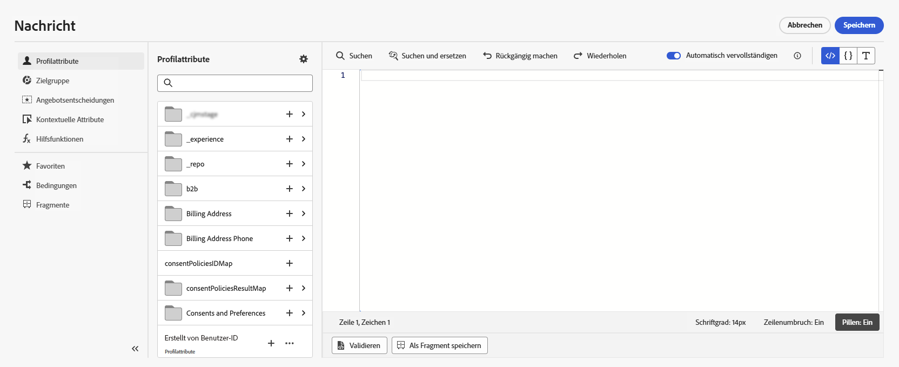

# Erste Schritte mit der Personalisierung {#add-personalization}

Entdecken Sie die Personalisierungsfunktionen von [!DNL Adobe Journey Optimizer], um Ihre Nachrichten an jeden einzelnen Empfänger anzupassen, indem Sie die vorhandenen Daten und Informationen zu ihm/ihr nutzen. Es kann sein/ihr Vorname sein, seine/ihre Interessen, wo er/sie lebt und mehr.

➡️ [Hier erfahren Sie, wie Sie eine Nachricht personalisieren.](#video-perso)

[!DNL Journey Optimizer] verwendet eine  **** inline einfache Personalisierungssyntax, die auf Handlebars basiert. Dadurch können Sie Ausdrücke mit Inhalten erstellen, die von doppelten geschweiften Klammern **{}}** eingeschlossen sind. Sie können ohne Einschränkungen mehrere Ausdrücke in demselben Inhalt oder Feld hinzufügen. Weitere Informationen finden Sie unter [Personalisierungssyntax](personalization-syntax.md).

Die Personalisierung basiert auf den Profildaten, die von dem in Adobe Experience Platform definierten Schema **Individuelles XDM-Profil** verwaltet werden. Weitere Informationen finden Sie in der [Dokumentation zum Adobe Experience Platform-Datenmodell (XDM)](https://experienceleague.adobe.com/docs/experience-platform/xdm/home.html?lang=de){target=&quot;_blank&quot;}.

>[!CAUTION]
>Das Schema **XDM Individual Profile** ist das einzige Schema, mit dem Sie Inhalte in [!DNL Journey Optimizer] personalisieren können.

**Beispiele:**

* `Hello {{profile.person.name.firstName}} {{profile.person.name.lastName}}`

* `Hello {{profile.person.name.fullName}}`

Bei der Verarbeitung der Nachricht (E-Mail und Push-Benachrichtigung) ersetzt Journey Optimizer den Ausdruck durch die in der Experience Cloud Platform-Datenbank enthaltenen Daten:  `Hello {{profile.person.name.firstName}} {{profile.person.name.lastName}}` wird zu &quot;Hello John Doe&quot;.

## Personalisierungskontexte{#personalization-areas}

Der Inhalt und die Anzeige von Nachrichten, die von [!DNL Journey Optimizer] gesendet werden, können auf verschiedene Weise personalisiert werden.

In allen Feldern mit dem Editor-Symbol können Sie den Personalisierungseditor (auch Ausdruckseditor genannt) öffnen und Personalisierung definieren.

### E-Mails personalisieren

Wenn Sie eine E-Mail erstellen, können Sie im Feld **E-Mail-Betreff** der Nachricht eine Personalisierung hinzufügen.

In Email Designer können Sie den Inhalt personalisieren:

* In der **Nachricht**: Klicken Sie in einen Textblock, klicken Sie auf das Symbol **Personalisieren** in der kontextbezogenen Symbolleiste und wählen Sie **Personalisierungfeld einfügen** aus. Weiterführende Informationen zur Benutzeroberfläche von Email Designer finden Sie in [diesem Abschnitt](../design-emails.md).

   

* Für einen **Link**: Wählen Sie Text oder ein Bild in einem Textblock aus und klicken Sie in der kontextbezogenen Symbolleiste auf das Symbol **Link einfügen**. Im Fenster können Sie einen Personalisierungsblock hinzufügen, indem Sie auf das Symbol **Personalisierung hinzufügen** klicken.

   

In beiden Fällen greifen Sie auf den Personalisierungs-Editor zu.

### Push-Benachrichtigungen personalisieren

Sie können **Push-Benachrichtigungen** auch in den folgenden Feldern personalisieren:

* **Titel**
* **Textkörper**
* **Benutzerdefinierter Benachrichtigungston**
* **Badges**
* **Benutzerspezifische Daten**

Weitere Informationen zur Konfiguration von Push-Benachrichtigungen finden Sie in [diesem Abschnitt](../push-gs.md).

## Verwenden des Ausdruckseditors

Der Ausdruckseditor ist das Herzstück der Personalisierung in [!DNL Journey Optimizer].

Er ist in jedem Kontext verfügbar, in dem Sie eine Personalisierung definieren müssen, wie z. B. E-Mails, Push-Benachrichtigungen und Angebote.

In der Benutzeroberfläche des Ausdruckseditors können Sie alle Daten auswählen, anordnen, anpassen und validieren, um eine benutzerdefinierte Personalisierung für Ihre Inhalte zu erstellen.

Im linken Bildschirmbereich wird ein Domain-Selektor angezeigt, mit dem Sie die Quelle für die Personalisierung auswählen können. Verfügbare Quellen sind:

* **Profil** : listet alle Verweise auf, die mit dem Profilschema verknüpft sind, das in der Dokumentation zum  [Adobe Experience Platform-Datenmodell (XDM) ](https://experienceleague.adobe.com/docs/experience-platform/xdm/home.html){target=&quot;_blank&quot;} beschrieben ist.
* **Segmentzugehörigkeit**: Listet alle im Adobe Experience Platform-Segmentierungs-Service erstellten Segmente auf. Weitere Informationen zur Segmentierung finden Sie [hier](https://experienceleague.adobe.com/docs/experience-platform/segmentation/home.html?lang=de){target=&quot;_blank&quot;}.
* **Angebote**: Listet alle Angebot auf, die mit einer bestimmten Platzierung verbunden sind. Wählen Sie die Platzierung aus und fügen Sie dann die Angebote in den Inhalt ein. Eine vollständige Dokumentation zum Verwalten von Angeboten finden Sie in [diesem Abschnitt](../deliver-personalized-offers.md).
* **Kontext**: Wenn die Aktivität **Nachrichten** in einer Journey verwendet wird, stehen in diesem Menü kontextbezogene Journey-Felder zur Verfügung. Weiterführende Informationen finden Sie in diesem [Abschnitt](personalization-use-case.md).
* **Helper-Funktionen**: listet alle Helper-Funktionen auf, die für die Durchführung von Datenoperationen wie Berechnungen, Datenformatierungen oder Konvertierungen, Bedingungen und die Bearbeitung von Daten im Kontext der Personalisierung verfügbar sind. Weiterführende Informationen finden Sie in diesem [Abschnitt](functions/functions.md).

Bei der Auswahl wird die Referenz im Editor hinzugefügt.

>[!NOTE]
>
>Das Infosymbol neben dem Symbol „+“ öffnet eine QuickInfo mit weiteren Details zu jeder Variablen.

Im folgenden Beispiel können Sie mit dem Ausdruckseditor die Profile auswählen, die heute Geburtstag haben, und dann die Anpassung vervollständigen, indem Sie ein spezifisches Angebot einfügen, das zu diesem Tag passt.

## Anleitungsvideos{#video-perso}

Erfahren Sie, wie Sie kontextbezogene Ereignisinformationen von einer Journey verwenden können, um eine Nachricht zu personalisieren.

>[!VIDEO](https://video.tv.adobe.com/v/334165?quality=12)

Erfahren Sie, wie Sie kontextbezogene Ereignisinformationen von einer Journey verwenden können, um eine Nachricht zu personalisieren.

>[!VIDEO](https://video.tv.adobe.com/v/334078?quality=12)
