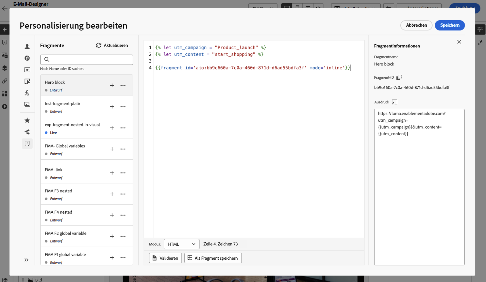
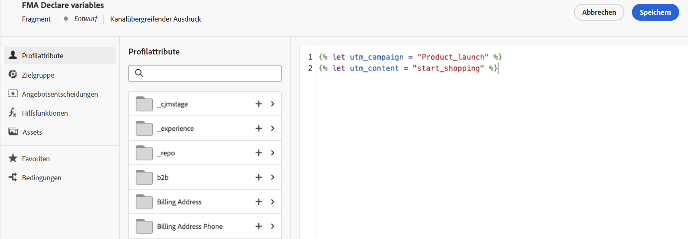
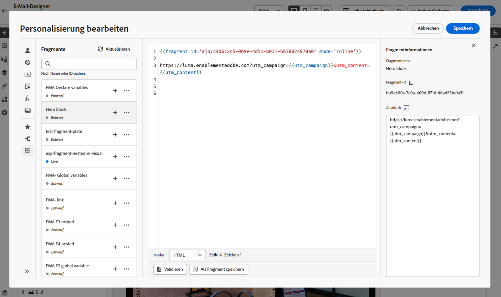
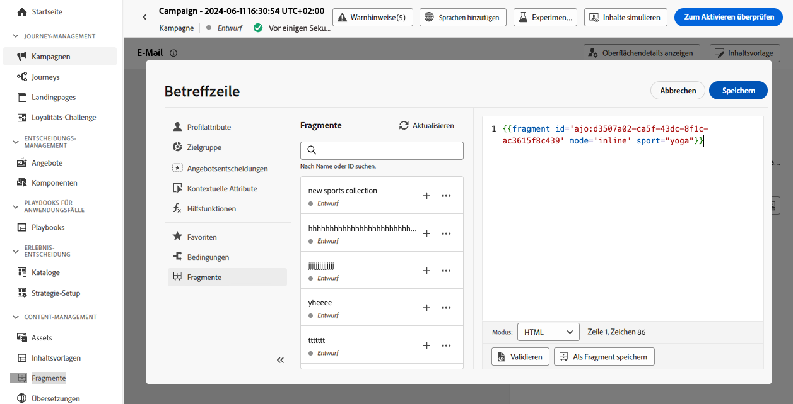

# Nutzen von Ausdrucksfragmenten {#use-expression-fragments}

Bei Verwendung des **Personalisierungseditors** können Sie alle Ausdrucksfragmente nutzen, die in der aktuellen Sandbox erstellt oder gespeichert wurden.

Ein Fragment ist eine wiederverwendbare Komponente, die in [!DNL Journey Optimizer]-Kampagnen und -Journeys referenziert werden kann. Mit dieser Funktion können Sie mehrere benutzerdefinierte Inhaltsbausteine vorab erstellen, mit denen Marketing-Fachleute Inhalte schnell in einem verbesserten Design-Prozess zusammenstellen können.  [Erfahren Sie mehr über Fragmente](../content-management/fragments.md)

➡️ [In diesem Video erfahren Sie, wie Sie Fragmente verwalten, erstellen und verwenden](../content-management/fragments.md#video-fragments)

## Verwenden eines Ausdrucksfragments {#use-expression-fragment}

Um Ausdrucksfragmente zu Ihren Inhalten hinzuzufügen, gehen Sie folgendermaßen vor.

>[!NOTE]
>
>Sie können für einen Versand bis zu 30 Fragmente hinzufügen. Fragmente können nur bis zu einer Ebene verschachtelt werden.

1. Öffnen Sie den [Personalisierungseditor](personalization-build-expressions.md) und wählen Sie die Schaltfläche **[!UICONTROL Fragmente]** im linken Bereich aus.

   In der Liste werden alle Ausdrucksfragmente angezeigt, die in der aktuellen Sandbox als Fragmente erstellt oder gespeichert wurden. [Informationen zum Erstellen von Fragmenten](../content-management/create-fragments.md)
Sie werden nach Erstellungsdatum sortiert, wobei die zuletzt hinzugefügten Ausdrucksfragmente in der Liste zuerst angezeigt werden.

   

   Sie können diese Liste auch aktualisieren.

   >[!NOTE]
   >
   >Wenn einige Fragmente während der Bearbeitung des Inhalts geändert oder hinzugefügt wurden, wird die Liste mit den neuesten Änderungen aktualisiert.

1. Klicken Sie auf das Symbol „+“ neben einem Ausdrucksfragment, um die entsprechende Fragment-ID in den Editor einzufügen.

   

   >[!CAUTION]
   >
   >Sie können jeden **Entwurf** und jedes **Live-Fragment** zu Ihrem Inhalt hinzufügen. Sie können Ihre Journey oder Kampagne jedoch nicht aktivieren, wenn darin ein Fragment mit dem Status **Entwurf** verwendet wird. Bei der Veröffentlichung einer Journey oder Kampagne wird bei Fragmententwürfen ein Fehler angezeigt. Sie müssen sie erst genehmigen, um sie veröffentlichen zu können.

1. Wenn die Fragment-ID einmal hinzugefügt worden ist, werden die Änderungen synchronisiert, sobald Sie das entsprechende Ausdrucksfragment öffnen und [bearbeiten](../content-management/manage-fragments.md#edit-fragments). Sie werden automatisch an alle Entwürfe oder Live-Journeys/Kampagnen übertragen, die diese Fragment-ID enthalten.

1. Klicken Sie auf die Schaltfläche **[!UICONTROL Mehr Aktionen]** neben einem Fragment. Wählen Sie aus dem sich öffnenden Kontextmenü die Option **[!UICONTROL Fragment anzeigen]** aus, um weitere Informationen zu diesem Fragment zu erhalten. Die **[!UICONTROL Fragment-ID]** wird ebenfalls angezeigt und kann von hier aus kopiert werden.

   

1. Sie können das Ausdrucksfragment in einem anderen Fenster öffnen, um seinen Inhalt und seine Eigenschaften zu bearbeiten – entweder im Kontextmenü mithilfe der Option **[!UICONTROL Fragment öffnen]** oder im Bereich **[!UICONTROL Fragmentinformationen]**. [Erfahren Sie, wie ein Fragment bearbeitet wird](../content-management/manage-fragments.md#edit-fragments)

   

1. Anschließend können Sie Ihre Inhalte wie gewohnt mit allen Personalisierungs- und Authoring-Funktionen des [Personalisierungseditors](personalization-build-expressions.md) anpassen und validieren.

1. In einigen Fällen müssen Sie nur Variablen berechnen. Daher können Sie den Inhalt des Ausdrucksfragments ausblenden. Verwenden Sie dazu das Attribut `render` und legen Sie es auf `false` fest. Beispiel:

   ```
   Hi {{profile.person.name.firstName|fragment id='ajo:fragmentId/variantId' mode ='inline' render=false}}
   ```

>[!NOTE]
>
>Wenn Sie ein Ausdrucksfragment erstellen, das mehrere Zeilenumbrüche enthält, und dieses in [SMS](../sms/create-sms.md#sms-content)- oder [Push](../push/design-push.md)-Inhalten verwenden, bleiben die Zeilenumbrüche erhalten. Testen Sie daher Ihre [SMS](../sms/send-sms.md)- oder [Push](../push/send-push.md)-Nachricht vor dem Versand.

## Verwenden implizierter Variablen {#implicit-variables}

Die impliziten Variablen verbessern die vorhandene Fragmentfunktion, um die Effizienz der Wiederverwendbarkeit und Skripterstellung von Inhalten zu verbessern. Fragmente können Eingabevariablen verwenden und Ausgabevariablen erstellen, die in Kampagnen- und Journey-Inhalten verwendet werden können.

Diese Funktion kann beispielsweise verwendet werden, um Tracking-Parameter Ihrer E-Mails basierend auf der aktuellen Kampagne oder Journey zu initialisieren und diese Parameter in den personalisierten Links zu verwenden, die zum E-Mail-Inhalt hinzugefügt werden.

Folgende Anwendungsfälle sind möglich:

1. **Verwenden Sie Eingabevariablen in einem Fragment.**

   Wenn ein Fragment im Inhalt einer Kampagnen-/Journey-Aktion verwendet wird, kann es Variablen nutzen, die außerhalb des Fragments deklariert wurden. Es folgt ein Beispiel:

   

   Oben sehen Sie, dass die Variable `utm_content` im Kampagneninhalt deklariert ist. Wenn das Fragment **Hero block** verwendet wird, wird ein Link angezeigt, an den der Parameterwert `utm_content` angehängt wird. Das Ergebnis lautet: `https://luma.enablementadobe.com?utm_campaign= Product_launch&utm_content= start_shopping`.

1. **Verwenden Sie Ausgabevariablen aus einem Fragment.**

   In einem Fragment berechnete oder definierte Variablen können in Ihren Inhalten verwendet werden. Im folgenden Beispiel deklariert ein Fragment **F1** einen Variablensatz:

   

   Ein E-Mail-Inhalt kann die folgende Personalisierung aufweisen:

   

   Das Fragment F1 initialisiert die folgenden Variablen: `utm_campaign`und `utm_content`. Dann werden dem Link im Nachrichteninhalt diese Parameter angehängt. Das Ergebnis lautet: `https://luma.enablementadobe.com?utm_campaign= Product_launch&utm_content= start_shopping`.

>[!NOTE]
>
>Zur Laufzeit erweitert das System, was sich in Fragmenten befindet, und interpretiert dann den Personalisierungs-Code von oben nach unten. Unter Berücksichtigung dieser Tatsache können komplexere Anwendungsfälle erreicht werden. Sie können beispielsweise ein Fragment F1 Variablen an ein anderes Fragment F2 übergeben lassen, das darunter sitzt. Sie können auch ein visuelles Fragment F1 Variablen an ein verschachteltes Ausdrucksfragment F2 übergeben lassen.

## Verwenden von Ausdrucksfragmenten in Schleifen {#fragments-in-loops}

Bei der Verwendung von Ausdrucksfragmenten in `{{#each}}`-Schleifen ist es wichtig zu verstehen, wie die Variablenauswahl funktioniert. Ausdrucksfragmente können auf globale Variablen zugreifen, die im Nachrichteninhalt definiert sind, sie können jedoch keine schleifenspezifischen Variablen als Parameter empfangen.

### Unterstützte Muster: Globale Variablen verwenden {#global-variables-in-loops}

Ausdrucksfragmente können auf globale Variablen verweisen, die außerhalb des Fragments definiert sind, selbst wenn das Fragment aus einer Schleife heraus aufgerufen wird. Dies ist der empfohlene Ansatz, wenn Sie Fragmente in iterativen Kontexten verwenden müssen.

**Beispiel: Verwenden eines Fragments mit globalen Variablen in einer Schleife**

Definieren Sie in Ihrem Nachrichteninhalt eine globale Variable und verwenden Sie ein Fragment, das darauf verweist:

```handlebars


{{#each context.journey.actions.GetProducts.items as |product|}}
  <div class="product">
    <h3>{{product.name}}</h3>
    <p>Price: ${{product.price}}</p>
    {{fragment id='ajo:fragment123/variant456' mode='inline'}}
  </div>
{{/each}}
```

Im Ausdrucksfragment (fragment123) können Sie auf die `globalDiscount` Variable verweisen:

```handlebars
<p class="discount-info">Save {{globalDiscount}}% on all items!</p>
```

Dieses Muster funktioniert, weil die globale Variable in der gesamten Nachricht verfügbar ist, auch in Fragmenten, unabhängig vom Schleifenkontext.

### Nicht unterstützt: Übergeben von Schleifenvariablen als Fragmentparameter {#loop-variables-limitations}

Sie können das aktuelle Iterationselement (z. B. `product` im obigen Beispiel) nicht als Parameter an ein Ausdrucksfragment übergeben. Das Fragment kann nicht direkt auf Variablen im Schleifenbereich vom umgebenden `{{#each}}`-Block zugreifen.

**Beispiel: Was funktioniert NICHT**

```handlebars
{{#each context.journey.actions.GetProducts.items as |product|}}
  <!-- This will NOT work as expected -->
  {{fragment id='ajo:fragment123/variant456' mode='inline' currentProduct=product}}
{{/each}}
```

Das Fragment kann keine `product` als Parameter empfangen und intern verwenden, da die Parameterübergabe für schleifenspezifische Variablen in der aktuellen Implementierung nicht unterstützt wird.

### Empfohlene Problemumgehungen {#fragments-in-loops-workarounds}

Wenn Sie Ausdrucksfragmente mit Daten aus einer Schleife verwenden müssen, sollten Sie die folgenden Ansätze berücksichtigen:

1. **Logik direkt in die Nachricht einfügen**: Anstatt ein Fragment für eine schleifenspezifische Logik zu verwenden, fügen Sie den Personalisierungscode direkt in Ihrem `{{#each}}` hinzu.

   ```handlebars
   {{#each context.journey.actions.GetProducts.items as |product|}}
     <div class="product">
       <h3>{{product.name}}</h3>
       <p>Price: ${{product.price}}</p>
       {{#if product.price > 100}}
         <span class="premium-badge">Premium Product</span>
       {{/if}}
     </div>
   {{/each}}
   ```

2. **Fragmente außerhalb von Schleifen verwenden**: Wenn der Fragmentinhalt nicht schleifenabhängig ist, rufen Sie das Fragment vor oder nach dem Iterationsblock auf.

   ```handlebars
   {{fragment id='ajo:fragment123/variant456' mode='inline'}}
   
   {{#each context.journey.actions.GetProducts.items as |product|}}
     <div class="product">
       <h3>{{product.name}}</h3>
       <p>Price: ${{product.price}}</p>
     </div>
   {{/each}}
   ```

3. **Mehrere globale Variablen festlegen**: Wenn Sie iterationsweise verschiedene Werte an ein Fragment übergeben müssen, legen Sie vor jedem Fragmentaufruf globale Variablen fest (obwohl dies die Flexibilität einschränkt).

>[!NOTE]
>
>Informationen zum Iterieren über kontextuelle Daten und zum Arbeiten mit Schleifen finden Sie im umfassenden Handbuch zum [Iterieren über kontextuelle Daten](iterate-contextual-data.md) mit Best Practices, Tipps zur Fehlerbehebung und erweiterten Mustern.

## Anpassen bearbeitbarer Felder {#customize-fields}

Wenn bestimmte Teile eines Ausdrucksfragments mithilfe von Variablen bearbeitbar gemacht wurden, können Sie deren Standardwerte mithilfe einer speziellen Syntax überschreiben. [Informationen dazu, wie Sie Ihre Fragmente anpassbar machen können](../content-management/customizable-fragments.md)

Gehen Sie wie folgt vor, um die Felder anzupassen:

1. Fügen Sie das Fragment über das Menü **[!UICONTROL Fragmente]** in ihren Code ein.

1. Verwenden Sie den Code `<fieldId>="<value>"` am Ende der Syntax, um den Standardwert der Variablen zu überschreiben.

   Im folgenden Beispiel wird der Wert einer Variablen, deren ID „sports“ lautet, mit dem Wert „Yoga“ überschrieben. Dadurch wird „Yoga“ überall dort in Ihrem Fragmentinhalt angezeigt, wo auf die Variable „sport“ verwiesen wird.

   

Ein Beispiel für das Hinzufügen von bearbeitbaren Feldern zu einem Ausdrucksfragment und zum Überschreiben ihrer Werte beim Erstellen einer E-Mail finden Sie in [diesem Abschnitt](../content-management/customizable-fragments.md#example).

## Unterbrechen der Vererbung {#break-inheritance}

Beim Hinzufügen einer Fragment-ID zum Personalisierungseditor werden die Änderungen am ursprünglichen Ausdrucksfragment synchronisiert.

Sie können jedoch auch den Inhalt eines Ausdrucksfragments in den Editor einfügen. Wählen Sie im Kontextmenü die Option **[!UICONTROL Fragment einfügen]** aus, um diesen Inhalt einzufügen.


In diesem Fall ist die Vererbung aus dem ursprünglichen Fragment fehlerhaft. Der Inhalt des Fragments wird in den Editor kopiert und die Änderungen werden nicht mehr synchronisiert.

Es wird zu einem eigenständigen Element, das nicht mehr mit dem ursprünglichen Fragment verknüpft ist. Sie können es wie jedes andere Element in Ihrem Code bearbeiten.

