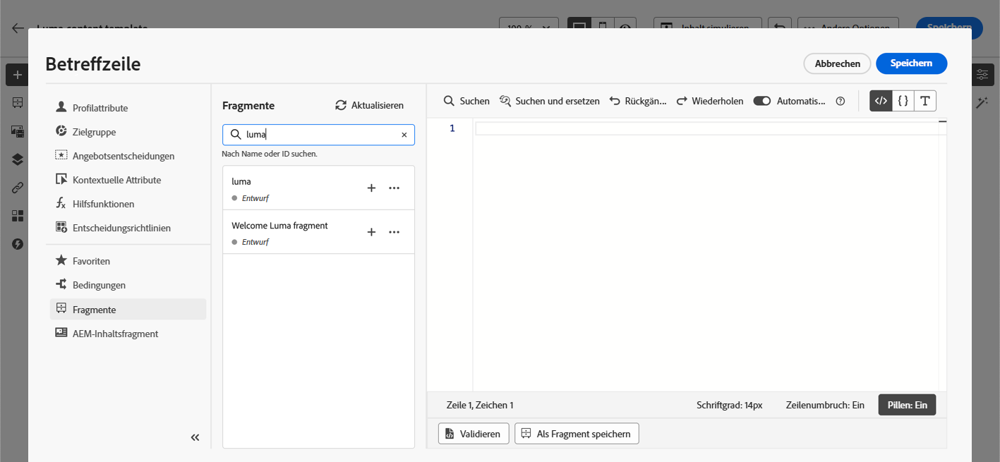
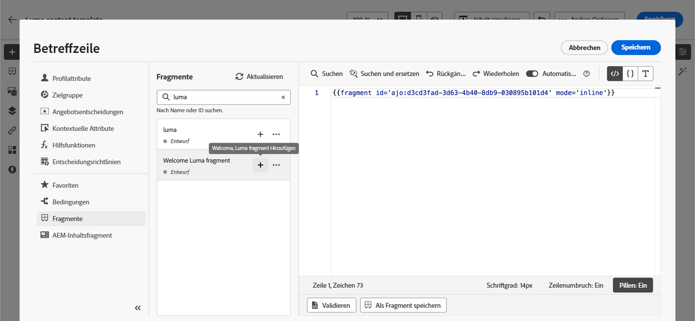
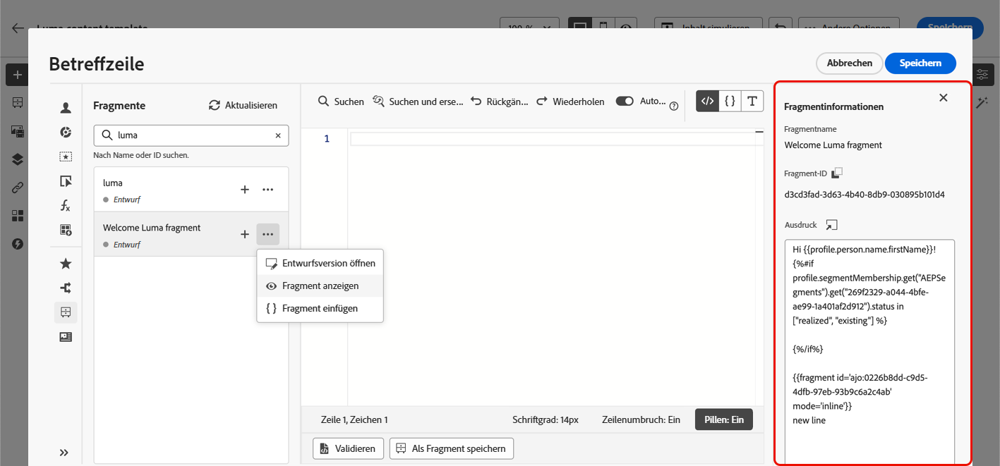
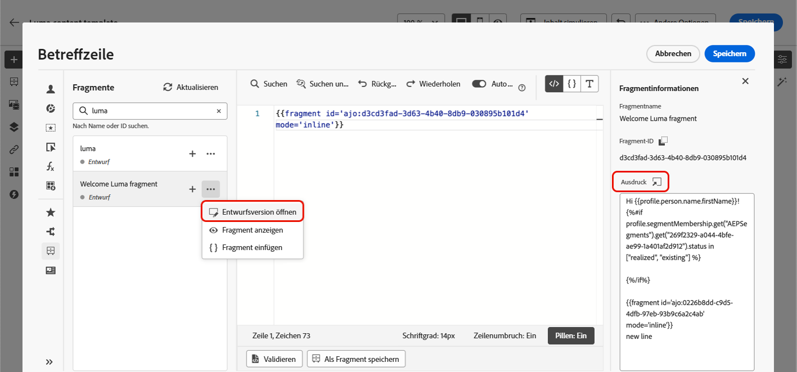
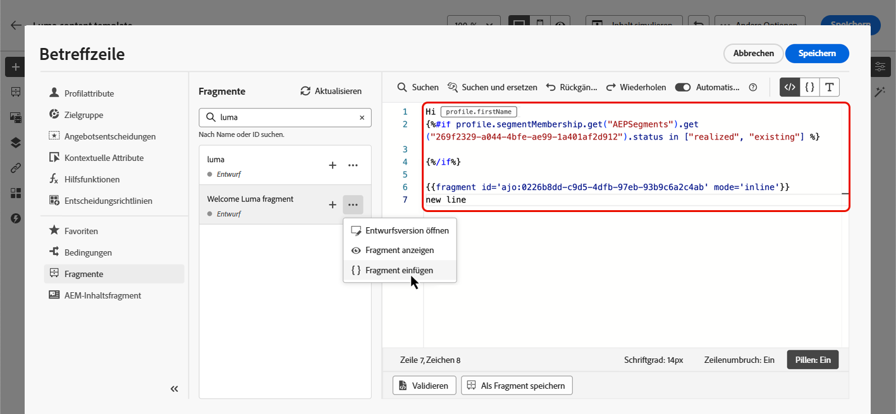

# Nutzen von Ausdrucksfragmenten {#use-expression-fragments}

Bei Verwendung des Ausdruckseditors können Sie alle Ausdrucksfragmente nutzen, die in der aktuellen Sandbox erstellt oder gespeichert wurden.

In [diesem Abschnitt](../content-management/fragments.md) erfahren Sie, wie Sie Fragmente erstellen und verwalten.

➡️ [In diesem Video erfahren Sie, wie Sie Fragmente verwalten, erstellen und verwenden.](../content-management/fragments.md#video-fragments)

## Verwenden eines Ausdrucksfragments {#use-expression-fragment}

Um Ausdrucksfragmente zu Ihren Inhalten hinzuzufügen, gehen Sie folgendermaßen vor.

1. Öffnen Sie den [Ausdruckseditor](personalization-build-expressions.md) und wählen Sie die Schaltfläche **[!UICONTROL Fragmente]** im linken Bereich aus.

   

   In der Liste werden alle Ausdrucksfragmente angezeigt, die in der aktuellen Sandbox als Fragmente erstellt oder gespeichert wurden. [Weitere Informationen](../content-management/fragments.md#create-expression-fragment)

   >[!NOTE]
   >
   >Fragmente werden nach Erstellungsdatum sortiert, wobei die zuletzt hinzugefügten Ausdrucksfragmente in der Liste zuerst angezeigt werden.

1. Sie können die Liste auch aktualisieren.

   >[!NOTE]
   >
   >Wenn einige Fragmente während der Bearbeitung des Inhalts geändert oder hinzugefügt wurden, wird die Liste mit den neuesten Änderungen aktualisiert.

1. Klicken Sie auf das Symbol „+“ neben einem Ausdrucksfragment, um die entsprechende Fragment-ID in den Editor einzufügen.

   

   Wenn die Fragment-ID hinzugefügt worden ist, werden die Änderungen synchronisiert, sobald Sie das entsprechende Ausdrucksfragment öffnen und [bearbeiten](../content-management/fragments.md#edit-fragments). Sie werden automatisch an alle **[!UICONTROL Entwürfe]** von Journeys/Kampagnen übertragen, die diese Fragment-ID enthalten.

   >[!NOTE]
   >
   >Die Änderungen werden nicht auf die in **[!UICONTROL Live]**-Journeys oder -Kampagnen verwendeten E-Mails übertragen.

1. Klicken Sie auf die Schaltfläche **[!UICONTROL Mehr Aktionen]** neben einem Fragment.

1. Wählen Sie aus dem sich öffnenden Kontextmenü die Option **[!UICONTROL Fragment anzeigen]** aus, um weitere Informationen zu diesem Fragment zu erhalten. Die **[!UICONTROL Fragment-ID]** wird ebenfalls angezeigt und kann von hier aus kopiert werden.

   

1. Sie können das Ausdrucksfragment in einem anderen Fenster öffnen, um seinen Inhalt und seine Eigenschaften zu bearbeiten – entweder im Kontextmenü mithilfe der Option **[!UICONTROL Fragment öffnen]** oder im Bereich **[!UICONTROL Fragmentinformationen]**. [Erfahren Sie, wie ein Fragment bearbeitet wird](../content-management/fragments.md#edit-fragments)

   

1. Anschließend können Sie Ihre Inhalte wie gewohnt mit allen Personalisierungs- und Authoring-Funktionen des [Ausdruckseditors](personalization-build-expressions.md) anpassen und validieren.

>[!NOTE]
>
>Wenn Sie ein Ausdrucksfragment erstellen, das mehrere Zeilenumbrüche enthält, und dieses in [SMS](../sms/create-sms.md#sms-content)- oder [Push](../push/design-push.md)-Inhalten verwenden, bleiben die Zeilenumbrüche erhalten. Testen Sie daher Ihre [SMS](../sms/send-sms.md)- oder [Push](../push/send-push.md)-Nachricht vor dem Versand.

## Unterbrechen der Vererbung {#break-inheritance}

Beim Hinzufügen einer Fragment-ID zum Ausdruckseditor werden die Änderungen am ursprünglichen Ausdrucksfragment synchronisiert.

Sie können jedoch auch den Inhalt eines Ausdrucksfragments in den Editor einfügen. Wählen Sie im Kontextmenü die Option **[!UICONTROL Fragment einfügen]** aus, um diesen Inhalt einzufügen.

In diesem Fall ist die Vererbung aus dem ursprünglichen Fragment fehlerhaft. Der Inhalt des Fragments wird in den Editor kopiert und die Änderungen werden nicht mehr synchronisiert.

Es wird zu einem eigenständigen Element, das nicht mehr mit dem ursprünglichen Fragment verknüpft ist. Sie können es wie jedes andere Element in Ihrem Code bearbeiten.

