# Vorschau und Testen Ihrer Nachrichten{#preview-and-proof}

Sobald der Inhalt der Nachricht definiert wurde, können Sie mithilfe von Test-Profilen die Vorschau und den Test durchführen. Wenn Sie [personalisierten Profil](personalization/personalize.md) eingefügt haben, können Sie überprüfen, wie dieser Inhalt in der Meldung angezeigt wird, und dabei Testdaten nutzen.

Um mögliche Fehler in E-Mail-Inhalten oder Personalisierungseinstellungen zu erkennen, senden Sie Testversand zum Testen von Profilen. Bei jeder Änderung sollte ein Testversand gesendet werden, um den neuesten Inhalt zu validieren.

>[!CAUTION]
>
>Sie müssen über Testing-Profil verfügen, um Ihre Nachrichten Vorschau und Testversand zu senden. [Mehr dazu](building-journeys/testing-the-journey.md#create-test-profile).

Zum Testen des Nachrichteninhalts müssen Sie:

* [Test-Profil auswählen](#select-test-profiles)
* [die Vorschau der Nachricht überprüfen](#preview-your-messages)

Anschließend können Sie [Testversand](#send-proofs) zu Ihren Test-Profilen senden.

Nutzen Sie außerdem Ihr **Litmus**-Konto in [!DNL Journey Optimizer], um Ihre **E-Mail-Wiedergabe** in populären E-Mail-Clients sofort Vorschau. Sie können dann sicherstellen, dass Ihre E-Mail-Inhalte gut aussehen und in jedem Posteingang korrekt funktionieren. Erfahren Sie, wie Sie in [diesem Abschnitt ](#email-rendering) die Sperre für Litmus-E-Mail-Vorschauen aufheben

## TestProfil{#select-test-profiles} auswählen

Testprofile ermöglichen es, zusätzliche Empfänger anzusprechen, die nicht den definierten Zielgruppenkriterien entsprechen.

Gehen Sie wie folgt vor, um die Profil auszuwählen:

1. Klicken Sie in der Nachrichtenschnittstelle oder im E-Mail-Designer auf die Schaltfläche **[!UICONTROL Vorschau]**, um auf die Auswahl des Profils &quot;Test&quot;zuzugreifen.

   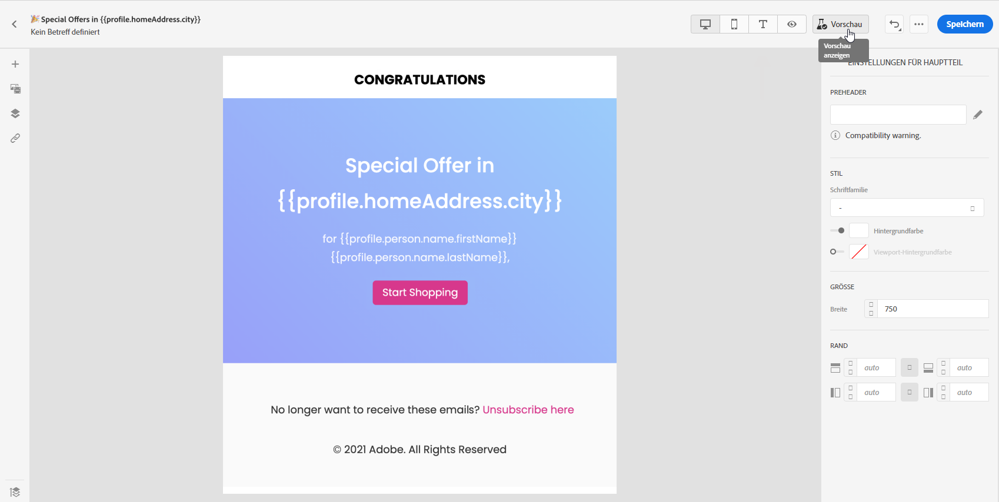

1. Wählen Sie den Namensraum aus, der zum Identifizieren der Profil verwendet werden soll, indem Sie auf das Auswahlsymbol **[!UICONTROL Identity Namensraum]** klicken.

   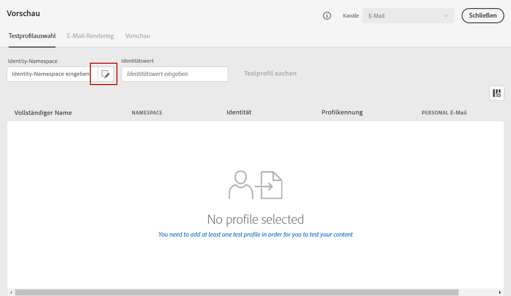

   Weitere Informationen zu Adobe Experience Platform-Identitätskennzeichen [finden Sie in diesem Abschnitt](https://experienceleague.adobe.com/docs/experience-platform/identity/namespaces.html?lang=en#getting-started).

   Im folgenden Beispiel verwenden wir den Namensraum **Email**.

1. Verwenden Sie das Suchfeld, um den Namensraum zu suchen, wählen Sie ihn aus und klicken Sie auf **[!UICONTROL Select]**

   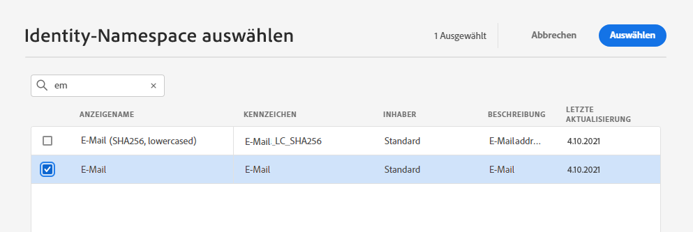

1. Geben Sie den Wert ein, um das Profil zu identifizieren, und klicken Sie auf **[!UICONTROL Profil suchen]**.

   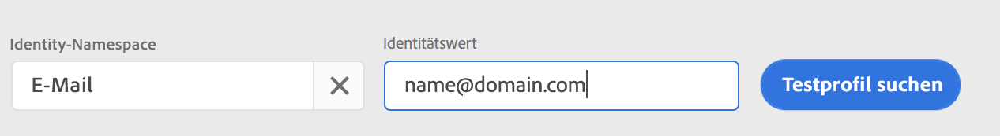

1. Wenn Sie Ihrer Nachricht eine Personalisierung hinzugefügt haben, fügen Sie weitere Profil hinzu, damit Sie je nach Profil verschiedene Varianten der Nachricht testen können. Nach dem Hinzufügen werden die Profil unter den Auswahlfeldern aufgelistet.

   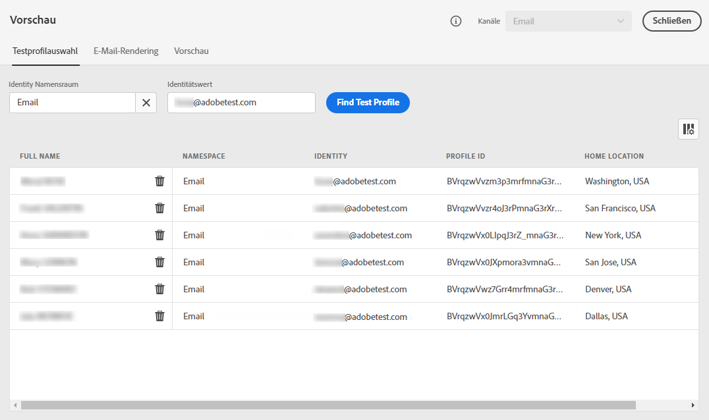

   Basierend auf den Elementen der Nachrichtenpersonalisierung zeigt diese Liste Daten zu den einzelnen Testspalten in den zugehörigen Profilen an.

## Vorschauen{#preview-your-messages}

Nach Auswahl von [Profilen](#select-test-profiles) können Sie Ihre Nachrichten Vorschau und den Inhalt überprüfen.

1. Klicken Sie auf die Registerkarte **[!UICONTROL Vorschau]**, um Ihre Nachricht zu testen.

1. Wählen Sie ein Profil aus. Sie können die in den Spalten verfügbaren Werte überprüfen. Verwenden Sie die Rechts-/Linkspfeile, um Daten zu durchsuchen.

   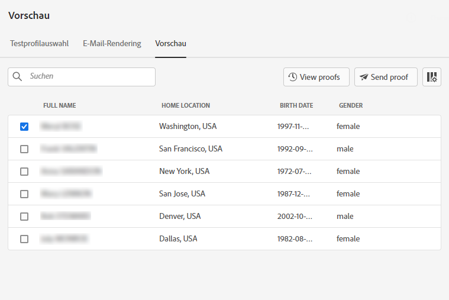

1. Klicken Sie auf das Symbol **[!UICONTROL Daten auswählen]** über der Liste, um Spalten hinzuzufügen oder zu entfernen.

   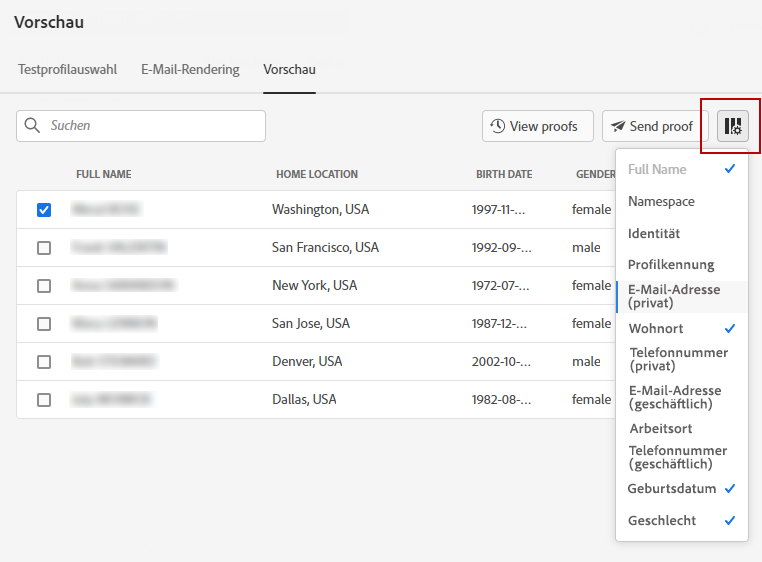

   Am Ende der Liste können Sie Personalisierungsfelder sehen, die für die aktuelle Nachricht spezifisch sind. In diesem Beispiel der Ort des Profils, Vorname und Nachname. Wählen Sie diese Felder aus und stellen Sie sicher, dass diese Werte in Ihren Test-Profilen ausgefüllt sind.

1. In der Vorschau der Nachricht werden personalisierte Elemente durch die ausgewählten Profil-Daten ersetzt.

   Für diese Nachricht werden beispielsweise sowohl E-Mail-Inhalt als auch E-Mail-Betreff personalisiert:

   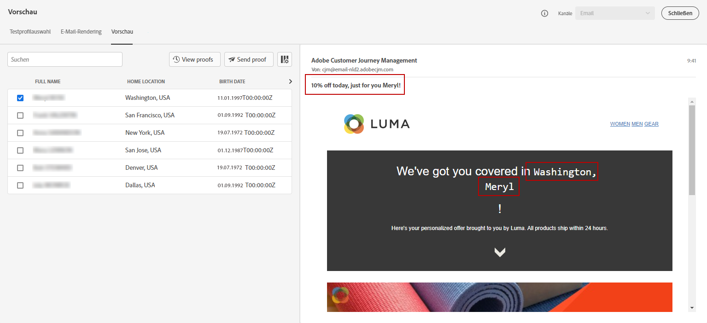

1. Wählen Sie für jede Variante Ihrer Nachricht weitere Profil zum Rendern von Vorschauen-E-Mails aus.

Für eine Vorschau mit Push-Benachrichtigungen:

1. Wechseln Sie zum Kanal **[!UICONTROL Push]** aus der Dropdown-Liste **[!UICONTROL Kanal]** oben links im Bildschirm **[!UICONTROL Vorschau]**.

   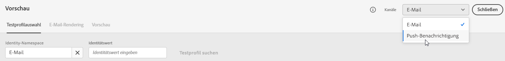

1. Wenden Sie dieselben Schritte wie oben beschrieben an, um ein Profil auszuwählen und den Gerätetyp zur Vorschau von Inhalten auszuwählen: **[!UICONTROL iOS]** oder **[!UICONTROL Android]**

   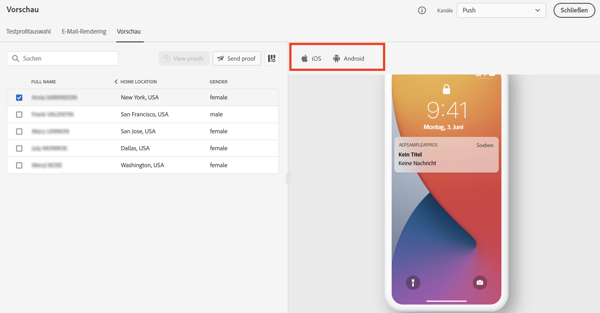

1. In der Push-Vorschau werden die Daten zum Testen von Profilen im Nachrichteninhalt genutzt.

   Für diese Push-Benachrichtigung werden beispielsweise Titel und Textkörper personalisiert:

   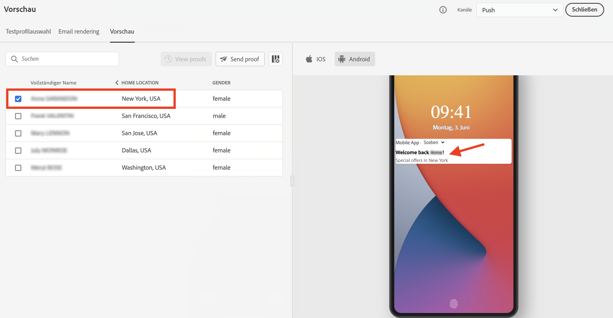

## Führen Sie einen Testversand durch{#send-proofs}

Ein Testversand ist eine bestimmte Meldung, mit der Sie eine Nachricht testen können, bevor Sie sie an die Hauptnachricht senden. Empfänger des Testversands sind für die Genehmigung der Nachricht zuständig: Rendering, Inhalt, Personalisierungseinstellungen, Konfiguration.

Sobald [Profil](#select-test-profiles) ausgewählt sind, können Sie Testversand senden.

1. Klicken Sie im Bildschirm **[!UICONTROL Vorschau]** auf die Schaltfläche **[!UICONTROL Testversand senden]**.

   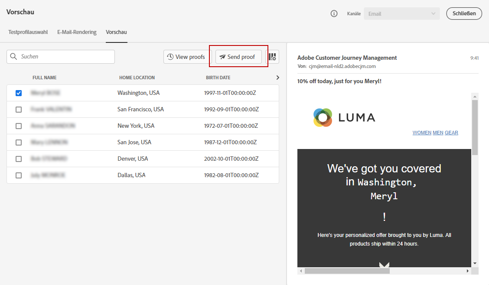

1. Wählen Sie die Profil aus, die den Testversand erhalten sollen, und klicken Sie auf **[!UICONTROL Testversand senden]**. Sie können der Betreffzeile des Testversands bei Bedarf ein Präfix hinzufügen.

   

1. Klicken Sie im Bildschirm **[!UICONTROL Vorschau]** auf die Schaltfläche **[!UICONTROL Ansicht Testversands]**, um den Status zu prüfen.

   

Sie müssen Testversand nach jeder Änderung am Inhalt der Nachricht senden.

## Email rendering{#email-rendering}

Sie können Ihr **Litmus**-Konto in [!DNL Journey Optimizer] nutzen, um Ihre **E-Mail-Wiedergabe** in beliebten E-Mail-Clients sofort Vorschau.

Für den Zugriff auf die Renderingfunktionen für E-Mails müssen Sie:

* Ein Litmus-Konto haben
* [TestProfile auswählen](#select-test-profiles)

Gehen Sie dann wie folgt vor:

1. Klicken Sie im E-Mail-Designer auf die Schaltfläche **[!UICONTROL Vorschau]** und wählen Sie die Registerkarte **[!UICONTROL E-Mail-Rendering]**.

1. Klicken Sie auf **Verbinden Sie Ihr Litmus-Konto** im oberen rechten Abschnitt.

   

1. Geben Sie Ihre Anmeldedaten ein und melden Sie sich an.

   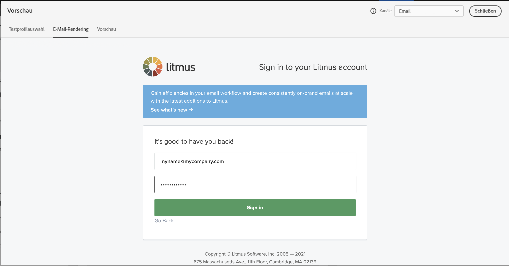

1. Klicken Sie auf die Schaltfläche **Test ausführen**, um E-Mail-Vorschauen zu generieren.

1. Prüfen Sie Ihre E-Mail-Inhalte auf gängigen Desktop-, mobilen und webbasierten Clients.

   

>[!CAUTION]
>
>Beim Verbinden Ihres **Litmus**-Kontos mit [!DNL Journey Optimizer] stimmen Sie zu, dass Testmeldungen an Litmus gesendet werden: Nach dem Versand werden diese E-Mails nicht mehr von der Adobe verwaltet. Infolgedessen gelten für diese E-Mails die Litmus-Richtlinien zur Datenspeicherung, einschließlich der Personalisierungsdaten, die in diese Testmeldungen aufgenommen werden können.

