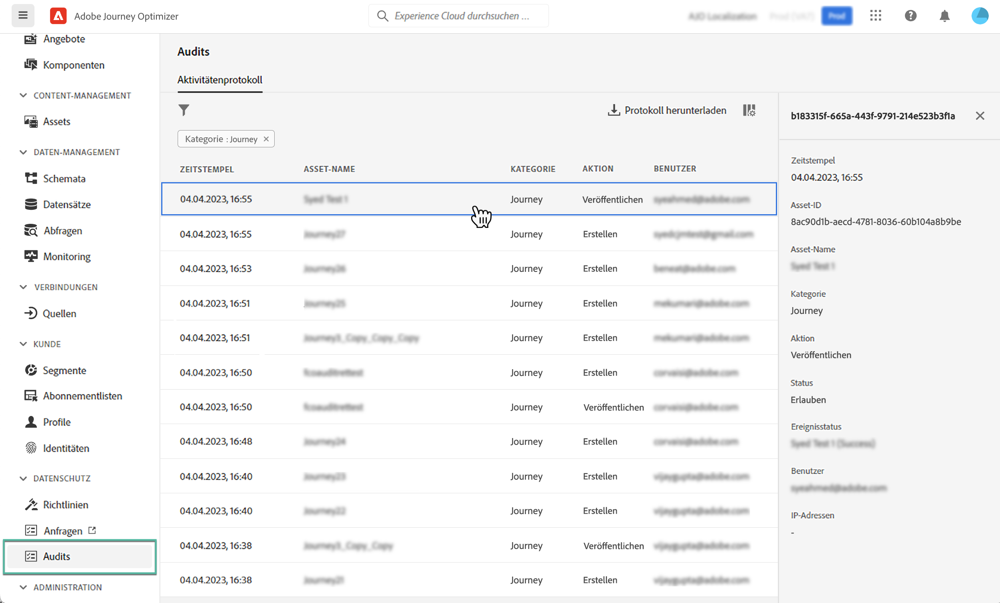

# Audit-Aktionen für Journey Optimizer-Ressourcen {#track-changes}

## Über Audit-Protokolle {#audit-logs}

>[!IMPORTANT]
>
>Zum Anzeigen und Exportieren des Auditprotokolls benötigen Sie die Genehmigung **[!DNL View User Activity Log]**. [Weitere Informationen](../administration/ootb-product-profiles.md)

Mit Journey Optimizer können Sie die von den Nutzern im System durchgeführten Aktionen für verschiedene Services und Funktionen wie Journeys, Nachrichten, Landingpages usw. ermitteln.

So können Sie die Sichtbarkeit der im System durchgeführten Aktivitäten erhöhen, Probleme beheben und Ihr Unternehmen bei der Einhaltung von Vorschriften und Unternehmensrichtlinien zur Datenverwaltung unterstützen.

Jede Aktion wird mit Metadaten in „Audit-Protokollen“ aufgezeichnet, die in Adobe Experience Platform zugänglich sind. Weiterführende Informationen zu Audit-Protokollen, einschließlich ihrer Anzeige und Verwaltung in der Benutzeroberfläche oder API, finden Sie in der [Dokumentation zu Adobe Experience Platform](https://experienceleague.adobe.com/docs/experience-platform/landing/governance-privacy-security/audit-logs/overview.html?lang=de).

## Von Audit-Protokollen erfasste Ereignistypen {#events}

In der folgenden Tabelle sind die Aktionen aufgeführt, für die Journey Optimizer-Ressourcen in Audit-Protokollen aufgezeichnet werden.

>[!NOTE]
>
>Die vollständige Liste der in den Audit-Protokollen erfassten Aktionen finden Sie in der [Dokumentation zu Adobe Experience Platform](https://experienceleague.adobe.com/docs/experience-platform/landing/governance-privacy-security/audit-logs/overview.html?lang=de#category).

| Ressource | Aktion |
|-----------|------------------|
| AJO-Kampagne | Erstellen/Löschen/Aktualisieren/Aktivieren/Stoppen |
| Allgemeine Einstellungen für den AJO-Kanal | Erstellen/Löschen/Aktualisieren |
| AJO-IP-Pool | Erstellen/Löschen/Aktualisieren |
| AJO-Landingpage | Erstellen/Löschen/Aktualisieren/Veröffentlichen/Veröffentlichung aufheben |
| AJO-Landingpage-HTML-Vorlage | Erstellen/Löschen/Aktualisieren |
| AJO-Landingpage-Voreinstellung | Erstellen/Löschen/Aktualisieren |
| AJO-Landingpage-Subdomain | Erstellen/Löschen/Aktualisieren |
| AJO-Nachricht | Erstellen/Löschen/Aktualisieren/Veröffentlichen |
| AJO-Nachrichtenvoreinstellung | Erstellen/Löschen/Aktualisieren |
| AJO-PTR-Eintrag | Erstellen/Löschen/Aktualisieren |
| AJO-Vorlage für gespeicherte Ausdrücke | Erstellen/Löschen/Aktualisieren |
| Anmeldedaten der AJO-SMS-API | Erstellen/Löschen/Aktualisieren |
| AJO-Subdomain | Erstellen/Löschen/Aktualisieren |
| AJO-Unterdrückungsliste | Erstellen/Löschen/Herunterladen der CSV |
| Feldergruppe | Erstellen/Löschen/Aktualisieren |
| Journey | Erstellen/Löschen/Aktualisieren/Stoppen/Veröffentlichen |
| Benutzerdefinierte Aktion in Journey | Erstellen/Löschen/Aktualisieren |
| Journey-Datenquelle | Erstellen/Löschen/Aktualisieren |
| Journey-Ereignis | Erstellen/Löschen/Aktualisieren |
| Häufigkeitsregeln für Nachrichten | Erstellen/Löschen/Aktualisieren |
| Rangfolgestrategie | Erstellen/Löschen/Aktualisieren |
