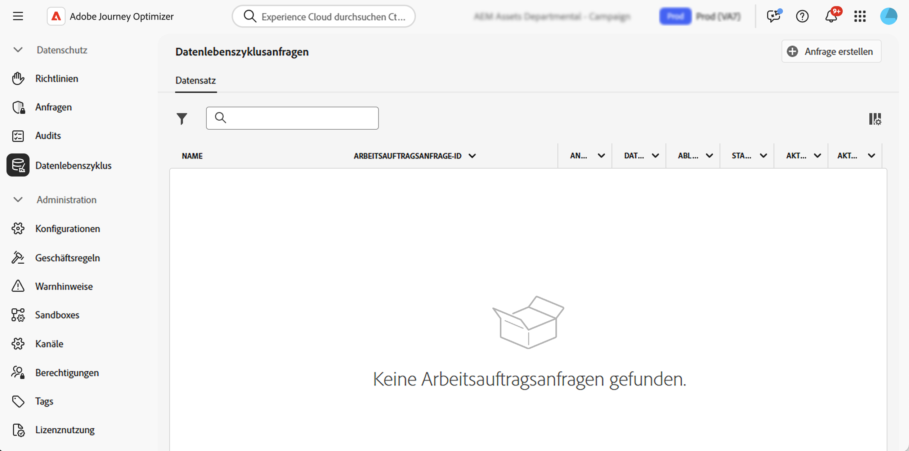

# Durchführen von Datenhygienevorgängen {#data-hygiene}

>[!AVAILABILITY]
>
>Datenhygiene-Funktionen sind derzeit nur für Organisationen verfügbar, die die Zusatzangebote **Healthcare Shield** und **Privacy and Security Shield** erworben haben.

Da Daten kontinuierlich in Adobe Experience Platform aufgenommen werden, ist es wichtig sicherzustellen, dass Ihre Daten wie vorgesehen verwendet, bei Bedarf aktualisiert und gemäß den Richtlinien der Organisation gelöscht werden.

Diese Aufgaben können mit dem Menü **[!UICONTROL Datenhygiene]** durchgeführt werden, das die Konfiguration und Planung von Datenhygiene ermöglicht und sicherstellt, dass Ihre Datensätze ordnungsgemäß gepflegt werden.

Weitere Informationen zum Privacy Service und zum Erstellen und Verwalten von Datenschutzanfragen finden Sie in der Dokumentation zu Adobe Experience Platform:

* [Übersicht über den Privacy Service](https://experienceleague.adobe.com/docs/experience-platform/privacy/home.html?lang=de)
* [Datenhygiene in Adobe Experience Platform](https://experienceleague.adobe.com/docs/experience-platform/hygiene/home.html)
