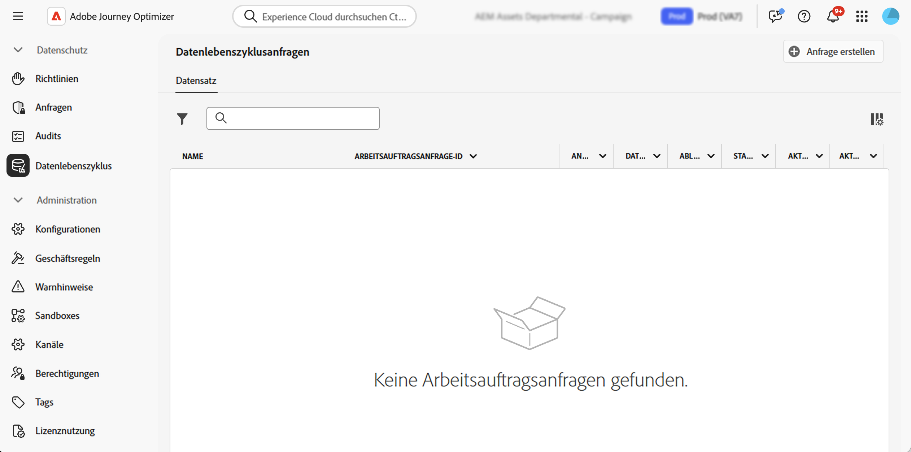

# Durchführen von Datenlebenszyklusvorgängen {#data-hygiene}

>[!BEGINSHADEBOX]

**Auf dieser Seite:** Konfigurieren und planen Sie Datenlebenszyklusvorgänge, damit Ihre Einträge korrekt sind, wie vorgesehen verwendet und gemäß Ihren Organisationsrichtlinien gelöscht werden können.

>[!ENDSHADEBOX]

>[!AVAILABILITY]
>
>Datenlebenzyklus-Funktionen sind derzeit nur für Organisationen verfügbar, die die Zusatzangebote **Healthcare Shield** und **Privacy and Security Shield** erworben haben.

Da Daten kontinuierlich in Adobe Experience Platform aufgenommen werden, ist es wichtig sicherzustellen, dass Ihre Daten wie vorgesehen verwendet, bei Bedarf aktualisiert und gemäß den Richtlinien der Organisation gelöscht werden.

Diese Aufgaben können mit dem Menü **[!UICONTROL Datenlebenszyklus]** durchgeführt werden, das die Konfiguration und Planung von Datenlebenszyklusvorgängen ermöglicht und sicherstellt, dass Ihre Einträge ordnungsgemäß gepflegt werden.

## Empfehlungen {#data-hygiene-recommendations}

Beachten Sie bei der Durchführung von Datenhygienevorgängen (z. B. beim Löschen von Identitäten oder Datensätzen), dass historische Versandereignisse, die mit gelöschten Identitäten verknüpft sind, nicht mehr in standardmäßigen Reporting- oder DataLake-Abfragen angezeigt werden. Dies kann zu Diskrepanzen zwischen der Anzahl der als **Zugestellt** gemeldeten E-Mails und der Anzahl der **empfangenen** E-Mails in den Posteingängen der Empfangenden führen, insbesondere bei älteren Journeys.

Validieren und exportieren Sie vor dem Ausführen umfangreicher Löschvorgänge alle erforderlichen Versand- oder Berichtsdaten. Wenn nach der Datenhygiene eine Abstimmung erforderlich ist, stimmen Sie sich mit dem Adobe-Support ab, um auf archivierte Protokolle zuzugreifen, oder verwenden Sie Abfragen zum Ereignisdatensatz mit Feedback zu Nachrichten für aktuelle Daten.

## Weitere Informationen {#data-hygiene-learn-more}

Weitere Informationen zum Privacy Service und zum Durchführen von Datenlebenszyklusvorgängen finden Sie in der Dokumentation zu Adobe Experience Platform:

* [Überblick über Privacy Service](https://experienceleague.adobe.com/docs/experience-platform/privacy/home.html?lang=de)
* [Datenlebenszyklus in Adobe Experience Platform](https://experienceleague.adobe.com/docs/experience-platform/hygiene/home.html?lang=de)
