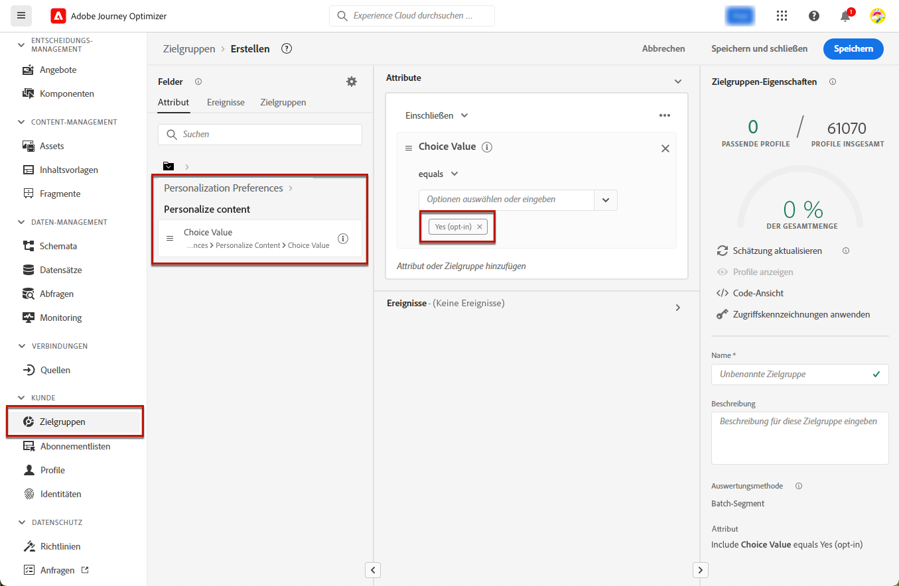
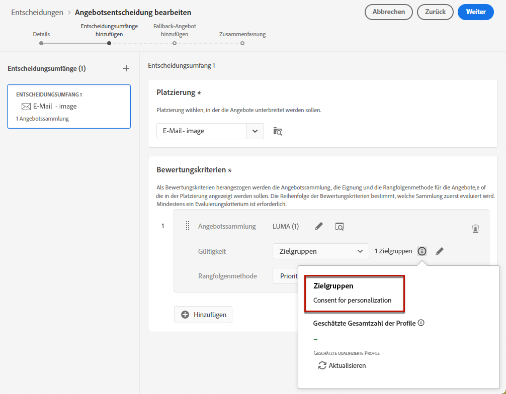
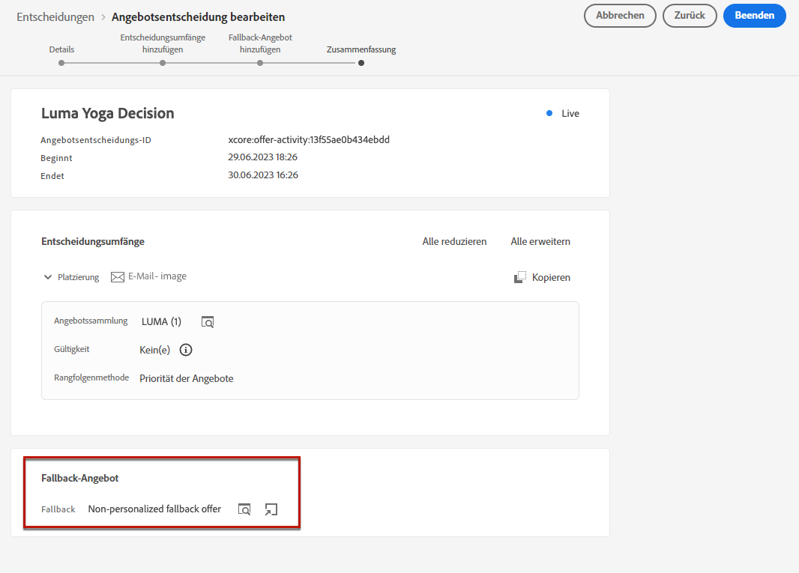
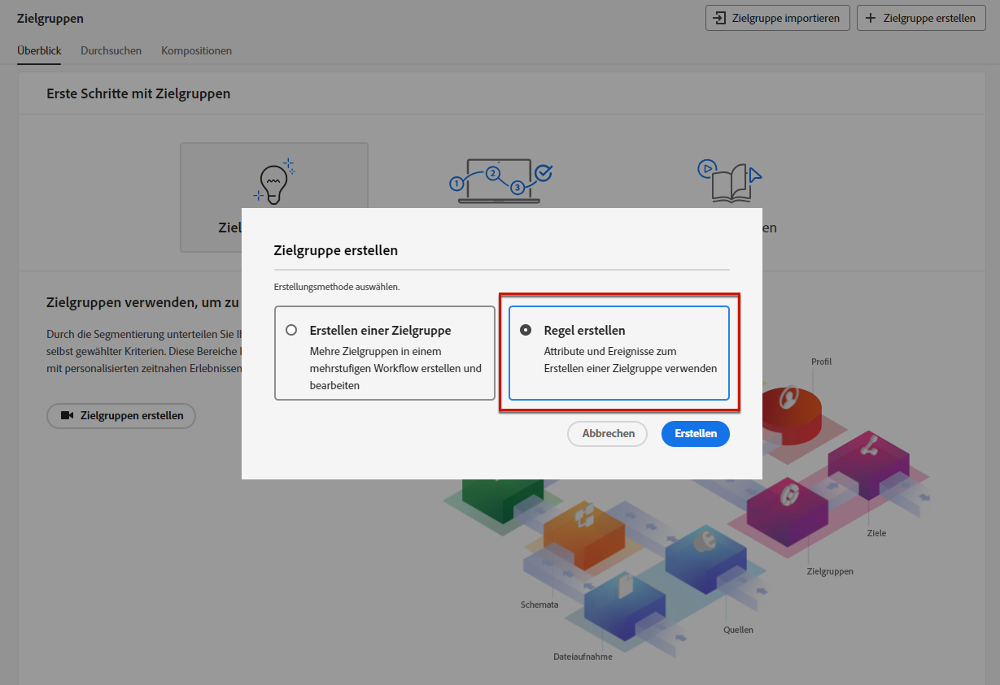
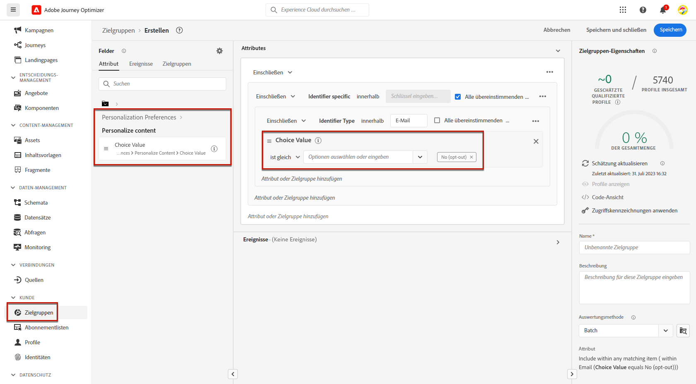
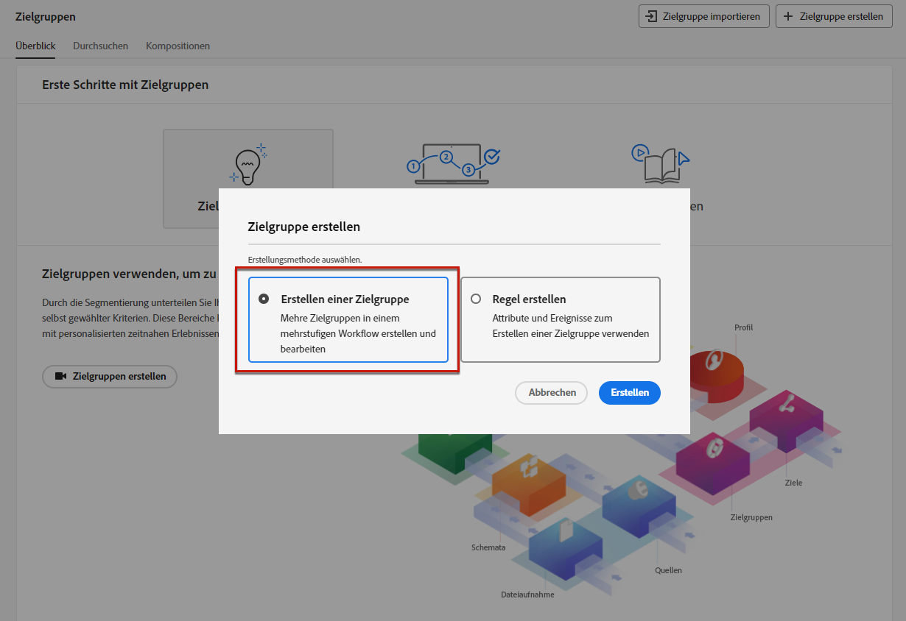
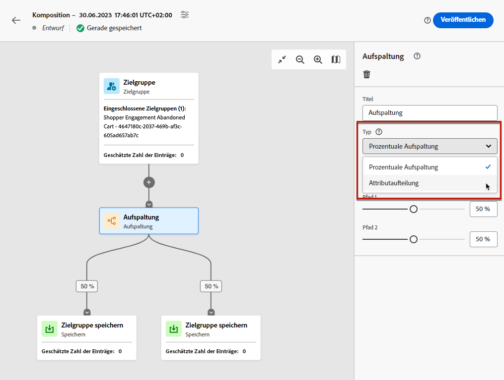
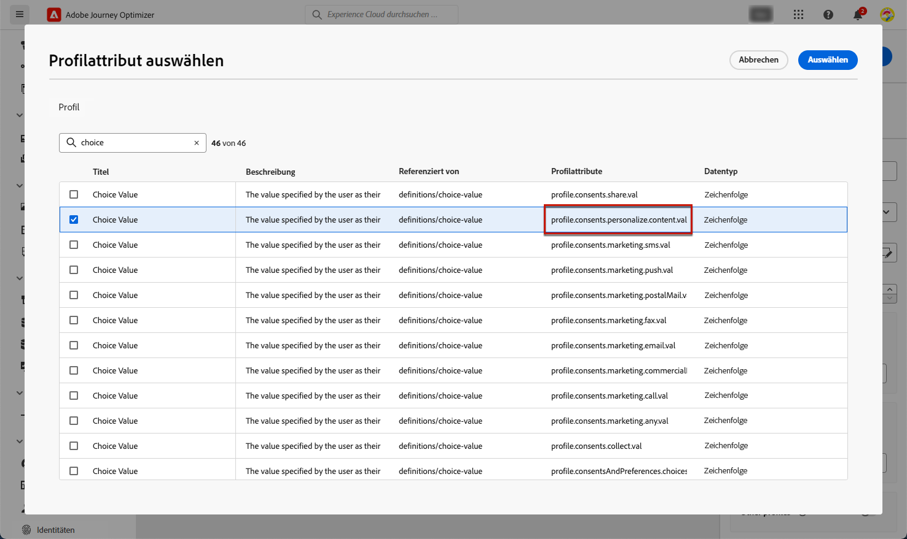
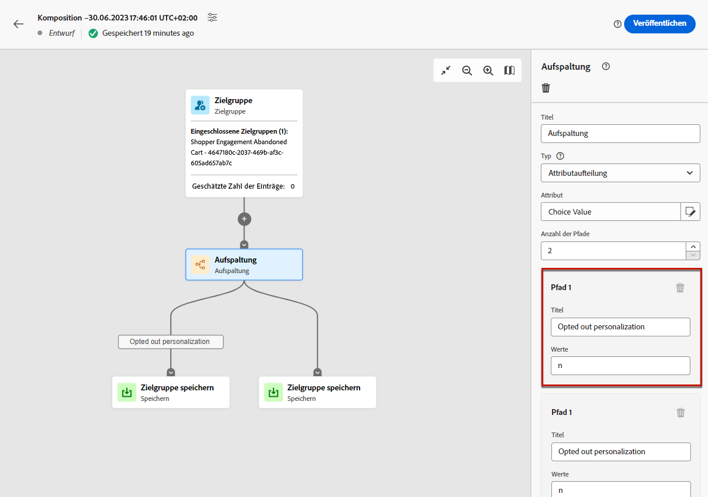

# Verwalten von Opt-out {#consent}

Es ist gesetzlich vorgeschrieben, den Empfängerinnen und Empfängern die Möglichkeit zu geben, den Erhalt von Mitteilungen einer Marke zu stornieren, und sicherzustellen, dass diese Entscheidung respektiert wird. Weitere Informationen zu den geltenden Rechtsvorschriften finden Sie in der Dokumentation zu [Adobe Experience Platform](https://experienceleague.adobe.com/docs/experience-platform/privacy/regulations/overview.html?lang=de#regulations){target="_blank"}.

**Warum ist das wichtig?**

* Die Nichtbeachtung dieser Vorschriften birgt rechtliche Risiken für Ihre Marke.
* Auf diese Weise vermeiden Sie das Verschicken unerwünschter Nachrichten an Empfänger, die Ihre Nachrichten als Spam kennzeichnen und Ihrem Ruf schaden könnten.

## Verwalten von Abmeldungen in Journeys und Kampagnen {#opt-out-ajo}

Beim Versand von Nachrichten von Journeys oder Kampagnen müssen Sie stets sicherstellen, dass sich Kunden von der künftigen Kommunikation abmelden können. Nach der Kündigung des Abos werden die Profile automatisch aus der Audience künftiger Marketing-Nachrichten entfernt.

**[!DNL Journey Optimizer]** bietet Möglichkeiten zum Verwalten des Opt-outs in E-Mails und SMS-Nachrichten. Push-Benachrichtigungen erfordern hingegen keine Maßnahme Ihrerseits, da sich Empfänger selbst über ihre Geräte abmelden können. Beispielsweise können sie den Versand von Benachrichtigungen beim Herunterladen oder bei der Nutzung Ihrer Mobile App deaktivieren. Ebenso können sie die Benachrichtigungseinstellungen über das mobile Betriebssystem ändern.

In den folgenden Abschnitten erfahren Sie, wie Sie Opt-out-Verfahren in E-Mails und SMS-Nachrichten von Journey Optimizer verwalten:

<table style="table-layout:fixed"><tr style="border: 0;">
<td>

<a href="../email/email-opt-out.md"><strong>Opt-out-Verwaltung für E-Mails</strong>

</td>
<td>

<a href="../sms/sms-opt-out.md"><strong>Opt-out-Verwaltung bei SMS</strong></a>

</td>
</tr></table>

>[!NOTE]
>
>In [!DNL Journey Optimizer] wird das Einverständnis durch das [Einverständnisschema](https://experienceleague.adobe.com/docs/experience-platform/xdm/field-groups/profile/consents.html?lang=de){target="_blank"}. By default, the value for the consent field is empty and treated as consent to receive your communications. You can modify this default value while onboarding to one of the possible values listed [here](https://experienceleague.adobe.com/docs/experience-platform/xdm/data-types/consents.html?lang=de#choice-values){target="_blank"} von Experience Platform verarbeitet.

## Implementieren der Personalisierungszustimmung {#opt-out-personalization}

Ihre Kundschaft kann sich auch gegen das Anzeigen personalisierter Inhalte entscheiden. Nachdem ein Profil sich von der Personalisierung abgemeldet hat, müssen Sie sicherstellen, dass dessen Daten nicht mehr für die Personalisierung verwendet werden, und Sie müssen alle personalisierten Inhalte durch eine Fallback-Variante ersetzen.

### Beim Entscheidungs-Management

Bei der Nutzung von Angeboten werden Personalisierungsvoreinstellungen nicht automatisch in [Entscheidungsbereichen](../offers/offer-activities/create-offer-activities.md#add-decision-scopes) implementiert, die über eine [Entscheidungsfindungs](../offers/api-reference/offer-delivery-api/decisioning-api.md)- oder [Edge-Decisioning](../offers/api-reference/offer-delivery-api/edge-decisioning-api.md)-API-Anfrage verwendet werden. In diesem Fall müssen Sie die Zustimmung zur Personalisierung manuell erzwingen. Gehen Sie dazu wie folgt vor.

>[!NOTE]
>
>Entscheidungsbereiche, die von in [!DNL Journey Optimizer] verfassten Kanälen verwendet werden, erfüllen diese Anforderung der Journey oder Kampagne, zu der sie gehören.

1. Erstellen Sie eine [Adobe Experience Platform-Audience](../audience/access-audiences.md) mithilfe der [Segmentierungsdienst](https://experienceleague.adobe.com/docs/experience-platform/segmentation/ui/overview.html?lang=de){target="_blank"} und verwenden ein Profilattribut wie **[!UICONTROL Inhalt personalisieren = Ja (Opt-in)]** , um Benutzer anzusprechen, die der Personalisierung zugestimmt haben.

   

1. Beim Erstellen einer [Entscheidung](../offers/offer-activities/create-offer-activities.md), fügen Sie einen Entscheidungsbereich hinzu und definieren Sie eine auf dieser Zielgruppe basierende Eignungsbegrenzung für jede Bewertungskriterien-Kollektion, die personalisierte Angebote enthält.

   

1. Erstellen Sie ein [Fallback-Angebot](../offers/offer-library/creating-fallback-offers.md), das keine personalisierten Inhalte enthält.

1. [Weisen Sie](../offers/offer-activities/create-offer-activities.md#add-fallback) das nicht personalisierte Fallback-Angebot der Entscheidung zu.

   

1. [Überprüfen und speichern](../offers/offer-activities/create-offer-activities.md#review) Sie die Entscheidung.

Haben Benutzende:

* der Personalisierung zugestimmt, bestimmt der Entscheidungsbereich das beste Angebot für dieses Profil.

* der Personalisierung nicht zugestimmt, kommt das entsprechende Profil für keines der Angebote in den Bewertungskriterien infrage und erhält daher das nicht personalisierte Fallback-Angebot.

>[!NOTE]
>
>Das Einverständnis für die Verwendung von Profildaten in [Datenmodellierung](../offers/ranking/ai-models.md) wird noch nicht in [!DNL Journey Optimizer] unterstützt.

## Im Ausdruckseditor:

<!--Expressions Editor while personalizing images, text, subject line  ( Segment in Campaigns) - UI and Headless -->

Die [Ausdruckseditor](../personalization/personalization-build-expressions.md) selbst führt keine Einwilligungsüberprüfungen oder Durchsetzungsmaßnahmen durch, da diese nicht an der Zustellung von Nachrichten beteiligt sind.

Die Verwendung von Steuerelementen für den Zugriff auf rechte ermöglicht jedoch die Beschränkung der für die Personalisierung verwendbaren Felder. Die [Nachrichtenvorschau](../email/preview.md#preview-email) und [E-Mail-Rendering-Dienst](../email/preview.md#email-rendering) maskiert die mit sensiblen Informationen identifizierten Felder.

>[!NOTE]
>
>Erfahren Sie mehr über die Zugriffskontrolle auf Objektebene (OLAC) in [diesem Abschnitt](../administration/object-based-access.md).

In [!DNL Journey Optimizer] -Kampagnen wird die Einwilligungsrichtlinie wie folgt durchgesetzt:

* Sie können Definitionen von Zustimmungsrichtlinien im Rahmen der Zielgruppenerstellung einbeziehen, um sicherzustellen, dass die für die Kampagne ausgewählte Zielgruppe bereits **Profile herausgefiltert, die nicht den Zustimmungskriterien entsprechen**.

* [!DNL Journey Optimizer] führt auf Kanalebene eine allgemeine Zustimmungsprüfung durch, um **sicherstellen, dass Profile sich für** für den Empfang von Marketingnachrichten über den entsprechenden Kanal.

  >[!NOTE]
  >
  >Die [!DNL Journey Optimizer] Das Kampagnenobjekt selbst führt derzeit keine zusätzlichen Prüfungen zur Durchsetzung der Einwilligungsrichtlinien durch.

Um die Zustimmung zur Personalisierung in Kampagnen manuell zu erzwingen, führen Sie eine der folgenden Optionen aus.

### Verwenden des Segmentregel-Builders

Sie können den Segment Rule Builder verwenden, um eine Zielgruppe mit Opt-out-Profilen zu erstellen.

1. Erstellen Sie eine [Adobe Experience Platform-Audience](../audience/access-audiences.md) mithilfe der [Segmentierungsdienst](https://experienceleague.adobe.com/docs/experience-platform/segmentation/ui/overview.html?lang=de){target="_blank"}.

   

1. Wählen Sie ein Profilattribut aus, z. B. **[!UICONTROL Inhalt personalisieren = Nein (Opt-out)]** , um Benutzer auszuschließen, die der Personalisierung nicht zugestimmt haben.

   

1. Klicken Sie auf **[!UICONTROL Speichern]**.

Sie können diese Zielgruppe nun verwenden, um die Profile herauszufiltern, die der Personalisierung nicht zugestimmt haben.

### Verwendung einer Aufspaltungsaktivität in einem Komprimierungs-Workflow

Sie können einer Audience auch eine Überprüfung der Personalisierungszustimmung hinzufügen, indem Sie eine Aufspaltungsaktivität zu einem Kompositions-Workflow hinzufügen.

1. Erstellen Sie eine Zielgruppe mithilfe der **[!UICONTROL Zielgruppe erstellen]** -Option. [Erfahren Sie mehr über das Erstellen eines Kompositionsarbeitsablaufs](../audience/create-compositions.md)

   

1. Fügen Sie Ihre Zielgruppe über die dedizierte Schaltfläche rechts hinzu.

1. Klicken Sie auf das Symbol + und wählen Sie **[!UICONTROL Aufspaltung]** , um eine aufgeteilte Zielgruppe zu erstellen. [Erfahren Sie mehr über die Aufspaltung .](../audience/composition-canvas.md#split)

   

1. Auswählen **[!UICONTROL Attributaufteilung]** als Aufspaltungstyp im rechten Bereich.

   

1. Klicken Sie auf das Stiftsymbol neben dem **[!UICONTROL Attribut]** -Feld, um **[!UICONTROL Profilattribut auswählen]** Fenster.

1. Suchen Sie nach dem Personalisierungszustimmungsattribut (`profile.consents.personalize.content.val`) und wählen Sie sie aus.

   

1. **[!UICONTROL Pfad 1]** ist die nicht personalisierte Zielgruppe. Wählen Sie einen entsprechenden Titel aus.

1. Wählen Sie den entsprechenden Wert aus diesem [Liste](https://experienceleague.adobe.com/docs/experience-platform/xdm/data-types/consents.html?lang=de#choice-values){target="_blank"}.

   In diesem Fall verwenden wir `n` , um anzugeben, dass Benutzer der Verwendung ihrer Daten zur Personalisierung nicht zustimmen.

   

1. Sie können einen separaten Pfad für andere Auswahlwerte erstellen. Sie können auch die verbleibenden Pfade löschen und aktivieren **[!UICONTROL Andere Profile]** um alle anderen Profile einzubeziehen, die nicht über den Auswahlwert `n`.

1. Klicken Sie abschließend auf **[!UICONTROL Zielgruppe speichern]** für jeden Pfad, um das Ergebnis Ihres Workflows in einer neuen Audience zu speichern. Für jeden Pfad wird eine Zielgruppe in Adobe Experience Platform gespeichert.

1. Veröffentlichen Sie nach Abschluss den Kompositions-Workflow.

Sie können diese Zielgruppe nun verwenden, um die Profile herauszufiltern, die der Personalisierung nicht zugestimmt haben.

>[!NOTE]
>
>Wenn Sie eine Audience erstellen, die der Personalisierung nicht zugestimmt hat, und diese Audience dann in einer Kampagne auswählen, bleiben die Personalisierungswerkzeuge verfügbar. Es liegt an Ihren Marketing-Benutzern, zu verstehen, dass sie, wenn sie mit einer Zielgruppe arbeiten, die keine Personalisierung erhält, keine Personalisierungswerkzeuge verwenden sollten.
