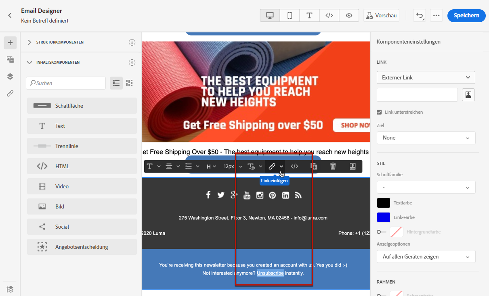
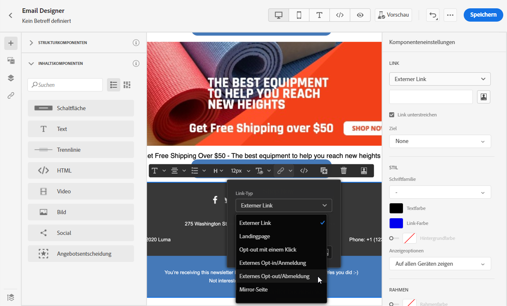
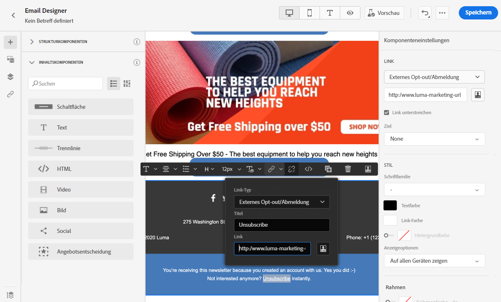
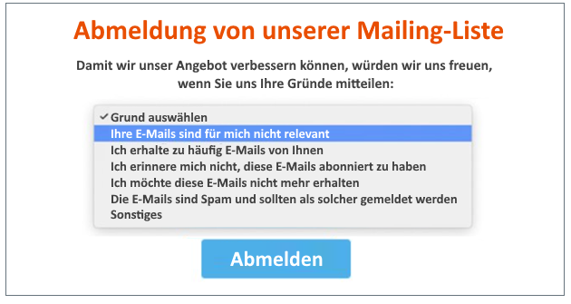
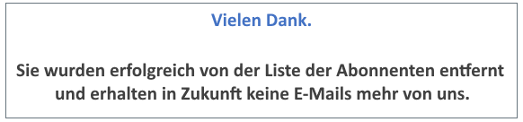
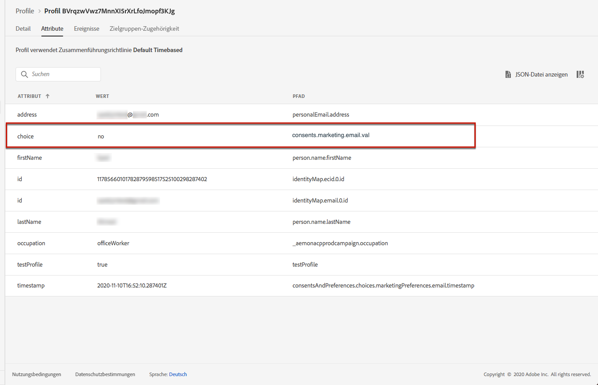
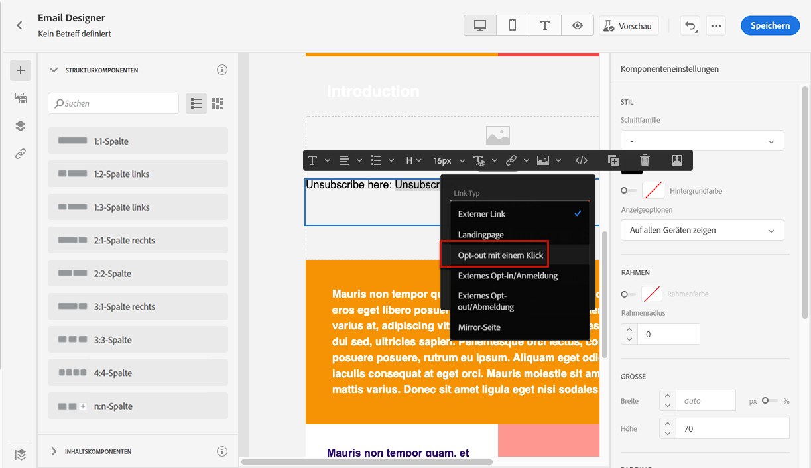
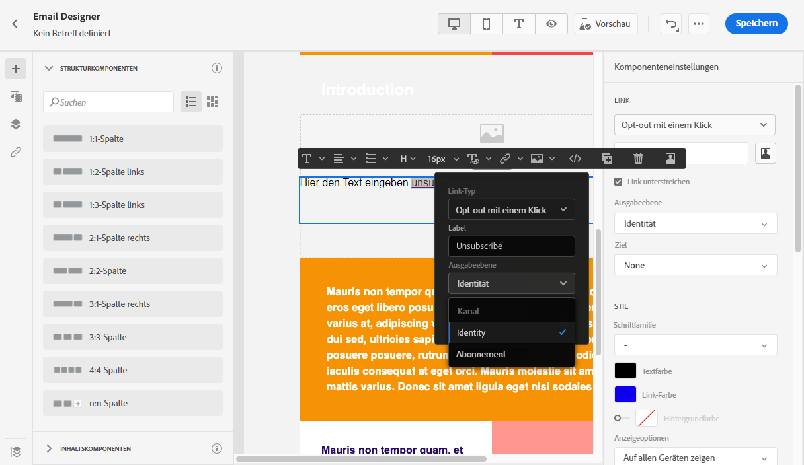
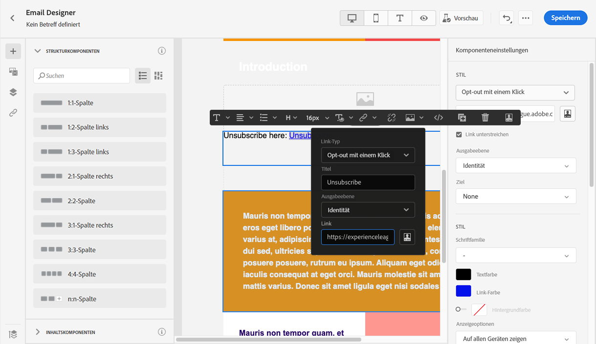

# Verwalten von Opt-out {#consent}

Verwenden Sie [!DNL Journey Optimizer], um das Einverständnis Ihrer Empfänger zur Kommunikation zu erfassen und anhand ihrer Voreinstellungs- und Abonnement-Verwaltung zu ermitteln, wie sie mit Ihrer Marke interagieren möchten.

Gesetzliche Bestimmungen wie die DSGVO verlangen die Erfüllung bestimmter Anforderungen, bevor Sie Informationen von betroffenen Personen verwenden können. Darüber hinaus sollten die betroffenen Personen ihre Einwilligung jederzeit ändern können.

**Warum ist das wichtig?**

* Die Nichtbeachtung dieser Vorschriften birgt rechtliche Risiken für Ihre Marke.
* Auf diese Weise vermeiden Sie das Verschicken unerwünschter Nachrichten an Empfänger, die Ihre Nachrichten als Spam kennzeichnen und Ihrem Ruf schaden könnten.

Weitere Informationen zur Verwaltung der Datenschutzeinstellungen und den geltenden Vorschriften finden Sie in der [Dokumentation zu Experience Platform](https://experienceleague.adobe.com/docs/experience-platform/privacy/home.html?lang=de){target=&quot;_blank&quot;}.

>[!NOTE]
>
>In [!DNL Journey Optimizer] wird das Einverständnis durch das [Einverständnisschema](https://experienceleague.adobe.com/docs/experience-platform/xdm/field-groups/profile/consents.html?lang=de){target=&quot;_blank&quot;} von Experience Platform gehandhabt. Standardmäßig ist der Wert für das Einverständnisfeld leer und gilt als Einverständnis für den Empfang Ihrer Nachrichten. Sie können diesen Standardwert beim Onboarding in einen der möglichen [hier](https://experienceleague.adobe.com/docs/experience-platform/xdm/data-types/consents.html?lang=de#choice-values){target=&quot;_blank&quot;} aufgelisteten Werte ändern.

## Opt-out-Verwaltung für E-Mails {#opt-out-management}

Die Möglichkeit für Empfänger, den Empfang von Mitteilungen einer Marke zu kündigen, ist eine gesetzliche Anforderung. Weitere Informationen zu den geltenden Rechtsvorschriften finden Sie in der [Dokumentation zu Adobe Experience Platform](https://experienceleague.adobe.com/docs/experience-platform/privacy/regulations/overview.html?lang=de){target=&quot;_blank&quot;}.

Aus diesem Grund müssen Sie in jeder E-Mail, die an Empfänger gesendet wird, immer einen **Link zur Abmeldung** einfügen:

* Wenn der Empfänger auf diesen Link klickt, wird er auf eine Landingpage weitergeleitet, auf der er die Abmeldung bestätigen muss.
* Nachdem er seine Entscheidung bestätigt hat, werden die Daten des Profils mit dieser Information aktualisiert.

>[!NOTE]
>
>E-Mail-Nachrichten vom Typ Marketing müssen einen Ausschluss-Link enthalten, der für Transaktionsnachrichten nicht erforderlich ist. Die Nachrichtenkategorie (**[!UICONTROL Marketing]** oder **[!UICONTROL Transaktion]**) wird auf der Ebene der [Kanaloberfläche](../configuration/channel-surfaces.md#email-type) (d. h. Nachrichtenvoreinstellung) und beim [Erstellen der Nachricht](../messages/get-started-content.md#create-new-message) definiert.

### Externes Opt-out {#opt-out-external-lp}

Hierfür können Sie einen Link zu einer externen Landingpage in eine E-Mail einfügen, damit sich Benutzer vom Erhalt von Nachrichten Ihrer Marke abmelden können.

#### Hinzufügen eines Abmelde-Links {#add-unsubscribe-link}

Zunächst müssen Sie einen Abmelde-Link zu einer Nachricht hinzufügen. Gehen Sie dazu wie folgt vor:

1. Erstellen Sie Ihre eigene Abmeldungs-Landingpage.

1. Hosten Sie sie auf einem Drittanbietersystem Ihrer Wahl.

1. [Erstellen Sie eine Nachricht](../messages/get-started-content.md) in einer Journey.

1. Wählen Sie Text in Ihrem Inhalt aus und [fügen](../design/message-tracking.md#insert-links) Sie mithilfe der kontextbezogenen Symbolleiste einen Link ein.

   

1. Wählen Sie **[!UICONTROL Externes Opt-out/Abmeldung]** aus der Dropdown-Liste **[!UICONTROL Link-Typ]**.

   

1. Fügen Sie im Feld **[!UICONTROL Link]** den Link zu der Landingpage eines Drittanbieters ein.

   

1. Klicken Sie auf **[!UICONTROL Speichern]**.

#### Implementieren eines API-Aufrufs zum Opt-out {#opt-out-api}

Damit Ihre Empfänger abgemeldet werden, wenn sie ihre Auswahl über die Landingpage senden, müssen Sie einen **Abonnement-API-Aufruf** über [Adobe Developer](https://developer.adobe.com){target=&quot;_blank&quot;} implementieren, um die Einstellungen der entsprechenden Profile zu aktualisieren.

Dieser POST-Aufruf sieht wie folgt aus:

Endpunkt: platform.adobe.io/journey/imp/consent/preferences

Abfrageparameter:

* **params**: enthält die verschlüsselte Payload
* **sig**: Signatur
* **pid**: verschlüsselte Profil-ID

Diese drei Parameter werden in die URL der Drittanbieter-Landingpage eingefügt, die an Ihren Empfänger gesendet wird:


Header-Anforderungen:

* x-api-key
* x-gw-ims-org-id
* x-sandbox-name
* authorization (Benutzer-Token Ihres technischen Accounts)

Hauptteil der Anfrage:

```
{
   "marketing": [
       {
            "type": "email",           
            "choice": "no",          
            "scope": "channel"       
        }
    ],
 
}
```

[!DNL Journey Optimizer] verwendet diese Parameter, um die Auswahl des entsprechenden Profils über den API-Aufruf von [Adobe Developer](https://developer.adobe.com){target=&quot;_blank&quot;} zu aktualisieren

#### Senden der Nachricht mit Abmelde-Link {#send-message-unsubscribe-link}

Nachdem Sie den Abmelde-Link für Ihre Landingpage konfiguriert und den API-Aufruf implementiert haben, kann Ihre Nachricht gesendet werden.

1. Senden Sie die Nachricht mit dem Link über eine [Journey](../building-journeys/journey.md).

1. Wenn der Empfänger nach Erhalt der Nachricht auf den Abmelde-Link klickt, wird die Landingpage angezeigt.

   

1. Wenn der Empfänger das Formular abschickt (in diesem Fall durch Klicken auf die Schaltfläche **Abmelden** auf Ihrer Landingpage), werden die Profildaten durch den [API-Aufruf](#opt-out-api) aktualisiert.

1. Der abgemeldete Empfänger wird dann zu einem Bestätigungsbildschirm weitergeleitet, der die erfolgte Abmeldung bestätigt.

   

   Ab sofort erhält dieser Benutzer keine weitere Kommunikation von Ihrer Marke, es sei denn, er meldet sich erneut an.

1. Um sich zu vergewissern, dass die Aktualisierung des betreffenden Profils erfolgt ist, öffnen Sie das Profil in Adobe Experience Platform, indem Sie einen Identity-Namespace und einen entsprechenden Identitätswert auswählen. Weitere Informationen finden Sie in der [Dokumentation zu Experience Platform](https://experienceleague.adobe.com/docs/experience-platform/profile/ui/user-guide.html?lang=de#getting-started){target=&quot;_blank&quot;}.

   

   Auf der Registerkarte **[!UICONTROL Attribute]** sehen Sie, dass der Wert für **[!UICONTROL choice]** auf **[!UICONTROL no]** geändert wurde.

### Opt-out mit einem Klick {#one-click-opt-out}

Da sich viele Kunden einen einfachen Abmeldevorgang wünschen, können Sie auch einen Opt-out-Link mit einem Klick in Ihren E-Mail-Inhalt einfügen. Dieser Link ermöglicht es Ihren Empfängern, sich schnell von Ihren Mitteilungen abzumelden, ohne erst auf eine Landingpage umgeleitet zu werden, auf der sie ihre Wahl bestätigen müssen, was den Abmeldeprozess beschleunigt.

Gehen Sie wie folgt vor, um einen Opt-out-Link zu Ihrer E-Mail hinzuzufügen.

1. [Fügen Sie einen Link ein](../design/message-tracking.md#insert-links) und wählen Sie als Link-Typ **[!UICONTROL Ausschluss mit einem Klick]**.

   

1. Wählen Sie aus, wie Sie die Abmeldung anwenden möchten: auf Kanal-, Identitäts- oder Abonnementebene.

   

   * **[!UICONTROL Kanal]**: Die Abmeldung gilt für künftige Nachrichten, die im aktuellen Kanal an das Ziel des Profils (d. h. die E-Mail-Adresse) gesendet werden. Wenn einem Profil mehrere Ziele zugeordnet sind, gilt die Abmeldung für alle Ziele (d. h. E-Mail-Adressen) im Profil für diesen Kanal.
   * **[!UICONTROL Identität]**: Die Abmeldung gilt für künftige Nachrichten, die an das Ziel (d. h. die E-Mail-Adresse) gesendet werden, das für die aktuelle Nachricht verwendet wird.
   * **[!UICONTROL Abonnement]**: Die Abmeldung gilt für künftige Nachrichten, die mit einer bestimmten Abonnentenliste verbunden sind. Diese Option kann nur ausgewählt werden, wenn die aktuelle Nachricht einer Abonnement-Liste zugeordnet ist.

1. Geben Sie die URL der Landingpage ein, zu der der Benutzer weitergeleitet werden soll, sobald er sich abgemeldet hat. Diese Seite dient nur zur Bestätigung, dass die Abmeldung erfolgreich war.

   >[!NOTE]
   >
   >Wenn Sie die Option zum **Abmelden von einer Liste** auf der Ebene der Kanaloberfläche aktiviert haben, wird diese URL auch verwendet, wenn jemand auf den Abmelde-Link in der E-Mail-Kopfzeile klickt. [Weitere Informationen](#unsubscribe-header)

   

   Sie können Ihre Links personalisieren. Weitere Informationen zu personalisierten URLs finden Sie in [diesem Abschnitt](../personalization/personalization-syntax.md).

1. Speichern Sie Ihre Änderungen.

Wenn Ihre Nachricht über eine [Journey](../building-journeys/journey.md) gesendet wurde, wird ein Empfänger, der auf den Abmelde-Link klickt, sofort abgemeldet.

### Abmelde-Link in der Kopfzeile einer E-Mail {#unsubscribe-header}

>[!CONTEXTUALHELP]
>id="ajo_admin_preset_unsubscribe"
>title="Hinzufügen eines Abmelde-Links zur E-Mail-Kopfzeile"
>abstract="Aktivieren Sie „Abmelden von einer Liste“, um einen Abmelde-Link zur E-Mail-Kopfzeile hinzuzufügen. Um eine Abmelde-URL einzurichten, fügen Sie einen 1-Klick-Ausschluss-Link in den Inhalt der E-Mail ein."
>additional-url="https://experienceleague.adobe.com/docs/journey-optimizer/using/privacy/consent/opt-out.html?lang=de#one-click-opt-out" text="Opt-out mit einem Klick"

Wenn die Option zum [Abmelden von einer Liste](../configuration/channel-surfaces.md#list-unsubscribe) auf der Ebene der Kanaloberfläche aktiviert ist, enthalten die entsprechenden E-Mails, die mit [!DNL Journey Optimizer] gesendet werden, einen Abmelde-Link in der Kopfzeile.

Der Abmelde-Link wird beispielsweise in Gmail wie folgt angezeigt:


>[!NOTE]
>
>Um den Abmelde-Link in der E-Mail-Kopfzeile anzuzeigen, muss der E-Mail-Client der Empfänger diese Funktion unterstützen.

Die Abmelde-Adresse ist die Standardadresse **[!UICONTROL Mailto (unsubscribe)]**, die in der entsprechenden Kanaloberfläche angezeigt wird. [Weitere Informationen](../configuration/channel-surfaces.md#list-unsubscribe).

Um eine personalisierte Abmelde-URL einzurichten, fügen Sie einen 1-Klick-Abmelde-Link in den Inhalt der E-Mail-Nachricht ein und geben Sie die gewünschte URL ein. [Weitere Informationen](#one-click-opt-out)

Je nach E-Mail-Client hat das Klicken auf den Abmelde-Link in der Kopfzeile eine der folgenden Auswirkungen:

* Die Abmelde-Anfrage wird an die Standard-Abmeldeadresse gesendet.

* Der Empfänger wird an die Landingpage-URL weitergeleitet, die Sie beim Hinzufügen des Abmelde-Links zu Ihrer Nachricht angegeben haben.

   >[!NOTE]
   >
   >Wenn Sie keinen 1-Klick-Abmelde-Link in Ihren Nachrichteninhalt einfügen, wird keine Landingpage angezeigt.

* Das entsprechende Profil wird sofort abgemeldet und in Experience Platform aktualisiert. Weitere Informationen finden Sie in der [Dokumentation zu Experience Platform](https://experienceleague.adobe.com/docs/experience-platform/profile/ui/user-guide.html#getting-started){target=&quot;_blank&quot;}.

## Push-Opt-out-Verwaltung {#push-opt-out-management}

Push-Empfänger können sich über ihre Geräte selbst abmelden.

Beispielsweise können sie den Versand von Benachrichtigungen beim Herunterladen oder bei der Nutzung Ihrer Mobile App deaktivieren. Ebenso können sie die Benachrichtigungseinstellungen über das mobile Betriebssystem ändern.

## SMS-Opt-out-Verwaltung {#sms-opt-out-management}

In Übereinstimmung mit den Branchenstandards und -vorschriften müssen alle SMS-Marketing-Nachrichten eine Möglichkeit für die Empfänger enthalten, ihr Abo einfach zu kündigen. Nach der Kündigung des Abos werden die Profile automatisch aus der Audience künftiger Marketing-Nachrichten entfernt.

Standardmäßig verarbeitet Adobe Journey Optimizer englischsprachige Standard-Antwortnachrichten wie STOP, UNSTOP und START für Nachrichten von gebührenfreien und von normalen Nummern in Übereinstimmung mit den Industriestandards für native Integration wie Sinch und Twilio. Diese Keywords lösen normalerweise eine automatische Standardantwort von Ihrem Dritt-Provider (wie beispielsweise Twilio, Sinch, etc.) aus. Sie können dies direkt mit Ihrem Provider oder über dessen Dokumentations-Website abklären.

Es sind keine Schritte erforderlich, um sicherzustellen, dass SMS-Opt-out-Funktionen in Adobe Journey Optimizer funktionieren, da die Keyword-Antworten STOP, UNSTOP und START automatisch erkannt werden.

Zusätzlich zum Abbrechen des Versands durch Adobe Journey Optimizer basierend auf dem Opt-out-Status (für direkte Integrationen mit Twilio oder Sinch) verfügen die meisten Provider von SMS-Gateways auch über eine Blockierungsliste, mit der sichergestellt wird, dass eine SMS-Nachricht nicht an einen Kontakt gesendet wird, der sich für einen Opt-out entschieden hat. Wenn Sie einen anderen Provider als Sinch oder Twilio verwenden und eine SMS über einen [benutzerdefinierten Kanal](../building-journeys/using-custom-actions.md) versenden, müssen Sie dies mit Ihrem Provider abklären.

>[!IMPORTANT]
>
>SMS-Kampagnen können je nach Art Ihrer SMS-Kampagne, dem Standort, von dem aus Sie Ihre SMS versenden, und dem Standort Ihrer Empfänger unterschiedliche rechtlichen Anforderungen unterliegen. <br>Auch wenn Adobe Journey Optimizer die Nachrichten an lange und gebührenfreie Nummern wie oben beschrieben verarbeitet, sollten Sie sich an Ihren Rechtsbeistand wenden, um sicherzustellen, dass Ihre SMS-Kampagne alle geltenden gesetzlichen Bestimmungen erfüllt.

### Kurzwahlnummern {#short-codes}

Adobe Journey Optimizer verarbeitet standardmäßig keine Opt-Out-, Opt-In- oder Hilfe-Keywords für Kurzwahlnummern.

Sie müssen sicherstellen, dass Ihre Kurzwahlnummer allen Branchenregeln und -vorschriften für die Handhabung von Opt-outs gerecht wird.

### Alphanumerische Sender ID {#alphanumeric}

Alphanumerische Sender IDs sind nur für einseitige Nachrichten gedacht und können keine eingehenden Nachrichten empfangen. Daher sind die SMS-Keywords STOP, START, HELP von Adobe Journey Optimizer für alphanumerische Sender IDs nicht anwendbar. Sie müssen andere Anweisungen geben, wie z. B. an das Support-Team zu schreiben, eine Support-Telefonnummer anzurufen oder eine andere Telefonnummer oder einen Code per SMS zu senden, damit die Benutzenden sich von den über die alphanumerische Sender ID gesendeten Nachrichten abmelden können.

#### Video {#video-sms}

Weiterführende Informationen über die Unterstützung nativer eingehender Keywords (START, STOP und UNSTOP) für SMS finden Sie in dem folgenden Video:

>[!VIDEO](https://video.tv.adobe.com/v/344026?quality=12)
