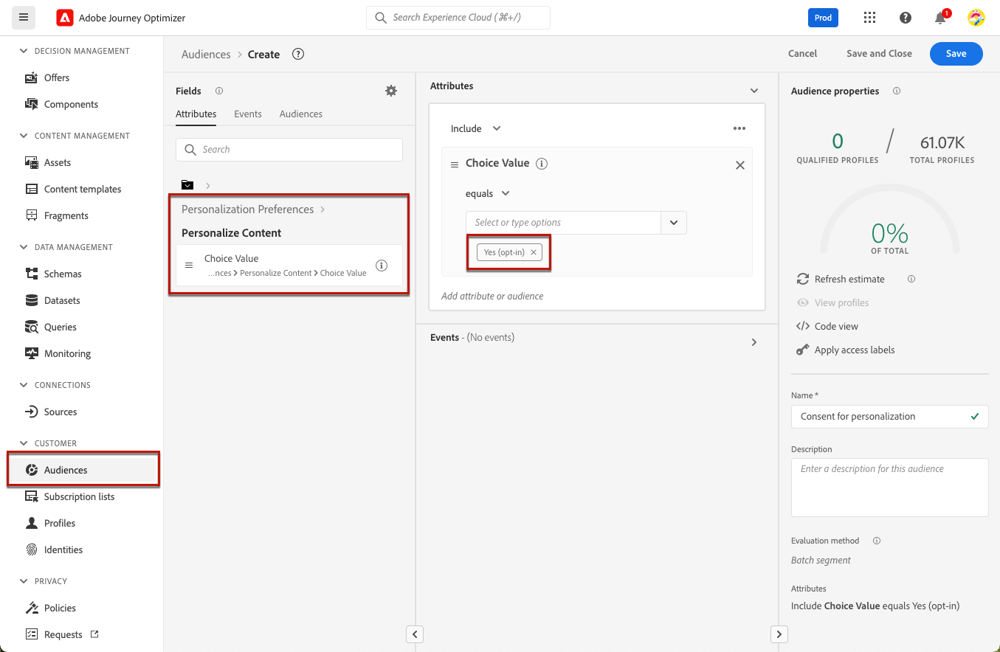
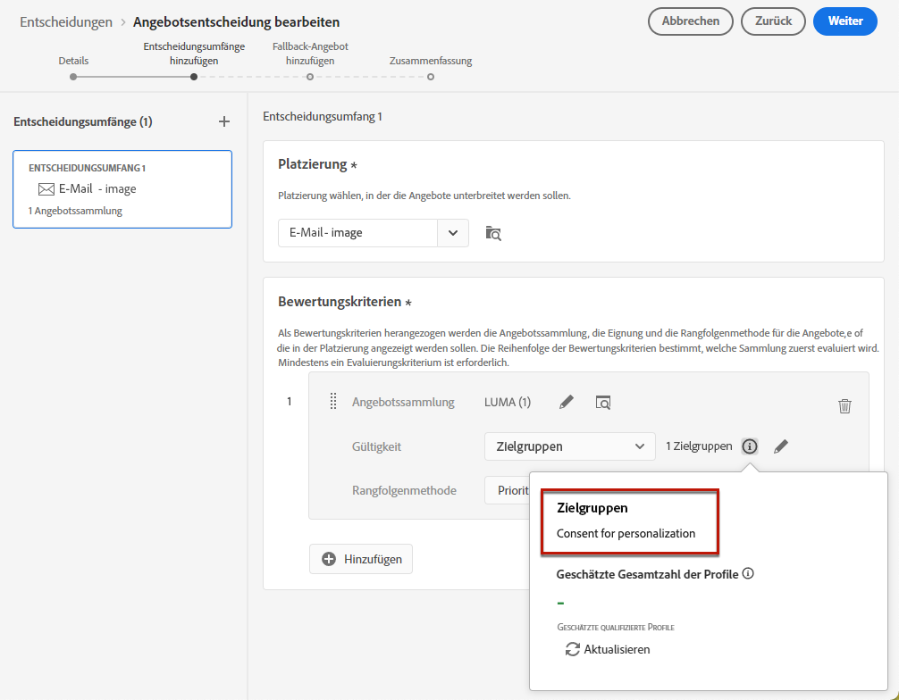
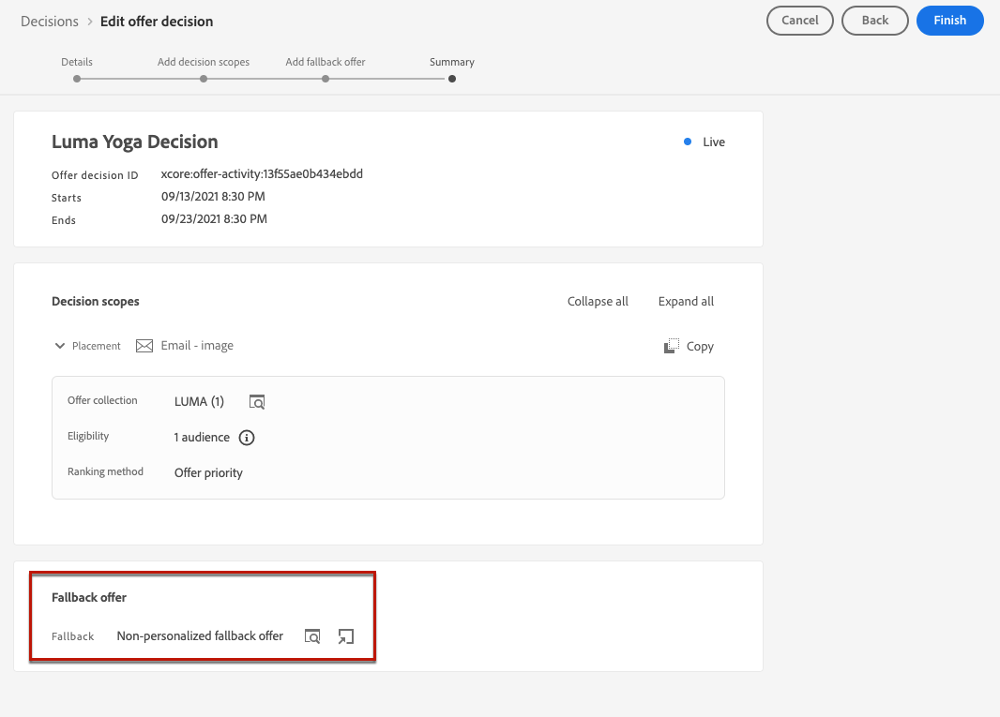
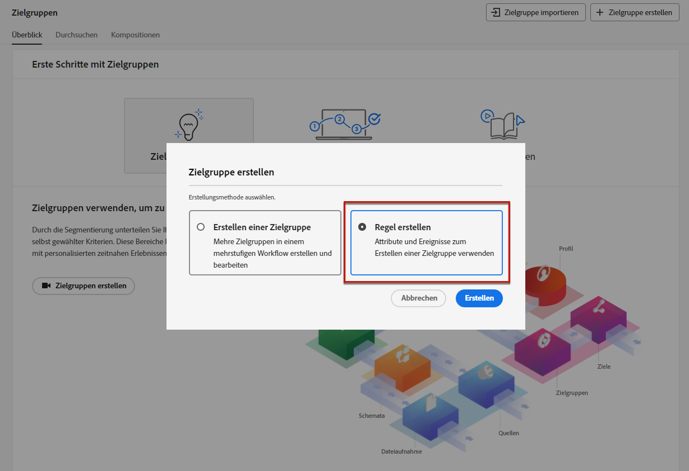
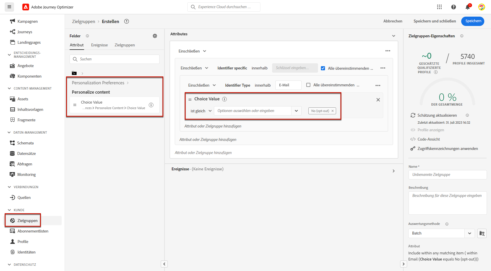
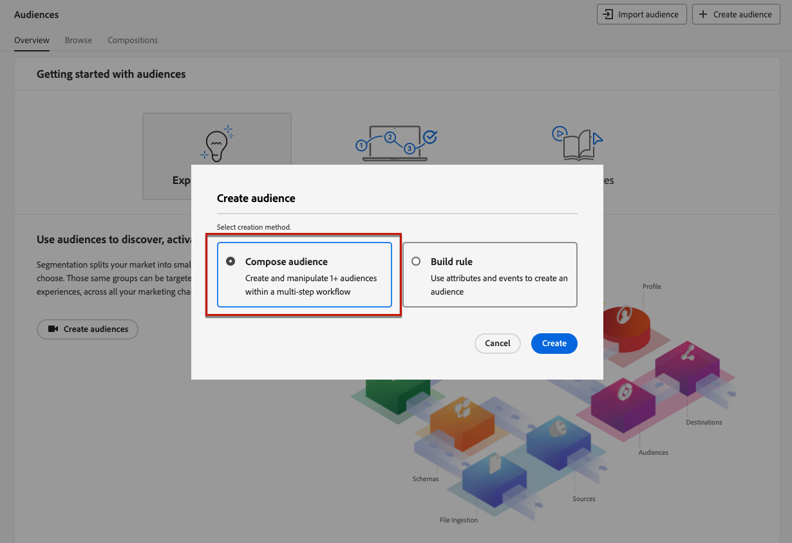
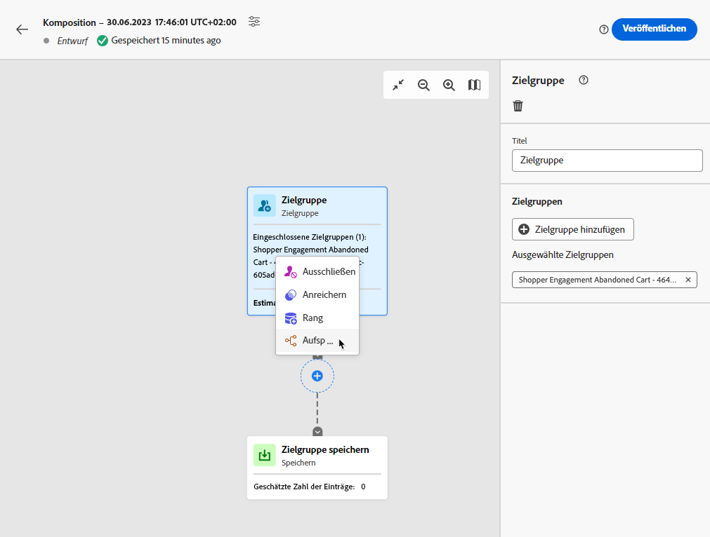
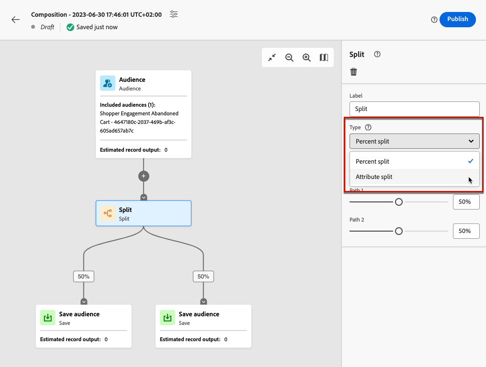
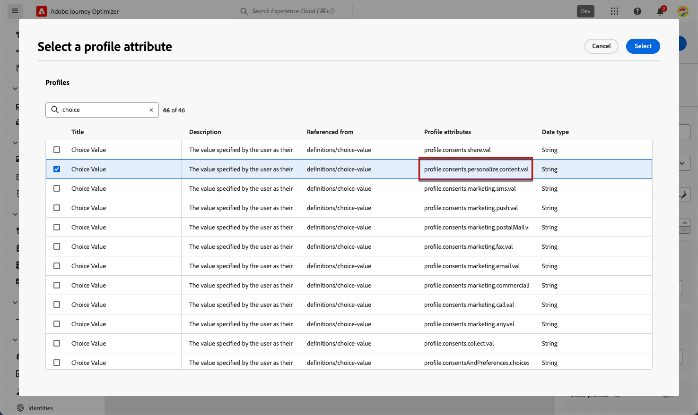
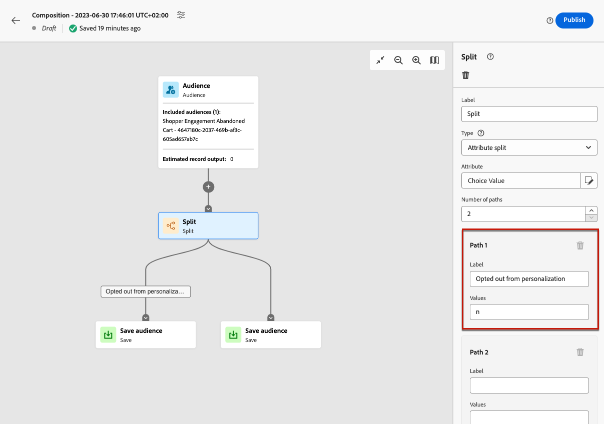

# Verwalten von Opt-out {#consent}

Es ist gesetzlich vorgeschrieben, den Empfängerinnen und Empfängern die Möglichkeit zu geben, den Erhalt von Mitteilungen einer Marke zu stornieren, und sicherzustellen, dass diese Entscheidung respektiert wird. Die Nichtbeachtung dieser Vorschriften birgt rechtliche Risiken für Ihre Marke. Auf diese Weise vermeiden Sie das Verschicken unerwünschter Nachrichten an Empfängerinnen und Empfänger, die Ihre Nachrichten als Spam kennzeichnen und Ihrem Ruf schaden könnten.

Weitere Informationen zu den geltenden Rechtsvorschriften finden Sie in der Dokumentation zu [Adobe Experience Platform](https://experienceleague.adobe.com/docs/experience-platform/privacy/regulations/overview.html?lang=de#regulations){target="_blank"}.

## Verwalten von Abmeldungen in Journeys und Kampagnen {#opt-out-ajo}

Beim Versand von Nachrichten von Journeys oder Kampagnen müssen Sie stets sicherstellen, dass sich Kundinnen und Kunden von der künftigen Kommunikation abmelden können. Nach der Kündigung des Abos werden die Profile automatisch aus der Zielgruppe künftiger Marketing-Nachrichten entfernt.

Während **[!DNL Journey Optimizer]** Möglichkeiten zum Verwalten des Opt-outs in E-Mails und SMS-Nachrichten bietet, erfordern Push-Benachrichtigungen keine Aktion von Ihrer Seite, da sich Empfänger selbst über ihre Geräte abmelden können. Beispielsweise können sie den Versand von Benachrichtigungen beim Herunterladen oder bei der Nutzung Ihrer App deaktivieren. Ebenso können sie die Benachrichtigungseinstellungen über das mobile Betriebssystem ändern.

>[!NOTE]
>
>Darüber hinaus können Sie über das **Unterdrückungs-REST-API** von Journey Optimizer Ihre ausgehenden Nachrichten mithilfe von Unterdrückungs- und Zulassungslisten steuern. [Erfahren Sie, wie man mit der Unterdrückungs-REST-API arbeitet.](https://developer.adobe.com/journey-optimizer-apis/references/suppression){target="_blank"}

### Überprüfen des Push-Opt-out-Status {#push-opt-out-status}

Ein Push-Opt-out für Apps wird auf Geräteebene gehandhabt: Wenn eine Person Benachrichtigungen auf ihrem Gerät deaktiviert, wird das Push-Token aus ihrem Profil entfernt. Das **Vorhandensein eines Push-Tokens** in einem Profil ist daher ein Zeichen für implizites Push-Einverständnis.

So überprüfen Sie den Push-Einverständnisstatus eines Profils in Adobe Experience Platform:

1. Öffnen Sie das Profil im Abschnitt **[!UICONTROL Profile]** von Adobe Experience Platform.
1. Wechseln Sie zur Registerkarte **[!UICONTROL Attribute]** und suchen Sie nach der Feldergruppe **[!UICONTROL Details zur Push-Benachrichtigung]**.
1. Wenn ein Push-Token vorhanden ist, hat das Profil dem Empfang von Push-Benachrichtigungen implizit zugestimmt. Wenn kein Token gefunden wird, hat die Person ein Opt-out auf Geräteebene gewählt.

>[!NOTE]
>
>Verwenden Sie für Compliance-Anwendungsfälle, die ein explizites Push-Einverständnis-Tracking erfordern, das **`consents.marketing.push.val`**-Attribut aus der Feldergruppe [Einverständnisse und Voreinstellungen](https://experienceleague.adobe.com/docs/experience-platform/xdm/field-groups/profile/consents.html?lang=de){target="_blank"}. Der Wert `y` bedeutet explizites Opt-in, `n` bedeutet explizites Opt-out.

In den folgenden Abschnitten erfahren Sie, wie Sie Opt-out-Verfahren in E-Mails und SMS-Nachrichten von Journey Optimizer verwalten:

<table style="table-layout:fixed"><tr style="border: 0;">
<td>

<a href="../email/email-opt-out.md"><strong>Opt-out-Verwaltung für E-Mails</strong>

</td>
<td>

<a href="../mobile/mobile-opt-out.md"><strong>Opt-out-Verwaltung bei SMS</strong></a>

</td>
</tr></table>

>[!NOTE]
>
>In [!DNL Journey Optimizer] wird das Einverständnis durch das [Einverständnisschema](https://experienceleague.adobe.com/docs/experience-platform/xdm/field-groups/profile/consents.html?lang=de){target="_blank"} von Experience Platform verarbeitet. Standardmäßig ist der Wert für das Einverständnisfeld leer und gilt als Einverständnis für den Empfang Ihrer Nachrichten. Sie können diesen Standardwert beim Onboarding auf einen der [hier](https://experienceleague.adobe.com/docs/experience-platform/xdm/data-types/consents.html?lang=de#choice-values){target="_blank"} aufgeführten möglichen Werte ändern oder die [Einverständnisrichtlinien](../action/consent.md) verwenden, um die Standardlogik zu überschreiben.

## Implementieren der Personalisierungszustimmung {#opt-out-personalization}

Ihre Kundschaft kann sich auch gegen das Anzeigen personalisierter Inhalte entscheiden. Nachdem ein Profil sich von der Personalisierung abgemeldet hat, müssen Sie sicherstellen, dass dessen Daten nicht mehr für die Personalisierung verwendet werden, und Sie müssen alle personalisierten Inhalte durch eine Fallback-Variante ersetzen.

### Im Entscheidungs-Management {#opt-out-decision-management}

Bei der Nutzung von Angeboten werden Personalisierungsvoreinstellungen nicht automatisch in [Entscheidungsbereichen](../offers/offer-activities/create-offer-activities.md#add-decision-scopes) implementiert, die über eine [Entscheidungsfindungs](../offers/api-reference/offer-delivery-api/decisioning-api.md)- oder [Edge-Decisioning](../offers/api-reference/offer-delivery-api/edge-decisioning-api.md)-API-Anfrage verwendet werden. In diesem Fall müssen Sie die Zustimmung zur Personalisierung manuell erzwingen. Gehen Sie dazu wie folgt vor.

>[!NOTE]
>
>Entscheidungsbereiche, die von in [!DNL Journey Optimizer] verfassten Kanälen verwendet werden, erfüllen diese Anforderung der Journey oder Kampagne, zu der sie gehören.

1. Erstellen Sie eine [Adobe Experience Platform-Zielgruppe](../audience/about-audiences.md) mithilfe des [Segmentierungs-Service](https://experienceleague.adobe.com/de/docs/experience-platform/segmentation/ui/overview){target="_blank"} und verwenden Sie ein Profilattribut wie **[!UICONTROL Personalisierungsinhalt = Ja (Opt-in)]**, um Benutzende anzusprechen, die der Personalisierung zugestimmt haben.

   

1. Fügen Sie beim Erstellen einer [Entscheidung](../offers/offer-activities/create-offer-activities.md) einen Entscheidungsumfang hinzu und definieren Sie eine auf dieser Zielgruppe basierende Eignungsbegrenzung für jede Sammlung von Auswertungskriterien, die personalisierte Angebote enthält.

   

1. Erstellen Sie ein [Fallback-Angebot](../offers/offer-library/creating-fallback-offers.md), das keine personalisierten Inhalte enthält.

1. [Weisen Sie](../offers/offer-activities/create-offer-activities.md#add-fallback) das nicht personalisierte Fallback-Angebot der Entscheidung zu.

   

1. [Überprüfen und speichern](../offers/offer-activities/create-offer-activities.md#review) Sie die Entscheidung.

Haben Benutzende:

* der Personalisierung zugestimmt, bestimmt der Entscheidungsbereich das beste Angebot für dieses Profil.

* der Personalisierung nicht zugestimmt, kommt das entsprechende Profil für keines der Angebote in den Auswertungskriterien infrage und erhält daher das nicht personalisierte Fallback-Angebot.

>[!NOTE]
>
>Das Einverständnis für die Verwendung von Profildaten in [Datenmodellierung](../offers/ranking/ai-models.md) wird noch nicht in [!DNL Journey Optimizer] unterstützt.

### Im Personalisierungseditor {#opt-out-expression-editor}

Der [Personalisierungseditor](../personalization/personalization-build-expressions.md) selbst führt keine Einverständnisprüfung oder -durchsetzung durch, da er nicht am Versand von Nachrichten beteiligt ist.

Die Verwendung von berechtigungsbasierten Zugriffssteuerungs-Labels ermöglicht jedoch die Beschränkung der für die Personalisierung verwendbaren Felder. Die [Nachrichtenvorschau](../content-management/preview.md) und der [E-Mail-Rendering-Service](../content-management/rendering.md) maskieren die Felder, in denen sensible Informationen identifiziert wurden.

>[!NOTE]
>
>Weitere Informationen zur Zugriffssteuerung auf Objektebene (Object Level Access Control, OLAC) finden Sie in [diesem Abschnitt](../administration/object-based-access.md).

In [!DNL Journey Optimizer]-Kampagnen wird die Einverständnisrichtlinie wie folgt durchgesetzt:

* Sie können Definitionen von Einverständnisrichtlinien als Teil der Zielgruppenerstellung einbeziehen, um sicherzustellen, dass die für die Kampagne ausgewählte Zielgruppe bereits **Profile herausgefiltert hat, die nicht den Einverständniskriterien entsprechen**.

* [!DNL Journey Optimizer] führt eine allgemeine Einverständnisprüfung auf Kanalebene durch, um **sicherzustellen, dass sich Profile per Opt-in auch wirklich dafür entschieden** haben, Marketing-Mitteilungen über den entsprechenden Kanal zu erhalten.

  >[!NOTE]
  >
  >Das [!DNL Journey Optimizer]-Kampagnenobjekt selbst führt derzeit keine zusätzlichen Prüfungen zur Durchsetzung der Einverständnisrichtlinie durch.

Um das Einverständnis zur Personalisierung in Kampagnen manuell durchzusetzen, nutzen Sie eine der folgenden Möglichkeiten.

### Verwenden des Segment-Regel-Builders

Sie können den Segment-Regel-Builder verwenden, um eine Zielgruppe mit Opt-out-Profilen zu erstellen.

1. Erstellen Sie eine [Adobe Experience Platform-Zielgruppe](../audience/about-audiences.md) mithilfe des [Segmentierungs-Service](https://experienceleague.adobe.com/de/docs/experience-platform/segmentation/ui/overview){target="_blank"}.

   

1. Wählen Sie ein Profilattribut aus, z. B. **[!UICONTROL Inhalt personalisieren = Nein (Opt-out)]**, um Benutzende auszuschließen, die sich nicht mit einer Personalisierung einverstanden erklärt haben.

   

1. Klicken Sie auf **[!UICONTROL Speichern]**.

Sie können diese Zielgruppe nun verwenden, um die Profile herauszufiltern, die sich nicht mit einer Personalisierung im Rahmen Ihrer Kampagnen einverstanden erklärt haben.

### Verwenden einer Aufteilungsaktivität in einem Kompositions-Workflow

Sie können einer Zielgruppe auch eine Einverständnisprüfung für die Personalisierung hinzufügen, indem Sie eine Aufteilungssaktivität zu einem Kompositions-Workflow hinzufügen.

1. Erstellen Sie eine Zielgruppe mithilfe der Option **[!UICONTROL Zielgruppe erstellen]**. [Weitere Informationen zum Erstellen eines Kompositions-Workflows](../audience/get-started-audience-orchestration.md)

   

1. Fügen Sie Ihre Ausgangszielgruppe über die dedizierte Schaltfläche rechts hinzu.

1. Klicken Sie auf das **+**-Symbol und wählen Sie eine **[!UICONTROL Aufspaltungsaktivität]**, um eine geteilte Zielgruppe zu erstellen.

   

1. Wählen Sie im rechten Bereich **[!UICONTROL Attributaufteilung]** als Aufteilungstyp.

   

1. Klicken Sie auf das Stiftsymbol neben dem Feld **[!UICONTROL Attribut]**, um das Fenster **[!UICONTROL Profilattribut auswählen]** aufzurufen.

1. Suchen Sie nach dem Einverständnisattribut für die Personalisierung (`profile.consents.personalize.content.val`) und wählen Sie es aus.

   

1. **[!UICONTROL Pfad 1]** ist die nicht personalisierte Zielgruppe. Wählen Sie ein entsprechendes Label.

1. Wählen Sie den entsprechenden Wert aus dieser [Liste](https://experienceleague.adobe.com/docs/experience-platform/xdm/data-types/consents.html?lang=de#choice-values){target="_blank"}.

   In diesem Fall verwenden wir `n`, um anzugeben, dass Benutzende mit der Nutzung ihrer Daten zwecks Personalisierung nicht einverstanden sind.

   

1. Sie können einen separaten Pfad für andere Auswahlwerte erstellen. Sie können auch die verbleibenden Pfade löschen und **[!UICONTROL Sonstige Profile]** aktivieren, um alle anderen Profile einzubeziehen, die nicht über den Auswahlwert `n` verfügen.

1. Klicken Sie abschließend für jeden Pfad auf **[!UICONTROL Zielgruppe speichern]**, um das Ergebnis Ihres Workflows in einer neuen Zielgruppe zu speichern. Für jeden Pfad wird eine Zielgruppe in Adobe Experience Platform gespeichert.

1. Veröffentlichen Sie nach Abschluss den Kompositions-Workflow.

Sie können diese Zielgruppe nun verwenden, um die Profile herauszufiltern, die sich nicht mit einer Personalisierung im Rahmen Ihrer Kampagnen einverstanden erklärt haben.

>[!NOTE]
>
>Bei der Erstellung einer Zielgruppe, die kein Einverständnis für eine Personalisierung erteilt hat, und der anschließenden Auswahl dieser Zielgruppe in einer Kampagne sind Personalisierungs-Tools weiterhin verfügbar. Ihre Marketing-Anwendenden sind selbst dafür verantwortlich, keine Personalisierungs-Tools zu verwenden, wenn mit einer Zielgruppe gearbeitet wird, für die keine Personalisierung durchgeführt werden soll.
