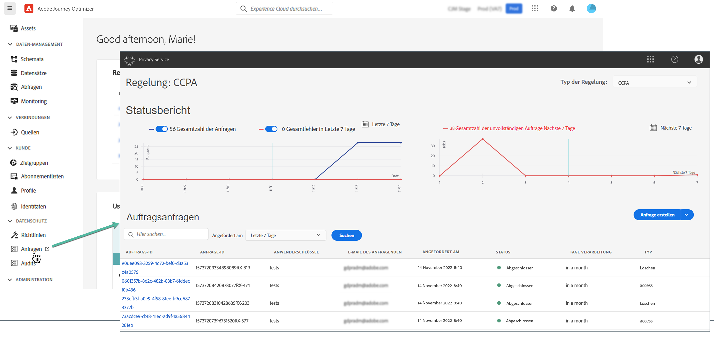

# Datenschutzanfragen {#track-changes}

Der **Privacy Service** von Adobe Experience Platform stellt eine RESTful-API und eine Benutzeroberfläche bereit, mit der Sie Anfragen zu Kundendaten verwalten können. Mit Privacy Service können Sie Anfragen zum Zugreifen auf und Löschen von personenbezogene(n) Kundendaten aus Adobe Experience Cloud-Programmen stellen, was die automatische Einhaltung gesetzlicher und unternehmensinterner Datenschutzbestimmungen erleichtert.

Datenschutzanfragen können über das Menü **[!UICONTROL Anfragen]** erstellt und verwaltet werden.

Weitere Informationen zu Privacy Service und zum Erstellen und Verwalten von Datenschutzanfragen finden Sie in der Adobe Experience Platform-Dokumentation:

* [Übersicht über den Privacy Service](https://experienceleague.adobe.com/docs/experience-platform/privacy/home.html?lang=de)
* [Verwalten von Datenschutzaufträgen in der Privacy Service-Benutzeroberfläche](https://experienceleague.adobe.com/docs/experience-platform/privacy/ui/user-guide.html?lang=de)
