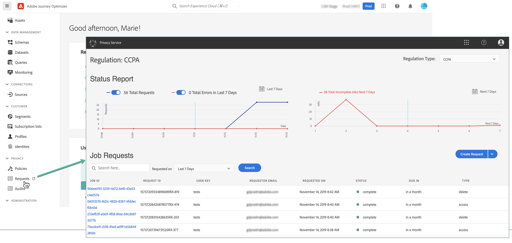
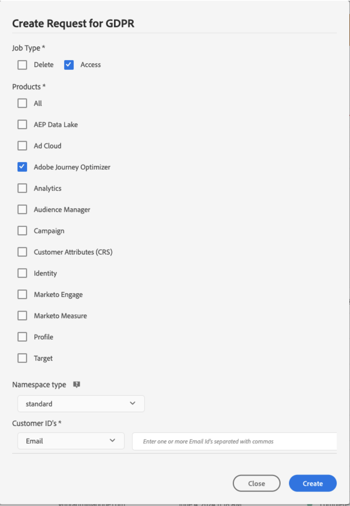
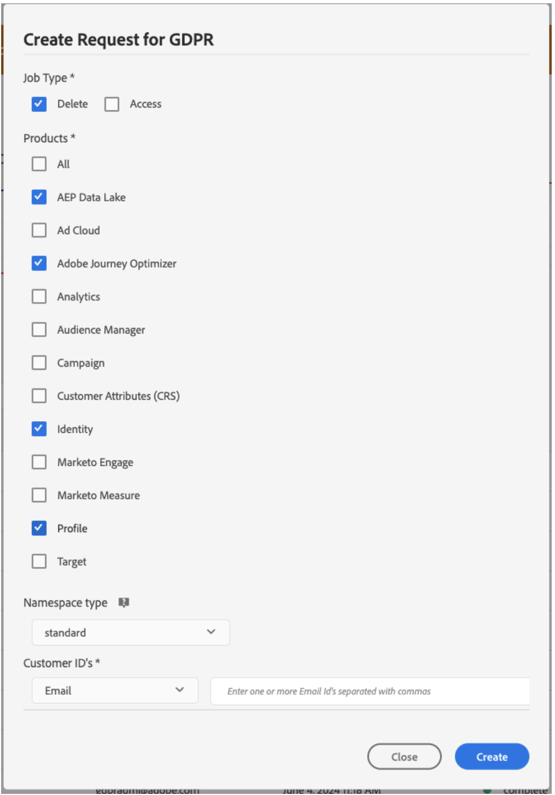

# Datenschutzanfragen {#track-changes}

>[!BEGINSHADEBOX]

**Auf dieser Seite:** Verwenden Sie den Adobe Experience Platform Privacy Service, um Datenzugriffs- und Löschungsanfragen für Adobe Journey Optimizer zu senden und zu verwalten, damit Sie die Rechte betroffener Personen erfüllen und die Einhaltung von Datenschutzbestimmungen automatisieren können.

>[!ENDSHADEBOX]

Der **Privacy Service** von Adobe Experience Platform stellt eine RESTful-API und eine Benutzeroberfläche bereit, mit der Sie Anfragen zu Kundendaten verwalten können. Mit Privacy Service können Sie Anfragen zum Zugreifen auf und Löschen von personenbezogene(n) Kundendaten aus Adobe Experience Cloud-Programmen stellen, was die automatische Einhaltung gesetzlicher und unternehmensinterner Datenschutzbestimmungen erleichtert.

Datenschutzanfragen können über das Menü **[!UICONTROL Anfragen]** erstellt und verwaltet werden.



Weitere Informationen zum Privacy Service und zum Erstellen und Verwalten von Datenschutzanfragen finden Sie in der [Dokumentation zu Adobe Experience Platform](https://experienceleague.adobe.com/docs/experience-platform/privacy/home.html?lang=de){target="_blank"}.

<!--
* [Privacy Service overview](https://experienceleague.adobe.com/docs/experience-platform/privacy/home.html?lang=de)
* [Managing privacy jobs in the Privacy Service UI](https://experienceleague.adobe.com/docs/experience-platform/privacy/ui/user-guide.html?lang=de)
-->

## Verwalten einzelner Datenschutzanfragen, die Sie an Adobe Journey Optimizer senden können {#data-privacy-requests}

Sie können individuelle Anfragen zum Zugriff auf und zum Löschen von Verbraucherdaten aus Adobe Journey Optimizer auf zwei Arten senden:

* Über die **Privacy Service-Benutzeroberfläche**. [Weitere Informationen](https://experienceleague.adobe.com/docs/experience-platform/privacy/ui/user-guide.html?lang=de){target="_blank"}
* Über die **Privacy Service-API**. [Weitere Informationen](https://experienceleague.adobe.com/de/docs/experience-platform/privacy/api/overview){target="_blank"}
  <!--More specific information on Privacy Service API [here](https://developer.adobe.com/experience-platform-apis/references/privacy-service/#_blank).-->

Privacy Service unterstützt zwei Arten von Anfragen: **Datenzugriff** und **Datenlöschung**.

Geben Sie für **Zugriffsanfragen** „**Adobe Journey Optimizer**“ über die Benutzeroberfläche an (oder „**CJM**“ als Produkt-Code in der API).

Für **Anfragen zum Löschen** müssen Sie zusätzlich zur Anfrage „**Adobe Journey Optimizer**“ auch Anfragen zum Löschen an **drei vorgelagerte Services** senden, um zu verhindern, dass Journey Optimizer die gelöschten Daten wieder aufnimmt. Wenn diese vorgelagerten Services nicht angegeben werden, bleibt die Anfrage „Adobe Journey Optimizer“ im Verarbeitungsstatus, bis Anfragen zum Löschen für die vorgelagerten Services erstellt werden.

Bei den drei vorgelagerten Services handelt es sich um:

* Profile (Produkt-Code: „profileService“)
* AEP Data Lake (Produkt-Code: „AdobeCloudPlatform“)
* Identity (Produkt-Code: „identity“)

>[!NOTE]
>
>In diesem Handbuch wird nur beschrieben, wie Sie Datenschutzanfragen für [!UICONTROL Adobe Journey Optimizer stellen].
>
>* Wenn Sie auch Datenschutzanfragen für den Platform-Data Lake planen, lesen Sie dieses [Handbuch](https://experienceleague.adobe.com/de/docs/experience-platform/catalog/privacy) zusätzlich zu diesem Tutorial.
>
>* Informationen zum Echtzeit-Kundenprofil finden Sie in diesem [Handbuch](https://experienceleague.adobe.com/de/docs/experience-platform/profile/privacy).
>* Informationen zu Identity Service finden Sie in diesem [Handbuch](https://experienceleague.adobe.com/de/docs/experience-platform/identity/privacy).
>
>Bei Anfragen zum Löschen und für den Zugriff müssen Sie diese einzelnen Systeme aufrufen, um sicherzustellen, dass die Anfragen von jedem einzelnen System bearbeitet werden. Durch eine Datenschutzanfrage an [!DNL Adobe Journey Optimizer] werden die Daten nicht aus all diesen Systemen entfernt.

## Erstellen von Zugriffs- und Löschanfragen

### Voraussetzungen

Um Anfragen für den Zugriff auf und zum Löschen von Daten in Adobe Journey Optimizer zu stellen, ist Folgendes erforderlich:

* eine Adobe-Organisations-ID
* eine Identitätskennung der Person, auf die Sie reagieren möchten, und die entsprechenden Namespaces. Weitere Informationen zu Identity-Namespaces in Adobe Journey Optimizer und Experience Platform finden Sie im Abschnitt [Übersicht zu Identity-Namespace](https://experienceleague.adobe.com/de/docs/experience-platform/identity/features/namespaces).

>[!IMPORTANT]
>
>Stellen Sie beim Senden von Datenschutzanfragen sicher, dass Sie „[!DNL '**Adobe Journey Optimizer**]“ als Zielproduktnamen und **alle Identity-Namespaces** (z. B. „E-Mail“, „ECID“ oder „Loyalty-ID“) angeben, die mit den Profildaten verknüpft sind, auf die zugegriffen werden muss oder die entfernt werden müssen. Insbesondere bei Löschanfragen werden keine Daten aus [!DNL Adobe Journey Optimizer] entfernt, wenn Sie den Produktnamen und alle anwendbaren Namespaces nicht explizit angeben.

### Erforderliche Feldwerte in Journey Optimizer für API-Anfragen

```json
"companyContexts":
    "namespace": imsOrgID
    "value": <Your Adobe Organization ID Value>

"users":
    "action": either access or delete

    "userIDs":
        "namespace": e.g. email, aaid, ecid, etc.
        "type": standard
        "value": <Data Subject's Identity Identifier>

"include":
    CJM (which is the Adobe product code for Adobe Journey Optimizer)
    profileService (product code for Profile)
    AdobeCloudPlatform (product code for AEP Data Lake)
    identity (product code for Identity)

"regulation":
    gdpr, ccpa, pdpa, lgpd_bra, or nzpa_nzl (which is the privacy regulation that applies to the request)
```


### Beispiel für eine DSGVO-Zugriffsanfrage:

Über die Benutzeroberfläche:

{width="60%" align="center"}

Über das API:

```json
// JSON Request
{
   "companyContexts":[
      {
         "namespace":"imsOrgID",
         "value":"745F37C35E4B776E0A49421B@AdobeOrg"
      }
   ],
   "users":[
      {
         "action":[
            "access"
         ],
         "userIDs":[
            {
               "namespace":"ecid",
               "value":"38400000-8cf0-11bd-b23e-10b96e40000d",
               "type":"standard"
            },
            {
               "namespace":"email",
               "value":"johndoe4@gmail.com",
               "type":"standard"
            }
         ]
      }
   ],
   "include":[
      "CJM"
   ],
   "regulation":"gdpr"
}
```

```json
// JSON Response
{
    "requestId": "17163122360480365RX-705",
    "totalRecords": 1,
    "jobs": [
        {
            "jobId": "e709b1f4-1796-11ef-b422-eddd0aebc40d",
            "customer": {
                "user": {
                    "key": "John Doe",
                    "action": [
                        "access"
                    ],
                    "userIDs": [
                        {
                            "namespace": "ecid",
                            "value": "38400000-8cf0-11bd-b23e-10b96e40000d",
                            "type": "standard",
                            "namespaceId": 4,
                            "isDeletedClientSide": false
                        },
                        {
                            "namespace": "email",
                            "value": "johndoe4@gmail.com",
                            "type": "standard",
                            "namespaceId": 6,
                            "isDeletedClientSide": false
                        }
                    ]
                }
            }
        }
    ]
}
```

### Beispiel für eine DSGVO-Anfrage zum Löschen:

Über die Benutzeroberfläche:

{width="60%" align="center"}

Über das API:

```json
// JSON Request
{
  "companyContexts": [
    {
      "namespace": "imsOrgID",
      "value": "745F37C35E4B776E0A49421B@AdobeOrg"
    }
  ],
  "users": [
    {
      "action": [
          "delete"
      ],
      "userIDs": [
        {
          "namespace": "ecid",
          "value": "38400000-8cf0-11bd-b23e-10b96e40000d",
          "type": "standard"
        },
                {
          "namespace": "email",
          "value": "johndoe4@gmail.com",
          "type": "standard"
        }
      ]
    }
  ],
  "include": [
    "CJM", "profileService", "AdobeCloudPlatform", "identity"
  ],
  "regulation": "gdpr"
}
```

```json
// JSON Response
{
    "requestId": "17163122360480365RX-705",
    "totalRecords": 1,
    "jobs": [
        {
            "jobId": "e709b1f4-1796-11ef-b422-eddd0aebc40d",
            "customer": {
                "user": {
                    "key": "John Doe",
                    "action": [
                        "delete"
                    ],
                    "userIDs": [
                        {
                            "namespace": "ecid",
                            "value": "38400000-8cf0-11bd-b23e-10b96e40000d",
                            "type": "standard",
                            "namespaceId": 4,
                            "isDeletedClientSide": false
                        },
                        {
                            "namespace": "email",
                            "value": "johndoe4@gmail.com",
                            "type": "standard",
                            "namespaceId": 6,
                            "isDeletedClientSide": false
                        }
                    ]
                }
            }
        }
    ]
}
```
