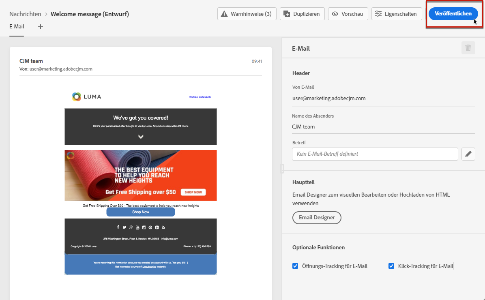
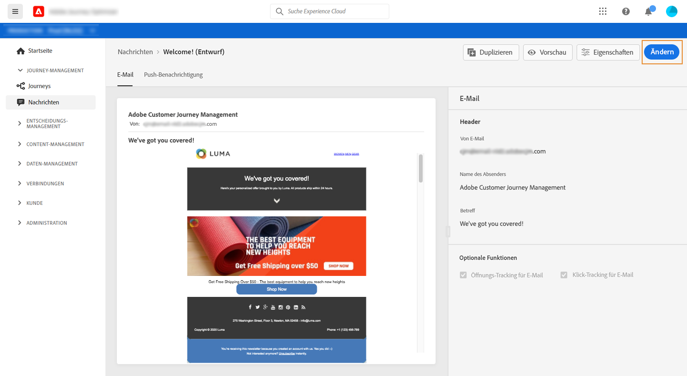

# Veröffentlichen von Nachrichten {#publish-manage-messages}

## Veröffentlichen einer Nachricht {#publish-message}

Nachdem die Nachricht erstellt wurde, können Sie diese veröffentlichen, um sie für die Ausführung verfügbar zu machen.

>[!CAUTION]
>
>Prüfen und lösen Sie Warnhinweise vor der Veröffentlichung. [Weitere Informationen](alerts.md).

Sobald die Nachricht veröffentlicht wurde, wird sie der Liste mit dem Status **[!UICONTROL Veröffentlicht]** hinzugefügt.

Nun kann sie von einer oder mehreren [Journeys](building-journeys/journey.md) ausgelöst werden.

## Aktualisieren einer schreibgeschützten Nachricht {#modify-message}

Nach der Veröffentlichung ist eine Nachricht im schreibgeschützten Modus. Sie können sie dennoch aktualisieren, indem Sie einen neuen Entwurf der Nachricht erstellen.

Dadurch können Sie Inhalte aktualisieren oder beispielsweise ein Problem beheben, ohne die gesamte Journey erneut zu veröffentlichen, in der Ihre Nachricht verwendet wird.

>[!NOTE]
>
>Die Entwurfsversion kann bereits bearbeitet werden, während die veröffentlichte Version noch veröffentlicht und aktiv ist.

So aktualisieren Sie eine veröffentlichte Nachricht:

1. Wählen Sie in der Liste die Nachricht aus, um sie zu öffnen.

1. Klicken Sie auf **[!UICONTROL Ändern]**.

   

1. Bestätigen Sie Ihre Auswahl. Eine Entwurfsversion der Nachricht wird erstellt.

   

1. Bearbeiten Sie den Inhalt oder ändern Sie die Einstellungen je nach Bedarf.
1. Klicken Sie auf **[!UICONTROL Veröffentlichen]**. Mit dieser Aktion wird die neue Version der Nachricht veröffentlicht, die für die nächsten Ausführungen verwendet wird.

Sobald die neue Version veröffentlicht ist, wird beim nächsten API-Aufruf eine neue Nachrichtenausführung generiert. Das nächste eingehende Profil erhält die neue Version.

<!--For batch messages, the audience/segment being processed in the previous execution will not be affected by the new version. Only the next incoming API call with an audience/segment will generate a new message execution with the new version. -->
