# Push-Benachrichtigungskanal konfigurieren {#push-notification-configuration}


Bevor Sie mit dem Senden von Push-Benachrichtigungen mit [!DNL Journey Optimizer] beginnen, müssen Sie die Einstellungen in [!DNL Adobe Experience Platform] und [!DNL Adobe Experience Platform Launch] definieren.

## Adobe Experience Platform-Einstellungen {#platform-settings}

Gehen Sie wie folgt vor, um Ihre Mobile App in [!DNL Adobe Experience Platform Launch] einzurichten:

1. [Zuweisen von Rechten für Eigenschaften und Unternehmen](#push-rights)
1. [Fügen Sie die Anmeldeinformationen für die Push-Funktion Ihrer Mobile App in Platform Launch hinzu](#push-credentials-launch).
1. [Erstellen Sie eine Edge-Konfiguration](#edge-configuration), die von der **[!UICONTROL Edge]**-Erweiterung verwendet wird, um benutzerdefinierte Daten von einem Mobilgerät an [!DNL Adobe Experience Platform] zu senden.
1. [Richten Sie eine Platform Launch-Eigenschaft ein](#launch-property).
1. [Veröffentlichen Sie die Eigenschaft](#publish-property).
1. [Konfigurieren Sie die ProfileDataSource](#configure-profiledatasource).

### Schritt 1: Weisen Sie Rechte für Eigenschaft und Unternehmen zu {#push-rights}

Bevor Sie eine Mobile App erstellen, müssen Sie zunächst sicherstellen, dass Sie die richtigen Benutzerberechtigungen haben oder zuweisen.

Weitere Informationen zur Benutzerverwaltung mit [!DNL Adobe Experience Platform Launch] finden Sie in der [Dokumentation zu Platform Launch](https://experienceleague.adobe.com/docs/launch/using/admin/user-permissions.html?lang=de).

So weisen Sie Rechte für Eigenschaften und Unternehmen zu:

1. Greifen Sie auf [!DNL Admin Console] zu.

1. Wählen Sie auf der Registerkarte **[!UICONTROL Produkte]** die Karte **[!UICONTROL Adobe Experience Platform Launch]** aus.

   

1. Wählen Sie ein vorhandenes **[!UICONTROL Profil]** aus oder erstellen Sie ein neues mit der Schaltfläche **[!UICONTROL Neues Profil]**. Weitere Informationen zum Erstellen eines **[!UICONTROL neuen Profils]** finden Sie in der [Dokumentation zur Admin Console](https://experienceleague.adobe.com/docs/experience-platform/access-control/ui/create-profile.html?lang=de#ui).

1. Wählen Sie auf der Registerkarte **[!UICONTROL Berechtigungen]** die Option **[!UICONTROL Eigenschaftenrechte]**.

   

1. Klicken Sie auf **[!UICONTROL Alle hinzufügen]**. Dadurch werden Ihrem Produktprofil die folgenden Rechte hinzugefügt:
   * **[!UICONTROL Genehmigen]**
   * **[!UICONTROL Entwickeln]**
   * **[!UICONTROL Umgebungen verwalten]**
   * **[!UICONTROL Erweiterungen verwalten]**
   * **[!UICONTROL Veröffentlichen]**

   

1. Wählen Sie dann im Menü links **[!UICONTROL Unternehmensrechte]**.

   

1. Fügen Sie die folgenden Rechte hinzu:

   * **[!UICONTROL Mobile-App-Konfigurationen verwalten]**
   * **[!UICONTROL Eigenschaften verwalten]**

   

1. Klicken Sie auf **[!UICONTROL Speichern]**.

So weisen Sie Benutzern dieses **[!UICONTROL Produktprofil]** zu:

1. Wählen Sie in [!DNL Admin Console] von der Registerkarte **[!UICONTROL Produkte]** die Karte **[!UICONTROL Adobe Experience Platform Launch]** aus.

1. Wählen Sie Ihr zuvor konfiguriertes **[!UICONTROL Produktprofil]** aus.

1. Klicken Sie auf der Registerkarte **[!UICONTROL Benutzer]** auf **[!UICONTROL Benutzer hinzufügen]**.

   

1. Geben Sie den Namen oder die E-Mail-Adresse Ihres Benutzers ein und wählen Sie den Benutzer aus. Klicken Sie dann auf **[!UICONTROL Speichern]**.

   >[!NOTE]
   >
   >Wenn der Benutzer vorher noch nicht in der Admin Console erstellt wurde, lesen Sie die [Dokumentation zum Hinzufügen von Benutzern](https://helpx.adobe.com/de/enterprise/admin-guide.html/enterprise/using/manage-users-individually.ug.html#add-users).

   


Sie haben jetzt die richtigen Benutzerberechtigungen, um eine Mobile App in [!DNL Adobe Experience Platform Launch] zu erstellen und zu konfigurieren.

### Schritt 2: Fügen Sie die Anmeldeinformationen für die Push-Funktion Ihrer Mobile App in Platform Launch hinzu {#push-credentials-launch}

Nachdem Sie die richtigen Benutzerberechtigungen erteilt haben, müssen Sie jetzt Ihre Push-Anmeldedaten für Mobile Apps in [!DNL Adobe Experience Platform Launch] hinzufügen.

Weitere Informationen und Verfahren zum Hinzufügen Ihrer Push-Anmeldedaten für Mobile Apps finden Sie in der [Dokumentation zum Adobe Experience Platform Mobile SDK](https://aep-sdks.gitbook.io/docs/beta/adobe-journey-optimizer#configure-the-journey-optimizer-extension-in-launch).

<!--
Note that to add push credentials in [!DNL Adobe Experience Platform Launch], the owner of the mobile app should fetch them from APNs/FCM.
1. From [!DNL Adobe Experience Platform Launch], ensure that **[!UICONTROL Client Side]** is selected in the drop-down menu.

1. Select the **[!UICONTROL App Configurations]** tab in the left-hand panel and click **[!UICONTROL App Configuration]** to create a new configuration.

1. Enter a **[!UICONTROL Name]** for the configuration.

1. From the **[!UICONTROL Messaging Service Type]** drop-down menu, select the **[!UICONTROL Messaging service type]** to be used for these credentials. Here, we selected **[!UICONTROL Apple Push Notification Service]** since we are working with iOS.

1. Enter the mobile app **[!UICONTROL Bundle Id]** in the **[!UICONTROL App ID (iOS Bundle ID)]** field if you are using Apple push notification service or in the **[!UICONTROL App ID (Android package name)]** field if you are using Firebase Cloud Messaging.

    

1. Drag and drop the .p8 key file or the .json private key file to the **[!UICONTROL Push Credentials]** field.

1. Enter the **[!UICONTROL Key Id]** and **[!UICONTROL Team Id]** if you are using Apple push notification service.

1. Click **[!UICONTROL Save]** to create your app configuration.
-->

### Schritt 3: Erstellen Sie die Edge-Konfiguration {#edge-configuration}

**[!UICONTROL Die Edge-Konfiguration]** wird von der **[!UICONTROL Edge]**-Erweiterung verwendet, um benutzerdefinierte Daten von einem Mobilgerät an [!DNL Adobe Experience Platform] zu senden.
Zum Konfigurieren von [!DNL Adobe Experience Platform] müssen Sie den Namen der **[!UICONTROL Sandbox]** und den **[!UICONTROL Ereignis-Datensatz]** angeben.

Weitere Informationen und Verfahren zum Erstellen der **[!UICONTROL Edge-Konfiguration]** finden Sie in den Schritten, die in der [Dokumentation zum Adobe Experience Platform Mobile SDK](https://aep-sdks.gitbook.io/docs/getting-started/configure-datastreams) beschrieben werden.


<!--
1. From [!DNL Adobe Experience Platform Launch], select the **[!UICONTROL Edge Configurations]** tab and click **[!UICONTROL Edge Configurations]**.
    
1. Select **[!UICONTROL New Edge Configuration]** to add a new **[!UICONTROL Edge Configuration]**.
1. Enter a **[!UICONTROL Name]** and click **[!UICONTROL Save]**

1. Click the **[!UICONTROL Adobe Experience Platform]** toggle to enable it.

1. Fill in the **[!UICONTROL Sandbox]**, **[!UICONTROL Event dataset]** and **[!UICONTROL Profile Dataset]** fields. Then, click **[!UICONTROL Save]**.
    
    
-->

### Schritt 4: Richten Sie eine Platform Launch-Eigenschaft ein {#launch-property}

Durch das Einrichten einer [!DNL Adobe Experience Platform Launch]-Eigenschaft kann der Entwickler oder Marketer der Mobile App die Attribute der Mobile-SDKs konfigurieren wie Sitzungszeitlimits, die [!DNL Adobe Experience Platform]-Sandbox, die als Ziel dienen sollen, und die **[!UICONTROL Adobe Experience Platform-Datensätze]**, die für das Mobile-SDK zum Senden von Daten an verwendet werden sollen.

Weitere Informationen und Verfahren zum Einrichten einer **[!UICONTROL Platform launch-Eigenschaft]** finden Sie in der [Adobe Experience Platform Mobile SDK-Dokumentation](https://aep-sdks.gitbook.io/docs/getting-started/create-a-mobile-property#create-a-mobile-property).

Damit die SDKs, die für die Push-Benachrichtigung benötigt werden, funktionieren, benötigen Sie die folgenden SDK-Erweiterungen für Android und iOS:

* **[!UICONTROL Mobile Core]** (wird automatisch installiert)
* **[!UICONTROL Profile]** (wird automatisch installiert)
* **[!UICONTROL Adobe Experience Platform Edge]**
* **[!UICONTROL Adobe Experience Platform Assurance]**, optional, wird aber zum Debuggen der mobilen Implementierung empfohlen.

Weitere Informationen zu [!DNL Adobe Experience Platform Launch]-Erweiterungen finden Sie in der [Dokumentation zu Platform Launch](https://experienceleague.adobe.com/docs/launch-learn/implementing-in-mobile-android-apps-with-launch/configure-launch/launch-add-extensions.html?lang=de).

<!--

1. From [!DNL Adobe Experience Platform Launch], ensure that **[!UICONTROL Client Side]** is selected in the drop-down menu.

1. select the **[!UICONTROL Properties]** tab and click **[!UICONTROL New Property]**.

    

1. Enter a **[!UICONTROL Name]** for your new property.

1. Select **[!UICONTROL Mobile]** as **[!UICONTROL Platform]**.

    

1. Click **[!UICONTROL Save]** to create your new property.

To configure **[!UICONTROL Adobe Experience Platform Edge Extension]** to send custom data from mobile devices to [!DNL Adobe Experience Platform].

1. Select your previously created property and select the **[!UICONTROL Extensions]** tab to view the extensions for this property.

    

1. Click **[!UICONTROL Configure]** under the **[!UICONTROL Adobe Experience Platform Edge]** Network' extension.

1. From the **[!UICONTROL Edge Configuration]** drop-down list, select the **[!UICONTROL Edge Configuration]** created in the previous steps. For more information on **[!UICONTROL Edge Configuration]**, refer to this [section](#edge-configuration).

1. Click **[!UICONTROL Save]**.

To configure **[!UICONTROL Adobe Experience Platform Messaging]** extension to send push profile and push interactions to the correct datasets, follow the same steps as above. Use **[!UICONTROL Sandbox]**, **[!UICONTROL Event dataset]** and **[!UICONTROL Profile Dataset]** created in the [Adobe Experience Platform setup](#edge-configuration).
-->

### Schritt 5: Veröffentlichen Sie die Eigenschaft {#publish-property} 

Sie müssen die Eigenschaft jetzt veröffentlichen, um Ihre Konfiguration zu integrieren und sie in der Mobile App zu verwenden.

Informationen zum Veröffentlichen Ihrer Eigenschaft finden Sie in den Schritten, die in der [Dokumentation zum Adobe Experience Platform Mobile SDK](https://aep-sdks.gitbook.io/docs/getting-started/create-a-mobile-property#publish-the-configuration) beschrieben sind.

### Schritt 6: Konfigurieren Sie die ProfileDataSource {#configure-profiledatasource}

Um die `ProfileDataSource` zu konfigurieren, verwenden Sie die `ProfileDCInletURL` vom [!DNL Adobe Experience Platform]-Setup und fügen Sie Folgendes in der Mobile App hinzu:

```
    MobileCore.updateConfiguration(
    mutableMapOf("messaging.dccs" to <ProfileDCSInletURL>)
```

<!--
## Test your mobile app with custom action {#mobile-app-test}

After configuring your mobile app in both Adobe Experience Platform and Adobe Launch, you can now test it before sending push notifications to your profiles. In this use case, we will create a journey to target our mobile app and set a custom action which will trigger the push notification.

You can use a test mobile app for this use case. For more on this, refer to this [page](https://wiki.corp.adobe.com/pages/viewpage.action?spaceKey=CJM&title=Details+of+setting+the+mobile+test+app) (internal use only).

For this journey to work, you need to create an XDM schema. For more information, refer to [XDM documentation](https://experienceleague.adobe.com/docs/experience-platform/xdm/schema/composition.html?lang=en#schemas-and-data-ingestion).

1. In the left menu, click **[!UICONTROL Data]** then **[!UICONTROL Schemas]** under **[!UICONTROL Data management]** to create your XDM schema.

    

1. Click **[!UICONTROL Create schema]** then select **[!UICONTROL XDM Experience event]**.

    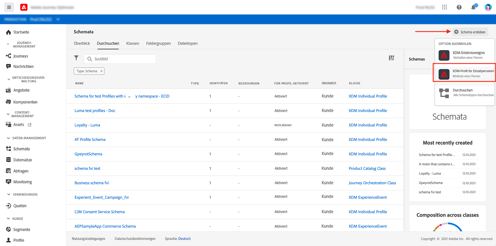

1. In the right pane, enter the name of your schema and description. Enable this schema for **[!UICONTROL Profile]**.

1. In the left pane, click **[!UICONTROL Add]** under **[!UICONTROL Mixins]** and select  **[!UICONTROL Create a new Mixin]**. For more information on how to create mixin, refer to [XDM System documentation](https://experienceleague.adobe.com/docs/experience-platform/xdm/api/create-mixin.html?lang=en#api).

    

1. Enter a **[!UICONTROL Display Name]** and a **[!UICONTROL Description]**. Click **[!UICONTROL Add mixin]** when done.

    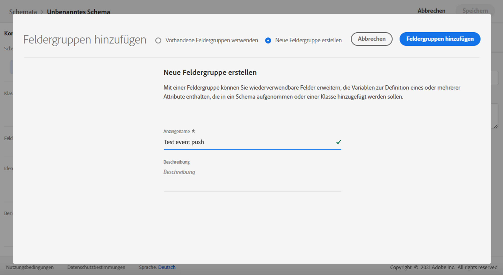

1. In the **[!UICONTROL Field properties]** window, add a **[!UICONTROL Field name]**, **[!UICONTROL Display name]** and select **[!UICONTROL String]** as **[!UICONTROL Type]**.

    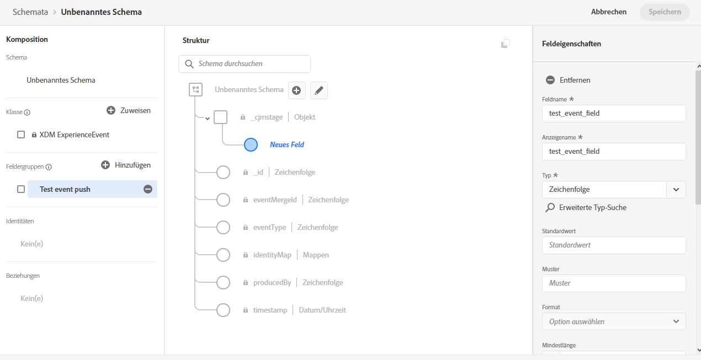

1. Check **[!UICONTROL Required]** and click **[!UICONTROL Apply]**.

1. Click **[!UICONTROL Save]**. Your schema is now created and can be used in an **[!UICONTROL Event schema]**.

You then need to set up an **[!UICONTROL Event schema]** where you will set the custom action which you will need to enter in your mobile app to trigger your push notification.

1. From the left menu of the home page, click the **[!UICONTROL Admin]** icon, then click **[!UICONTROL Manage]** from the **[!UICONTROL Events]** card to create your new **[!UICONTROL Event schema]**.

1. Click **[!UICONTROL Add]**, the event configuration pane opens on the right side of the screen.

    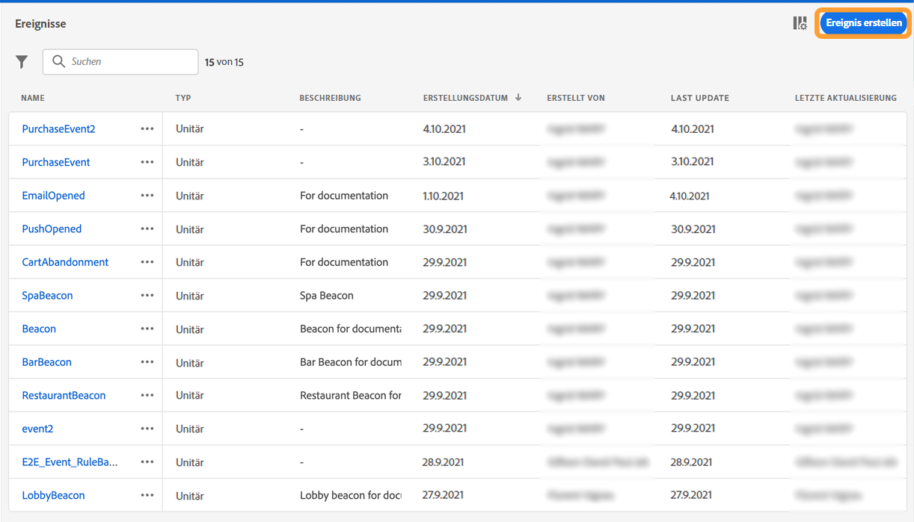

1. Enter the name of your event. You can also add a description.

1. In the **[!UICONTROL Event ID type]** field, select **[!UICONTROL Rule Based]**.

1. In the **[!UICONTROL Parameters]**, select your previously created XDM event.

    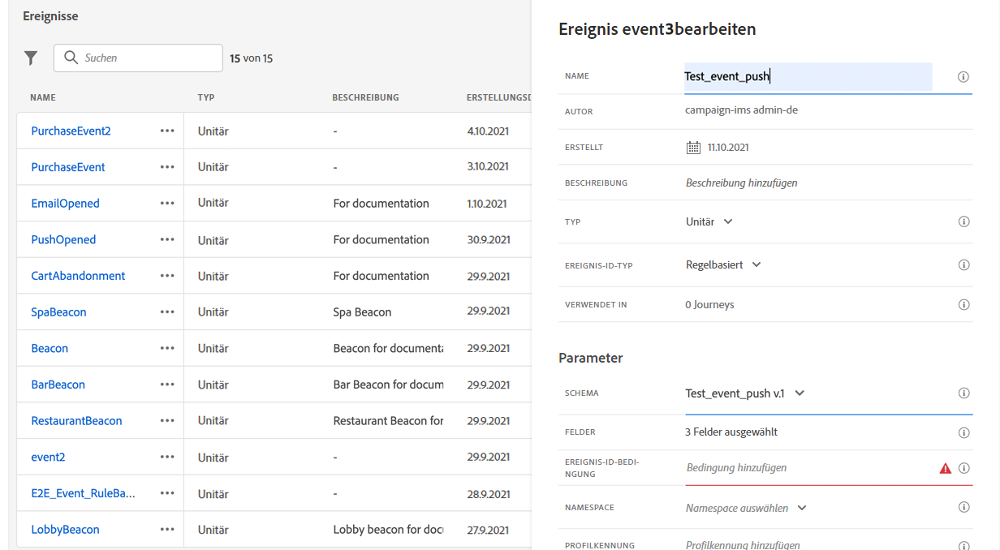

1. Click **[!UICONTROL Edit]** in the **[!UICONTROL Event ID condition]** field.

1. Drag and your previously added mixin to define the condition that will be used by the system to identify the events that will trigger your journey.

    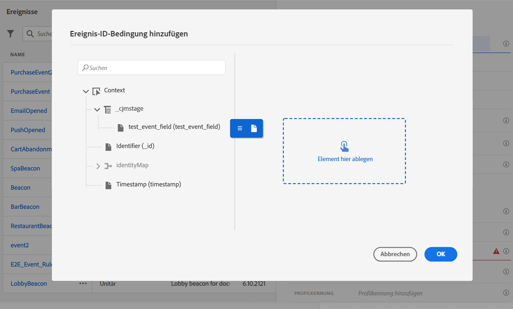

1. Type in the syntax that you will need to use to trigger your push notification in your test app, in this example **order confirmation**.

    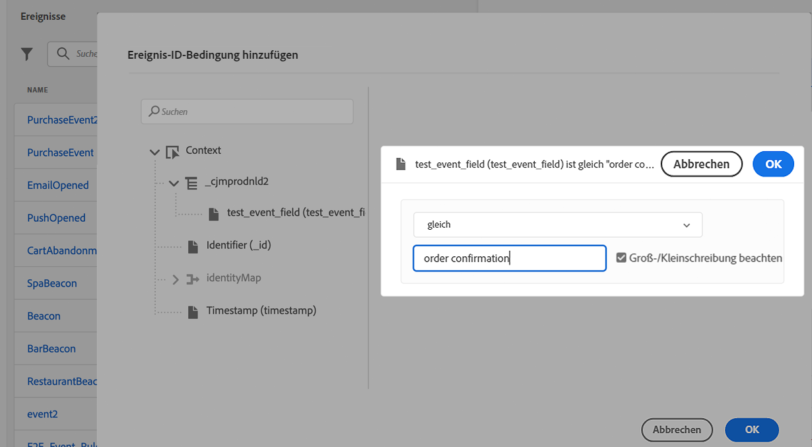

1. Select **[!UICONTROL ECID]** as your **[!UICONTROL Namespace]**.

1. Click **[!UICONTROL Ok]** then **[!UICONTROL Save]**.

Your **[!UICONTROL Event schema]** is now created and can now be used in a journey.

1. In the left menu from [!DNL Journey Optimizer] homepage, click **[!UICONTROL Journeys]**.

1. Click **[!UICONTROL Create]** to create a new journey.

    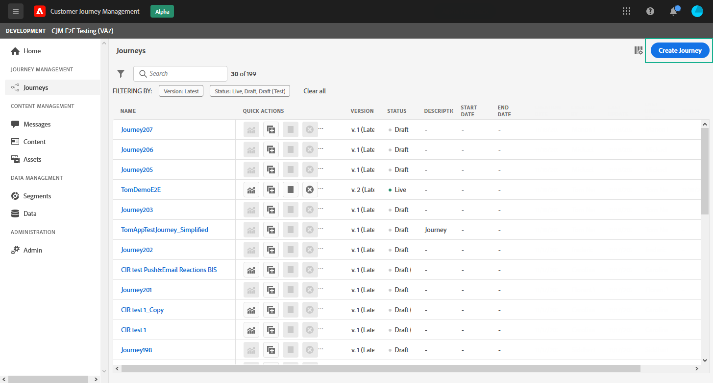

1. Edit the journey's properties in the configuration pane displayed on the right side. Learn more in this [section](building-journeys/journey-gs.md#change-properties).

1. Start by drag and dropping the **[!UICONTROL Event schema]** created in the previous steps from the **[!UICONTROL Events]** drop-down.

    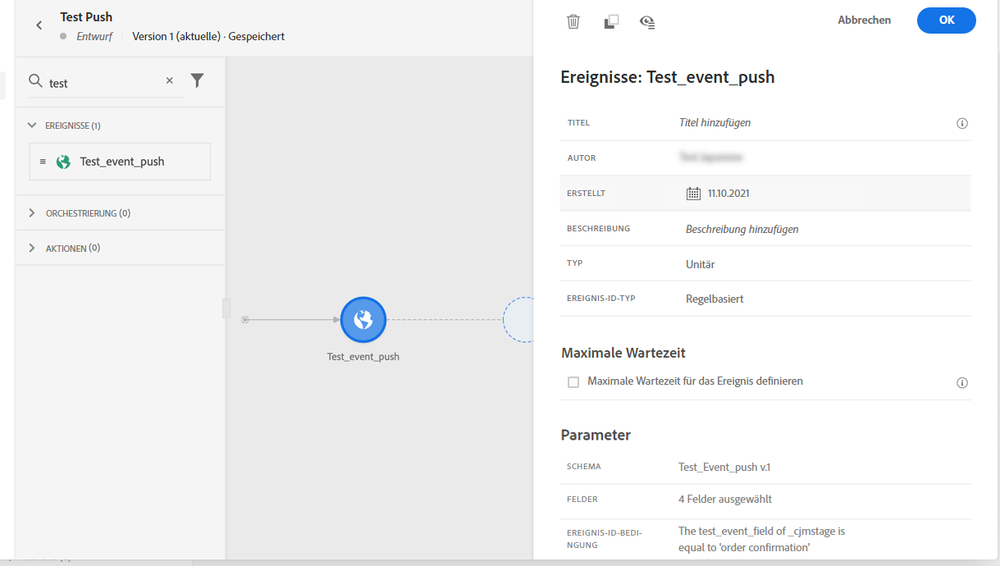

1. From the **[!UICONTROL Actions]** drop-down, drag and drop a **[!UICONTROL Message]** activity to your journey.

1. Select a previously created message. For more information on how to create push notifications, refer to this [page](create-message.md).

1. Drag and drop an **[!UICONTROL End]** activity to your journey.

1. Activate **[!UICONTROL Test]** to your journey to start testing your push notifications and click **[!UICONTROL Trigger an event]**.

    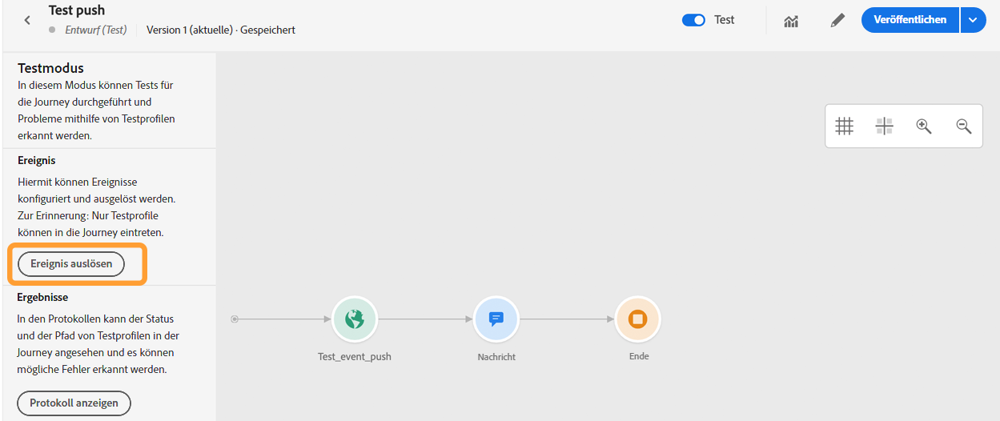

1. Enter your ECID in the **[!UICONTROL Key]** field then your event that will trigger the push notification in our case **order confirmation**.

    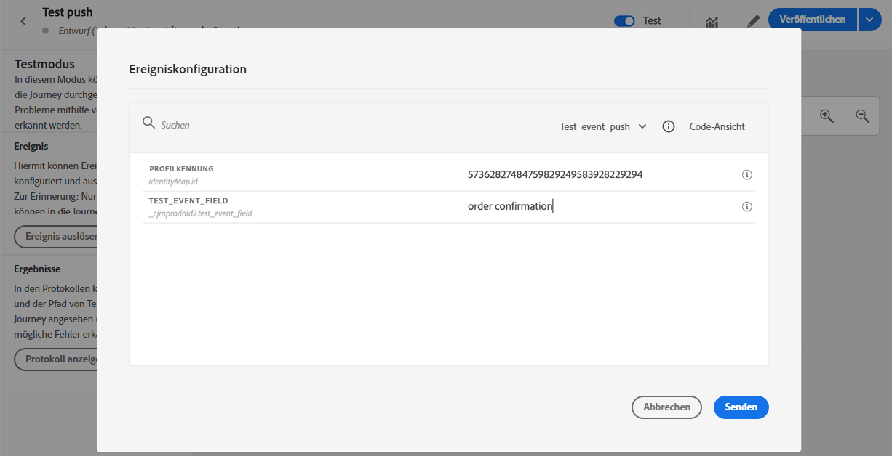

1. Click **[!UICONTROL Send]**.

Your event will be triggered and you will receive your push notification to your mobile app.


-->

### Schritt 7: Nachrichtenvorgabe {#message-preset} erstellen

Nachdem Ihre Mobile App in [!DNL Adobe Experience Platform Launch] eingerichtet wurde, müssen Sie eine Nachrichtenvorgabe erstellen, damit Sie Push-Benachrichtigungen von **[!DNL Journey Optimizer]** senden können.

In [diesem Abschnitt](configuration/message-presets.md) erfahren Sie, wie Sie eine Nachrichtenvorgabe erstellen und konfigurieren.