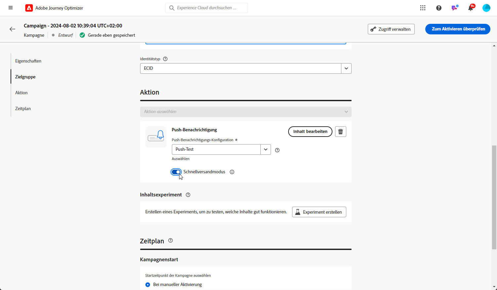

# Erstellen einer Push-Benachrichtigung {#create-push-notification}

>[!CONTEXTUALHELP]
>id="ajo_message_push"
>title="Erstellen von Push-Benachrichtigungen"
>abstract="Fügen Sie Ihre Push-Benachrichtigung hinzu und personalisieren Sie sie mit dem Ausdruckseditor."

## Erstellen der Push-Benachrichtigung in einer Journey oder Kampagne {#create}

Gehen Sie wie folgt vor, um eine Push-Benachrichtigung zu erstellen:

>[!BEGINTABS]

>[!TAB Hinzufügen einer Push-Benachrichtigung zu einer Journey]

1. Öffnen Sie die Journey und platzieren Sie per Drag-and-Drop eine Push-Aktivität aus dem Bereich „Aktionen“ der Palette.

   

1. Geben Sie allgemeine Informationen (Titel, Beschreibung, Kategorie) zu Ihrer Nachricht ein und wählen Sie dann die zu verwendende Nachrichtenoberfläche aus. Das Feld **[!UICONTROL Oberfläche]** ist standardmäßig mit der letzten Oberfläche für den Kanal vorausgefüllt, den die Benutzerin oder der Benutzer verwendet hat.

   

   >[!NOTE]
   >
   >Wenn Sie eine Push-Benachrichtigung aus einer Journey heraus versenden, können Sie die Sendezeitoptimierungsfunktion von Adobe Journey Optimizer nutzen, um den besten Zeitpunkt für den Versand der Nachricht vorherzusagen und so die Kundenbindung basierend auf historischen Öffnungs- und Klickraten zu maximieren. [Erfahren Sie, wie man mit der Sendezeitoptimierung arbeitet](../building-journeys/journeys-message.md#send-time-optimization)

   Weitere Informationen zur Konfiguration der Journey finden Sie auf [dieser Seite](../building-journeys/journey-gs.md).

1. Zum Konfigurieren des Inhalts der Push-Benachrichtigung klicken Sie im Konfigurationsbildschirm der Journey auf die Schaltfläche **[!UICONTROL Inhalt bearbeiten]**. [Gestalten einer Push-Benachrichtigung](design-push.md)

1. Sobald der Inhalt der Nachricht erstellt wurde, können Sie mithilfe von Testprofilen eine Vorschau erstellen und einen Testversand durchführen.

1. Wenn Ihre Push-Benachrichtigung fertig ist, schließen Sie zum Versenden die Konfiguration Ihrer [Journey](../building-journeys/journey-gs.md) ab.

   Um das Verhalten der Empfänger anhand des Öffnens von Push-Benachrichtigungen und/oder anhand von Interaktionen zu verfolgen, stellen Sie sicher, dass die entsprechenden Optionen im Tracking-Abschnitt der [E-Mail-Aktivität](../building-journeys/journeys-message.md) aktiviert sind.

>[!TAB Hinzufügen einer Push-Benachrichtigung zu einer Kampagne]

1. Erstellen Sie eine neue geplante oder durch eine API ausgelöste Kampagne, wählen Sie als Aktion **[!UICONTROL Push-Benachrichtigung]** aus und wählen Sie die **[!UICONTROL App-Benutzeroberfläche]**, die verwendet werden soll. [Weitere Informationen zur Konfiguration von Push-Benachrichtigungen](push-configuration.md).

   

1. Klicken Sie auf **[!UICONTROL Erstellen]**.

1. Bearbeiten Sie im Bereich **[!UICONTROL Eigenschaften]** den **[!UICONTROL Titel]** und die **[!UICONTROL Beschreibung]** Ihrer Kampagne.

   

1. Klicken Sie auf die Schaltfläche **[!UICONTROL Audience auswählen]**, um die Audience aus der Liste der verfügbaren Adobe Experience Platform-Segmente zu definieren. [Weitere Informationen](../segment/about-segments.md).

1. Wählen Sie im Feld **[!UICONTROL Identity-Namespace]** den Namespace aus, der zur Identifizierung der Personen im ausgewählten Segment verwendet werden soll. [Weitere Informationen](../event/about-creating.md#select-the-namespace).

   

1. Klicken Sie auf **[!UICONTROL Experiment erstellen]**, um mit der Konfiguration Ihres Inhaltsexperiments zu beginnen und Abwandlungen zu erstellen, deren Leistung zu messen und die beste Option für Ihre Zielgruppe zu ermitteln. [Weitere Informationen](../campaigns/content-experiment.md)

1. Kampagnen sind so konzipiert, dass sie an einem bestimmten Datum oder in regelmäßigen Abständen ausgeführt werden. Erfahren Sie in [diesem Abschnitt](../campaigns/create-campaign.md#schedule), wie Sie den **[!UICONTROL Zeitplan]** der Kampagne konfigurieren können.

1. Wählen Sie im Menü **[!UICONTROL Aktionsauslöser]** die **[!UICONTROL Häufigkeit]** Ihrer Push-Benachrichtigung:

   * Einmal
   * Täglich
   * Wöchentlich
   * Monatlich

1. Zum Konfigurieren des Inhalts der Push-Benachrichtigung klicken Sie im Konfigurationsbildschirm der Kampagne auf die Schaltfläche **[!UICONTROL Inhalt bearbeiten]**. [Gestalten einer Push-Benachrichtigung](design-push.md)

1. Sobald der Inhalt der Nachricht erstellt wurde, können Sie mithilfe von Testprofilen eine Vorschau erstellen und einen Testversand durchführen.

1. Wenn Ihre Push-Benachrichtigung fertig ist, schließen Sie zum Versenden die Konfiguration Ihrer [Kampagne](../campaigns/create-campaign.md) ab.

   Um das Verhalten der Empfänger anhand des Öffnens von Push-Benachrichtigungen und/oder anhand von Interaktionen zu verfolgen, stellen Sie sicher, dass die entsprechenden Optionen im Tracking-Abschnitt der [Kampagne](../campaigns/create-campaign.md) aktiviert sind.

>[!ENDTABS]

**Verwandte Themen**

* [Konfigurieren des Push-Kanals](push-gs.md)
* [Hinzufügen einer Nachricht zu einer Journey](../building-journeys/journeys-message.md)

## Schnellversand-Modus {#rapid-delivery}

>[!CONTEXTUALHELP]
>id="ajo_campaigns_rapid_delivery"
>title="Schnellversand-Modus"
>abstract="Der Schnellversand-Modus ermöglicht den extrem schnellen Nachrichtenversand über den Push-Kanal an eine Audience von weniger als 30 Millionen Kontakten."

Der schnelle Bereitstellungsmodus ist eine [!DNL Journey Optimizer] -Add-on, das den sehr schnellen Versand von Push-Nachrichten in großen Mengen durch Kampagnen ermöglicht.

Der Schnellversand wird verwendet, wenn eine Verzögerung beim Nachrichtenversand geschäftskritisch wäre oder wenn Sie eine dringende Push-Benachrichtigung an Mobiltelefone senden möchten, z. B. eine Eilmeldung an Benutzende, die Ihre Nachrichten-App installiert haben.

Weitere Informationen zur Leistung bei Verwendung des Schnellversand-Modus finden Sie unter [Produktbeschreibung für Adobe Journey Optimizer](https://helpx.adobe.com/de/legal/product-descriptions/adobe-journey-optimizer.html).

### Voraussetzungen {#prerequisites}

Für Nachrichten mit Schnellversand gelten folgende Anforderungen:

* Der Schnellversand ist nur für **[!UICONTROL geplante]** Kampagnen verfügbar und nicht für Kampagnen, die über eine API ausgelöst werden.
* In der Push-Benachrichtigung ist keine Personalisierung zulässig,
* Die Audience muss weniger als 30 Millionen Profile enthalten.
* Im Schnellversand-Modus können Sie bis zu 5 Kampagnen gleichzeitig ausführen.

### Aktivieren des Schnellversand-Modus

1. Erstellen Sie eine Push-Benachrichtigungskampagne und aktivieren Sie die Option **[!UICONTROL Schnellversand]**.

1. Konfigurieren Sie den Inhalt der Nachricht und wählen Sie die Audience aus. [Erfahren Sie, wie Sie eine Kampagne erstellen](#create)

   >[!IMPORTANT]
   >
   >Stellen Sie sicher, dass der Inhalt der Nachricht keine Personalisierung enthält und dass die Audience weniger als 30 Millionen Profile umfasst.

1. Überprüfen und aktivieren Sie Ihre Kampagne wie gewohnt. Beachten Sie, dass im Testmodus Nachrichten nicht über den Schnellversand-Modus gesendet werden.