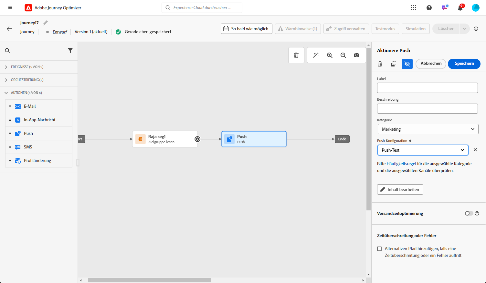

# Erstellen einer Push-Benachrichtigung {#create-push-notification}

>[!CONTEXTUALHELP]
>id="ajo_message_push"
>title="Erstellen von Push-Benachrichtigungen"
>abstract="Fügen Sie Ihre Push-Benachrichtigung hinzu und personalisieren Sie sie mit dem Ausdruckseditor."

## Push-Benachrichtigung in einer Journey oder Kampagne erstellen {#create}

Gehen Sie wie folgt vor, um eine Push-Benachrichtigung zu erstellen:

>[!BEGINTABS]

>[!TAB Hinzufügen eines Push zu einer Journey]

1. Öffnen Sie die Journey und ziehen Sie eine Push-Aktivität per Drag-and-Drop aus dem Bereich Aktionen der Palette.

   

1. Geben Sie grundlegende Informationen zu Ihrer Nachricht ein (Titel, Beschreibung, Kategorie) und wählen Sie dann die zu verwendende Nachrichtenoberfläche aus.

   

   >[!NOTE]
   >
   >Wenn Sie eine Push-Benachrichtigung von einer Journey senden, können Sie die Sendezeitoptimierungsfunktion von Adobe Journey Optimizer nutzen, um die beste Sendezeit für die Nachricht vorherzusagen und so die Interaktion basierend auf historischen Öffnungs- und Klickraten zu maximieren. [Erfahren Sie, wie Sie mit der Sendezeitoptimierung arbeiten.](../building-journeys/journeys-message.md#send-time-optimization)

   Weitere Informationen zum Konfigurieren einer Journey finden Sie unter [diese Seite](../building-journeys/journey-gs.md)

1. Klicken Sie im Journey-Konfigurationsbildschirm auf das **[!UICONTROL Inhalt bearbeiten]** Schaltfläche zum Konfigurieren des Push-Inhalts. [Push-Benachrichtigung erstellen](design-push.md)

1. Sobald der Inhalt der Nachricht erstellt wurde, können Sie mithilfe von Testprofilen eine Vorschau erstellen und einen Testversand durchführen.

1. Wenn Ihre Push-Benachrichtigung fertig ist, schließen Sie die Konfiguration Ihrer [Journey](../building-journeys/journey-gs.md) , um es zu versenden.

   Um das Verhalten Ihrer Empfänger über Push-Öffnungen und/oder Interaktionen zu verfolgen, stellen Sie sicher, dass die dedizierten Optionen im Tracking-Abschnitt im Abschnitt [E-Mail-Aktivität](../building-journeys/journeys-message.md).

>[!TAB Hinzufügen einer Push-Benachrichtigung zu einer Kampagne]

1. Erstellen Sie eine neue geplante oder API-gesteuerte Kampagne und wählen Sie **[!UICONTROL Push-Benachrichtigung]** als Aktion und wählen Sie die **[!UICONTROL Anwendungsoberfläche]** verwendet werden. [Weitere Informationen zur Push-Konfiguration](push-configuration.md).

   

1. Klicken Sie auf **[!UICONTROL Erstellen]**.

1. Bearbeiten Sie im Bereich **[!UICONTROL Eigenschaften]** den **[!UICONTROL Titel]** und die **[!UICONTROL Beschreibung]** Ihrer Kampagne.

   

1. Klicken Sie auf die Schaltfläche **[!UICONTROL Audience auswählen]**, um die Audience aus der Liste der verfügbaren Adobe Experience Platform-Segmente zu definieren. [Weitere Informationen](../segment/about-segments.md).

1. Wählen Sie im Feld **[!UICONTROL Identity-Namespace]** den Namespace aus, der zur Identifizierung der Personen im ausgewählten Segment verwendet werden soll. [Weitere Informationen](../event/about-creating.md#select-the-namespace).

   

1. Kampagnen sind so konzipiert, dass sie an einem bestimmten Datum oder in regelmäßigen Abständen ausgeführt werden. Erfahren Sie in [diesem Abschnitt](../campaigns/create-campaign.md#schedule), wie Sie den **[!UICONTROL Zeitplan]** der Kampagne konfigurieren können.

1. Aus dem **[!UICONTROL Action Triggers]** Menü, wählen Sie die **[!UICONTROL Häufigkeit]** Ihrer Push-Benachrichtigung:

   * Einmal
   * Täglich
   * Wöchentlich
   * Monatlich

1. Klicken Sie im Konfigurationsbildschirm der Kampagne auf die Schaltfläche **[!UICONTROL Inhalt bearbeiten]** Schaltfläche zum Konfigurieren des Push-Inhalts. [Push-Benachrichtigung erstellen](design-push.md)

1. Sobald der Inhalt der Nachricht erstellt wurde, können Sie mithilfe von Testprofilen eine Vorschau erstellen und einen Testversand durchführen.

1. Wenn Ihre Push-Benachrichtigung fertig ist, schließen Sie die Konfiguration Ihrer [Kampagne](../campaigns/create-campaign.md) , um es zu versenden.

   Um das Verhalten Ihrer Empfänger über Push-Öffnungen und/oder Interaktionen zu verfolgen, stellen Sie sicher, dass die dedizierten Optionen im Tracking-Abschnitt im Abschnitt [Kampagne](../campaigns/create-campaign.md).

>[!ENDTABS]

**Verwandte Themen**

* [Konfigurieren des Push-Kanals](push-gs.md)
* [Hinzufügen einer Nachricht zu einer Journey](../building-journeys/journeys-message.md)

## Schnellversand-Modus {#rapid-delivery}

>[!CONTEXTUALHELP]
>id="ajo_campaigns_rapid_delivery"
>title="Schnellversand-Modus"
>abstract="Schnellversand-Modus ermöglicht den Versand von Nachrichten mit hoher Geschwindigkeit über den Push-Kanal an eine Audience von weniger als 30 Millionen Mitgliedern."

Der Schnellversand-Modus, der in Journeys früher als Burst-Modus bezeichnet wurde, ist ein Add-on für [!DNL Journey Optimizer], das den sehr schnellen Versand von Push-Nachrichten in großen Mengen im Rahmen von Kampagnen ermöglicht.

Der Schnellversand wird verwendet, wenn eine Verzögerung beim Nachrichtenversand geschäftskritisch wäre oder wenn Sie eine dringende Push-Benachrichtigung an Mobiltelefone senden möchten, z. B. eine Eilmeldung an Benutzende, die Ihre Nachrichten-App installiert haben.

Weitere Informationen zur Leistung bei Verwendung des Schnellversand-Modus finden Sie unter [Produktbeschreibung für Adobe Journey Optimizer](https://helpx.adobe.com/de/legal/product-descriptions/adobe-journey-optimizer.html).

### Voraussetzungen {#prerequisites}

Für Nachrichten mit Schnellversand gelten folgende Anforderungen:

* Der Schnellversand ist nur für **[!UICONTROL geplante]** Kampagnen verfügbar und nicht für Kampagnen, die über eine API ausgelöst werden.
* In der Push-Benachrichtigung ist keine Personalisierung zulässig,
* Die Audience muss weniger als 30 Millionen Profile enthalten.
* Im Modus Schneller Versand können Sie bis zu fünf Kampagnen gleichzeitig ausführen.

### Aktivieren des Schnellversand-Modus

1. Erstellen Sie eine Push-Benachrichtigungskampagne und aktivieren Sie die Option **[!UICONTROL Schnellversand]**.

1. Konfigurieren Sie den Inhalt der Nachricht und wählen Sie die Audience aus. [Erfahren Sie, wie Sie eine Kampagne erstellen](#create)

   >[!IMPORTANT]
   >
   >Stellen Sie sicher, dass der Inhalt der Nachricht keine Personalisierung enthält und dass die Audience weniger als 30 Millionen Profile umfasst.

1. Überprüfen und aktivieren Sie Ihre Kampagne wie gewohnt. Beachten Sie, dass im Testmodus Nachrichten nicht über den Schnellversand-Modus gesendet werden.