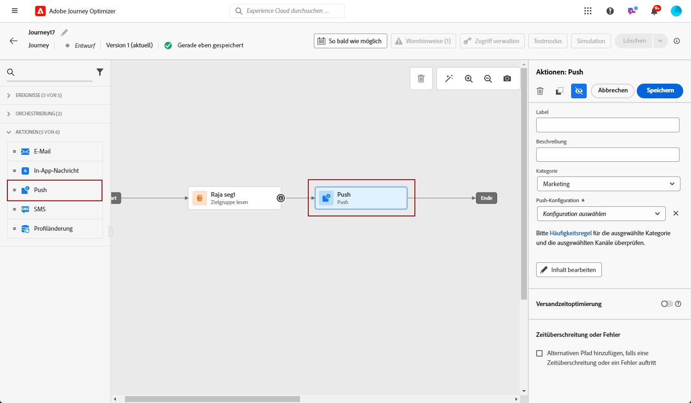

# Erstellen einer Push-Benachrichtigung {#create-push-notification}

>[!CONTEXTUALHELP]
>id="ajo_message_push"
>title="Erstellen von Push-Benachrichtigungen"
>abstract="Fügen Sie Ihre Push-Benachrichtigung hinzu und personalisieren Sie sie mit dem Personalisierungseditor."

Sie können Push-Benachrichtigungen für Mobilgeräte (iOS und Android) und Webbrowser erstellen. Auf dieser Seite werden Sie durch den Prozess zum Einrichten einer Push-Benachrichtigung in einer Journey oder Kampagne geführt.

## Erstellen der Push-Benachrichtigung in einer Journey oder Kampagne {#create}

Gehen Sie wie folgt vor, um eine Push-Benachrichtigung zu erstellen:

>[!BEGINTABS]

>[!TAB Hinzufügen einer Push-Benachrichtigung zu einer Journey]

1. Öffnen Sie Ihren Journey und ziehen Sie eine **[!UICONTROL Aktion]**-Aktivität per Drag-and-Drop aus dem Bereich **[!UICONTROL Aktionen]** der Palette. Weitere Informationen über die [Aktionsaktivität](../building-journeys/journey-action.md).

   >[!IMPORTANT]
   >
   >Da nun über die Aktivität Aktion auf alle nativen Kanäle zugegriffen werden kann, werden alte native Kanalaktivitäten mit der März-Version eingestellt. Vorhandene Journey mit Legacy-Aktionen funktionieren weiterhin wie bisher - es ist keine Migration erforderlich.

1. Wählen **[!UICONTROL als]** „Push“ aus.

   

1. Geben Sie einen **[!UICONTROL Titel]** ein, um Ihre Aktion auf der Journey-Arbeitsfläche zu identifizieren.

1. Klicken Sie auf **[!UICONTROL Schaltfläche „Aktion konfigurieren]**.

1. Sie werden zur Registerkarte **[!UICONTROL Aktionen]** geleitet. Wählen oder erstellen Sie dort die zu verwendende Push-Konfiguration. [Weitere Informationen](push-configuration.md)

   

1. Zusätzlich gilt:

   * Sie können Begrenzungsregeln auf Ihre Push-Aktion anwenden, indem Sie einen Regelsatz in der Dropdown-Liste **[!UICONTROL Geschäftsregeln]** auswählen. [Weitere Informationen](../conflict-prioritization/channel-capping.md)

   * Sie können die Option **[!DNL Send time optimization]** verwenden, um die beste Versandzeit für die Nachricht vorherzusagen und so die Interaktion basierend auf historischen Öffnungs- und Klickraten zu maximieren. [Weitere Informationen](../building-journeys/send-time-optimization.md)

1. Verwenden Sie den **[!UICONTROL Schnellversand-Modus]**, um Ihre Push-Benachrichtigung in großen Mengen zu senden. [Weitere Informationen](#rapid-delivery)

1. Klicken Sie auf die **[!UICONTROL Inhalt bearbeiten]** und erstellen Sie den Inhalt nach Bedarf. [Weitere Informationen](design-push.md)

1. Sobald der Nachrichteninhalt definiert wurde, können Sie mithilfe von Testprofilen oder Beispieleingabedaten, die aus einer CSV- oder JSON-Datei hochgeladen oder manuell hinzugefügt wurden, eine Vorschau des Inhalts anzeigen. [Weitere Informationen](send-push.md)

1. Zurück zur Journey-Arbeitsfläche. Schließen Sie bei Bedarf Ihren Journey-Fluss ab, indem Sie zusätzliche Aktionen oder Ereignisse per Drag-and-Drop verschieben. [Weitere Informationen](../building-journeys/about-journey-activities.md)

   >[!NOTE]
   >
   >Um das Verhalten der Empfänger anhand des Öffnens von Push-Benachrichtigungen und/oder anhand von Interaktionen zu verfolgen, stellen Sie sicher, dass die entsprechenden Optionen im Tracking-Abschnitt der [E-Mail-Aktivität](../building-journeys/journey-action.md) aktiviert sind.

Weitere Informationen zum Erstellen, Konfigurieren und Veröffentlichen einer Journey finden Sie auf [dieser Seite](../building-journeys/journey-gs.md).

>[!TAB Hinzufügen einer Push-Benachrichtigung zu einer Kampagne]

1. Rufen Sie das Menü **[!UICONTROL Kampagnen]** auf und klicken Sie auf **[!UICONTROL Kampagne erstellen]**.

1. Wählen Sie den Typ der Kampagne aus, die Sie ausführen möchten.

   * **Geplant – Marketing**: die Kampagne wird sofort oder an einem bestimmten Datum ausgeführt. Geplante Kampagnen dienen dem Versand von Marketing-Nachrichten. Sie werden über die Benutzeroberfläche konfiguriert und ausgeführt.

   * **API-ausgelöst – Marketing/Transaktion**: die Kampagne wird mithilfe eines API-Aufrufs ausgeführt.  API-ausgelöste Kampagnen zielen auf den Versand von Nachrichten des Typs „Marketing“ oder „Transaktion“ ab. Beim Typ „Transaktion“ handelt es sich um Nachrichten, die nach einer von einem Kontakt durchgeführten Aktion verschickt werden: Zurücksetzen des Passworts und Verlassen des Warenkorbs.

1. Bearbeiten Sie im Bereich **[!UICONTROL Eigenschaften]** den **[!UICONTROL Titel]** und die **[!UICONTROL Beschreibung]** Ihrer Kampagne.

1. Klicken Sie auf die Schaltfläche **[!UICONTROL Zielgruppe auswählen]**, um die Zielgruppe aus der Liste der verfügbaren Adobe Experience Platform-Zielgruppen zu definieren. [Weitere Informationen](../audience/about-audiences.md).

1. Wählen Sie im Feld **[!UICONTROL Identity-Namespace]** den Namespace aus, der zur Identifizierung der Personen in der ausgewählten Zielgruppe verwendet werden soll. [Weitere Informationen](../event/about-creating.md#select-the-namespace).

1. Wählen Sie im Abschnitt **[!UICONTROL Aktionen]** die Option **[!UICONTROL Push-Benachrichtigung]** aus und wählen Sie eine Konfiguration aus oder erstellen Sie eine neue Konfiguration.

   Erfahren Sie mehr über die Push-Konfiguration für Mobile [auf dieser Seite](push-configuration.md) und für Web [auf dieser Seite](push-configuration-web.md).

   

1. Klicken Sie auf **[!UICONTROL Experiment erstellen]**, um mit der Konfiguration Ihres Inhaltsexperiments zu beginnen und Abwandlungen zu erstellen, deren Performance zu messen und die beste Option für Ihre Zielgruppe zu ermitteln. [Weitere Informationen](../content-management/content-experiment.md)

1. Kampagnen sind so konzipiert, dass sie an einem bestimmten Datum oder in regelmäßigen Abständen ausgeführt werden. Erfahren Sie in [diesem Abschnitt](../campaigns/create-campaign.md#schedule), wie Sie den **[!UICONTROL Zeitplan]** der Kampagne konfigurieren können.

1. Wählen Sie im Menü **[!UICONTROL Aktionsauslöser]** die **[!UICONTROL Häufigkeit]** Ihrer Push-Benachrichtigung:

   * Einmal
   * Täglich
   * Wöchentlich
   * Monatlich

1. Zum Konfigurieren des Inhalts der Push-Benachrichtigung klicken Sie im Konfigurationsbildschirm der Kampagne auf die Schaltfläche **[!UICONTROL Inhalt bearbeiten]**. [Gestalten einer Push-Benachrichtigung](design-push.md)

1. Sobald der Nachrichteninhalt definiert wurde, können Sie mithilfe von Testprofilen oder Beispieleingabedaten, die aus einer CSV- oder JSON-Datei hochgeladen oder manuell hinzugefügt wurden, eine Vorschau des Inhalts anzeigen. [Weitere Informationen](send-push.md)

1. Wenn Ihre Push-Benachrichtigung fertig ist, schließen Sie zum Versenden die Konfiguration Ihrer [Kampagne](../campaigns/create-campaign.md) ab.

   Um das Verhalten der Empfänger anhand des Öffnens von Push-Benachrichtigungen und/oder anhand von Interaktionen zu verfolgen, stellen Sie sicher, dass die entsprechenden Optionen im Tracking-Abschnitt der [Kampagne](../campaigns/create-campaign.md) aktiviert sind.

Weitere Informationen zum Erstellen, Konfigurieren und Aktivieren einer Kampagne finden Sie auf [ Seite](../campaigns/get-started-with-campaigns.md).

>[!ENDTABS]

**Verwandte Themen**

* [Konfigurieren des Push-Kanals](push-gs.md)
* [Hinzufügen einer Nachricht zu einer Journey](../building-journeys/journey-action.md)

## Schnellversand-Modus {#rapid-delivery}

>[!CONTEXTUALHELP]
>id="ajo_campaigns_rapid_delivery"
>title="Schnellversand-Modus"
>abstract="Der Schnellversand-Modus ermöglicht den extrem schnellen Nachrichtenversand über den Push-Kanal an eine Zielgruppe von weniger als 30 Millionen Kontakten."

Der Schnellversand-Modus ist ein Add-on für [!DNL Journey Optimizer], das den sehr schnellen Versand von Push-Nachrichten in großen Mengen im Rahmen von Kampagnen ermöglicht.

Der Schnellversand wird verwendet, wenn eine Verzögerung beim Nachrichtenversand geschäftskritisch wäre oder wenn Sie eine dringende Push-Benachrichtigung an Mobiltelefone senden möchten, z. B. eine Eilmeldung an Benutzende, die Ihre Nachrichten-App installiert haben.

Weitere Informationen zur Leistung bei Verwendung des Schnellversandmodus finden Sie unter [Produktbeschreibung für Adobe Journey Optimizer](https://helpx.adobe.com/de/legal/product-descriptions/adobe-journey-optimizer.html){target="_blank"}.

### Voraussetzungen {#prerequisites}

Für Nachrichten mit Schnellversand gelten folgende Anforderungen:

* Der Schnellversand ist nur für **[!UICONTROL geplante]** Kampagnen verfügbar und nicht für Kampagnen, die über eine API ausgelöst werden.
* In der Push-Benachrichtigung ist keine Personalisierung zulässig,
* Die Zielgruppe muss weniger als 30 Millionen Profile enthalten.
* Im Schnellversand-Modus können Sie bis zu 5 Kampagnen gleichzeitig ausführen.

### Aktivieren des Schnellversand-Modus

1. Erstellen Sie eine Push-Benachrichtigungskampagne und aktivieren Sie die Option **[!UICONTROL Schnellversand]**.

   

1. Konfigurieren Sie den Inhalt der Nachricht und wählen Sie die Zielgruppe aus. [Erfahren Sie, wie Sie eine Kampagne erstellen](#create)

   >[!IMPORTANT]
   >
   >Stellen Sie sicher, dass der Inhalt der Nachricht keine Personalisierung enthält und dass die Zielgruppe weniger als 30 Millionen Profile umfasst.

1. Überprüfen und aktivieren Sie Ihre Kampagne wie gewohnt. Beachten Sie, dass im Testmodus Nachrichten nicht über den Schnellversand-Modus gesendet werden.