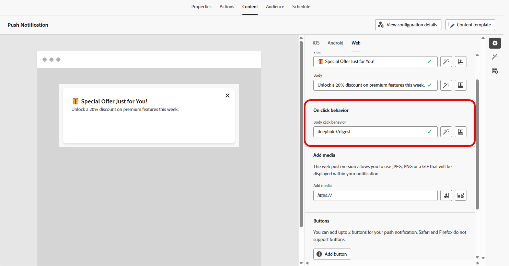
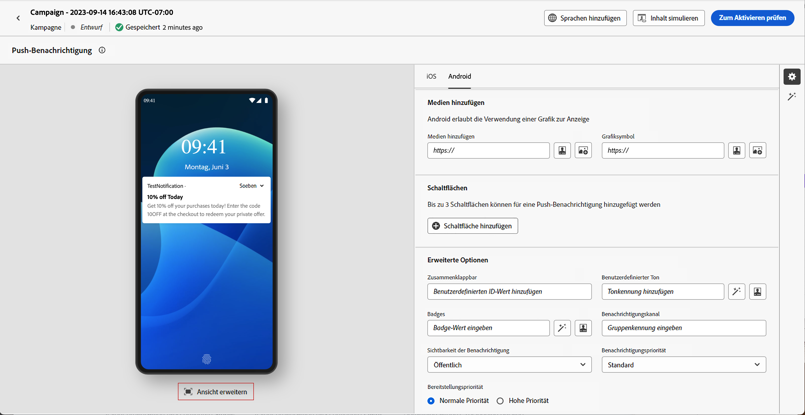

# Gestalten einer Web-Push-Benachrichtigung {#design-push-notification}

>[!AVAILABILITY]
>
>Derzeit unterstützen Web-Push-Benachrichtigungen in Journey Optimizer nicht die Funktion **Stille Benachrichtigung**, sie werden jedoch zu einem späteren Zeitpunkt verfügbar sein.

Nachdem Sie Ihre Web-Push-Benachrichtigungskampagne oder -Journey erstellt haben, können Sie den Inhalt und die Struktur entsprechend Ihren Anforderungen gestalten. Beachten Sie, dass vor dem Senden einer Web-Push-Benachrichtigung dieser Kanal zunächst in Ihrer [Kanalkonfiguration](push-configuration-web.md) konfiguriert werden muss.

<!--
## Send a silent notification {#silent-notification}

A silent push notification (also called a background notification) is a hidden message sent to your web application without alerting the user.

To enable a silent notification, enable the **[!UICONTROL Silent Notification]** option. When this option is used, the notification is delivered directly to the application, and no alert, banner, or sound is shown to the user.

Use the **Custom Data** section to include additional information in the form of key-value pairs. 

-->

## Titel und Textkörper {#push-title-body}

Um eine Nachricht zu erstellen, klicken Sie auf die Felder **[!UICONTROL Titel]** und **[!UICONTROL Textkörper]**. Verwenden Sie den Personalisierungseditor, um Inhalte zu definieren, [Daten zu personalisieren](../personalization/personalize.md) und [dynamische Inhalte](../personalization/get-started-dynamic-content.md) hinzuzufügen. 

Klicken Sie auf **[!UICONTROL Text mit KI-Assistenten bearbeiten]**, um Ihre Inhalte einfach mithilfe des KI-Assistenten von Journey Optimizer zu generieren.

## Klickverhalten {#on-click-behavior}

Verwenden Sie das Feld **[!UICONTROL Verhalten bei Klick auf Hauptteil]**, um einen Deeplink zu definieren, der bestimmt, was passiert, wenn Benutzende auf den Benachrichtigungstext klicken. Auf diese Weise können Sie Benutzende direkt zu einer bestimmten Seite oder einem bestimmten Abschnitt Ihrer Web-Anwendung weiterleiten.

## Hinzufügen von Medien {#add-media-push}

Geben Sie die Medien-URL in das Feld **[!UICONTROL Medien hinzufügen]** ein. Sie können auch Personalisierungs-Token in die URL aufnehmen, um den Inhalt für alle Benutzenden anzupassen.

Klicken Sie , um Medien schnell mithilfe des KI-Assistenten von Journey Optimizer zu generieren.

## Hinzufügen von Schaltflächen {#add-buttons-push}

Gestalten Sie Ihre Web-Push-Benachrichtigungen interaktiv, indem Sie Ihrem Inhalt Schaltflächen hinzufügen.

Beachten Sie, dass Schaltflächen nur angezeigt werden, wenn das Gerät entsperrt ist. Wenn der Bildschirm gesperrt ist, werden nur **[!UICONTROL Titel]** und **[!UICONTROL Nachricht]** angezeigt.

Verwenden Sie die Option **[!UICONTROL Schaltfläche hinzufügen]**, um das Label jeder Schaltfläche und die zugehörige Aktion zu definieren, wie unten beschrieben:

* **[!UICONTROL Deeplink]**: Leitet Benutzende zu einer bestimmten Ansicht, einem bestimmten Abschnitt oder einer bestimmten Registerkarte in Ihrer App weiter. Geben Sie die Deeplink-URL in das entsprechende Feld ein.

* **[!UICONTROL Web-URL]**: Leitet Benutzende zu einer externen Web-Seite weiter. Fügen Sie die URL in das entsprechende Feld ein.

## Benutzerdefinierte Daten {#custom-data}

Im Abschnitt **[!UICONTROL Benutzerdefinierte Daten]** können Sie der Benachrichtigungs-Payload benutzerdefinierte Schlüssel-Wert-Paare hinzufügen. Diese Werte können von Ihrer Web-Anwendung verwendet werden, um bestimmte Aktionen auszulösen oder das Anwendererlebnis anzupassen. Weitere Informationen zum Einrichten von Push-Benachrichtigungen in Adobe Experience Platform finden Sie in [diesem Abschnitt](push-gs.md).

