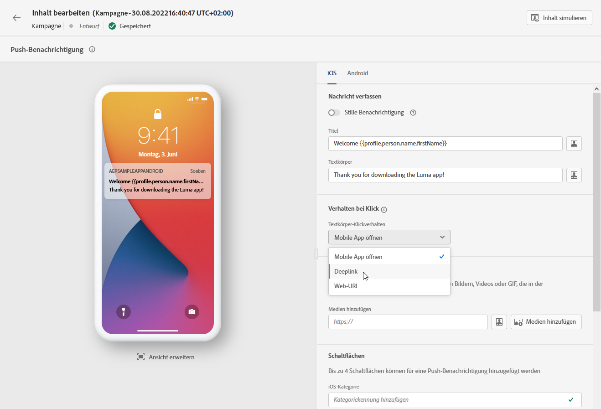
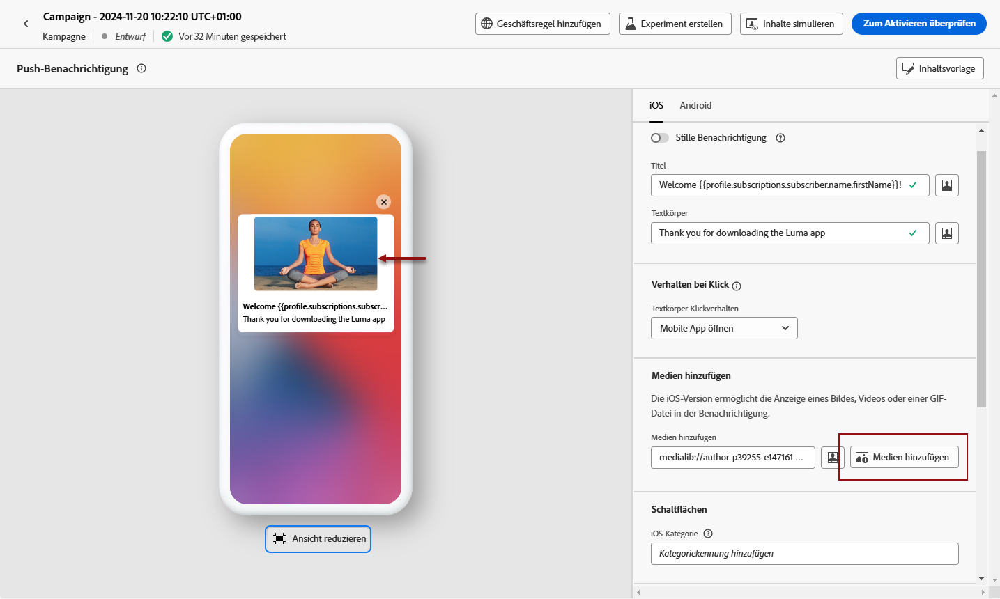
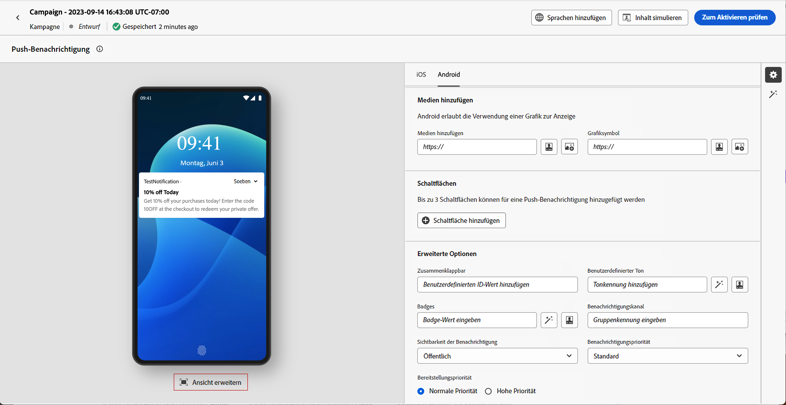

# Gestalten einer Push-Benachrichtigung {#design-push-notification}

## Titel und Hauptteil {#push-title-body}

>[!CONTEXTUALHELP]
>id="ajo-message-push-compose"
>title="Personalisieren Sie Ihre Push-Benachrichtigung."
>abstract="Um Ihre Nachricht zu erstellen, geben Sie den Inhalt in die Felder „Titel“ und „Hauptteil“ ein. Um Personalisierungs-Token einzuschließen, öffnen Sie das Personalisierungsdialogfeld."

Um eine Nachricht zu erstellen, klicken Sie auf die Felder **[!UICONTROL Titel]** und **[!UICONTROL Hauptteil]**. Verwenden Sie den Ausdruckseditor, um Inhalte zu definieren, Daten zu personalisieren und dynamische Inhalte hinzuzufügen. Weitere Informationen zu [Personalisierung](../personalization/personalize.md) und [dynamischen Inhalten](../personalization/get-started-dynamic-content.md) finden Sie im Ausdruckseditor.

Im Bereich für die Gerätevorschau sehen Sie, wie die Push-Benachrichtigung auf iOS- und Android-Geräten dargestellt wird.

## Klickverhalten {#on-click-behavior}

>[!CONTEXTUALHELP]
>id="ajo-message-push-onclick"
>title="Über das Klickverhalten"
>abstract="Wählen Sie das Verhalten, wenn ein Empfänger auf den Hauptteil der Push-Benachrichtigung klickt."

Sie können das Verhalten bestimmen, wenn ein Empfänger auf den Hauptteil der Push-Benachrichtigung klickt.

* Um die App zu öffnen, wählen Sie die Option **[!UICONTROL App öffnen]**. Die mit der Benachrichtigung verknüpfte App wird in der [Kanaloberfläche](../configuration/channel-surfaces.md) definiert (d. h. Nachrichtenvoreinstellung).
* Um den Benutzer zu einem bestimmten Inhaltselement innerhalb einer App umzuleiten, wählen Sie die Option **[!UICONTROL Deeplink]**.  Der bestimmte Inhalt kann eine Ansicht, ein Abschnitt einer Seite oder eine Registerkarte sein. Geben Sie nach Auswahl der Option den Deeplink in das entsprechende Feld ein.
* Um den Benutzer zu einer externen URL umzuleiten, verwenden Sie die Option **[!UICONTROL Web-URL]**. Geben Sie nach Auswahl der Option die URL in das entsprechende Feld ein.

## Hinzufügen von Medien {#add-media-push}

>[!CONTEXTUALHELP]
>id="ajo-message-push-media"
>title="Hinzufügen von Medien zu Push-Benachrichtigungen"
>abstract="Sie können ein Bild, ein Video oder ein GIF hinzufügen, das in Ihrer Benachrichtigung angezeigt wird."

In der iOS-Version Ihrer Push-Benachrichtigung können Sie ein Bild, ein Video oder ein GIF hinzufügen, das in Ihrer Benachrichtigung angezeigt wird.

In der Android-Version können Sie nur ein Bildsymbol und ein Bild für erweiterte Benachrichtigungen hinzufügen.

Dazu sind zwei Optionen verfügbar. Sie haben folgende Möglichkeiten:

* Klicken Sie auf die Schaltfläche **[!UICONTROL Medien hinzufügen]**, um ein Asset in **[!DNL Adobe Experience Manager Assets]** auszuwählen.

  Wie Sie **[!DNL Adobe Experience Manager Assets]** verwenden, erfahren Sie auf [dieser Seite](../content-management/assets.md).

* Oder geben Sie die URL des Mediums im Feld **[!UICONTROL Medien hinzufügen]** ein. In diesem Fall können Sie die URL personalisieren.

Nach dem Hinzufügen werden die Medien rechts neben dem Textkörper der Benachrichtigung angezeigt.

## Hinzufügen von Schaltflächen {#add-buttons-push}

>[!CONTEXTUALHELP]
>id="ajo-message-push-buttons"
>title="Fügen Sie Schaltflächen hinzu, über die Benutzende mit Ihrer Push-Benachrichtigung interagieren können."
>abstract="In diesem Abschnitt können Sie Aktionsaufruf-Schaltflächen zu Ihrer Nachricht hinzufügen. Geben Sie für iOS eine Kennung der Benachrichtigungskategorie an. Für Android können Sie für jede Schaltfläche benutzerdefinierten Text und Ziele hinzufügen."

Erstellen Sie eine verwertbare Benachrichtigung, indem Sie Ihrem Push-Inhalt Schaltflächen hinzufügen.

Wenn der Gerätebildschirm gesperrt ist, werden diese Schaltflächen nicht angezeigt: Nur der **Titel** und die **Nachricht** der Benachrichtigung sind sichtbar. Wenn das Gerät entsperrt ist, sehen die Empfänger die Schaltflächen.

In der Android-Version können Sie bis zu drei Schaltflächen hinzufügen.

In der iOS-Version wird eine Kategoriekennung der Benachrichtigung angegeben. Benachrichtigungskategorien müssen in der iOS-App vorkonfiguriert werden. Dadurch werden die anzuzeigenden Schaltflächen und die durchgeführten Aktionen definiert. Weitere Informationen dazu finden Sie in der [Apple-Dokumentation](https://developer.apple.com/documentation/usernotifications/declaring_your_actionable_notification_types).

1. Klicken Sie auf die **[!UICONTROL Schaltfläche „Hinzufügen“]**, um die Einstellungen zu definieren: den Titel und die zugehörige Aktion. Mögliche Aktionen sind die gleichen wie für das [Verhalten bei Klick](#on-click-behavior).

1. Verwenden Sie für eine Vorschau Ihrer personalisierten Schaltflächen das Symbol **[!UICONTROL Ansicht erweitern]** unter dem zentralen Vorschaubild.

   

## Senden einer stillen Benachrichtigung {#silent-notification}

>[!CONTEXTUALHELP]
>id="ajo_message_push_silent_notification"
>title="Über stille Benachrichtigungen"
>abstract="Senden Sie Benachrichtigungen, ohne den Benutzer zu stören, denn die Benachrichtigungen werden nicht im Benachrichtigungszentrum oder in der Benachrichtigungsleiste angezeigt."

Eine stille Push-Benachrichtigung (oder Hintergrundbenachrichtigung) ist eine versteckte Anweisung, die an die Mobile App gesendet wird. Sie wird beispielsweise verwendet, um Ihre Mobile App über die Verfügbarkeit von neuem Inhalt zu informieren oder einen Download im Hintergrund zu starten.

Wählen Sie die Option **[!UICONTROL Stille Benachrichtigung]** aus, um die Mobile App im Hintergrund zu benachrichtigen. In diesem Fall wird die Benachrichtigung direkt auf die Mobile App übertragen. Auf dem Bildschirm des Geräts wird dabei kein Warnhinweis angezeigt.

Verwenden Sie den Abschnitt **[!UICONTROL Benutzerdefinierte Daten]**, um Schlüssel-Wert-Paare hinzuzufügen.

## Benutzerspezifische Daten {#custom-data}

>[!CONTEXTUALHELP]
>id="ajo-message-push-custom"
>title="Konfigurieren Sie benutzerdefinierte Daten für Ihre Push-Benachrichtigung."
>abstract="Fügen Sie der Payload je nach Konfiguration Ihrer Mobile App benutzerdefinierte Variablen hinzu."

Im Abschnitt **[!UICONTROL Benutzerdefinierte Daten]** können Sie der Payload je nach Konfiguration Ihrer Mobile App benutzerdefinierte Variablen hinzufügen. Weitere Informationen zum Einrichten von Push-Benachrichtigungen in Adobe Experience Platform und zu Adobe Launch finden Sie in [diesem Abschnitt](push-gs.md)

## Erweiterte Optionen {#advanced-options-push}

>[!CONTEXTUALHELP]
>id="ajo-message-push-advanced"
>title="Konfigurieren Sie erweiterte Optionen für Ihre Push-Benachrichtigung."
>abstract="In diesem Abschnitt können Sie die Personalisierung Ihrer Push-Benachrichtigung optimieren."

Sie können **[!UICONTROL Erweiterte Optionen]** für Ihre Push-Benachrichtigung konfigurieren. Die verfügbaren Parameter sind unten aufgeführt:

| Parameter | Beschreibung |
|---------|---------|
| **[!UICONTROL Reduzierbar]** (iOS/Android) | Eine ausblendbare Nachricht ist eine Nachricht, die durch eine neue Nachricht ersetzt werden kann, wenn sie veraltet ist. Häufig werden ausblendbare Nachrichten verwendet, um eine Mobile App anzuweisen, Daten vom Server zu synchronisieren. Ein Beispiel wäre eine Sport-App, die Benutzer über den aktuellen Spielstand auf dem Laufenden hält. Nur die neueste Nachricht ist relevant. Bei nicht ausblendbaren Nachrichten ist hingegen jede Nachricht wichtig für die Mobile App und muss zugestellt werden. |
| **[!UICONTROL Benutzerdefinierter Ton]** (iOS/Android) | Der Ton, der beim Empfang der Benachrichtigung vom Mobilgerät wiedergegeben wird. Der Ton muss in der Mobile App verfügbar sein. |
| **[!UICONTROL Badges]** (iOS/Android) | Mit einem Badge wird die Anzahl der neuen ungelesenen Nachrichten direkt auf dem Mobile-App-Symbol angezeigt.  Der Badge-Wert verschwindet, sobald der Benutzer den neuen Inhalt in der Mobile App öffnet oder liest. Wenn eine Benachrichtigung auf einem Gerät empfangen wird, kann der Badge-Wert für die entsprechende Mobile App aktualisiert oder hinzugefügt werden. Beispiel: Wenn Sie die Anzahl der ungelesenen Artikel Ihrer Kunden erfassen, können Sie eine Personalisierung anwenden, um für jeden Kunden den entsprechenden Wert für das Badge der ungelesenen Artikel zu senden. Weitere Informationen zur Personalisierung finden Sie in [diesem Abschnitt](../personalization/personalize.md). |
| **[!UICONTROL Benachrichtigungsgruppe]** (nur iOS) | Verknüpfen Sie eine Benachrichtigungsgruppe mit der Push-Benachrichtigung. Ab iOS 12 ermöglichen Benachrichtigungsgruppen die Konsolidierung von Nachrichten-Threads und Benachrichtigungsthemen als Thread-IDs. Dadurch kann eine Marke beispielsweise Marketing-Benachrichtigungen unter einer Gruppen-ID und Benachrichtigungen mit betrieblichen Informationen unter einer oder mehreren anderen IDs senden. Beispielsweise können Sie folgende Benachrichtigungsgruppen erstellen: groupID: 123 „Die neue Sweatshirt-Frühlingskollektion ist da“ und groupID: 456 „Ihr Paket wurde zugestellt“. Bei diesem Beispiel würden alle Versandbenachrichtigungen unter der Gruppen-ID 456 gebündelt. |
| **[!UICONTROL Benachrichtigungskanal]** (nur Android) | Weisen Sie der Push-Benachrichtigung einen Benachrichtigungskanal zu. Ab Android 8.0 (API-Stufe 26) müssen alle Benachrichtigungen einem Kanal zugewiesen werden, damit sie angezeigt werden. Weiterführende Informationen zu diesem Thema finden Sie in der [Dokumentation für Android-Entwickler](https://developer.android.com/guide/topics/ui/notifiers/notifications#ManageChannels). |
| **[!UICONTROL Kennzeichnung für Inhaltsverfügbarkeit hinzufügen]** (nur iOS) | Wenn der Inhalt verfügbar ist, wird die Markierung für Inhaltsverfügbarkeit in der Push-Payload gesendet. Dies aktiviert die Mobile App sofort beim Empfang der Push-Benachrichtigung, sodass die Mobile App auf die Payload-Daten zugreifen kann.  Dies ist auch dann möglich, wenn die Mobile App im Hintergrund läuft und ohne dass der Benutzer eingreifen muss (z. B. durch Tippen auf die Push-Benachrichtigung). Diese Möglichkeit besteht jedoch nicht, wenn die Mobile App nicht geöffnet ist. Weiterführende Informationen dazu finden Sie in der [Dokumentation für Apple-Entwickler](https://developer.apple.com/library/content/documentation/NetworkingInternet/Conceptual/RemoteNotificationsPG/CreatingtheNotificationPayload.html). |
| **[!UICONTROL Kennzeichnung für veränderbaren Inhalt hinzufüge]** (nur iOS) | Sendet die Markierung für veränderbaren Inhalt als Teil der Push-Payload und ermöglicht die Änderung des Inhalts der Push-Benachrichtigung durch eine im iOS-SDK bereitgestellte Anwendungserweiterung des Benachrichtigungs-Service. Weiterführende Informationen dazu finden Sie in der [Dokumentation für Apple-Entwickler](https://developer.apple.com/library/content/documentation/NetworkingInternet/Conceptual/RemoteNotificationsPG/ModifyingNotifications.html). Sie können die Erweiterungen Ihrer Mobile App nutzen, um den Inhalt oder die Darstellung eintreffender Push-Benachrichtigungen, die von [!DNL Journey Optimizer] versandt werden, nachträglich zu ändern. Beispielsweise können Benutzer diese Option nutzen, um Daten zu entschlüsseln, den Textkörper oder Titel einer Benachrichtigung zu ändern, eine Thread-Kennung zu einer Benachrichtigung hinzuzufügen usw. |
| **[!UICONTROL Benachrichtigungssichtbarkeit]** (nur Android) | Definiert die Sichtbarkeit der Push-Benachrichtigung.  <b>Privat</b>: Die Benachrichtigung wird auf allen Sperrbildschirmen angezeigt, vertrauliche oder private Informationen werden jedoch auf gesicherten Sperrbildschirmen ausgeblendet.  <b>Public</b>: Die Benachrichtigung wird vollständig auf allen Sperrbildschirmen angezeigt.  <b>Secret</b>: Auf einem gesicherten Sperrbildschirm wird kein Teil der Benachrichtigung angezeigt.  Weiterführende Informationen zu diesem Thema finden Sie in der [Dokumentation für Android-Entwickler](https://developer.android.com/reference/android/app/Notification). |
| **[!UICONTROL Benachrichtigungspriorität]** (nur Android) | Definiert die Wichtigkeit der Push-Benachrichtigung von „niedrig“ bis „maximal“. Dadurch wird festgelegt, wie „aufdringlich“ die Push-Benachrichtigung bei der Zustellung ist. Weiterführende Informationen zu diesem Thema finden Sie in der [Dokumentation für Android-Entwickler](https://developer.android.com/guide/topics/ui/notifiers/notifications#importance). |
| **[!UICONTROL Versandpriorität]** (nur Android) | Weist Ihren Push-Benachrichtigungen eine hohe oder normale Priorität zu. Weiterführende Informationen zur Priorität von Nachrichten finden Sie in der [Dokumentation für Google-Entwickler](https://firebase.google.com/docs/cloud-messaging/concept-options#setting-the-priority-of-a-message). |
