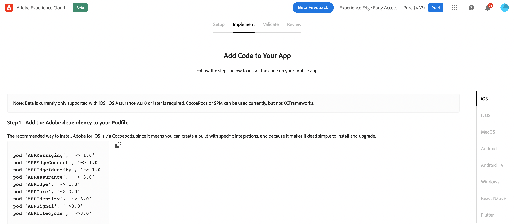

# Schnellstart-Workflow für Mobile-Onboarding {#mobile-wf}

Der neue **Schnellstart-Workflow für Mobile-Onboarding** ist eine neue Produktfunktion, die dazu dient, das Mobile SDK schnell zu konfigurieren, mit dem Erfassen und Überprüfen von Mobile-Ereignisdaten zu beginnen und Push-Benachrichtigungen mit [!DNL Journey Optimizer] zu senden.

Diese Funktion ist als eine öffentliche Beta-Version über die **[!DNL Adobe Experience Platform Data Collection]**-Startseite für alle Kunden verfügbar.

## Erste Schritte  {#gs-mobile-wf}

Dieser neue Workflow automatisiert die Einrichtung der Datenerfassung, indem die Gesamtzahl der Klicks reduziert und die Mobile-Konfiguration für Journey Optimizer beschleunigt wird. Dieser Schnellstart-Workflow führt Sie durch vier einfache Schritte, um Ihre Mobile-Konfiguration [einzurichten](##setup-mobile-wf), zu [implementieren](#implement-mobile-wf), zu [validieren](#valid-mobile-wf) und zu [überprüfen](#review-mobile-wf).

Navigieren Sie vom Lösungsumschalter aus zum neuen Schnellstart-Workflow für das Mobile-Onboarding in **[!DNL Data Collection]**. Wählen Sie dann die **[!DNL Start Collecting Mobile Data]**-Karte auf der Startseite aus.

Im Folgenden finden Sie einige zusätzliche Funktionen:

* Einfacher, vierstufiger Workflow und Benutzeroberfläche.
* Sie bietet eine grundlegende Einrichtung, um in Minutenschnelle mit der Erfassung von Mobile-Ereignisdaten über das [Adobe Experience Platform Mobile SDK](https://developer.adobe.com/client-sdks/documentation/){target="_blank"} zu beginnen.
* Möglichkeit zum Testen und Validieren eines einfachen mobilen Push-Ereignisses mithilfe von [Adobe Experience Platform Assurance](https://experienceleague.adobe.com/docs/experience-platform/assurance/home.html?lang=de){target="_blank"}.
* Erstellt und konfiguriert automatisch alle erforderlichen Datenerfassungs- und Journey Optimizer-Assets.
* In Produktanleitungen und QuickInfos.
* Bietet bei Bedarf einen natürlichen Übergang für eine erweiterte Implementierung.

## Einrichten {#setup-mobile-wf}

Im ersten Schritt dieses Workflows werden automatisch alle erforderlichen Datenerfassungs- und Journey Optimizer-Assets erstellt und konfiguriert, z. B. Eigenschaften für Mobilgeräte, Mobile-Erweiterungen, Journey Optimizer-Erweiterung, Regeln, Datenelemente usw.

Geben Sie, wenn Sie die Nutzungsbedingungen der Beta-Version akzeptiert haben, den Namen Ihrer Mobile App ein und klicken Sie auf **[!DNL Next]**.

Geben Sie Informationen für iOS- und Android-Plattformen an, einschließlich Ihrer App-ID und des Authentifizierungsschlüssel oder der Schlüsseldatei.

## Implementierung{#implement-mobile-wf}

Der nächste Schritt enthält eine Schritt-für-Schritt-Anleitung zur Installation des Codes für Ihre Mobile App.

## Überprüfen{#valid-mobile-wf}

Überprüfen und checken Sie die Implementierung, um sie zu validieren. Sie können eine Test-Push-Benachrichtigung senden.

## Überprüfung {#review-mobile-wf}

Die automatisierte Einrichtung ist abgeschlossen. Sie können jetzt Ihre mobile Tag-Eigenschaft aufrufen, Ihre Regeln oder Datenelemente konfigurieren und mit dem Senden von Push-Benachrichtigungen mit Adobe Journey Optimizer beginnen.

**Verwandte Themen**

* [Erste Schritte mit Push-Benachrichtigungen](get-started-push.md)
* [Datenfluss und Komponenten von Push-Benachrichtigungen](push-gs.md)
* [Kanal der Push-Benachrichtigung konfigurieren](push-configuration.md)
* [Bericht zu Push-Benachrichtigungen](../reports/journey-global-report.md#push-global)
* [Erstellen einer Push-Benachrichtigung](create-push.md)
