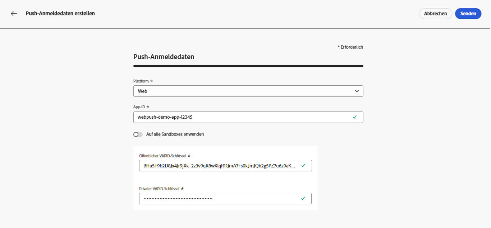
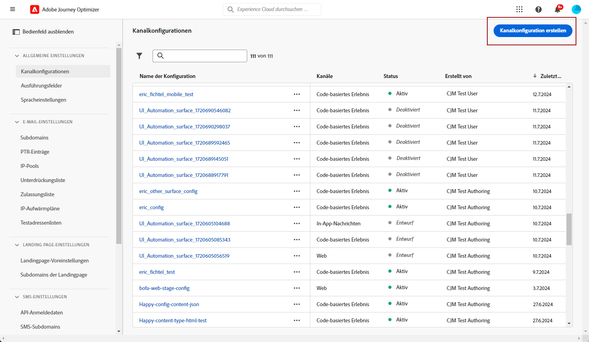
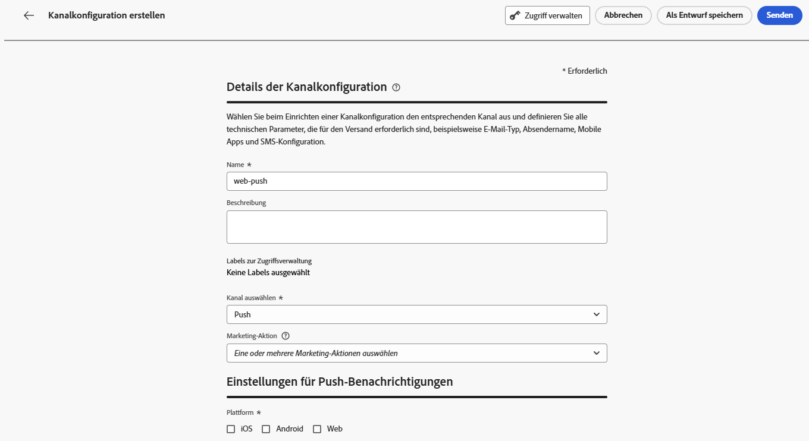

# Konfigurieren des Kanals für Web-Push-Benachrichtigungen {#push-notification-configuration}

[!DNL Journey Optimizer] ermöglicht es Ihnen, Journeys zu erstellen und Nachrichten an eine ausgewählte Zielgruppe zu senden. Bevor Sie mit dem Versand von Web-Push-Benachrichtigungen mit [!DNL Journey Optimizer] beginnen, müssen Sie sicherstellen, dass in Adobe Experience Platform Konfigurationen und Integrationen vorhanden sind. Informationen zum Datenfluss von Push-Benachrichtigungen in [!DNL Adobe Journey Optimizer] finden Sie auf [dieser Seite](push-gs.md).

>[!AVAILABILITY]
>
>Der neue **Schnellstart-Workflow für Mobile-Onboarding** ist jetzt verfügbar. Verwenden Sie diese neue Produktfunktion, um das Mobile SDK schnell so zu konfigurieren, dass es mit der Erfassung und Validierung von Mobile-Ereignisdaten und dem Senden von Mobile-Push-Benachrichtigungen beginnt. Auf diese Funktion kann über die Startseite der Datenerfassung als öffentliche Beta-Version zugegriffen werden. [Weitere Informationen](mobile-onboarding-wf.md)
>

## Bevor Sie beginnen {#start-push}

### Berechtigungen einrichten {#setup-permissions}

Bevor Sie eine Mobile App erstellen, müssen Sie zunächst sicherstellen, dass Sie für Tags in Adobe Experience Platform die richtigen Benutzerberechtigungen haben oder diese zuweisen. Weitere Informationen finden Sie in der [Tags-Dokumentation](https://experienceleague.adobe.com/docs/experience-platform/tags/admin/user-permissions.html?lang=de){target="_blank"}.

>[!CAUTION]
>
>Die Konfiguration für Push-Benachrichtigungen muss von einem erfahrenen Benutzer durchgeführt werden. Abhängig von Ihrem Implementierungsmodell und den an dieser Implementierung beteiligten Rollen müssen Sie möglicherweise den gesamten Berechtigungssatz einem einzelnen Produktprofil zuweisen oder Berechtigungen zwischen dem App-Entwickler und dem **Adobe Journey Optimizer**-Administrator aufteilen. Weitere Informationen zu Berechtigungen für **Tags** finden Sie in [dieser Dokumentation](https://experienceleague.adobe.com/docs/experience-platform/tags/admin/user-permissions.html?lang=de){target="_blank"}.

<!--ou need to your have access to perform following roles :

* Manage Datastreams
* Manage Client-side Properties
* Manage App Configurations
-->

Gehen Sie wie folgt vor, um die Rechte für **Eigenschaft** und **Unternehmen** zuzuweisen:

1. Greifen Sie auf **[!DNL Admin Console]** zu.

1. Wählen Sie auf der Registerkarte **[!UICONTROL Produkte]** die Karte **[!UICONTROL Datenerfassung in Adobe Experience Platform]** aus.

   

1. Wählen Sie ein vorhandenes **[!UICONTROL Produktprofil]** aus oder erstellen Sie mit der Schaltfläche **[!UICONTROL Neues Profil]** ein neues. Wie Sie ein **[!UICONTROL neues Profil]** erstellen, erfahren Sie in der [Dokumentation zur Admin Console](https://experienceleague.adobe.com/docs/experience-platform/access-control/ui/create-profile.html?lang=de#ui){target="_blank"}.

1. Wählen Sie auf der Registerkarte **[!UICONTROL Berechtigungen]** die Option **[!UICONTROL Eigenschaftenrechte]**.

   

1. Klicken Sie auf **[!UICONTROL Alle hinzufügen]**. Dadurch werden Ihrem Produktprofil die folgenden Rechte hinzugefügt:
   * **[!UICONTROL Genehmigen]**
   * **[!UICONTROL Entwickeln]**
   * **[!UICONTROL Umgebungen verwalten]**
   * **[!UICONTROL Erweiterungen verwalten]**
   * **[!UICONTROL Veröffentlichen]**

   Diese Berechtigungen sind erforderlich, um die Adobe Journey Optimizer-Erweiterung zu installieren und zu veröffentlichen und die App-Eigenschaft im Adobe Experience Platform Mobile SDK zu veröffentlichen.

1. Wählen Sie dann im Menü links **[!UICONTROL Unternehmensrechte]**.

   

1. Fügen Sie die folgenden Rechte hinzu:

   * **[!UICONTROL Mobile-App-Konfigurationen verwalten]**
   * **[!UICONTROL Eigenschaften verwalten]**

   Diese Berechtigungen sind für die Entwicklerin oder den Entwickler der App erforderlich, um Push-Anmeldedaten für die **Datenerfassung in Adobe Experience Platform** einzurichten und Konfigurationen für Push-Benachrichtigungskanäle (d. h. Nachrichtenvoreinstellungen) in **Adobe Journey Optimizer** zu definieren.

   

1. Klicken Sie auf **[!UICONTROL Speichern]**.

Gehen Sie wie folgt vor, um Benutzern dieses **[!UICONTROL Produktprofil]** zuzuweisen:

1. Greifen Sie auf **[!DNL Admin Console]** zu.

1. Wählen Sie auf der Registerkarte **[!UICONTROL Produkte]** die Karte **[!UICONTROL Datenerfassung in Adobe Experience Platform]** aus.

1. Wählen Sie Ihr zuvor konfiguriertes **[!UICONTROL Produktprofil]** aus.

1. Klicken Sie auf der Registerkarte **[!UICONTROL Benutzer]** auf **[!UICONTROL Benutzer hinzufügen]**.

   

1. Geben Sie den Namen oder die E-Mail-Adresse Ihres Benutzers ein und wählen Sie den Benutzer aus. Klicken Sie dann auf **[!UICONTROL Speichern]**.

   >[!NOTE]
   >
   >Wenn der Benutzer vorher noch nicht in der Admin Console erstellt wurde, lesen Sie die [Dokumentation zum Hinzufügen von Benutzern](https://helpx.adobe.com/de/enterprise/admin-guide.html/enterprise/using/manage-users-individually.ug.html#add-users).

   

### Überprüfen Ihrer Datensätze {#push-datasets}

Die folgenden Schemata und Datensätze sind über den Push-Benachrichtigungskanal verfügbar:

| Schema  Datensatz | Liste der Felder | Vorgang |
| -------------------------------------------------------------------------------------- | --------------------------------------------------------------------------------------------------------------------------------------------------------------------------------------- | -------------------------------------------------------- |
| CJM-Push-Profilschema  CJM-Push-Profildatensatz | Details zu Push-Benachrichtigungen Adobe CJM ExperienceEvent – Details zum Nachrichtenprofil Adobe CJM ExperienceEvent – Details zur Nachrichtenausführung Anwendungsdetails Umgebungsdetails | Push-Token registrieren |
| CJM-Push-Tracking-Erlebnisereignis-Schema CJM-Push-Tracking-Erlebnisereignis-Datensatz | Tracking von Push-Benachrichtigungen | Interaktionen verfolgen und Daten für die Reporting-Benutzeroberfläche bereitstellen |

>[!NOTE]
>
>Wenn Push-Tracking-Ereignisse in den CJM-Push-Tracking-Erlebnisereignis-Datensatz aufgenommen werden, können Fehler auftreten, obwohl Daten teilweise erfolgreich aufgenommen werden. Hierzu kann es kommen, wenn einige Felder in Ihrer Zuordnung nicht in eingehenden Ereignissen vorhanden sind: Das System protokolliert Warnungen, verhindert jedoch nicht die Aufnahme gültiger Teile der Daten. Diese Warnungen werden im Batch-Status als „Fehlgeschlagen“ angezeigt, spiegeln jedoch den teilweisen Erfolg der Aufnahme wider.
>
>Die vollständige Liste der Felder und Attribute für jedes Schema finden Sie im [Journey Optimizer-Schemawörterbuch](https://experienceleague.adobe.com/tools/ajo-schemas/schema-dictionary.html?lang=de){target="_blank"}.

### Konfigurieren der Eigenschaft „pushNotification“ {#push-property}

Um **Web-Push-Benachrichtigungen** zu aktivieren, müssen Sie zunächst sicherstellen, dass die [pushNotifications-Eigenschaft](https://experienceleague.adobe.com/en/docs/experience-platform/collection/js/commands/configure/pushnotifications) in der Web-SDK ordnungsgemäß konfiguriert ist. Diese Eigenschaft steuert, wie Push-Benachrichtigungen von Ihrer Web-Anwendung verarbeitet werden.

Darüber hinaus müssen Sie GÜLTIGE Schlüssel generieren, die zum Konfigurieren ([ Push-Anmeldeinformationen für Ihre App](#push-credentials-launch) in Journey Optimizer erforderlich sind.

## Schritt 1: Hinzufügen von Push-Anmeldedaten für die App in Journey Optimizer {#push-credentials-launch}

Nachdem Sie die richtigen Benutzerberechtigungen erteilt haben, müssen Sie jetzt Ihre Push-Anmeldedaten für Apps in Journey Optimizer hinzufügen.

Die Registrierung der Push-Anmeldedaten für Mobile Apps ist erforderlich, um Adobe zu erlauben, Push-Benachrichtigungen in Ihrem Namen zu senden. Gehen Sie wie folgt vor:

1. Öffnen Sie das Menü **[!UICONTROL Kanäle]** > **[!UICONTROL Push-Einstellungen]** > **[!UICONTROL Push-Anmeldedaten]**.

1. Klicken Sie auf **[!UICONTROL Push-Anmeldedaten erstellen]**.

1. Wählen Sie in der **[!UICONTROL -]**-Dropdown-Liste die Option **[!UICONTROL Web]**.

   

1. Geben Sie die **[!UICONTROL App-ID]** an.

1. Geben Sie Ihren **[!UICONTROL öffentlichen VAPID-Schlüssel]** und Ihren **[!UICONTROL privaten Schlüssel]** ein.

1. Klicken Sie auf **[!UICONTROL Senden]**, um Ihre App-Konfiguration zu erstellen.

## Schritt 2: Erstellen einer Kanalkonfiguration für Push-Benachrichtigungen{#message-preset}

Nachdem Ihre Push-Anmeldedaten erstellt haben, müssen Sie eine Konfiguration erstellen, damit Sie Push-Benachrichtigungen über **[!DNL Journey Optimizer]** senden können.

1. Rufen Sie das Menü **[!UICONTROL Kanäle]** > **[!UICONTROL Allgemeine Einstellungen]** > **[!UICONTROL Kanalkonfigurationen]** auf und klicken Sie dann auf **[!UICONTROL Kanalkonfiguration erstellen]**.

   

1. Geben Sie einen Namen und eine Beschreibung (optional) für die Konfiguration an.

   >[!NOTE]
   >
   > Namen müssen mit einem Buchstaben (A–Z) beginnen. Ein Name darf nur alphanumerische Zeichen enthalten. Sie können auch die Zeichen Unterstrich `_`, Punkt `.` und Bindestrich `-` verwenden.

1. Um der Konfiguration benutzerdefinierte oder grundlegende Datennutzungs-Labels zuzuweisen, können Sie **[!UICONTROL Zugriff verwalten]** auswählen. [Erfahren Sie mehr über die Zugriffssteuerung auf Objektebene (Object Level Access Control, OLAC)](../administration/object-based-access.md).

1. Wählen Sie den **Push**-Kanal aus.

   

1. Wählen Sie eine **[!UICONTROL Marketing-Aktion]** aus, um Einverständnisrichtlinien mit den Nachrichten zu verknüpfen, die diese Konfiguration verwenden. Es werden alle mit der Marketing-Aktion verknüpften Einverständnisrichtlinien genutzt, um die Präferenzen Ihrer Kundinnen und Kunden zu respektieren. [Weitere Informationen](../action/consent.md#surface-marketing-actions)

1. Wählen Sie Ihre **[!UICONTROL Plattform]** aus: Android, iOS und/oder Web.

1. Wählen Sie dieselbe **[!UICONTROL App-ID]** wie für Ihre oben konfigurierten [Push-Anmeldedaten](#push-credentials-launch) aus.

1. Speichern Sie Ihre Änderungen.

Sie können Ihre Konfiguration jetzt beim Erstellen Ihrer Push-Benachrichtigungen auswählen.

## Schritt 3: Konfigurieren der Eigenschaft „sendPushSubscription“ {#sendPushSubscription-property}

Nachdem Sie Ihre Push-Anmeldeinformationen und die Kanalkonfiguration eingerichtet haben, müssen Sie [den Befehl sendPushSubscription](https://experienceleague.adobe.com/en/docs/experience-platform/collection/js/commands/sendpushsubscription) in Ihrer Web-Anwendung implementieren. Dieser Befehl registriert Benutzer-Push-Abonnements bei Adobe Experience Platform, sodass das System verfolgen kann, welche Benutzer sich für den Empfang von Push-Benachrichtigungen entschieden haben, und ihren Abonnementstatus beibehalten kann. Diese Registrierung ist für Journey Optimizer unerlässlich, um gezielte Push-Benachrichtigungen an Ihre Benutzerinnen und Benutzer zu senden.

## Schritt 4: Testen Sie Ihre Mobile App mit einem Ereignis {#mobile-app-test}

Nach Abschluss der Web-Push-Konfiguration in Adobe Experience Platform und [!DNL Adobe Experience Platform Data Collection] können Sie Ihre Implementierung testen, bevor Sie Web-Push-Benachrichtigungen an Ihre Profile senden. Durch Tests wird sichergestellt, dass Abonnements ordnungsgemäß registriert und Benachrichtigungen korrekt an die Browser Ihrer Benutzer gesendet werden.

Detaillierte Anweisungen zum Erstellen einer Test-Journey mit Ereignissen zur Validierung Ihrer Web-Push-Einrichtung finden Sie in der Dokumentation [Konfiguration von Mobile-App-Push-Benachrichtigungen](push-configuration.md) , die einen umfassenden Test-Workflow bietet, der sowohl für mobile als auch für Web-Push-Kanäle gilt.
